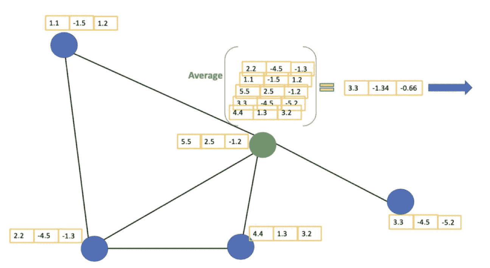
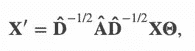
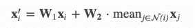
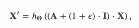
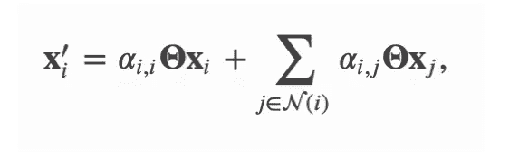

# 图形卷积网络(GCN)的最新进展

> 原文：<https://towardsdatascience.com/recent-advances-in-graph-convolutional-network-gcn-9166b27969e5?source=collection_archive---------29----------------------->

## 用通俗易懂的英语介绍 GCN 最新发展的便车指南

图卷积网络(GCN)因其在解决深度互联的现实世界问题中的多功能性而越来越受欢迎。如果您需要快速复习 GNN/GCN，请在继续之前点击此处。在本帖中，我们将用更简单的语言来强调 GCN 建筑的一些进步…

[阿丽娜·格鲁布尼亚](https://unsplash.com/@alinnnaaaa?utm_source=medium&utm_medium=referral)在 [Unsplash](https://unsplash.com?utm_source=medium&utm_medium=referral) 上的照片

# 目录:

1.  GCN 积木
2.  萨格科夫
3.  金康夫
4.  图形注意网络

# GCN 积木

GCN 将更传统的卷积神经网络(CNN)的卷积原理结合到图形数据结构中。让我们更深入地探讨这个问题。

## **卷积和消息传递**

简而言之，图中的卷积聚合来自相邻节点的信息，应用特定的聚合函数，并输出某些内容(例如，新特征嵌入、输出)。下图可以清楚地说明这一点。

GCN 的卷积法

上图中感兴趣的节点(即。绿色节点)正在从它的直接邻居(即蓝色节点)，应用平均值作为其集合函数，并输出新的嵌入。这个操作被称为**消息传递(MP)** ，由所述图中的每个节点执行。

## 聚合函数

聚合函数是许多 GCN 变量的关键。上述 GCN 的初始公式使用归一化作为其聚合函数，定义如下。

GCN 的聚合函数

其中 **D** 为度矩阵(即。每个节点有多少个邻居)， **A** 是邻接矩阵(即每个节点如何与其他节点连接)，以及 **X** 特征矩阵(即如何描述节点)。

上面的规格化公式仅仅意味着一个平均运算:如果一个节点比其他节点有更多的邻居，按比例平均 X。

现在我们已经有了基本的构建模块，让我们讨论一些在 GCN 更受欢迎的进展。

# 萨格科夫

(论文: [ICLR](https://arxiv.org/abs/1706.02216) )

*想象训练一个复杂的图形。如果再增加一个节点呢？你需要从头开始重新训练整个图形吗？*

SAGEConv 从这个问题出发，通过归纳学习使 GCN 训练更加健壮。这是通过在集合函数中引入可学习的 W1 和 W2 权重矩阵，并对每个节点邻居的特征矩阵应用均值运算(类似于 GCN)来实现的。

SAGEConv 聚集函数

在训练之后，如果您需要将一个额外的节点包括到现有的图中，您不必从头开始重新学习:您可以应用学习到的权重矩阵来为新的节点生成新的嵌入。

# 金康夫

(论文: [ICLR](https://arxiv.org/abs/1810.00826) )

*如果您想在聚合步骤中学习非线性表示法(不是传统的平均值、加法等),以近似模拟不同节点之间真实世界的复杂交互，该怎么办？*

接下来是 GINConv，它将聚集的特征矩阵输入到可学习的人工神经网络(ANN)中。

GINConv 聚合函数

其中 h 是前馈神经网络。该公式简单地意味着，向邻接矩阵中的每个元素添加标量值ε，与聚集的特征矩阵相乘，并将结果馈送到可学习的 ANN 中。

该论文报告说，这种架构比 GCN 的早期变体更稳定，尤其是在区分更简单的图形时。

# 手枪

(论文: [ICLR](https://arxiv.org/abs/1710.10903) )

如果你能在 GCN 中加入注意力机制会怎么样？通过专注于重要的特征节点而将其余的降级？

这就是 GAT 通过修改下面的聚合函数所要达到的目的。

GAT 聚合函数

其中 alpha 为关注系数(在这篇[帖子](https://www.analyticsvidhya.com/blog/2019/11/comprehensive-guide-attention-mechanism-deep-learning/)中可以了解更多关于关注的内容)，X 为每个节点的特征矩阵。

# 结论

我们已经到了帖子的末尾。在这里，我们讨论了一些更重要的 GCN 变种。如果你注意到，这些变化大部分来自聚合函数中的新公式:线性(均值、求和)或非线性(ANN、注意系数)运算。所以下次你阅读任何 GCN 最先进的模型论文时，请留意这些变化！

***做订阅我的邮件简讯:***[*https://tinyurl.com/2npw2fnz*](https://tinyurl.com/2npw2fnz)****在那里我定期用通俗易懂的语言和漂亮的可视化方式总结 AI 研究论文。****