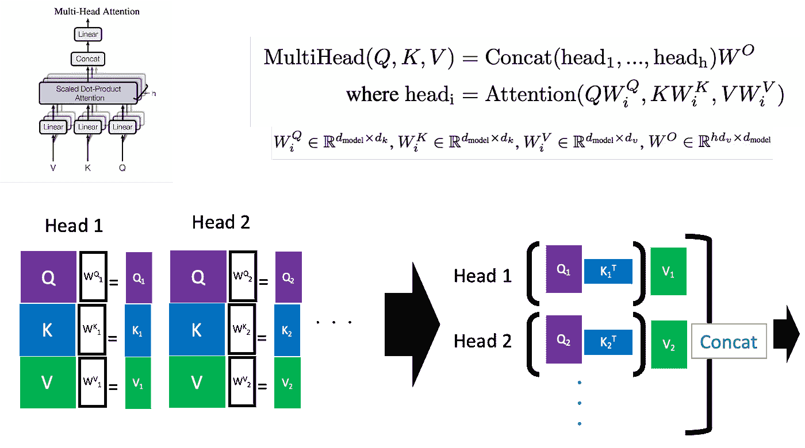
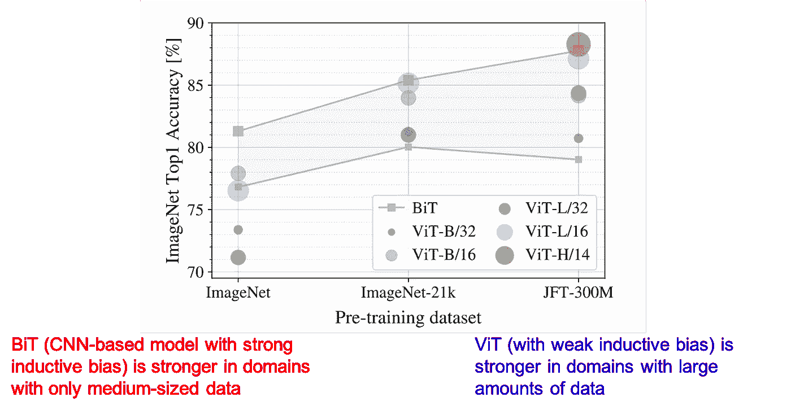
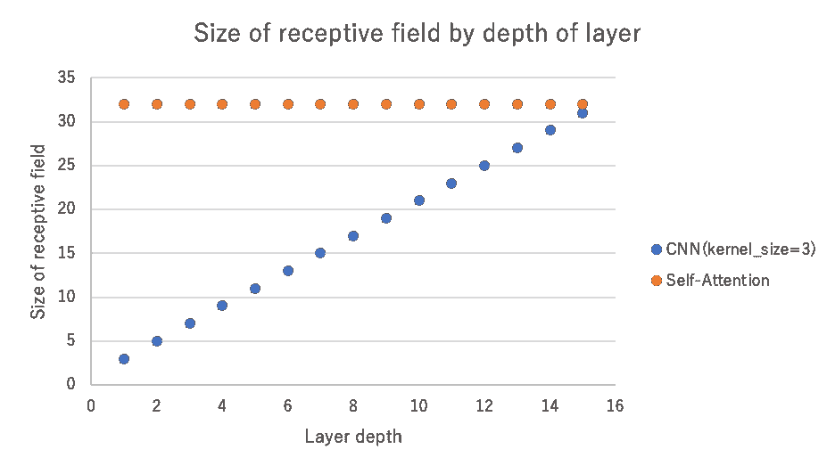

# 计算机视觉 x 变形金刚的最新发展和看法

> 原文：<https://towardsdatascience.com/recent-developments-and-views-on-computer-vision-x-transformer-ed32a2c72654?source=collection_archive---------13----------------------->

## 《变形金刚》和 CNN 的区别，为什么《变形金刚》很重要，它的弱点是什么。

# 关于这篇文章

本文讨论了自视觉转换器问世以来，Transformer x 计算机视觉研究中的一些有趣的研究和见解。这篇文章的四个主题如下

1.  Transformer 和 CNN 感受野大小和行为的差异
2.  自我关注对《变形金刚》来说是否必不可少？
3.  视觉变压器的缺点和改进方向
4.  变压器的快速扩张及其重要性

***作为本文的总结，我的观点如下:***

*   自视觉变压器以来，变压器的应用范围迅速扩大。我个人认为这样做的原因是它可以应用于各种各样的数据，并且很容易在不同的模态之间建立关联。
*   《变形金刚》和 CNN 的主要区别之一就是视野开阔。也许正因为如此，变形金刚比 CNN 更能适应纹理的变化，并生成不同模式的对抗性补丁。
*   根据最近的一项研究，自我关注在《变形金刚》中可能并不重要。在我看来，编码器块中有两个部分很重要，一个处理全局信息，另一个在本地传播。
*   Vision Transformer 的弱点是需要大量内存和大量数据，但它正在快速改进。

# 变压器和视觉变压器

## 变压器

首先，我想解释一下 Vision Transformer 中使用的 Transformer 编码器，这是一个在论文“注意力是你所需要的全部”中提出的模型。这篇论文的标题对那些使用 LSTM 和 CNN 的人来说是挑衅性的。

它既不是 CNN，也不是 LSTM，而是一种叫做点积注意力的机制，建立在它之上的模型(Transformer)已经远远超过了现有的方法。

摘自[2]，变压器模型概述

在转换器中使用的(点积)注意中有三个变量:查询、键和值。简而言之，系统计算查询和关键词的关注权重，并将每个关键词乘以与之相关联的值。

点积注意力

多头注意力，使用多个注意力头(在 MLP 的术语中，“隐藏层数”增加)，定义如下。上图中的(单个头)注意力原样使用 q，k，但在多头注意力中，每个头都有自己的投影矩阵 W_i^Q、W_i^K 和 W_i^V，这些矩阵投影的特征用于创建注意力。

多头注意。左上图取自[2]

在这个点积注意力中使用的 Q、K 和 V，当它们都来自相同的数据时，称为自我注意。当点积注意力中使用的 Q、K 和 V 来自相同的数据时，这被称为自我注意力。在《变形金刚》中，编码器的部分和解码器下面的部分是自关注的。解码器的上半部分不是自关注的，因为查询来自编码器，K，V 来自解码器。下图显示了注意力权重的示例。在该图中，单词“making”被用作查询，并且每个关键词的注意力权重被计算和可视化。注意力集中的每个键都在学习不同的依赖性。“关键”这几个字用多种方式着色，代表每个人头的注意力权重。

引自[2]，变压器的自我关注的重量。我加上字幕。

## 视觉转换器的工作原理

Vision Transformer 是将 Transformer 应用于图像分类任务的模型，于 2020 年 10 月提出。内容和原来的 Transformer 几乎一样，但是有一种别出心裁的方式，像自然语言处理一样处理图像。

视觉变压器架构，引自[1]。

视觉转换器将图像分成 N 个 16x16 大小的小块。由于补丁本身是三维数据，它们不能由处理语言处理的转换器直接处理。因此，在将它们展平后，他们做一个线性投影，将它们转换成二维数据。通过这样做，每个补丁可以被视为一个令牌(像一个单词)，可以输入到转换器中。

此外，Vision Transformer 采用了预训练→微调的策略:Vision Transformer 在包含 3 亿幅图像的数据集 JFT-300M 上进行预训练，在 ImageNet 等下游任务上进行微调。Vision Transformer 是第一款在 ImageNet 上实现 SotA 性能的纯变压器型号。这是对 Transformer x 计算机视觉研究大量增加的开始。

## 为什么《视觉变形金刚》这么准？

关于 Transformer x 计算机视觉的研究由来已久，但一直无法在 ImageNet 上实现 SotA 性能。作者从模型的归纳偏差和数据数量方面解释了原因。归纳偏差是模型对数据的一种假设。比如 CNN 用 3x3 内核处理数据，这是基于数据信息是本地聚合的数据假设。在 RNNs 中，当前时间的数据与前一时间的数据高度相关，但前一时间的数据仅通过前一时间的数据相关。在 RNN，当前时间数据与先前时间数据高度相关，但是先前 x2 时间数据仅通过先前时间数据相关。这个过程也是基于数据与上一次高度相关的数据假设。另一方面，由于自我关注只与每个数据相关，可以说与 CNN 和 RNN 相比，其归纳偏差相对较低。

(左)CNN，它有一个强烈的归纳偏见，即信息是本地聚合的。(中间)RNN，它有很强的归纳偏差，因为它与前一次(右)自我注意强烈相关，而后者有相对较弱的归纳偏差，因为它只与所有特征相关。

作者将 ViT 的强解释为:“在数据很少的情况下，具有强归纳偏差的模型比那些具有弱归纳偏差的模型更强，因为它们对数据有假设。另一方面，当有大量数据时，假设就成了阻碍，所以在有大量数据的情况下，具有弱归纳偏差的模型就变得更强”。下图加强了这种解释:通过预训练数据集的大小来比较 Vision Transformer 和 CNN。在使用 JFT-300M 进行预训练的情况下，它优于 CNN(具有强归纳偏差的模型)。

数据量和准确性

# 变形金刚 x 计算机视觉的发展趋势

从现在开始，我将介绍 Transformer x 计算机视觉的研究动态以及最近研究中发现的视觉变压器系统的有趣行为。下面有四个主题。请注意，它们包含了我的许多个人观点。

1.  扩大变压器的应用领域及其原因。
2.  Transformer 和 CNN 感受野范围和行为的差异
3.  自我关注对《变形金刚》来说是否必不可少？
4.  视觉转换器的缺点和改进方向

# 1.扩大变压器的应用领域及其原因

自从引入视觉转换器以来，将转换器应用于各种数据和任务的研究数量迅速增加，尤其是在计算机视觉领域。Vision Transformer 用于图像分类任务，但也有其他应用，如应用于语义分割、对象检测的 Swin Transformer 和应用于深度估计的 DPT[17]。在不同的数据格式方面，点转换器[18]适用于点云数据，感知者[19]适用于音频、视频、点云以及图像。

在视觉和语言领域，它将最初 transformer 使用的领域自然语言与计算机视觉任务相结合，也有许多应用程序，如 UniT，它可以同时执行多个任务，如计算机视觉。

如你所见，变压器已经广泛应用于各个领域。为什么变压器被这样使用？在我看来，有以下原因。

1–1。人们发现它不仅可以应用于自然语言处理，也可以应用于图像处理，因此得到了很大的发展。

*1–2。不需要根据数据更换网络，方便。*

*1–3。不同数据之间很容易建立关联。*

***1–1。人们发现它不仅可以应用于自然语言处理，也可以应用于图像处理，因此得到了很大的发展。***

最初，Transformer 用于自然语言处理领域，其有效性在自然语言处理和语音识别中得到证实，如 Transformer Transducer[20]在语音方面的成功。感谢 Vision Transformer，我们现在知道它在图像领域甚至比 CNN 更好。单单语音和自然语言处理的研究领域就很广阔。现在，随着同样具有广泛研究领域的计算机视觉的加入，以及在语音+图像、视觉&语言等复杂领域中使用它的能力，应用范围迅速扩大。

***1-2。不需要根据数据更换网络，方便。***

以前需要把网络分开，比如图像-> CNN，自然语言-> Transformer，现在所有的数据都可以通过 Transformer 处理，使用起来很方便，比如感知者[19]。

他们提出 Preciever，一个可以处理超过 10 万个特征的高维输入的 transformer 模型，可以处理视频+音频、图像、点云等多种数据格式。它通过从潜在空间中检索 Q 来减少计算量。不仅实现了对图像和点云的高性能，还获得了对视频+音频的 SotA 性能。这些图片引自[19]。

***1-3。不同数据之间易于关联。***

事实上，我们不需要有一个图像分支网络和一个自然语言分支网络，因为我们可以作为一个令牌处理一切，包括图像和语言，这可能是它越来越多地使用的另一个原因。在低层次上，我们可以将不同的模态与自我关注联系起来。典型的例子有维尔特[21]，VATT[22]和 VL-T5[23]。

通过将不同模态的数据视为记号，很容易获得不同数据之间的相关性。(上)VL-T5[23]，(下)VLiT[21]。

# 2.Transformer 和 CNN 感受野范围和行为的差异

《变形金刚》现在在计算机视觉上和 CNN 一样好甚至更好，但是两者有什么区别呢？

首先在视野上有区别:CNN 用的是 3x3 或者 7x7 大小的内核，所以每一层只能有一个对应的视野。并且视场随着其在各层中的传播而扩大，但是这种扩大随着深度而线性增加。

另一方面，转换器使用自我关注，这允许网络从初始层看到整个图像。由于每个面片被视为一个令牌，并且所有面片都是相互关联和计算的，因此可以从头开始学习全局特征。

将 CNN (kernel_size=3)和自我关注应用于一个大小为 32x32 的图像时，视场大小的差异。CNN 线性增加视野，而自我关注(视觉转换者)从一开始就拥有整个视野。

事实上，下图显示了视觉转换器感受野的扩展。大部分视图是线性扩展的，但也有一部分是从初始层获取全局信息。

受过训练的视觉转换者的视野。图片取自[1]。

此外，也许是由于其视野的大小，研究表明，与 CNN 相比，Transformer 可以根据形状做出物体决策。有一项研究[3]声称，CNN 的决策更多的是基于纹理而不是基于形状，这与常规理论不同，并建议 CNN 根据纹理而不是形状对对象进行分类。例如，在下图(c)中，人类倾向于根据猫的形状来判断猫，但基于 CNN 的模型根据纹理来判断印度大象。

*CNN 是根据纹理而不是形状来判断的。图片取自[3]。*

下图定量显示了这一点。该图显示了在保持形状的同时对纹理进行扰动的图像的分类精度。红点是人类，蓝点是基于 CNN 的模型。人类的判断对纹理扰动是鲁棒的，而 CNN 的准确性大大降低。换句话说，CNN 的标准高度依赖于纹理，而不是形状。

定量评价 CNN 是用纹理而不是形状来判断的。比较人类(红色)和基于 CNN 的模型(蓝色)对纹理有扰动但形状保持不变的图像的分类精度。图片取自[3]。

与基于 CNN 的模型相比，Transformer 模型(ViT)对纹理扰动相对更加鲁棒。与 CNN 模型相比，变压器模型(ViT)对纹理扰动相对稳健[4]。这可能和变形金刚视野广有关。

变形金刚比 CNN 更少依赖纹理。图片取自[4]。

还有其他有趣的特性可能归因于视场的大小。有一种技术称为对抗性例子[5]，它使用故意创建的噪声来误判模型，并且已经发现基于 CNN 的模型和 Transformer [6]之间的噪声存在差异。在导致狗图像误判的噪声中，CNN (ResNet)噪声有很多高频成分，具有局部结构。另一方面，变压器噪声(ViT)具有相对较低的频率分量和较大的结构。这也可能是由于视野的大小。(很有意思的是，你可以在 16x16 的补丁中清晰地看到边界。

反面例子的例子。通过添加故意制造的噪音，该模型将熊猫图像误解为长臂猿。图片摘自[5]。

*对抗性噪音的比较；ViT 的噪声具有较大的结构，具有相对较低的频率分量，而 ResNet 由高频分量组成。图片摘自[6]。*

# 3.自我关注是变形金刚必备的吗？

ViT 在计算机视觉方面取得了巨大的成功，但也有很多研究在探索是否存在比自我关注更好的结构。例如，MLP 混合器[7]不使用自我关注，而是使用多层感知器(MLP)，这是最基本的深度学习方法，结果与视觉变压器相当。与 Vision Transformer 一样，它需要在 JFT-300M 等庞大的数据集上进行预训练，但它可以在不使用自关注等复杂机制的情况下实现高性能。

基本结构是，混合器层是一个包含 MLP1 和 MLP2 的块，ml P1 处理跨面片的信息，MLP 2 处理每个面片的信息，这些块堆叠在一起，而不是 Transformer 编码器。这种方法类似于 ViT，它将图像分成小块，并处理小块的 2D 数据投影，用 MLP 代替 ViT 的变换器。

*MLP 密炼机的结构。混合器层是一个包含 MLP1 和 MLP2 的块，ml P1 处理跨面片的信息，MLP 2 处理每个面片的信息，并且堆叠在彼此的顶部。图片摘自[7]。*

MLP 混频器、ViT 和 Big Transfer 的比较(BiT，基于 CNN)。和 ViT 一样，MLP 混频器在低数据条件下不如 CNN，但在大数据时超过 CNN。图片摘自[7]。

受此影响，一篇论文[8]出现，声称自我关注不是一个必不可少的元素。该论文中提出的 gMLP 还提出了一种仅使用 MLPs 的结构，类似于 MLP 混频器，但是具有类似于挤压和激励的结构，该结构还具有用于处理面片方向上的信息的部分和用于处理空间方向上的信息的部分。即使不使用 JFT-300M 这样的庞大数据集，仅通过训练 ImageNet 就可以达到高于 EfficientNet 的精度。同样需要注意的是，它不仅在计算机视觉任务上和 BERT 一样准确，在自然语言处理上也是如此。

*gMLP 的结构，分为通道方向处理信息的机制和空间方向处理信息的机制。图片摘自[8]。*

gMLP 的结果。在图像识别领域，没有 JFT-300M，ViT 无法超越 CNN，但 gMLP 仅用 ImageNet 就取得了与 EfficientNet 相同的结果。此外，在自然语言处理领域，gMLP 已经产生了可与 BERT 相媲美的结果。图片摘自[8]。

还有一项研究提出了更为激进的主张，即自我关注可以被一种完全没有学习参数的机制所取代，如果它可以接受全部信息的话。在自然语言处理领域的研究 FNet [9]中，自我注意被傅立叶变换所取代。傅立叶变换没有学到任何东西，因为它只是改变了基础，并且它具有通过在傅立叶变换之前和之后添加特征而在物理上难以解释的结构，但是即使具有这样的结构，它也产生合理的结果。在这篇论文中，作者认为在令牌之间混合信息就足够了，除了傅立叶变换之外，他们还使用随机矩阵(具有固定参数)代替自关注对网络进行了实验。

FNet 的结构，其中变换器的自关注部分由傅立叶变换代替。图片取自[9]。

最近几天，有很多关于网络的研究，这些网络可以在不使用自我关注的情况下取得结果，如 MLP 混合器，gMLP 和 FNet。这三种机制处理全局信息(ViT 中的自我注意，MLP 混合器中的 MLP1，FNet 中的傅立叶变换)并在局部传播它(ViT 和 FNet 中的前馈，MLP 混合器中的 MLP2)。

虽然我的个人意见是混合的，但重要的是要有一个块结构，它不仅像 FNet 声称的那样在令牌(图像的情况下是补丁)之间混合信息，而且在考虑全局信息后在局部传播。

# 4.视觉转换器的缺点和改进方向

虽然《视觉变形金刚》在超越 CNN 方面成绩斐然，但它有两大弱点。然而，改进正在迅速进行，这些弱点正在被克服。

*   由于感应偏差较弱，需要比 ImageNet(130 万个数据集)大的 JFT-300M (3 亿个数据集)才能获得良好的精度
*   由于自我关注的性质，它需要的内存大小等于图像长度的四次方。

由于感应偏差较弱，需要比 ImageNet(130 万个数据集)大的 JFT-300M (3 亿个数据集)才能获得良好的精度。Vision Transformer 之所以能够超越 CNN，是因为它的感性偏置弱，但另一方面，如果数据量不够大，无法利用感性偏置弱的优势，准确性就会下降。具体来说，如果没有 3 亿个数据集，我们还无法超越基于 CNN 的模型。为了克服这一点，已经提出了各种改进方法。

## 使用 CNN

人们试图通过使用 CNN 来减少所需的数据量:DeiT [10]使用了一个知识提取框架，其中 CNN 被用作教师模型，而知识被输入到转换器模型。通过这样做，即使仅使用 ImageNet，结果也不仅超过 ViT，而且超过 EffcientNet。也有报道称，判决的倾向很大程度上通过蒸馏更接近 CNN。

*(左)在 DeiT 中执行的知识提炼的概念图(右)使用 CNN 作为教师模型执行知识提炼的 ViT DeiT 的结果。图片取自[10]。*

此外，由于 Vision Transformer 通过线性投影 16x16 大小的补丁以非常简单的方式处理本地信息，因此有研究使用 CNN，它对本地信息更具抵抗力。

(左)ViT 在 Transformer 中使用 patchy 嵌入表示，而 CeiT 使用带 CNN 卷积的抽象嵌入表示。(右)CNN 放置在变压器内部，使其对局部特征获取更加鲁棒。图片取自[11]、[12]，我添加了注释。

由于自我关注的性质，它需要的内存大小是图像边长的四次方。因为自注意计算所有补丁之间的相关性，所以它需要与边长的四次方成比例的内存大小。这使得难以处理高分辨率图像。然而，有研究通过采用分层结构解决了这一问题，如 CNN，初始层处理高分辨率图像，随着越来越深，分辨率逐渐降低。例如，PVT [14]使用了类似 CNN 的高分辨率到低分辨率的层次结构，而 Swin [13]不仅使用了层次结构，还缩小了自我注意的视野，以减少斑块大小，获得更详细的信息。

(左)ViT，固定分辨率和低分辨率。(中间)PVT，它可以通过逐渐降低分辨率来处理高分辨率信息。(右)Swin Tranformer，它像 CNN 一样通过逐渐扩大视野来处理高分辨率信息，而不是使用整个注意力区域。图片取自[13]、[14]。

## 其他改进

除了与 CNN 相关的改进之外，还提出了 Transformer 独有的各种其他改进。例如，T2T 模块[15]提出将图像嵌入与周围的补片(记号)混合，允许重叠。Swin Transformer [13]使用局部注意，不像 ViT 使用全局注意，但是注意的组在不同的层是不同的。

此外，ViT 还有一个问题，就是随着越来越深入，会产生同样类型的注意力地图。在《走向更深的视觉转换器》中，作者重点阐述了保持头部之间注意力多样性的观点，并引入了一个参数来混合不同头部的注意力图，即使在加深后也成功地保持了注意力图的多样性。

(左)考虑到 ViT 中的图像标记化(嵌入)过于简单，他们提出了一个 T2T 模块，允许通过混合周围的标记进行复制和重新标记化。(右上)与使用全局注意力的 ViT 不同，Swin 在红色框架内获得局部注意力，但通过改变每层的注意力组来传播它。(右下)引入一个混合不同头部注意力的学习参数，提高了注意力的多样性。

Vision Transformer 过去存在“需要大量数据”和“需要大内存大小”等问题，但在过去几个月中已经提出了许多改进。在实际使用中，CNN 仍然是主流，但可能用不了多久，它也会在实际使用中取代 CNN。

# 结论

在这篇文章中，我讨论了自 Vision Transformer 问世以来，Transformer x 计算机视觉研究中一些有趣的研究和见解。我对这篇文章的总结如下。我非常兴奋地看到未来将在变压器上做什么研究。

*   自视觉变压器以来，变压器的应用范围迅速扩大。我个人认为这样做的原因是它可以应用于各种各样的数据，并且很容易在不同的模态之间建立关联。
*   《变形金刚》和 CNN 的主要区别之一就是视野开阔。也许正因为如此，变形金刚比 CNN 更能适应纹理的变化，并生成不同模式的对抗性补丁。
*   根据最近的一项研究，自我关注在《变形金刚》中可能并不重要。在我看来，编码器块中有两个部分很重要，一个处理全局信息，另一个在本地传播。
*   Vision Transformer 的弱点是需要大量内存和大量数据，但它正在快速改进。

— — — — — — — — — — — — — — — — — — –

# 🌟我每周发布时事通讯！请订阅！🌟

<https://www.getrevue.co/profile/akiratosei>  

— — — — — — — — — — — — — — — — — — –

# 关于我

制造工程师/机器学习工程师/数据科学家/物理学硕士/[http://github.com/AkiraTOSEI/](https://t.co/hjHHbG24Ph?amp=1)，

<https://www.linkedin.com/in/%E4%BA%AE%E5%AE%8F-%E8%97%A4%E4%BA%95-999868122/?locale=en_US>  

推特，我贴一句纸评论。

— — — — — — — — — — — — — — — — — — –

# 参考

1.  Dosovitskiy、Lucas Beyer、Alexander、Dirk Weissenborn、翟晓华、Thomas Unterthiner、Mostafa Dehghani、Matthias Minderer、Georg Heigold、Sylvain Gelly、Jakob Uszkoreit、Neil Houlsby。一幅图像抵得上 16x16 的文字:大规模图像识别的变形金刚。第十四次评估报告(2019 年)
2.  Ashish Vaswani，Noam Shazeer，Niki Parmar，Jakob Uszkoreit，Llion Jones，Aidan N. Gomez，Lukasz Kaiser，Illia Polosukhin。你需要的只是关注。第十四次评估报告(2017 年)
3.  罗伯特·盖尔霍斯、帕特里夏·鲁比什、克劳迪奥·米歇尔斯、马蒂亚斯·贝赫、费利克斯·a·威其曼、维兰德·布伦德尔。ImageNet 训练的 CNN 偏向于纹理；增加形状偏差可以提高精确度和鲁棒性。第十四次评估报告(2018 年)
4.  Shikhar Tuli，Ishita Dasgupta，Erin Grant，Thomas L. Griffiths。卷积神经网络还是变形金刚更像人类的视觉？第十四次评估报告(2021 年)
5.  伊恩·j·古德菲勒，黄邦贤·史伦斯，克里斯蒂安·塞格迪。解释和利用对立的例子。第十四次评估报告(2021 年)
6.  Srinadh Bhojanapalli，Ayan Chakrabarti，Daniel，Daliang Li，Thomas Unterthiner，Andreas Veit。理解用于图像分类的变压器的鲁棒性。第十四次评估报告(2021 年)
7.  Ilya Tolstikhin、Neil Houlsby、Alexander、Lucas Beyer、Zhai Hua Zhai、Thomas Unterthiner、Jessica Yung、Andreas Steiner、Daniel Keysers、Jakob Uszkoreit、Mario Lucic、Alexey Dosovitskiy。MLP 混合器:全 MLP 的视觉建筑。第十四次评估报告(2021 年)
8.  、戴子航、苏大伟、郭诉乐。关注 MLPs。第十四次评估报告(2021 年)
9.  李中清-索普，约书亚·安斯利，伊利亚·埃克斯坦，圣地亚哥·翁塔农。FNet:用傅立叶变换混合记号。第十四次评估报告(2021 年)
10.  Hugo Touvron，Matthieu Cord，Matthijs Douze，Francisco Massa，Alexandre Sablayrolles，Hervé Jégou。训练数据有效的图像转换器&通过注意力进行提炼。第十四次评估报告(2020 年)
11.  吴，，诺埃尔·柯黛拉，，刘，戴喜阳，陆源，。CvT:将卷积引入视觉变形器。第十四次评估报告(2021 年)
12.  袁昆，，郭，，周傲军，，于。将卷积设计结合到视觉转换器中。第十四次评估报告(2021 年)
13.  、林语桐、、韩虎、、魏、、林、郭柏宁。Swin Transformer:使用移位窗口的分层视觉转换器。第十四次评估报告(2021 年)
14.  、谢恩泽、、邓、、宋、、、罗平、邵凌。金字塔视觉转换器:无卷积密集预测的通用主干。第十四次评估报告(2021 年)
15.  李远，，陈，，，俞，，蒋子航，刘永泰，冯家实，严水成。Token-to-Token ViT:在 ImageNet 上从头开始训练视觉变形人。arXiv(2021)。
16.  周大全、康、金晓杰、杨、连、姜子航、侯启斌、冯家实。DeepViT:走向更深层的视觉转换。第十四次评估报告(2021 年)
17.  勒内·兰福特，阿列克谢·博奇科夫斯基，弗拉德连·科尔敦。用于密集预测的视觉转换器。第十四次评估报告(2021 年)
18.  赵恒爽，，贾亚佳，菲利普托尔，弗拉德连科尔顿。点变压器。第十四次评估报告(2020 年)
19.  安德鲁·耶格尔，菲利克斯·吉梅诺，安德鲁·布洛克，安德鲁·齐泽曼，奥里奥尔·维尼亚尔斯，若昂·卡雷拉。感知者:具有重复注意的一般感知。第十四次评估报告(2021 年)
20.  张倩、卢汉、哈西姆·萨克、安舒曼·特里帕蒂、埃里克·麦克德莫特、斯蒂芬·库、尚卡尔·库马尔。变压器传感器:一个流语音识别模型与变压器编码器和 RNN-T 损失。第十四次评估报告(2021 年)
21.  金元宰，孙宝庆，金一斗。无卷积或区域监控的视觉-语言转换器。第十四次评估报告(2021 年)
22.  哈桑·阿克巴里、李良哲、袁瑞倩、庄伟红、张世福、尹翠、龚柏青。VATT:从原始视频、音频和文本进行多模式自我监督学习的变形金刚。第十四次评估报告(2021 年)
23.  赵在民，解磊，郝坦，莫希特.班萨尔。通过文本生成统一视觉和语言任务。第十四次评估报告(2021 年)