# 最近发现的用例(第 1 部分)

> 原文：<https://towardsdatascience.com/recently-discovered-use-cases-part-1-5afe7ca9b32?source=collection_archive---------41----------------------->

## 扩展我们的预测加工产品

丹尼尔·史密斯在 [Unsplash](https://unsplash.com?utm_source=medium&utm_medium=referral) 上的照片

在过去的几个月里，我们一直在悄悄地监测和发现我们的预测加工产品的新用例。由于简化的操作界面，它也方便地兼作“幕后”标记的数据收集平台，迄今为止，我们已经看到了数百个工具故障、轴承故障和其他机器故障场景。

在与客户的合作中，我们从电机数据的角度提出了一个大型的典型机器故障目录，今天我们很高兴与您分享。我们将回顾我们在多个客户场所看到的六个重复场景，以及它们从“图上的点”的角度和它们在车间的物理表现看起来是什么样子。这些措施如下:

1.  端铣刀故障导致加工质量差和零件报废
2.  滚珠轴承故障导致主轴外壳损坏
3.  粗加工刀具故障，导致精加工刀具上的级联刀具故障
4.  不正确的偏移，导致导套错位
5.  工具故障，导致不完全切断
6.  对工具寿命的估计不正确，导致工具过度使用或使用不足

在进入正题之前，让我们回顾一下预测加工产品的主题:

> 我们从机器上的**嵌入式传感器**中提取**丰富的数据**，以**预测和预防**可能证明代价高昂的不同场景。

1.  丰富的数据:1 毫秒采样率->每台电机每天 1.7 亿次观察，主轴转速精度达到 001 RPM，功率/负载连续额定值为 0.01%
2.  嵌入式传感器:不需要额外的传感器，因为数据必须在所有现代数控机床上可用。我们只提取机器用来运行内部控制反馈回路的数据。演示的所有场景都是在新冠肺炎疫情期间部署的，机器度量人员从未踏足过工厂车间
3.  预测和预防代价高昂的情况:概述的情况会让我们的客户花费金钱，预防这些情况会为他们省钱。我们从节省下来的钱中抽取一部分来赚钱

## 立铣刀故障

回顾一下，在每一台 MachineMetrics 机器上，我们都有一个*操作员平板电脑*，它基本上只是一个三星 Galaxy 平板电脑或 iPad，指向我们 SaaS 产品中特定机器的网页。

使用我们操作员平板电脑的客户。

操作员平板电脑直接连接到我们的平台，因此每当机器停止时，就会有一个信号从机器发送到我们的边缘设备，然后被发送到云，在云上与其他指标一起汇总和显示。然后，平板电脑会反映这一新信息，并在机器网页上弹出一个窗口，提示操作员解释机器停机的原因。

当机器停止时，会出现一个弹出窗口，要求操作员添加原因代码。

随着时间的推移，这些注释越来越多，让我们可以更详细地了解**机器何时因何种原因**发生故障。

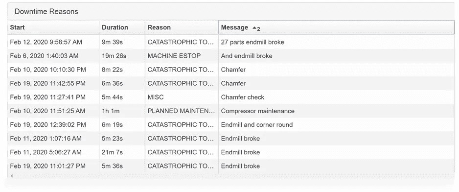

使用我们从机器电机收集的极其精细的数据，由 MachineMetrics 数据科学提出机器故障的**原因和方式**。在这种情况的一个实施例中，我们可以查看成千上万个制造的部件和几十个注释来识别模式，如在下面的例子中，其中黑线是注释的故障，点是每个制造的部件消耗的功率。

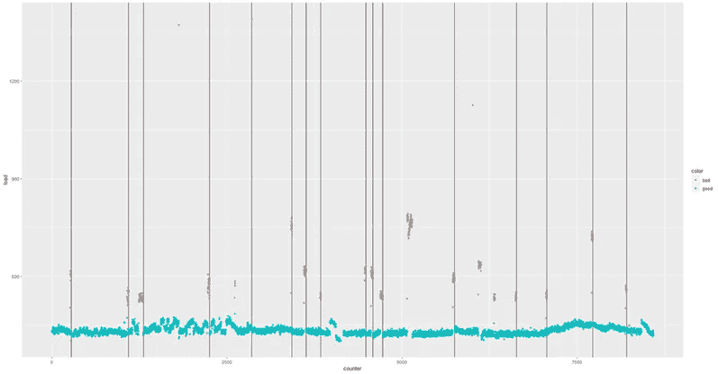

黑线是注释失败，而红点是异常负载。一些红点与黑线不在一条线上，这是由于操作人员有时会遗漏注释。

随着时间的推移，每种类型的失败都会出现不同的模式。上图中的黑线都代表了*立铣刀故障*的次数，此时一个特定的立铣刀断裂，无法完成完成零件所需的工作。在之后进入*的刀具需要消耗额外的能量来进行切削，这导致了你在上图中看到的红色负载信号。这是一次又一次地重复，允许我们创建一个简单的阈值算法，每当我们看到第一个提升的负载信号时，就停止机器的运行。*

在它的物理表现中，你可以看到一个好的零件，由一个好的端铣刀切割，在槽中有一个漂亮而闪亮的表面。一个坏零件，由一个坏的立铣刀切割，有一个粗糙的槽，因为立铣刀不能创造一个光滑的光洁度，随后的工具也不能正确地完成它的工作。

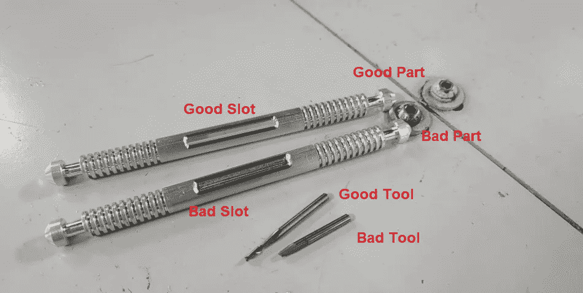

在我们的产品中，我们现在监控这台机器上的负载，以便在制造任何这些坏的槽零件之前发出进料保持。在过去的 4 个月里，我们在多台机器上发布了 60 个 feed holds，其中 3 个为误报，2 个为漏检(95%的准确率，96%的召回率)，防止了 2，000 多个零件报废，节省了无数的机器重新配置工时。当然，这些都是小零件，由小工具制造，当我们提取非常敏感的电机数据时，尺寸不是很大的限制。从这些机器中出来的所有零件现在都是崭新的，没有了它们曾经带有的缺陷。

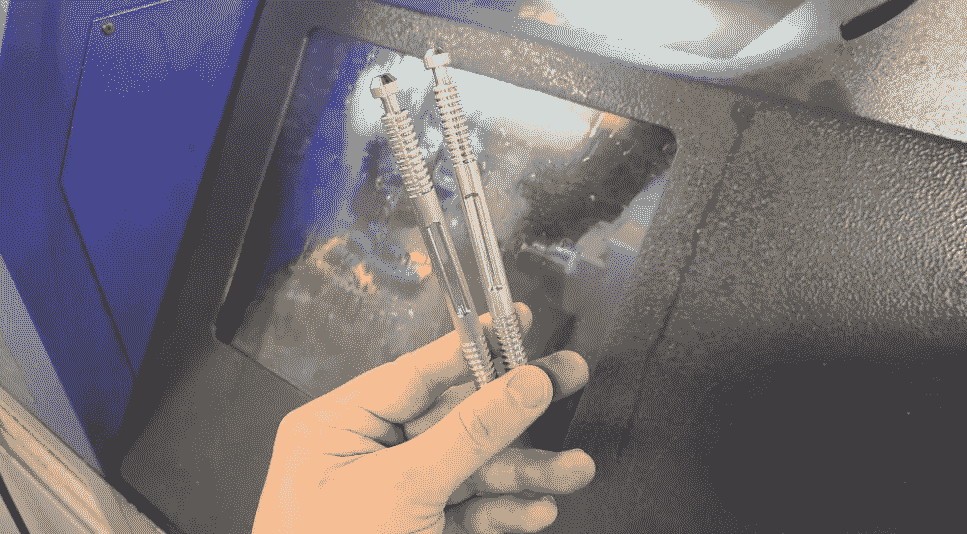

很整洁，是吧？这只是众多使用案例中的一个。你不会以为我们只是只会一招的小马吧？

## 滚珠轴承故障

与立铣刀故障类似，轴承故障会在材料和人力方面造成巨大损失。

与立铣刀故障不同，轴承故障在我们需要寻找的模式方面看起来完全不同。

与立铣刀故障类似，轴承故障使用相同类型的丰富电机数据和收集方法。

与立铣刀故障不同，轴承故障会出现很长时间(几天到几周),并且可以提前很长时间预防。

让我们首先通过故障前 2 小时的数据快照，研究轴承故障前机器上的负载。

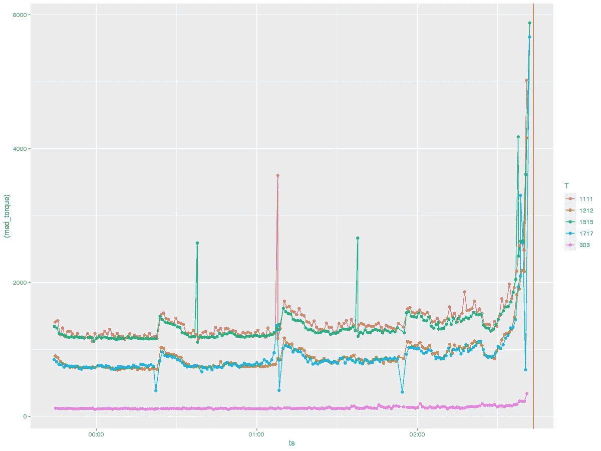

这些线中的每一条都被加载到特定的工具上。不需要一个火箭科学家就能弄清楚这里发生了什么。在每个工具的轴承实际出现故障前约 15 分钟，负载急剧增加，这可能是因为机器的关键部件越来越脆弱，导致机器承受了额外的压力。

如果我们观察故障前 15 分钟内一个部件接一个部件的进展，另一个有趣的模式出现了，即负载似乎随着时间的推移而退化。您可以看到，对于每次切割，负载都呈指数增长，越来越超出规格。

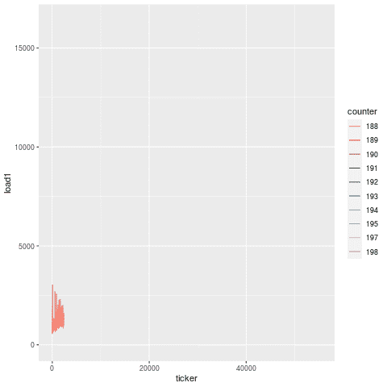

将此与制造相同零件的另一台机器上的另一个轴承故障进行比较，模式非常相似。这是因为这是轴承故障的独特特征。虽然导致零件报废的立铣刀故障表现为后续刀具上的载荷突然增加，但是轴承故障表现为所有刀具上的载荷急剧增加。

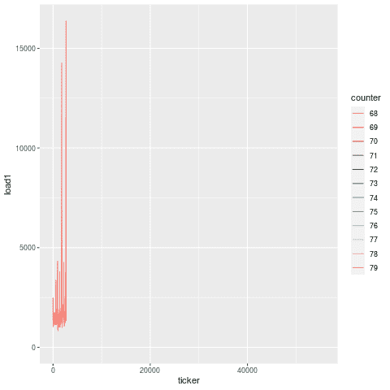

二月(左)与十一月(右)轴承故障，加速约 20 倍

随着时间的推移，我们实际上看到这种退化在实际失败前几天就开始了。在两台机器的两个独立实例中，您可以看到，在断裂前的最后 15 分钟内，负载在最后一次陡峭爬升之前很久就有所提升。那是因为轴承不会凭空出现。在最后一次开斋节之前的几天里，可能会有松动或骨折没有得到检查，这是由误用或缺乏维护造成的。在这种情况下，故障轴承还导致主轴箱损坏，这又花费了几千美元的修理费。

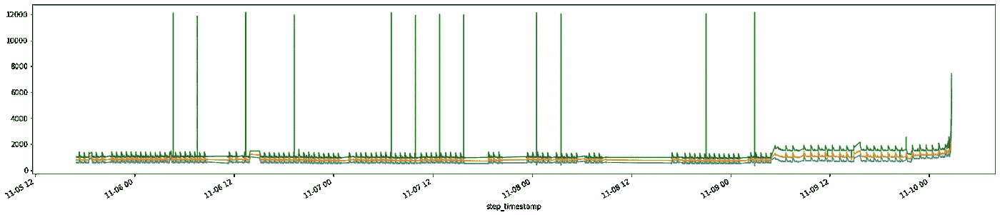

11 月轴承故障，显示大约 2 天前负荷升高。

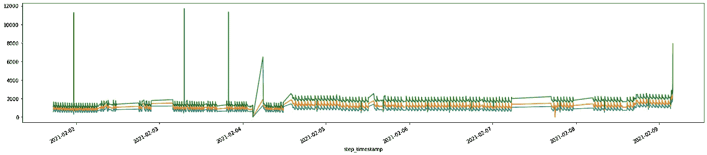

2 月轴承故障，显示大约 1 周前负荷升高。

我们看到的相似类型的失败的显著一致性是由于我们正在观察物理现象，令人惊讶的是，这些现象受物理定律支配。因此，故障遵循确定性模式，我们可以从足够高保真的数据中辨别出来。诀窍在于获取这些数据并对其进行清理，使其变得有用，这是我们知识产权的一大部分。

我们将这一创新归功于 MachineMetrics 团队的特殊技能组合——我们认为，让经验丰富的机器操作员与网络物理协议专家一起工作，辅之以来自 CERN 的物理学家和来自全球智库的数据科学家，并得到相信我们正在开创一个新的工业时代的投资者的支持，这并不常见。

## 级联工具故障

对于任何机械师来说，一整列工具断裂都是令人沮丧的经历。不幸的是，这在我们的行业中太常见了。如果我们可以看到第一个工具何时损坏，然后在其他工具取出之前立即停止机器，会怎么样？

事实证明，你可以。在第一个工具消失后，后续工具上的负载特征的改变几乎是轻而易举的事情。

在这种情况下，当检测到灾难性事件时，我们看到第一个工具在机器自行停止之前中断了许多零件循环。当自停发生时，其他工具也已被取走，使车间花费了价值数百美元的不必要的工具更换。第一个工具很可能是因为磨损和过期而损坏的，所以无论如何也不可能保存。但是没有理由为什么在它之后的其他工具，一些新替换的，也需要被淘汰。

你可以在下面看到一个动画，根据操作者所说，工具故障，当机器自己停止时，是在第 40 部分。事实上，信号在第 37 部分开始减弱，整整 3 个周期后，机器才自我识别出有问题。在这三个周期中，跟随坏工具的工具破产了。

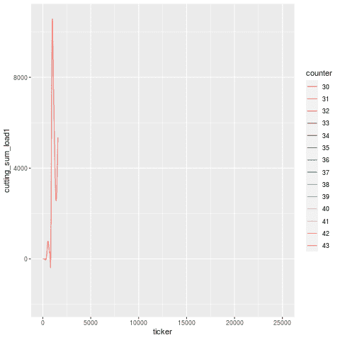

除了零件号之外，让我们来分解一下工具使用期，工具由不同的线型指定。

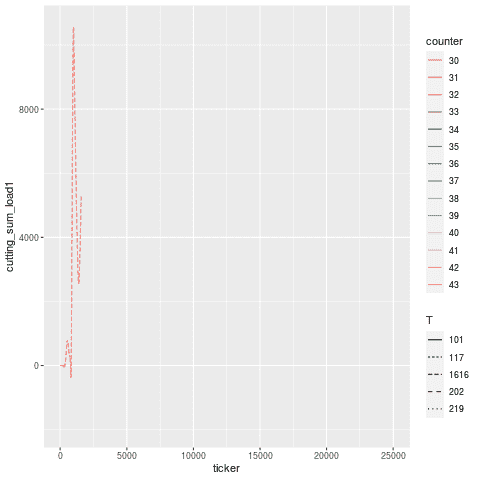

让我们把问题放大一点。这有点难以辨别，但看起来 T101 是损坏的令人不快的工具，T117 是在紧接着的周期中经历更高负载的工具，然后是平坦线(死亡)。一旦工具被替换，负载特征大致回到它之前的样子(由于有新的工具，导致了一点滑动)。

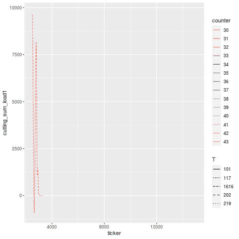

在这种情况下的注释是“H1t1 198/200 粗破，取出座。”—意思是，“头 1、刀具 1(粗加工刀具)在工作过程中断裂，在 200 个要制造的零件中的 198 个处断裂，并取出了定位(后续)刀具”。

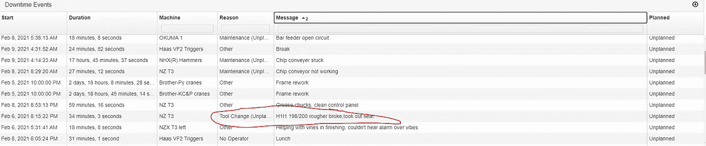

事实上，事情就是这样。

*继续关注第 2 部分，我们将回顾刀具寿命估计、机床上不正确偏置的后果以及刀具故障的不完全切断。*