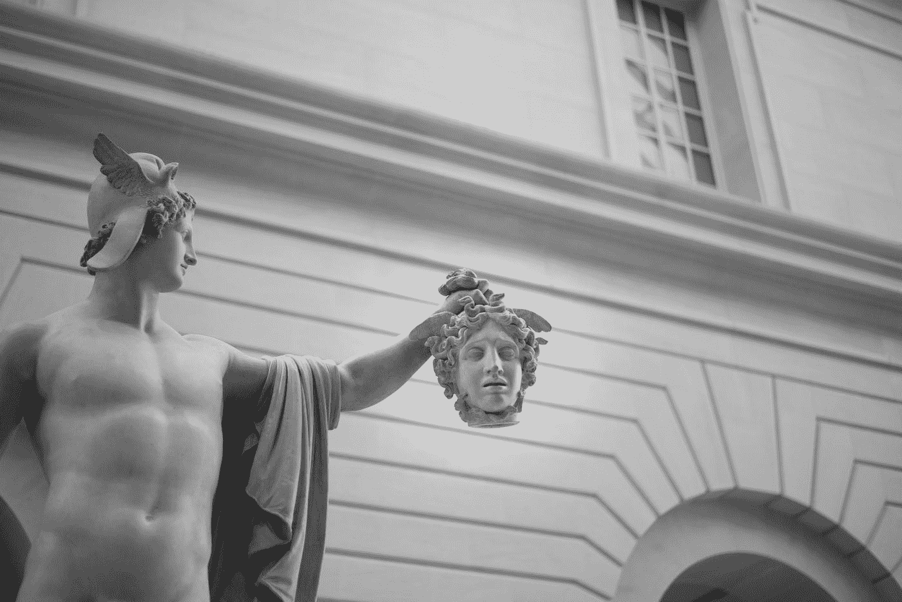
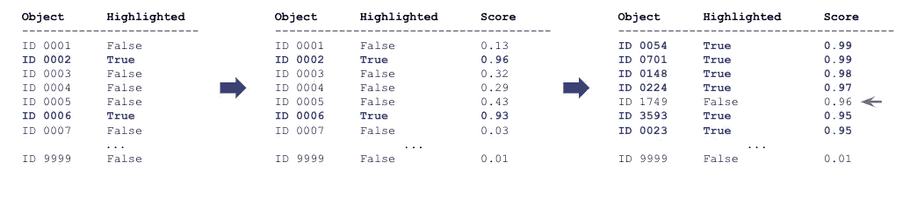
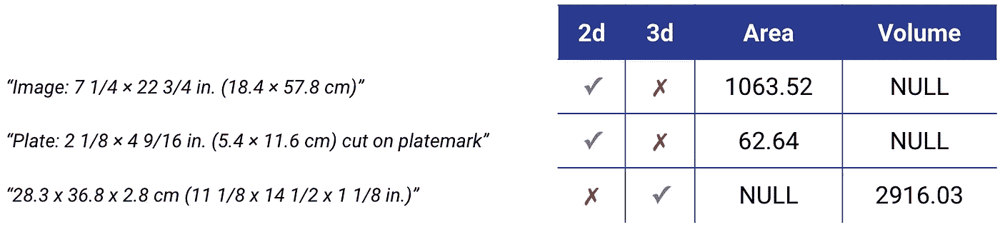
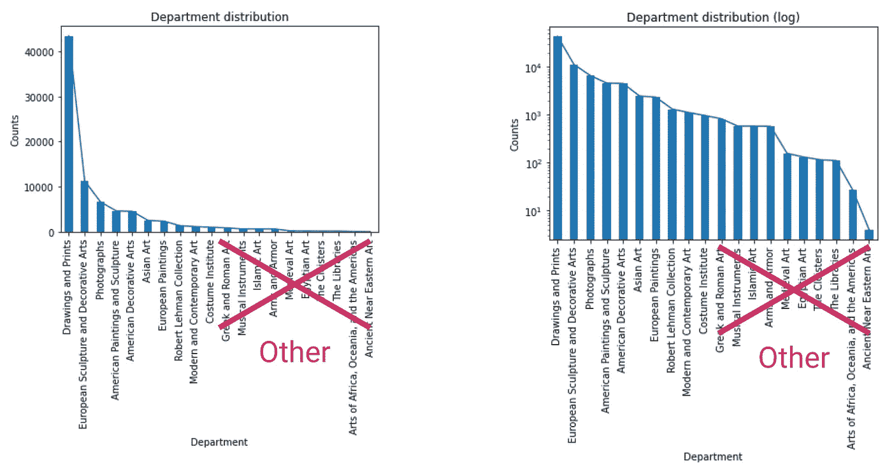
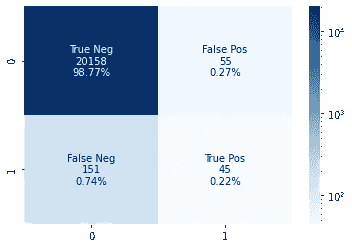
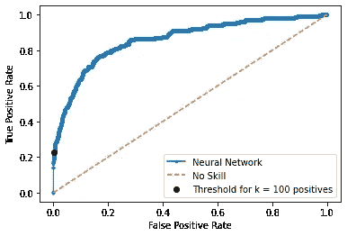

# 用机器学习重新分类库存——艺术爱好者版

> 原文：<https://towardsdatascience.com/reclassifying-inventory-with-machine-learning-art-lovers-edition-53818c287996?source=collection_archive---------25----------------------->

## 预测大都会艺术博物馆收藏的艺术品的受欢迎程度和重要性

艾莉森·考特尼在 [Unsplash](https://unsplash.com?utm_source=medium&utm_medium=referral) 上拍摄的照片

大都会艺术博物馆，也被称为 Met，是美国最大的艺术博物馆，永久收藏超过 200 万件作品。永久收藏从古典绘画到广泛的现代艺术收藏都有。我仍然记得我第一次走进博物馆时的激动心情。感觉我在短短几个小时内经历了几个世纪的人类历史。我是如此的敬畏，以至于作为我在 [Metis](https://www.thisismetis.com/) 数据科学训练营的一个项目，我决定做一个关于预测大都会博物馆藏品中艺术品的受欢迎程度和重要性的项目。

博物馆保留了一份精选作品清单，这些精选作品是从大都会博物馆的永久收藏中挑选出来的，被认为是受欢迎的和重要的。这些还不到收藏中所有艺术品的 1%。我的项目的目标是创建一个分类器，它能够根据描述艺术品的特征来识别这些突出显示的项目。Met 可以使用这种类型的模型来识别他们的集合中他们可能认为重新分类为重要的对象。它还可以用于对新添加到集合中的内容进行初始分析。

## 数据和方法

对于这个问题，我使用了 Met BigQuery 公共数据集，其中有超过 200，000 件艺术品。它包含关于艺术品的信息，如标题、艺术家、部门、城市、国家、文化、分类等。

这是我用来从 Google Cloud BigQuery 数据仓库中提取艺术品数据的 SQL 查询，它利用 Google 基础设施的处理能力实现了超快速的 SQL 查询。

提取插图数据的 SQL 查询

为了找到与突出显示的艺术品最接近的项目，我需要创建一个分类器，以高精度找到突出显示的项目，然后挑选得分最高的非突出显示的项目。希望这些是应该被强调的艺术品，但可能不知何故“从裂缝中滑落”。

下图显示了生成需要重新考虑以突出显示的候选人列表所需的步骤。第一步是创建一个分类器来预测突出显示的项目。下一步是用分类器对所有观察结果进行评分，并根据分数进行排序。最后一步是挑选得分最高的非高亮项目。

生成要重新考虑以突出显示的候选艺术品列表所需的步骤

这是一个大海捞针式的问题，其中类严重不平衡，我只对列表顶端的精度感兴趣。Precision@k 是最适合这个问题的度量标准，其中我挑选了 k 个得分最高的项目，并在这个集合上测量分类器的精度。

## 特征工程

数据集包含描述艺术品尺寸的列。为了能够使用它，我必须解析它的内容。根据物体是二维还是三维，我计算并存储了面积或体积。

解析维度列(面积单位为厘米，体积单位为厘米)

许多分类特征，如国家、城市、时期、部门等，都有数百个(如果不是数千个的话)唯一值，频率计数按照 Zipf 定律随着等级快速减少。这是一个使用数理统计制定的经验法则，指的是这样一个事实，即对于物理和社会科学中研究的许多类型的数据，等级-频率分布是一种反比关系。

在左图中，您可以看到各部门的绝对频率，在右图中，是相同的数据，但 Y 轴是对数刻度。我将从这些分类变量中创建虚拟特征，因此，为了保持特征的合理数量，我只保留了每个类别中的前 X 个值，并将其余的标记为“其他”。保留值的数量因变量而异。

频率计数随着等级快速减少

## 机器学习

这个项目中我最喜欢的部分来了——使用机器学习来实现我的主要目标，即创建一个分类器来找到与突出显示的艺术品最接近的项目。为了这个项目，我尝试了不同的 ML 模型——随机森林、袋装决策树、增强决策树和神经网络(DNN)。

对于每个模型，我选择了一个不同的阈值，该阈值将产生正好 100 个阳性结果，允许我使用 Precision@k 来比较它们，其中 k 是 100。尽管 DNN 的性能比表现最好的随机森林稍低，但 DNN 的输出粒度更好，允许我正确地对对象进行排序。这是一个很好的例子，说明性能指标分数不是影响模型选择的唯一标准。

下面你可以在测试集上找到 DNN 模型的混淆矩阵和 ROC 曲线。

DNN 测试集混淆矩阵

DNN 检验集 ROC 曲线

我在整个数据集上重新训练了我的神经网络，对所有对象进行了评分，并挑选了前 10 个得分最高的非突出显示项目。然后我使用[大都会艺术博物馆收藏 API](https://metmuseum.github.io/) 来显示结果。

从 Met Collection API 中检索和显示图像

请访问我的 [Github 帐户](https://github.com/SatenikS)来查看这个和我的其他项目的代码。也可以随时通过 [LinkedIn](https://www.linkedin.com/in/satenik-safaryan/) 联系我。