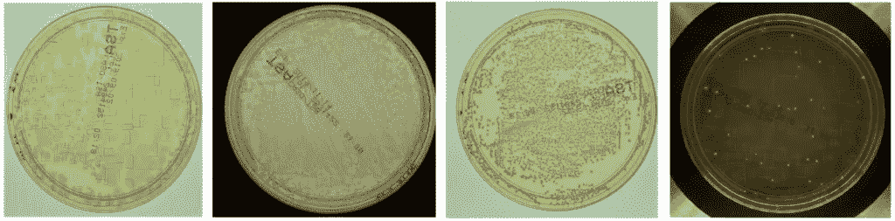
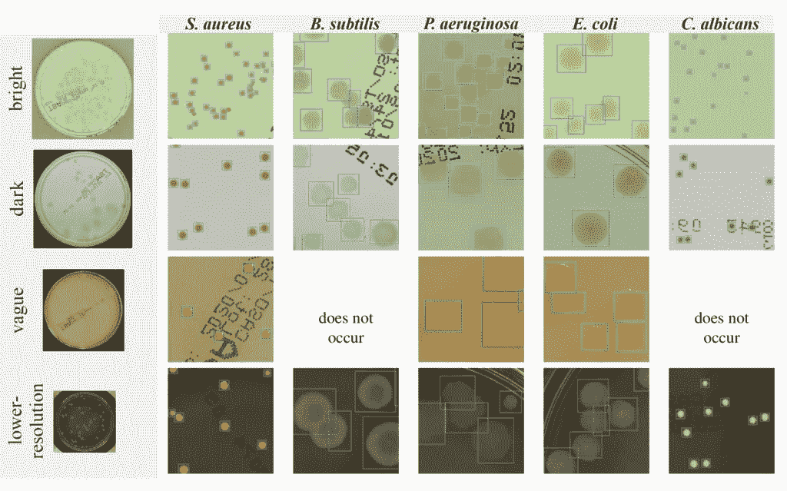
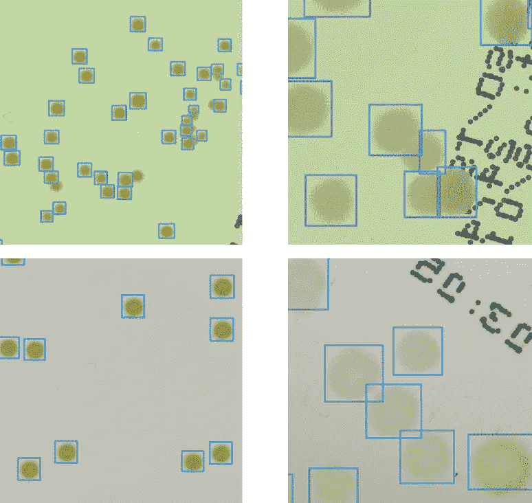
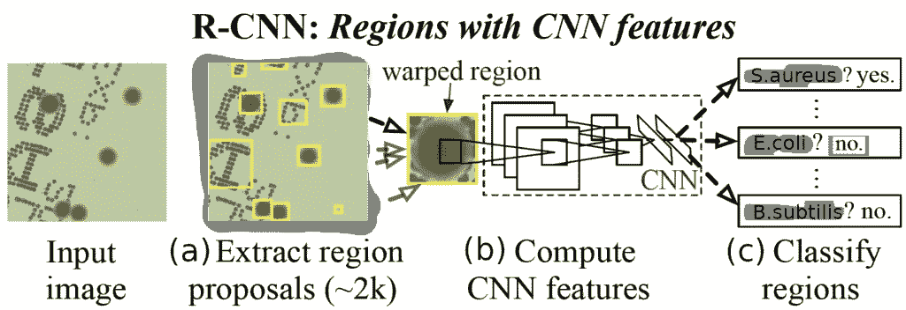
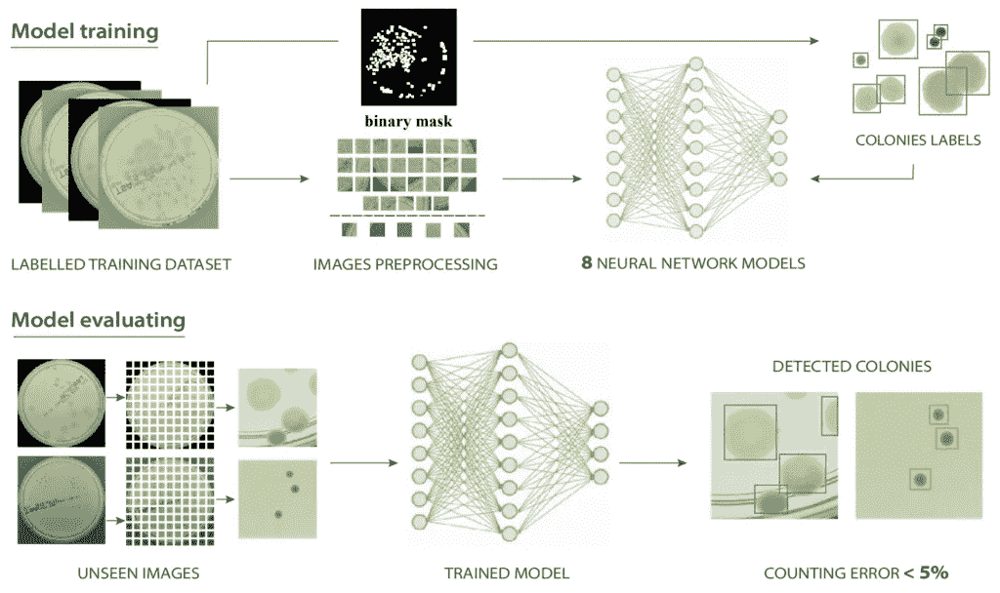
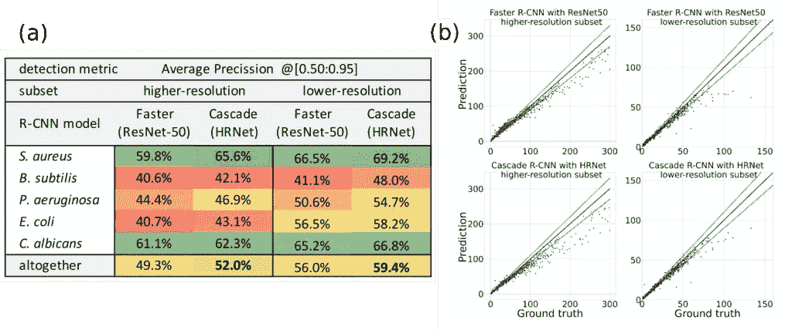

# 培养皿上微生物的识别和计数

> 原文：<https://towardsdatascience.com/recognition-and-counting-of-microorganisms-on-petri-dishes-53a499283dc8?source=collection_archive---------17----------------------->

## **引入深度学习方法**用于分析微生物图像

*[*雅罗斯瓦夫*](https://medium.com/@jaroslaw.pawlowski) *和* [*西尔维娅*](https://medium.com/@sylwia.majchrowska) *。**

**

*作者图片。*

*制药、化妆品或食品行业的生产过程受到严格的政策和法规的约束，制造商有义务进行持续的微生物监控。这意味着成千上万的样本，通常以标准培养皿(琼脂培养基上生长的微生物培养物)的形式，必须由经验丰富的微生物学家人工分析和计数。这是一个耗时且容易出错的过程，需要训练有素的专业人员。为了避免这些问题，应用于该任务的自动化方法将是非常受欢迎的。*

*在这篇文章中，我们将介绍由 NeuroSYS 研究团队开发的分析微生物图像的**深度学习方法**。训练机器学习模型的关键是获得大的、构造良好的数据集。因此，我们将利用在我们之前的[帖子](https://neurosys.com/annotated-germs-automated-recognition/)中介绍的[琼脂数据集](https://agar.neurosys.com/)来训练一个模型，该模型根据细菌菌落的 RGB 图像对培养皿上生长的细菌菌落进行计数和分类。*

> *你知道这条线索吗？—拥有大量数据的愚蠢算法胜过拥有少量数据的聪明算法。*

# *微生物菌落的检测*

*好的，那么让我们从检测微生物开始。想象一下，我们有一个培养皿的图像(这种圆形玻璃通常用于保存生长培养基，以便在实验室繁殖微生物细胞)。在不同琼脂图像设置中的这种培养皿的示例性照片显示在图 1 的左栏中。其他 5 列显示了包含 5 种不同微生物类型的照片片段(我们称之为*小块*)。现在很容易理解**微生物检测**是什么意思了。我们只需确定每个微生物的确切位置和大小，用蓝色矩形标记它(我们称之为*边界框*)，如图 1 所示，并在图 2 中放大。*

**

*图一。不同类型的微生物(第 2-6 列)在不同照明设置(每行)的培养皿(第 1 列)中生长。每个蓝色边界框都是由一个训练有素的探测器预测的。作者图片。*

*对于训练有素的专业人员来说，这似乎很容易，但请注意，微生物菌落边缘可能模糊不清，菌落本身非常小(甚至只有几个像素大)，或者相机设置(例如聚焦或照明)非常不充分(例如，参见图 1 中第三行的照明条件)。此外，一些群体可能重叠，这使得一个群体结束而另一个群体开始的决定非常具有挑战性。这就是为什么要建立一个微生物菌落**定位**和**分类**的自动化系统真的很难。*

**

*图二。由我们的探测器进行预测的放大补丁。请注意，菌落可能有非常不同的大小:一些菌落非常小，一些菌落很大，边缘模糊，一些菌落可能重叠——这使得检测非常具有挑战性。作者图片。*

*为此，我们开发了一种用于微生物检测的深度学习模型。深度学习是一系列人工智能模型，主要利用**人工神经网络**。这种现代方法在许多领域都非常成功，例如在计算机视觉或机器翻译领域。深度学习**物体检测器**(在我们的例子中是检测微生物菌落)是非常复杂的多级模型，有数百层，每层由数百个神经元组成。*

## *人工智能试图解决对人类来说相对容易但极难编程的任务。*

*这里，我们采用基于区域的卷积神经网络(R-CNN)系列的两级检测器[2，3]，已知这种检测器速度慢但非常精确(与单级检测器相比，例如著名的 YOLO [4])。关于其工作原理的简短解释，请参见图 3。关于各种物体检测算法的更详细的解释，请参见我们之前关于这个问题的博文。*

**

*图 3。R-CNN 检测器的两级结构。第一阶段(a)生成区域建议，这些区域建议只是原始图像的较小部分，我们认为它们可能包含我们正在搜索的对象。在第二阶段:(b)我们采用每个区域提议，并使用深度 CNN 创建表示该区域的特征向量，并对每个提议进行分类:它是否相关，如果是，它包含哪类对象。图改编自[2]。*

# *训练探测器*

*展示完微生物检测结果后，让我们看看检测机是如何工作的。这包含神经网络**监督训练**过程，但不仅如此:数据预处理和后处理也出现在图 4 的训练方案中。为了以监督的方式训练深度学习模型，我们需要一个带标签的数据集。如前所述，我们在此使用琼脂数据集，该数据集由带有标记微生物菌落的培养皿的图像组成。*

*神经网络的典型特征是模型的结构严格对应于输入大小。当训练(和评估)网络时，我们受到可用存储器的限制，因此我们不能一次处理整个高分辨率图像，所以我们必须将它分成许多小块。这个过程并不简单，因为在切割成小块的过程中，我们必须确保给定的菌落完整地出现在至少一个小块上。*

*之后，我们准备训练检测器(图 4 中的上一行)。我们从 R-CNN 家族中挑选了 8 款不同的机型进行综合对比。训练完探测器后，我们**在照片上(实际上是在补丁上)测试了**探测器(图 4 中的下部管道)**在训练期间看不到**，以确保测试公平进行。请注意，为测试准备的补丁只是被均匀地切掉了——在这个阶段，我们不能包含关于边界框所在位置的信息。*

**

*图 4。监督训练和评估(测试)我们的微生物菌落检测器神经网络模型的流程图。作者图片。*

# *检测和计数结果*

*我们在图 1 和图 2 中看到，我们的模型**很好地检测到了菌落**。但是如何定量描述检测的性能呢？我们可以计算一些标准数字(度量)来描述模型在测试集上的性能。其中最受欢迎的一种称为平均精度(AP)或多类检测情况下的平均精度(mAP)(详细定义见本文[帖子](https://neurosys.com/article/object-detection-algorithms-starter-pack/))。在琼脂数据集的两个子集(较高和较低分辨率)上评估的两个选定的 R-CNN 模型(更快的 ResNet-50 和 Cascade HRNet)的 AP 和 mAP 结果如图 5 所示(左侧表格)。*

*一般来说，AP 值越高，检测越精确——预测的和真实的**边界框**彼此更好地匹配。然而，请注意，这里的情况有点复杂，因为我们有不同的微生物类型，这意味着除了找到菌落，detector 还需要对它们进行分类。*

*用不同的 fidelites 检测不同种类的微生物，这影响了图 5 所示的 mAP。例如，*金黄色葡萄球菌*细菌边缘锋利的小菌落比*假单胞菌* *铜绿*细菌边缘模糊的大菌落(AP 约 50%)更容易被检测和标记(AP 约 65%)。同样值得一提的是，与在著名的 COCO 数据集上使用相同架构完成的报告相比，我们的结果似乎非常出色:级联 R-CNN 为 45%，更快的 R-CNN 为 37%[5]。*

*与检测培养皿上的每个菌落严格相关的最后一项任务是**计数**。在检测到所有的微生物菌落后，我们将它们相加，并将该数值与给定培养皿中菌落的真实数值进行比较。在琼脂试验子集上用相同的两个模型计数的结果显示在图 5 中(右边的图)。*

*在*x*-轴上，我们有由训练有素的专业人员估计的不同培养皿的地面真实菌落数，而在 *y* 轴上，我们有由我们的模型预测的值——每对(*真实值*，*预测值*)由这些图上的单个黑点表示。很明显，在理想预测的情况下，所有点都应该位于由黑线表示的 *y = x* 曲线上。幸运的是，绝大多数点都位于这条曲线附近——模型计算得相当好。两条额外的蓝色曲线标记+/- 10%的计数误差，我们可以看到只有少数点(特别是具有超过 50 个菌落的更高密度的培养皿)位于该区域之外。*

*平均计数误差通过平均绝对误差(MAE)来测量，例如在本博客的[中定义的，以及所谓的对称平均绝对百分比误差(sMAPE)，其基于百分比误差来测量准确度【6】。一般来说，sMAPE 不超过 5%，这是一个相当合理的结果。](https://neurosys.com/objects-counting-by-estimating-a-density-map/)*

**

*图 5。微生物菌落检测的质量:左边是描述检测本身保真度的平均精度度量的结果，而右边是菌落计数的比较——预测与真实菌落数(理想预测位于 y=x 黑色曲线上)。作者图片。*

# *结论*

*总之，在这篇文章中，我们介绍了关于在培养皿上识别 **微生物的**深度学习研究。所选的 R-CNN 模型在检测微生物菌落方面表现非常好。菌落具有相似的形状并且所有种类的微生物在训练数据中都有很好的表现，这一事实有助于检测，证明了琼脂数据集的实用性。此外，用基本的更快的 R-CNN 和更复杂的级联 R-CNN 获得的结果差别不大。*****

*如上所述，对于菌落数少于 50 的样品，检测器更加准确。然而，对于具有数百甚至数千个菌落的培养皿，它们仍然给出了非常好的估计，如图 6 所示，在高度密集的样品中正确地识别出单个菌落。**在极端情况下，一个平板上检测到的最大菌落数等于 2782 个**。值得注意的是，深度学习系统需要几秒钟，而在人工计数的情况下，可能需要一个小时。此外，在某些情况下，探测器能够识别人类难以看到和错过的群体。这些案例证实了建立自动微生物检测系统的好处，并且这可以通过使用现代深度学习技术成功实现。*

# *参考*

*[1] P. Domingos，关于机器学习要知道的一些有用的事情，Commun。美国计算机学会，第 55 卷，第 78-87 页，2012 年。*

*[2] R. Girshick 等，精确对象检测和语义分割的丰富特征层次，IEEE 计算机视觉和模式识别会议论文集，2014。*

*[3] [A. Mohan，使用 R-CNNs 的物体检测和分类](https://www.telesens.co/2018/03/11/object-detection-and-classification-using-r-cnns/)，关于 RCNN 模型的非常详细的博客，2018。*

*[4] J. Redmon 等，你只看一次:统一的、实时的物体检测，IEEE 计算机视觉与模式识别会议论文集，2016。*

*[5] J. Wang 等，面向视觉识别的深度高分辨率表征学习，IEEE 模式分析与机器智能汇刊，2020。*

*[6] S. Majchrowska，J. Pawł owski，G. Guł，T. Bonus，A. Hanas，A. Loch，A. Pawlak，J. Roszkowiak，T. Golan，和 Z. Drulis-Kawa，AGAR a Microbial Colony Dataset for Deep Learning Detection，2021 年 7 月 7 日，预印本可在 arXiv[arXiv:2108.01234](https://arxiv.org/abs/2108.01234)查阅。*

**由欧洲区域发展基金下的欧盟基金共同资助的项目，作为精明增长运营计划的一部分。作为国家研究与发展中心的一部分实施的项目:快速通道。**

**

**原载于 2021 年*10 月 13 日*https://neurosys.com**。**

*[https://github.com/majsylw/microbial-counting-review](https://github.com/majsylw/microbial-counting-review)*

*[https://arxiv.org/abs/2108.01234](https://arxiv.org/abs/2108.01234)*