# 利用张量流识别猫和狗

> 原文：<https://towardsdatascience.com/recognizing-cats-and-dogs-with-tensorflow-105eb56da35f?source=collection_archive---------12----------------------->

## 使用卷积深度神经网络来参加 Kaggle 的狗与猫比赛

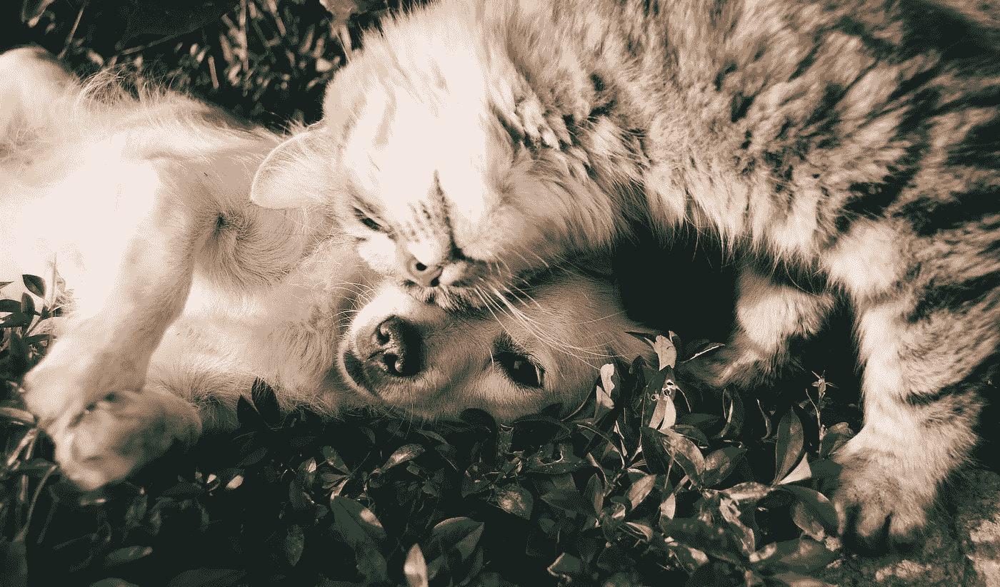

[来自像素的 Snapwire 图像](https://www.pexels.com/photo/orange-tabby-cat-beside-fawn-short-coated-puppy-46024/)

在学习深度神经网络的过程中，我喜欢用实际的例子和项目来帮助我记忆理论。寻找这些实际项目的一个极好的资源是 [Kaggle](https://www.kaggle.com/) 。Kaggle 是一个由数据科学家和机器学习实践者组成的在线社区。

Kaggle 允许您搜索和发布数据集，探索和建立模型。您可以在基于 web 的环境中执行这些功能。Kaggle 还提供带有实际问题的机器学习竞赛，并为获胜者提供奖品。

目前在用 TensorFlow 研究深度学习。我想学的科目之一是图像识别。这篇文章描述了我试图解决 2013 年的一场名为“狗与猫”的前 Kaggle 比赛为了实现这个解决方案，我使用了 Python 3.8 和 TensorFlow 2.3.0。

最初的“狗与猫”比赛的目标是编写一个算法来分类图像是包含狗还是猫。请注意，2013 年没有 TensorFlow 或 PyTorch 等其他框架来提供帮助。

虽然比赛结束了，但还是可以上传，让 Kaggle 给你的预测打分。

# 准备培训数据

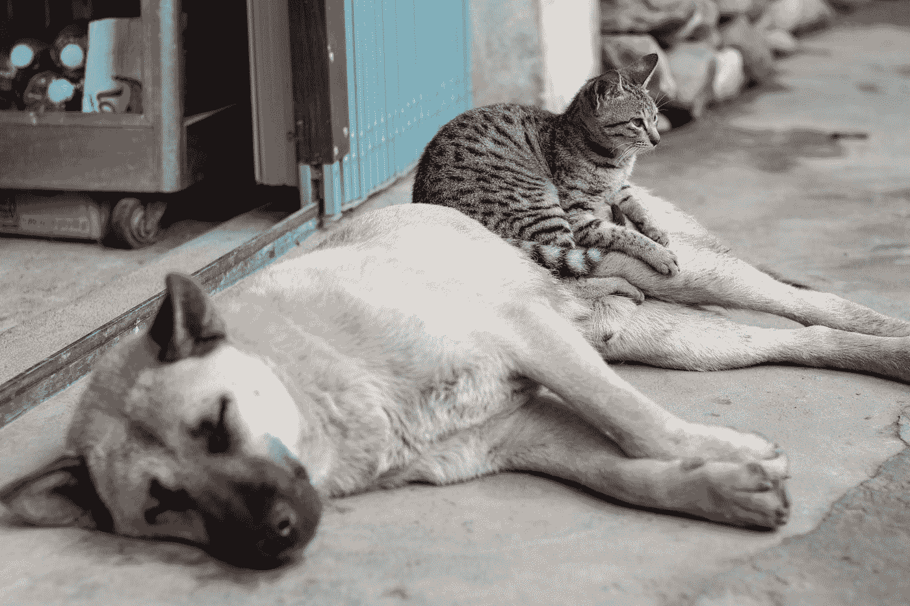

照片由 [Glomad Marketing](https://unsplash.com/@glomadmarketing?utm_source=medium&utm_medium=referral) 在 [Unsplash](https://unsplash.com?utm_source=medium&utm_medium=referral)

在创建和训练模型之前，我们必须准备好训练数据。这项比赛的训练数据涉及 25，000 张狗和猫的图像。每个图像的文件名指定图像是狗还是猫。

要为竞赛创建提交，您必须从测试集中为 12，500 幅图像中的每一幅图像创建一个预测。你必须预测图片中是一只狗还是一只猫。您可以通过上传包含 12，500 幅图像中每一幅图像的一行的 CSV 来对提交的图像进行评分。每一行必须包含图像的 id 和它是狗还是猫的预测(1 =狗，0 =猫)。

## 从图像中读取数据

Kaggle 通过一个包含所有猫和狗图像的 zip 文件提供了[训练数据](https://www.kaggle.com/c/dogs-vs-cats-redux-kernels-edition/data)。

为了在训练期间将图像数据输入到模型中，我们首先必须从磁盘加载一个图像，并将其转换为一个字节数组。然后，训练程序将这个字节数组与“猫”或“狗”的标签一起输入神经网络，以学习它是猫还是狗。

我没有编写 Python 程序从磁盘读取文件，而是使用 Tensorflow 中的`ImageDataGenerator`。预处理模块。该类可以从磁盘加载图像，并生成训练过程可以直接使用的批量图像数据。它还可以做其他的事情，稍后我们优化模型的时候我会展示给你们看。

要使用 ImageDataGenerator，必须在磁盘上以某种方式组织数据。对于您想要识别的每个标签或类别，您必须创建一个与标签同名的子目录。在该目录中，放置该特定类别的图像。

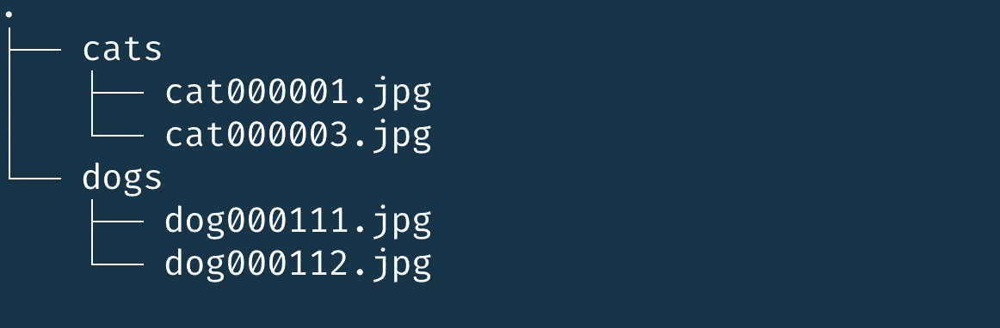

结构化数据，以便 ImageDataGenerator 可以使用它，image by the author

## 分发训练图像

如前所述，我们必须将图像从 Kaggle 的 zip 文件复制到目录结构中。此外，为了表明我们的模型有多好，我们将从 Kaggle 获得的训练图像分成一个训练和验证集。例如，我们从 25，000 张照片中保留 5，000 张照片，用于验证经过训练的模型。

下面的 Python 函数分发了来自文件夹中的猫和狗的图像，在该文件夹中，您解压了带有 Kaggle 图片的 zip 文件。该过程创建一个可由 ImageDataGenerator 直接使用的结构。

该函数检索一个名为 validation_size 的参数。验证大小是一个介于 0.0 和 1.0 之间的数字，表示验证集在拆分中所占的比例。

分发和分割培训数据

该函数在将图像复制到正确的目录之前，会打乱图像名称列表。有了这个目录结构，我们就可以开始使用 ImageDataGenerator 了。

## 准备 ImageDataGenerator

我们将使用 ImageDataGenerator 中的`flow_from_directory`方法。该方法创建一个迭代器，从指定的目录中检索并返回图像。

创建 ImageDataGenerator 以向处理管道提供图像

我在创建实例时使用 rescale 参数来自动缩放图像的像素。我们没有使用范围从 0 到 255 的 RGB 值，而是将它们重新调整为从 0 到 1 的浮点数。这种重新标度使得训练深度学习模型变得更加容易。

我们在`flow_from_directory`方法中使用以下参数:

*   目录—包含带有类别的子目录的目录。
*   target _ size——每个图像在提交到深度学习管道之前必须具有相同的大小。ImageDataGenerator 可以动态执行此操作。
*   batch _ size——我们分批将图像提交给深度学习管道。这将设置单个批次的大小。
*   class_mode —我们读取的数据类型的提示。在我们的例子中，“二进制”表明我们将使用两个类别。

当我们运行代码时，`flow_from_directory`会报告在哪些类别中找到了多少张图片。在我们的例子中，训练生成器报告 20000 幅图像，验证生成器报告 5000 幅图像。

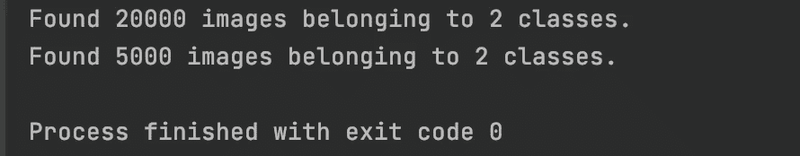

flow_from_directory 报告由作者找到的图像和类

当 ImageDataGenerator 准备就绪时，我们可以开始创建和训练深度学习模型

# 创建和训练深度学习模型

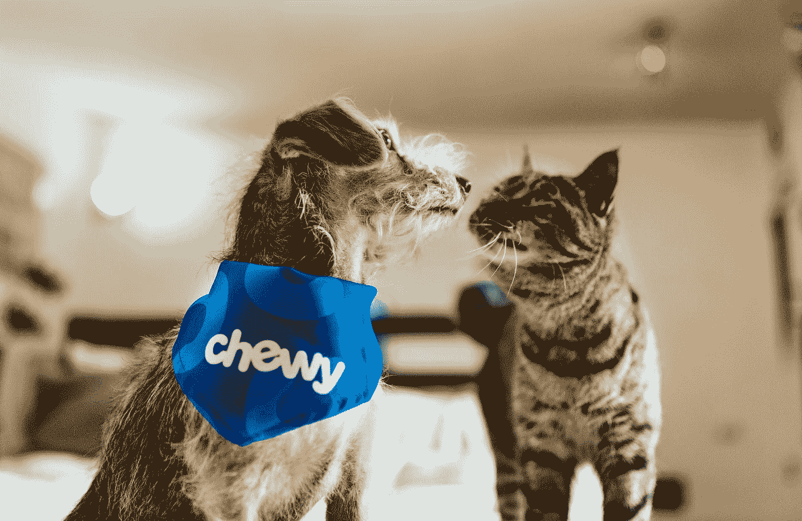

照片由[耐嚼](https://unsplash.com/@chewy?utm_source=medium&utm_medium=referral)在 [Unsplash](https://unsplash.com?utm_source=medium&utm_medium=referral) 上拍摄

由于我们已经准备好了数据，我们现在可以开始使用 TensorFlow 构建深度学习模型。我们使用`Sequential`实例添加层。

定义卷积神经网络的各层

## 卷积层

我们将模型分成三个主要部分。首先，`Conv2D`和`MaxPool2D` 层有三种组合。这些被称为卷积层。一个`Conv2D`图层将滤镜应用于原始图像，以放大图片的某些特征。`MaxPool2D`层缩小了图像的大小，减少了所需参数的数量。减小图像的大小将提高训练网络的速度。

第二个也是实际的深度学习网络从第八行开始，我们在那里展平阵列。我们创建了一个 512 个单元的隐藏密集层，并使用校正线性单元(relu)作为激活函数。

最后一部分是输出层。第十行的最后一层有一个输出神经元。输出神经元将包含从 0 到 1 的值，其中 0 代表猫，1 代表狗。

## 编译模型

在开始训练之前，我们必须使用`compile`方法编译模型。编译为训练配置模型。

编译要配置的模型

我选择 Adam 优化器，因为这是一个很好的默认设置。损失函数是`binary_cross_entropy`，因为我们正在训练一个具有两种可能输出的分类模型。我想报训练时的准确率；因此，我添加了准确性作为度量标准。

第二行调用模型上的`summary()`。调用 summary 方法会产生层和参数数量的概述。这是一个很好的方法来验证你是否创造了你想要创造的一切。

显示模型的摘要

我们在总结中认识到的是图像的大小通过不同的层而减小。图片以 150x150 的图像开始，在进入深度神经网络之前，通过多层缩小为 17x17 大小的图像。

## 训练模型

编译完模型后，我们可以开始训练模型。我们可以通过在模型实例上调用`fit`方法来开始训练。

开始训练 50 个纪元

第一个参数是我们通过调用训练数据的`ImageDataGenerator`的`flow_from_directory`创建的迭代器。第二个参数是来自验证数据的迭代器。

epoch 参数显示模型将处理整个训练集的次数。在这里，我想将所有 20，000 个训练图像处理 50 次。

`steps_per_epoch`显示了在它结束这个纪元之前应该处理多少个批处理。我们之前在`flow_from_directory`上建立了 200 的批量大小，这给出了 200 * 100 = 20，000-我们的训练集的图像数量。

同样的道理也适用于`validation_steps`，50 * 100 = 5，000，这是我们验证集中的图像数量。

在训练期间，`fit`方法打印各种指标。下面你可以看到，在训练结束时，我们的训练集的精度是 0.99。验证集的精确度为 0.79。

fit 方法的控制台输出

一旦训练结束，`model.fit`方法返回一个包含所有训练数据的历史对象。这个历史对象可用于可视化指标。

# 可视化培训结果

我们可以将历史对象与 [Matplotlib](https://matplotlib.org/) 库结合使用，以可视化每个时期的损失和准确性。下面的函数创建了两个图表，一个显示训练和验证准确性，另一个显示训练和验证损失。

使用 Matplotlib 可视化训练结果

如果您训练模型 50 个时期，则`plot_result`函数显示以下两个图表。

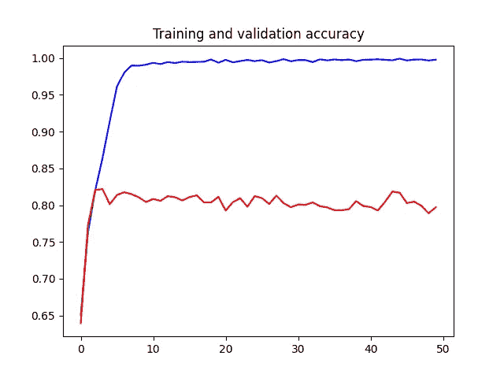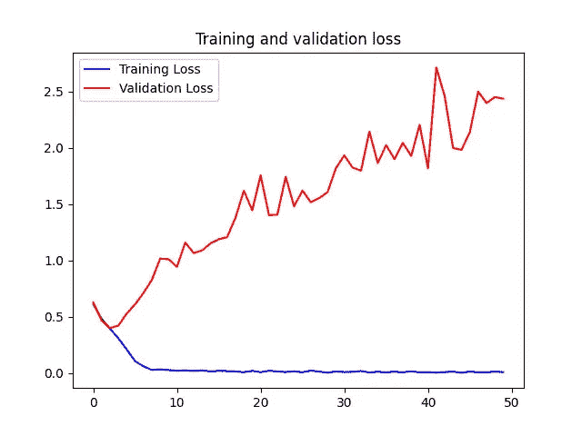

可视化培训结果，图片由作者提供

有趣的是，训练集的准确率慢慢增加到几乎 1 (100%)。然而，在前五个时期内，验证集的准确度增加到大约 0.8，然后在 0.8 处持平。这与验证集的丢失是一样的。它减少前四个时期，然后再次增加。

这是一个明显的**过度拟合**的案例。训练集的准确性提高了，但不能一般化，这从验证集的准确性停滞不前可以清楚地看出。

## 过度拟合

当模型很好地学习了训练数据，以至于它只能预测来自训练集的图像时，就会发生过度拟合。如果我们给它提供不是来自训练集的图像，它的表现会很差。

我们可以通过在您的训练数据集中使用更多数据来克服过度拟合。在这里，这是困难的，因为我们没有更多的来自 Kaggle 的猫和狗的图像。幸运的是，我们还有其他的可能性。

# 优化模型

在我创建一个预测并提交给 Kaggle 之前，我想看看我们是否可以优化这个模型。

## 图像增强

我们看到，在训练过程中，验证集的准确性没有变化。我们还讨论了可以通过增加训练数据量来提高准确性。

除了添加更多的训练数据，我们还可以使用图像增强。图像增强是一种从现有数据创建新的人工训练数据的技术。图像增强通过缩放、旋转、裁剪和翻转来改变原始训练图像。它人为地创造了用于训练的图像。

我们使用的 ImageDataGenerator 可以在从磁盘加载图像后扩充内存中的图像。我们可以在实例化 ImageDataGenerator 时设置图像增强选项。

之前，我们已经使用 ImageDataGenerator 从磁盘中重新缩放图像。现在，我们添加额外的选项来增强图像。

向 ImageDataGenerator 添加图像增强选项

我们指示 ImageDataGenerator 在特定范围内旋转、移动、缩放、翻转和剪切。ImageDataGenerator 随机执行增强。如果我们再次使用 ImageDataGenerator 对模型进行 50 个时期的训练，我们会看到下面的准确度和损失图。

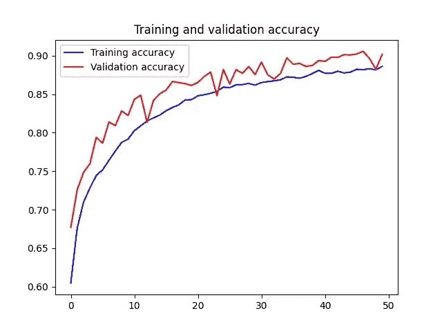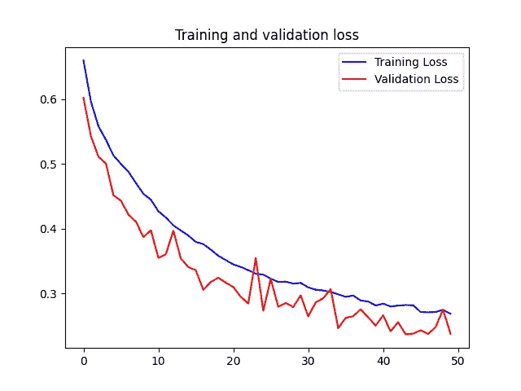

使用图像增强将训练结果可视化，作者提供的图像

请看左图，它显示了验证准确性，我们看到它没有像我们在之前的培训中看到的那样在 80%停止。相反，它慢慢攀升到 90%的准确率。

右图显示了训练集和验证集的损失。这里我们也看到它们缓慢而稳定地减少。

好得多的结果！

# 创建预测

在进一步优化模型之前(这将在另一篇文章中讨论)，我们应该将我们对测试集的预测上传到 Kaggle，看看我们的模型得分如何。在我训练了模型之后，我使用模型上的`save`方法保存了它。

在`load_and_predict`方法中，我们首先加载模型，然后创建一个新的`ImageDataGenerator`来为模型提供来自测试集的图像。然后，我们在模型上调用 predict 方法，从测试集中创建预测。

加载保存的模型并创建预测

提交给 Kaggle 的文件必须是 CSV 格式。我们使用[熊猫](https://pandas.pydata.org/)从预测数组中创建一个数据帧。该数据帧保存为 CSV 文件，并上传至 Kaggle。使用以下对数损失函数对每个提交进行评分。

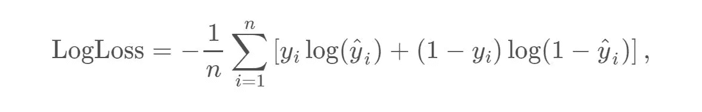

我从使用 CNN 和图像增强的模型提交的得分为 0.26211。这将使我在公共排行榜上名列第 833 位。

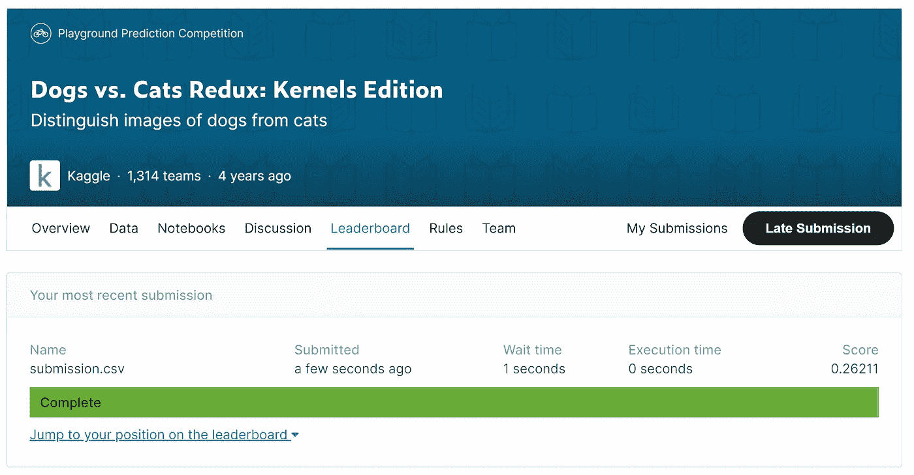

上传提交的内容，查看作者的评分和图片

这是一个好的开始，但我想看看我能不能进一步提高精确度。但这是另一篇文章的内容。

# 结论

在本文中，我描述了如何使用 TensorFlow 创建和使用卷积神经网络。这个神经网络被用来从图像中识别猫和狗。猫和狗的图像取自于[这一古老的猫狗比赛](https://www.kaggle.com/c/dogs-vs-cats-redux-kernels-edition/overview)。

尽管竞赛已经停止，但您仍然可以上传您对测试集的预测并对其进行评分。我的 CNN 获得了 0.26211 的分数，这使我们在公共排行榜上名列第 833 位。

在下一篇文章中，我将描述我们如何使用迁移学习来进一步提高准确性。

本文的源代码可以在 [GitHub](https://github.com/PatrickKalkman/cats_vs_dogs/tree/master) 上找到。这个存储库非常大，因为它包含了所有的训练和测试图像。

感谢您的阅读！