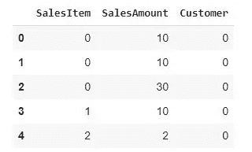
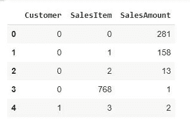
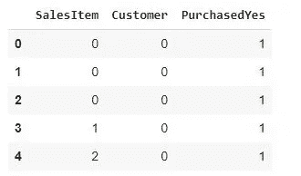
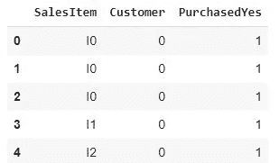

# 推荐使用 Scikit-Learn 和 Tensorflow 推荐器

> 原文：<https://towardsdatascience.com/recommend-using-scikit-learn-and-tensorflow-recommender-bc659d91301a?source=collection_archive---------11----------------------->

## 针对每位客户售出的销售项目(二进制)的协作筛选


[远大前程，布勒，2011，绝缘胶带，木材，纸板，丙烯酸玻璃，喷雾疼痛](http://www.boehler-orendt.com/boehler/index.html) t(经我的朋友马蒂亚斯·布勒友好许可)

**动机:**

我们将学习如何向顾客推荐销售商品，查看顾客的个人购买记录。在我之前的文章中，我详细解释了推荐引擎的许多概念:

[](/recommender-systems-item-customer-collaborative-filtering-ff0c8f41ae8a) [## 推荐系统:商品-顾客协同过滤

### 用 Python 代码逐步解释稀疏性、相似性和显式二进制协同过滤

towardsdatascience.com](/recommender-systems-item-customer-collaborative-filtering-ff0c8f41ae8a) 

本帖重点推荐使用 Scikit-Learn 和 Tensorflow 推荐器。

**解决方案:**

首先，让我们看看我们的数据框架(数据存储在我的 [github 存储库](https://github.com/DAR-DatenanalyseRehberg/DDDD_Data-Driven-Dealings-Development)):

```
import pandas as pd
import numpy as np
data = pd.read_excel(‘/content/gdrive/MyDrive/DDDDFolder/DDDD.xlsx’) 
data.head()
```


这就是我们的数据帧最初的样子

因此，我们得到的是每个销售日的销售额、客户(例如，客户代码 0 是一个特定的客户)和销售项目(类似于客户，销售项目 0 是一个特定的销售项目)。

其他栏目与我们的产品推荐无关，因此我们将删除这些栏目:

```
DataPrep = data[['SalesItem', 'SalesAmount', 'Customer']] 
#we will only use SalesItem, SalesAmount and Customer
DataPrep.head()
```



我们希望了解哪些顾客购买了哪些销售商品:

```
DataGrouped = DataPrep.groupby(['Customer', 'SalesItem']).sum().reset_index() # Group together
DataGrouped.head()
```



我们的协同过滤将基于二进制数据。对于每个数据集，我们将在购买时添加 1。这意味着，该客户已经购买了该商品，不管该客户过去实际购买了多少。我们使用这种二进制数据方法作为我们的推荐示例。另一种方法是使用 SalesAmount 并将其规范化，以防您希望将购买的 SalesItems 的数量视为一种口味因素，这意味着某人购买了 SalesItem x 100 次——而另一个客户只购买了相同的 sales item x 5 次——并不喜欢它。我认为，在销售建议中，二元方法通常更有意义，但当然这真的取决于您的数据:

```
def create_DataBinary(DataGrouped):DataBinary = DataGrouped.copy()DataBinary['PurchasedYes'] = 1return DataBinaryDataBinary = create_DataBinary(DataGrouped)DataBinary.head()
```

最后，让我们去掉 SalesAmount 列:

```
purchase_data=DataBinary.drop(['SalesAmount'], axis=1)purchase_data.head()
```



我们准备的数据框架

为了更方便，我们在每个 SalesItem 中添加 I 作为 Item 的前缀。否则，我们将只有客户和销售项目编号，这可能有点令人费解:

```
purchase_data[‘SalesItem’] = ‘I’ + purchase_data[‘SalesItem’].astype(str)
```



现在我们的数据框架最终为构建推荐器做好了准备。为什么你会问所有的数据？这样做的原因是我希望它能帮助你在数据中采用这个例子，特别是如果你是新手的话。

现在我们将用 Scikit-Learn 导入推荐所需的库:

```
from scipy.sparse import coo_matrix, csr_matrixfrom sklearn.metrics.pairwise import cosine_similarityfrom sklearn.preprocessing import LabelEncoder
```

现在让我们来计算项目-项目余弦相似度:

```
def GetItemItemSim(user_ids, product_ids):SalesItemCustomerMatrix = csr_matrix(([1]*len(user_ids), (product_ids, user_ids)))similarity = cosine_similarity(SalesItemCustomerMatrix)return similarity, SalesItemCustomerMatrix
```

在数据框架中接收每个客户的前 10 个销售项目建议，我们将通过创建 SalesItemCustomerMatrixs(每行销售项目和客户作为填充二元关联的列)来使用上面单元格中的项目-项目相似性矩阵。

```
def get_recommendations_from_similarity(similarity_matrix, SalesItemCustomerMatrix, top_n=10):CustomerSalesItemMatrix = csr_matrix(SalesItemCustomerMatrix.T)CustomerSalesItemScores = CustomerSalesItemMatrix.dot(similarity_matrix) # sum of similarities to all purchased productsRecForCust = []for user_id in range(CustomerSalesItemScores.shape[0]):scores = CustomerSalesItemScores[user_id, :]purchased_items = CustomerSalesItemMatrix.indices[CustomerSalesItemMatrix.indptr[user_id]:CustomerSalesItemMatrix.indptr[user_id+1]]scores[purchased_items] = -1 # do not recommend already purchased SalesItemstop_products_ids = np.argsort(scores)[-top_n:][::-1]recommendations = pd.DataFrame(top_products_ids.reshape(1, -1),index=[user_id],columns=['Top%s' % (i+1) for i in range(top_n)])RecForCust.append(recommendations)return pd.concat(RecForCust)
```

计算建议:

```
def get_recommendations(purchase_data):user_label_encoder = LabelEncoder()user_ids = user_label_encoder.fit_transform(purchase_data.Customer)product_label_encoder = LabelEncoder()product_ids = product_label_encoder.fit_transform(purchase_data.SalesItem)# compute recommendationssimilarity_matrix, SalesItemCustomerMatrix = GetItemItemSim(user_ids, product_ids)recommendations = get_recommendations_from_similarity(similarity_matrix, SalesItemCustomerMatrix)recommendations.index = user_label_encoder.inverse_transform(recommendations.index)for i in range(recommendations.shape[1]):recommendations.iloc[:, i] = product_label_encoder.inverse_transform(recommendations.iloc[:, i])return recommendations
```

让我们开始推荐:

```
recommendations = get_recommendations(purchase_data)
```


每位客户的 10 大建议

这意味着，例如，客户 0(上面截图的第一行)应该对购买商品 I769、第二相关的 I253、第三相关的 I1146 等非常感兴趣。

如果您想将建议导出到 excel 等文件中，您可以这样做:

```
dfrec = recommendationsdfrec.to_excel("ExportCustomerName-Itemname.xlsx")
```

现在，我们已经使用 Scikit-Learn 向客户推荐了他们应该非常感兴趣(但尚未购买)的销售商品。

**Tensorflow 推荐器:**

出于好奇，我们再重复一遍，这次使用 Tensorflow 推荐器。[的原始代码](https://www.tensorflow.org/recommenders) [1]取自谷歌的大脑团队，只是稍微被我们的数据集采用。我在 Google Colab 中运行了代码:

```
!pip install -q tensorflow-recommenders!pip install -q --upgrade tensorflow-recommendersfrom typing import Dict, Textimport numpy as npimport tensorflow as tfimport tensorflow_recommenders as tfrs
```

我们还将添加 C(代表客户)作为每个客户 id 的前缀:

```
purchase_data['Customer'] = 'C' + purchase_data['Customer'].astype(str)uniq = data.SalesItem.unique()uniq = pd.DataFrame(uniq)uniq.columns = ['SalesItem']uniqrat = purchase_data[['Customer', 'SalesItem', 'SalesAmount']]dataset = tf.purchase_data.Dataset.from_tensor_slices(dict(purchase_data))ratings = dataset.from_tensor_slices(dict(rat))SalesItem = dataset.from_tensor_slices(dict(uniq))ratings = ratings.map(lambda x: {"Customer": x["Customer"],"SalesItem": x["SalesItem"]})SalesItem = SalesItem.map(lambda x: x["SalesItem"])ratings.take(1)CustomerID_vocabulary = tf.keras.layers.experimental.preprocessing.StringLookup(mask_token=None)CustomerID_vocabulary.adapt(ratings.map(lambda x: x["Customer"]))SalesItem_vocabulary = tf.keras.layers.experimental.preprocessing.StringLookup(mask_token=None)SalesItem_vocabulary.adapt(SalesItem)#Define a model#We can define a TFRS model by inheriting from tfrs.Model and implementing the compute_loss method:class SalesItemRecModel(tfrs.Model):def __init__(self,CustomerModel: tf.keras.Model,SalesItemModel: tf.keras.Model,task: tfrs.tasks.Retrieval):super().__init__()# Set up Customer and SalesItem representations.self.CustomerModel = CustomerModelself.SalesItemModel = SalesItemModel# Set up a retrieval task.self.task = taskdef compute_loss(self, features: Dict[Text, tf.Tensor], training=False) -> tf.Tensor:# Define how the loss is computed.CustEmbeddings = self.CustomerModel(features["Customer"])SalesItemEmbeddings = self.SalesItemModel(features["SalesItem"])return self.task(CustEmbeddings, SalesItemEmbeddings)
```

定义客户和销售项目模型:

```
CustomerModel = tf.keras.Sequential([CustomerID_vocabulary,tf.keras.layers.Embedding(CustomerID_vocabulary.vocab_size(), 64)])SalesItemModel = tf.keras.Sequential([SalesItem_vocabulary,tf.keras.layers.Embedding(SalesItem_vocabulary.vocab_size(), 64)])task = tfrs.tasks.Retrieval(metrics=tfrs.metrics.FactorizedTopK(SalesItem.batch(128).map(SalesItemModel)))
```

现在，我们将创建模型，对其进行训练，并生成预测:

```
model = SalesItemRecModel(CustomerModel, SalesItemModel, task)model.compile(optimizer=tf.keras.optimizers.Adagrad(0.5))# Train for 3 epochs.model.fit(ratings.batch(4096), epochs=3)# Use brute-force search to set up retrieval using the trained representations.index = tfrs.layers.factorized_top_k.BruteForce(model.CustomerModel)index.index(SalesItem.batch(100).map(model.SalesItemModel), SalesItem)customers = data.Customer.unique().tolist()fcst = pd.DataFrame()for x in customers:_, SalesItem = index(np.array([x]))fcst = pd.concat((fcst, pd.DataFrame(SalesItem[0, :10].numpy()).transpose()))fcst['Customer'] = customersfcst.to_excel('RecFc.xlsx', index=False)
```

非常感谢您的阅读！希望这篇文章对你有帮助。请随时在 [LinkedIn](https://de.linkedin.com/in/jesko-rehberg-40653883) 、 [Twitter](https://twitter.com/DAR_Analytics) 或[工作室](https://jesko-rehberg.medium.com/virtual-reality-vr-for-education-a532aa5b6272)与我联系。

[](https://jesko-rehberg.medium.com/membership) [## 通过我的推荐链接加入 Medium-Jesko Rehberg

### 阅读杰斯科·雷伯格(以及媒体上成千上万的其他作家)的每一个故事。您的会员费直接支持…

jesko-rehberg.medium.com](https://jesko-rehberg.medium.com/membership) 

最初发表在我的网站 [DAR-Analytics](https://www.dar-analytics.de/AboutUs.html) 上，这里也有 Jupyter 笔记本和数据文件。

参考:[1] *马切伊和詹姆斯陈，谷歌大脑*，介绍 TensorFlow 推荐器(2020)，[https://blog . tensor flow . org/2020/09/Introducing-tensor flow-re commenders . html](https://blog.tensorflow.org/2020/09/introducing-tensorflow-recommenders.html)