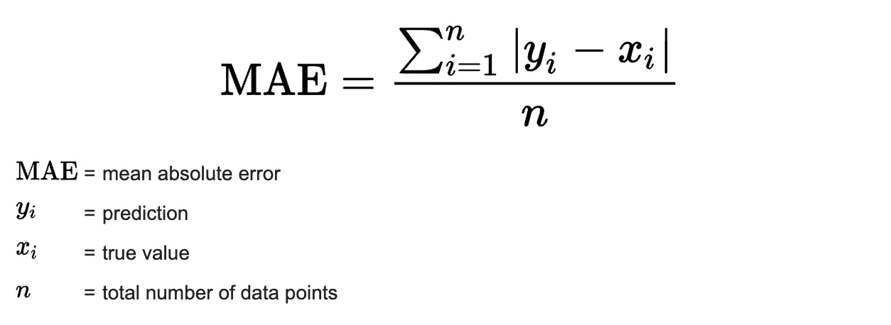
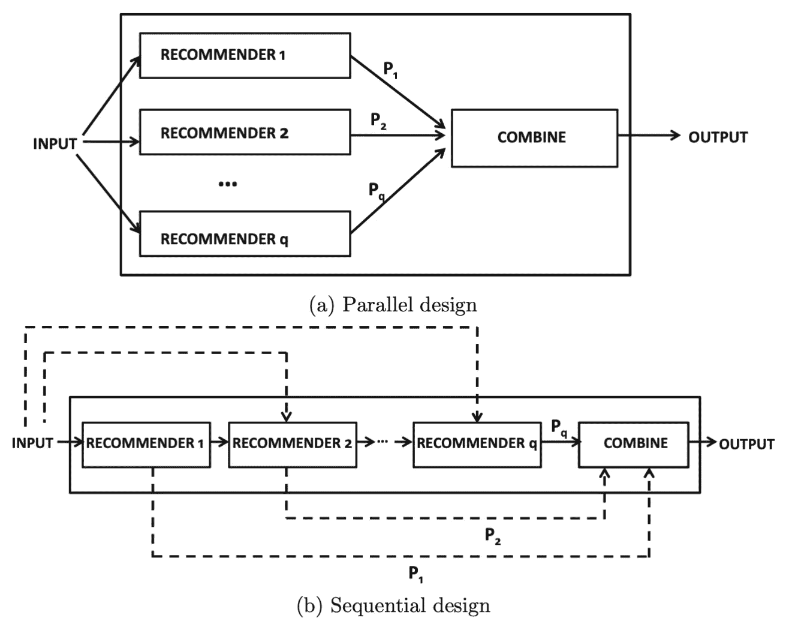

# 推荐系统解释

> 原文：<https://towardsdatascience.com/recommendation-systems-explained-a42fc60591ed?source=collection_archive---------0----------------------->

## 用 Python 解释和实现基于内容的协同过滤和混合推荐系统

由[水花](https://unsplash.com/photos/ocRxdu9gNKs)的[穆罕默德·扎赫里](https://unsplash.com/@mozaheri)拍摄的图像

**目录**

*   什么是推荐系统
*   什么定义了一个好的推荐
    - K 倍交叉验证
    - MSE
    - RMSD
*   数据
    -要求
    -代码
*   协同过滤推荐系统
    -直觉
    -优点
    -缺点
    -实例
    -实现
*   基于内容的推荐系统
    -直觉
    -优点
    -缺点
    -示例
    -实现
*   混合推荐系统
    -直觉
    -优点
    -缺点
    -实例
    -实现
*   结束语
*   资源

# 什么是推荐系统

推荐引擎是机器学习的一个子类，通常处理产品/用户的排名或评级。不严格地说，推荐系统是一个预测用户对某个特定项目的评价的系统。这些预测将被排序并返回给用户。

他们被各种大公司使用，如谷歌、Instagram、Spotify、亚马逊、Reddit、网飞等。通常是为了增加用户和平台的参与度。例如，Spotify 会推荐与你反复听过或喜欢的歌曲相似的歌曲，这样你就可以继续使用他们的平台来听音乐。亚马逊使用推荐，根据用户收集的数据向不同的用户推荐产品。

推荐系统通常被视为“黑箱”，这些大公司创建的模型不太容易解释。生成的结果通常是对用户需要/想要的东西的推荐，但是直到他们被推荐给他们，他们才意识到他们需要/想要它。

有许多不同的方法来建立推荐系统，一些使用算法和公式化的方法，如页面排名，而另一些使用更多的建模为中心的方法，如协同过滤，基于内容，链接预测等。所有这些方法的复杂性都各不相同，但是复杂性并不意味着“好”的性能。通常简单的解决方案和实现会产生最强的效果。例如，像 Reddit、Hacker News 和 Google 这样的大公司已经使用推荐引擎的简单公式化实现来推广他们平台上的内容。在本文中，我将提供一个直观的技术概述，介绍推荐系统的体系结构，以及在一个示例生成的数据集上实现一些不同的变体。

# 什么是好的推荐？

确定什么是好的推荐本身就是一个问题，许多公司都在努力解决这个问题。这个“好”推荐的定义有助于评估你建立的推荐器的性能。推荐的质量可以通过各种衡量覆盖率和准确性的策略来评估。准确度是所有可能推荐中正确推荐的比例，而覆盖率衡量系统能够为其提供推荐的搜索空间中对象的比例。评估建议的方法完全取决于数据集和用于生成建议的方法。推荐系统与分类和回归建模问题在概念上有一些相似之处。在理想情况下，你会希望看到真实用户对推荐的反应，并跟踪用户周围的指标以改进你的推荐，然而，这是很难做到的。评估推荐器准确性的常用统计准确性度量有 [RMSD](https://en.wikipedia.org/wiki/Root-mean-square_deviation) 、 [MAE](https://en.wikipedia.org/wiki/Mean_absolute_error) 和 [k 倍交叉验证](https://en.wikipedia.org/wiki/Cross-validation_(statistics))。

**K 折交叉验证**

*   假设您已经建立了一个模型，该模型将根据一组特征预测用户对某个项目的评价。k 折叠交叉验证可用于通过准确性度量来推断模型的结果
*   除了我们创建 K 个随机分配的训练和测试集之外，与训练测试分割的想法相同
*   每个单独的训练集/折叠用于独立地在推荐系统上进行训练，然后相对于测试集测量结果系统的准确性
*   我们取准确度分数的平均值来看推荐系统学习得有多好
*   这种方法有利于防止模型过度拟合，但是这是一个计算量很大的过程

**平均绝对误差**

图片取自[统计如何到](https://www.statisticshowto.com/absolute-error/#:~:text=E%20%3D%20xexperimental%20%E2%80%93%20xtrue,true%20is%20the%20true%20measurement.)

*   表示评级预测中每个误差的平均绝对值
*   MAE 分数越低越好

**RMSD(均方根偏差)**

图片取自[统计如何到](https://www.statisticshowto.com/probability-and-statistics/regression-analysis/rmse-root-mean-square-error/#:~:text=If%20you%20don't%20like,square%20root%20of%20the%20result.)

*   与 MAE 类似的度量标准，但当预测值与真实值相差甚远时惩罚更强，而当预测值与真实值更接近时惩罚更弱
*   去掉真实值和预测值之差的平方，而不是绝对值之和。这确保了结果值总是正的，并且当差值高时较大，当差值低时较小。
*   RMSD 分数越低越好

这些指标通常用于评估推荐的质量，但是它们缺少各种组件。拥有与推荐相关的用户数据对于了解推荐的真实质量至关重要。能够跟踪推荐的点击率、平台参与度、响应度等。将提供更清晰的推荐质量观点。需要注意的其他组件是，当用户已经有 X 段时间没有与推荐进行交互时，要知道何时改变推荐，或者何时根据新的评级或来自用户的交互来重新训练推荐者。你还需要注意这些推荐是否会将用户限制在产品的某一部分，推荐者如何处理新颖性、多样性和选择偏差。A/B 测试通常是用来跟踪这些度量的方法(查看我关于[贝叶斯](/bayesian-a-b-testing-explained-344a6df88c1a)和[频繁者](/frequentist-a-b-testing-explained-90b9ce8c28b9) a/b 测试的文章)。

# 数据

在接下来的章节中，我们将更深入地讨论创建推荐引擎的不同方法以及 Python 中的相关实现。本节将提供一个脚本，该脚本将合成一个与书籍相关的数据集。该数据集将用于推荐系统的应用。在下面的部分中，本文的目标不是获得有意义的结果，而是向用户展示各种类型的推荐引擎背后的直觉和实现。因此，这些建议的结果将是无意义的，但这些方法将类似于工业生产级环境中的方法。

**要求**

*   Python = 3.8.8
*   熊猫= 1.2.4

**代码**

# 协同过滤系统

**直觉**

协同过滤是通过识别许多用户的偏好和信息来预测用户兴趣的过程。这是通过使用涉及多个代理、数据源等之间的协作的技术来过滤信息或模式的数据来完成的。协同过滤背后的潜在直觉是，如果用户 A 和 B 对某个产品有相似的品味，那么 A 和 B 很可能对其他产品也有相似的品味。

在协同过滤中有两种常见的方法，基于记忆的方法和基于模型的方法。

1.  基于记忆的方法——通常也称为邻域协同过滤。本质上，用户项目组合的评级是基于它们的邻域来预测的。这可以进一步分为基于用户的协同过滤和基于项目的协同过滤。以用户为基础本质上意味着志同道合的用户会产生强烈的和相似的推荐。基于项目的协同过滤基于项目之间的相似性来推荐项目，该相似性是使用那些项目的用户评级来计算的。
2.  基于模型的方法—是使用机器学习的预测模型。与数据集相关联的特征被参数化为模型的输入，以尝试解决优化相关问题。基于模型的方法包括使用决策树、基于规则的方法、潜在因素模型等。

**优势**

使用协同过滤模型的主要优点是实现简单，并且覆盖面广。这也是有益的，因为它捕捉到了微妙的特征(对于潜在因素模型来说非常正确)，并且不需要理解项目内容。

**劣势**

这种模式的主要缺点是它对推荐新项目不友好，这是因为没有用户/项目与之交互。这被称为[冷启动问题](https://en.wikipedia.org/wiki/Cold_start_(recommender_systems))。众所周知，基于内存的算法在高度稀疏的数据集上表现不佳。

**例题**

协作过滤算法的一些例子:

*   向用户推荐 YouTube 内容——根据与您订阅/观看过类似视频的其他用户向您推荐视频。
*   CourseEra 课程推荐——根据其他已经完成你已经完成的课程的人向你推荐课程。

**实施**

1.  从 generate_data 函数(上面提供的函数)导入数据或从[这里](https://github.com/vatsal220/medium_articles/blob/main/rec_sys/data/data.csv)下载 CSV
2.  生成一个数据透视表，其中读者在索引上，书籍在列上，值是评级
3.  使用 [svds](https://docs.scipy.org/doc/scipy/reference/generated/scipy.sparse.linalg.svds.html) 计算项目和用户之间的相似度
4.  根据 user_id 生成项目建议

# 基于内容的系统

**直觉**

基于内容的系统基于用户偏好和简档生成推荐。他们试图将用户与他们以前喜欢的项目匹配起来。项目之间的相似性级别通常是基于用户喜欢的项目的属性来建立的。与大多数利用目标用户和其他用户之间的评级的协同过滤模型不同，基于内容的模型关注由目标用户自己提供的评级。本质上，基于内容的方法利用不同的数据源来生成推荐。

最简单的基于内容的系统需要以下数据源(这些需求会随着您要构建的系统的复杂程度而增加):

1.  项目级数据源—您需要一个与项目属性相关联的强大数据源。对于我们的场景，我们有诸如图书价格、页数、出版年份等信息。您对该物品了解的信息越多，对您的系统就越有利。
2.  用户级数据源——您需要某种用户反馈，基于您提供推荐的项目。这种级别的反馈可以是隐式的，也可以是显式的。在我们的样本数据中，我们处理的是用户对他们读过的书的评价。你跟踪的用户反馈越多，对你的系统就越有利。

**优势**

当没有足够数量的可用评级数据时，基于内容的模型最有利于推荐项目。这是因为用户可能已经对具有相似属性的其他项目进行了评级。因此，即使没有大量数据，模型也应该能够利用评分和项目属性来生成推荐。

**劣势**

基于内容的系统有两个主要缺点。

1.  基于用户已经消费的项目/内容，所提供的推荐是“明显的”。这是一个缺点，因为如果用户从未与特定类型的项目交互过，则该项目将永远不会被推荐给用户。例如，如果你从未读过推理小说，那么通过这种方法，你将永远不会被推荐推理小说。这是因为该模型是特定于用户的，并且没有利用来自类似用户的知识。这降低了建议的多样性，这对许多企业来说是一个负面的结果。
2.  它们对于向新用户提供推荐是无效的。构建模型时，您需要项目的显式/隐式用户级数据的历史记录。通常重要的是，要在不过度拟合的情况下做出稳健的预测，要有一个大的评级数据集。

**例句**

基于内容的系统的一些例子有:

*   亚马逊产品源(向您推荐与您之前购买的产品相似的产品)
*   Spotify 音乐推荐

有许多优秀的基于内容的系统是通过算法构建的，不依赖于基于模型的方法。例如，众所周知，Hacker Rank 和 Reddit 等公司以前使用算法向用户推荐他们平台上的新帖子。建立基于内容的推荐算法的关键在于为你的业务定义一套规则，用来对项目进行排序。在 Reddit 的例子中，他们的推荐受到发布时间、喜欢数量、不喜欢数量、评论数量等的限制。这可以作为一个公式中的一个因素来产生一个帖子的分数，高分将产生高推荐，反之亦然。

**实施**

1.  从 generate_data 函数(上面提供的函数)导入数据或从[这里](https://github.com/vatsal220/medium_articles/blob/main/rec_sys/data/data.csv)下载 CSV
2.  正常化图书价格、图书评级、页数
3.  一个热编码出版年份、图书类型、文本语言
4.  给定 book_id 输入，计算[余弦相似度](https://pyshark.com/cosine-similarity-explained-using-python/)并返回与输入相似的前 n 本书

# 混合推荐系统

**直觉**

推荐系统的各种方法各有利弊。通常，这些方法中的许多在单独使用时可能看起来有局限性，特别是当问题有多个数据源时。混合推荐系统被设计成使用不同的可用数据源来生成健壮的推理。

混合推荐系统有两种主要的设计，并行和顺序。并行设计向多个推荐系统提供输入，这些推荐中的每一个被组合以生成一个输出。顺序设计向单个推荐引擎提供输入参数，输出被传递给序列中的下一个推荐器。请参考下图，了解两种设计的直观表示。

并行和顺序推荐系统体系结构。图片由 C.C. Aggarwal 提供，推荐系统:教科书

**优点**

混合系统将不同的模型结合起来，以克服一种模型与另一种模型的缺点。这总体上减少了使用单个模型的缺点，并有助于生成更可靠的建议。这为用户提供了更加强大和个性化的推荐。

**缺点**

这些类型的模型通常具有很高的计算复杂度，并且需要一个大的评级和其他属性的数据库来保持最新。没有最新的指标(用户参与度、评级等。)这使得很难重新训练和提供具有来自各种用户的更新项目和评级的新推荐。

**例子**

网飞是一家使用混合推荐系统的公司，他们根据相似用户的观看和搜索风格(协同过滤)以及用户评级的具有相似特征的电影(基于内容)向用户提供推荐。

**实施**

1.  从 generate_data 函数(上面提供的函数)导入数据或从[这里](https://github.com/vatsal220/medium_articles/blob/main/rec_sys/data/data.csv)下载 CSV
2.  使用基于内容的模型(cosine_similarity)计算 50 本最相似的书
3.  使用协作式
    过滤模型(SVD)计算用户可能给这 50 本书的预测评分
4.  返回预测评分最高的前 n 本书

如果您想要一步一步地了解如何以一种不同的方式实现混合推荐系统，您可以参考我的关于使用 Node2Vec 构建链接预测推荐引擎的文章。

<https://vatsal12-p.medium.com/link-prediction-recommendation-engines-with-node2vec-c97c429351a8>  

# **结束语**

请注意，这只是对推荐引擎的介绍。还有更多类型和方法可以构建强大的推荐引擎，本文没有涉及。一些值得注意的是通过链接预测，算法方法，贝叶斯模型，马尔可夫模型等产生推荐…

这篇文章的目的是提供对推荐系统所使用的基本方法(协同过滤、基于内容和混合)的直观理解和实现。协同过滤是通过识别来自许多用户的偏好和信息来预测用户兴趣的过程，而基于内容的系统基于用户的偏好和简档来生成推荐。混合系统通常是许多推荐系统的组合。

我将在下面列出一些用于评估推荐质量的思考材料。本文没有回答这些问题，但是在构建一个好的推荐系统时，这些问题是必不可少的。

*   你如何跟踪推荐的流失率、响应度、参与度和新颖性？
*   当你知道用户已经有 X 段时间没有和之前的推荐互动了，你应该什么时候给他们看一个新的推荐呢？
*   当用户评价新产品或与新产品互动时，它会立即影响你的推荐系统，还是稍后？
*   随着用户与平台互动的增加，推荐是如何变化的？
*   你怎么知道你的推荐没有把你的用户限制在企业的小部分？

我特意尝试实现每种类型的推荐系统的不同版本，以便对它们的实现有更广泛的理解。所有用于生成这些结果的代码和数据都可以在[这里](https://github.com/vatsal220/medium_articles/tree/main/rec_sys)查看。

# 资源

*   [science direct . com/science/article/pii/S1110866515000341 # s 0160](https://www.sciencedirect.com/science/article/pii/S1110866515000341#s0160)
*   [https://www . statistics show to . com/absolute-error/#:~:text = E % 20 = % 20x experimental % 20% E2 % 80% 93% 20x true，true % 20 is % 20 the % 20 true % 20 measure](https://www.statisticshowto.com/absolute-error/#:~:text=E%20=%20xexperimental%20%E2%80%93%20xtrue,true%20is%20the%20true%20measurement)。
*   [https://www . statisticshowto . com/probability-and-statistics/regression-analysis/RMSE-root-mean-square-error/#:~:text = If % 20 you % 20 don t % 20 like，square % 20 root % 20 of % 20 the % 20 result](https://www.statisticshowto.com/probability-and-statistics/regression-analysis/rmse-root-mean-square-error/#:~:text=If%20you%20don't%20like,square%20root%20of%20the%20result)。
*   [https://en.wikipedia.org/wiki/Collaborative_filtering](https://en.wikipedia.org/wiki/Collaborative_filtering)
*   [https://en . Wikipedia . org/wiki/Cold _ start _(recommender _ systems)](https://en.wikipedia.org/wiki/Cold_start_(recommender_systems))
*   [https://link.springer.com/book/10.1007/978-0-387-85820-3](https://link.springer.com/book/10.1007/978-0-387-85820-3)

如果你喜欢读这篇文章，看看其他你可能也感兴趣的文章:

</bayesian-a-b-testing-explained-344a6df88c1a> [## 贝叶斯 A/B 测试解释

towardsdatascience.com](/bayesian-a-b-testing-explained-344a6df88c1a) </monte-carlo-method-explained-8635edf2cf58>  </random-walks-with-restart-explained-77c3fe216bca> 