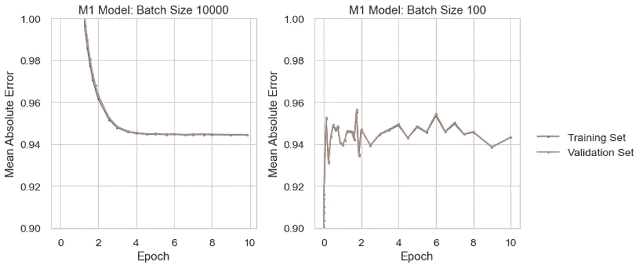
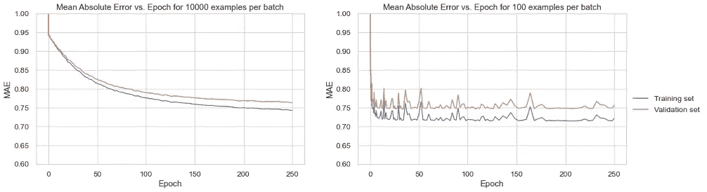
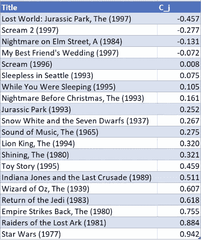
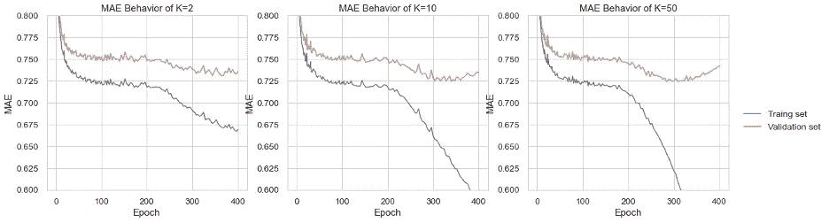
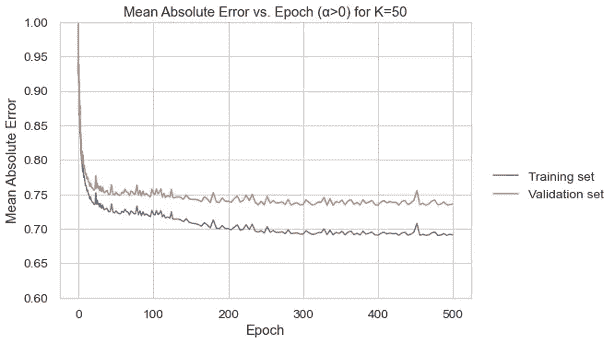
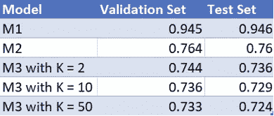
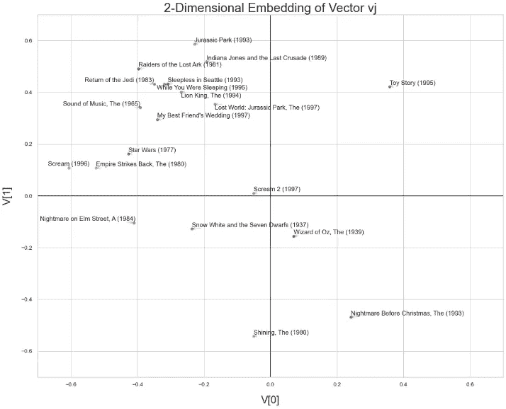
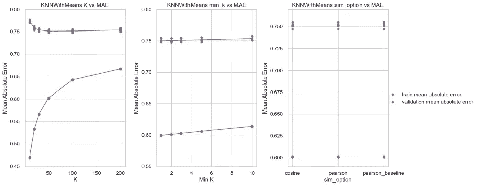
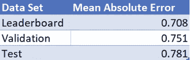

# 基于矩阵分解的推荐系统

> 原文：<https://towardsdatascience.com/recommendation-systems-via-matrix-factorization-28e7d0aa8ca7?source=collection_archive---------29----------------------->

## 探索 MovieLens 100k 数据集与新币，亲笔签名，和惊喜包。

查尔斯·德鲁维奥在 [Unsplash](https://unsplash.com?utm_source=medium&utm_medium=referral) 上拍摄的照片

由[加文·史密斯](https://www.linkedin.com/in/gavin-h-smith/)和[阮宣汉](https://www.linkedin.com/in/xuankhanh-nguyen-68a83419a/)

这个项目是我这个学期机器学习课的第三个项目。该项目旨在通过优化模型的预测能力，使用 MovieLens 100k 数据集训练一种机器学习算法，用于电影推荐。我们得到了一个干净的预处理版本的 MovieLens 100k 数据集，其中有 943 个用户对 1682 部电影的评级。我们的预测系统的输入是(用户 id，电影 id)对。我们的预测器的输出将是范围(1，5)内的标量等级 y-等级 1 是最差的，等级 5 是最好的。我们的主要任务是预测所有用户-电影对的评级。使用四种不同的模型来执行推荐系统。

*   问题 1 遵循简单基线模型与 SGD 和自动签名的使用。我们考虑了最简单的可能基线模型——无论考虑什么用户或电影，该模型都对电影的评级做出相同的标量预测。
*   问题 2 是在 SGD 和 Autograd 中使用每个项目一个标量的基线后出现的。
*   问题 3 是在 SGD 和 Autograd 中使用每项一个向量的协同过滤后出现的。
*   问题 4 是开放式的。我们得到了一个省略了评级的数据集。

对于所有问题，我们的任务是在验证集和测试集上获得关于平均绝对误差(MAE)的最佳可能预测结果。所有章节都解释了方法，并附有相应的图表。

# 问题 1:带有 SGD 和自动签名的简单基线模型

## **图 1a:简单基线模型历元与平均绝对误差的关系**

图 1a 显示了简单基线模型的平均绝对误差如何随时间变化，该模型仅预测每个示例的μ值。左侧图的批次大小为 10000，由于其批次大小较大，因此稳定地收敛到 MAE 值，而右侧图的批次大小较小，为 100，开始不稳定地收敛到某个值。这个问题我们选择 n_epoch=10。对于 batch_size=10000，我们在 4 个纪元后开始看到一些学习；MAE 开始接近恒定值，同时历元的数量保持增加。对于 batch_size=100，在 4 个历元之后，数据噪声较小。

## **1b:您如何计算该模型的最佳μ值？**

可以计算最佳 mu 值的行应该是“print(ag _ NP . mean(ag _ NP . as array(train _ tuple[2]))”，它将计算所有示例的平均值。该计算产生的值为 3.58，与我们模型的 mu 值相同。这是真的，因为如果我们为每个例子预测相同的值，分数的平均值将在大多数情况下是“最”正确的。

# 问题 SGD 和亲笔签名的每个项目一个标量基线

## **图 2a:标量模式模型历元与平均绝对误差的关系**

图 2a 示出了标量模式模型的平均绝对误差随时间随随机梯度下降的变化。左图显示了批量为 10000 时误差的变化情况，由于批量越大，误差以越稳定的速率降低，然后稳定在 0.75 左右。右图显示了相同的过程，但批量大小为 100，因此误差会快 0.75 左右，但其值更不可预测，因为批量更小。这个问题我们选择 n_epoch=250。对于 batch_size=10000，我们在 200 个纪元后开始看到一些学习；MAE 开始接近恒定值，同时历元的数量保持增加。对于 batch_size=100，在 200 个历元之后，数据噪声更小。为了选择步长，我们首先为步长选择一个大的数字(step_size=1.5)，我们看到训练图发散。因此，我们将步长减小 0.25。最终，我们发现小于或等于 0.75 的步长不会使训练损失发散。对于这个问题，我们选择步长等于 0.75。

## **表 2b:精选电影片名对比 c j**

表 2b 按顺序示出了所选列表中的每部电影及其学习的每部电影分级调整参数 cj。我们在验证集上选择具有最佳 MAE 的模型，其中批量大小为 10000，250 个时期，步长为 0.75。该模型给出了列表结果。从这个列表中，我们可以看到，具有较大正 cj 值的电影往往是更受普遍“称赞”的电影，或“经典”，如*星球大战*或*印第安纳琼斯*，而值较低的电影往往不那么受欢迎，如*侏罗纪公园 2* 或*尖叫 2、*这些都是恐怖电影，并不总是吸引广泛的观众。在我们的问题中，一部电影的偏见将描述这部电影与所有电影的平均水平相比有多好。该值仅取决于电影，不考虑用户和电影之间的交互。因此，对于一部电影来说，大而正，意味着这部电影很可能被人们评为高，而大的负值意味着这部电影很可能被评为低。

# 问题 SGD 和自动签名的单向量协同过滤

## **图 3a:历元模式模型历元与平均绝对误差的关系，α=0**

该图显示了每个项目一个向量的协作过滤器模型的平均绝对误差如何随时间变化，每个图显示了具有不同数量的维度 K 的模型，这些维度用于表示用户和电影。对于所有的图表，我们可以看到，当仅仅过了很短的时间时，模型对数据拟合不足，因为训练集和验证集误差都非常高。所有的模型在 250 个时期后开始过度拟合，这可以从训练集误差减小，但是验证集误差又开始增加的事实中看出。随着 K 的增加，我们看到验证集误差在 350 个历元附近有一个更明确的下降，并且随着 K 值的增加，模型过拟合得更快。

## **图 3b:历元模式模型历元与平均绝对误差的关系，α = 0.1**

该图显示了对于 alpha 值为 0.1 的模型，平均绝对误差如何随历元数而变化。我们通过使用网格搜索训练具有许多不同 alpha 值的模型来选择这个 alpha 值，我们发现 alpha 值为 0.1 可以最大程度地降低平均绝对误差。使用此 alpha 值，我们能够将平均绝对误差降低到比模型更低的值，该模型使用 0 的 alpha 值进行训练。对于这个问题，批量固定为 1000。我们很早就停下来寻找在验证集上表现最好的参数。0.75 是我们能得到的最大步长，它不会使训练损失发散。为了找到在验证集上表现最好的参数，我们使用了早期停止。

## **表 3c:验证和测试集的平均绝对误差**

此表显示了我们在验证集和测试集的问题 1 至 3 中训练的每个模型的平均绝对误差。为了确定每个模型的最佳版本，我们试图最小化验证集上的误差。对 M1 来说，这很容易，因为我们只是选择一个固定的变量来进行每次猜测，所以只有一个真正的最优值。对于 M2，我们选择了使用 10000 批次大小的模型，因为它最小化了验证集的均方误差。我们对每个 M3 车型都采用了提前停车；我们搜索了不同的 alpha 值、批量大小和步长大小，以确定哪个版本的模型产生的平均绝对误差最小。我们建议使用 50 的 K 值，因为它具有最小的误差。尝试具有较大 K 值的模型可能是有益的，因为似乎 K 值越大，误差越小。我们找到的最佳模型是 M3，K 值为 50，alpha 值为 0.1；这个模型减少了验证集和测试集的错误。此外，L2 罚款被添加到 M3 模型。在向量 u 和 v 上设置 L2 正则化会强制这些值尽可能小。它可以帮助我们避免过度拟合。

## **图 3d:所选电影的 v j 值**

该图示出了 select_movies 数据集中的电影的所学习的每电影向量 vj 的二维嵌入。这是使用 K=2 因子的最佳 M3 模型创建的。在这个图表中，电影是根据它们的因素向量来放置的。我们可以看到，有些相似的电影往往会被归为一类；但是，分组对我们来说并不是超级明显的。在右下方，我们可以看到《呐喊》《榆树街的噩梦》这样的恐怖片。我们注意到，具有相似评级的电影将在嵌入空间中更接近。解释这一点的一个原因是，我们的 M3 模型已经了解到这些电影与类似的评级相关联。为了检查我们的观察，我们从 ratings_all_development_set 数据集计算平均评分。《T2》《西雅图不眠夜》《T3》的平均评分是 3.55，而《T4》《当你熟睡时》《T5》的平均评分是 3.56。而这两部电影在嵌入空间里放置的很近。

# 问题 4:开放式推荐挑战

## **4a:开放式推荐挑战方法说明**

对于我们的开放式推荐模型，我们选择使用来自 surprise 包的 KNNWithMeans 分类器。KNNWithMeans 的工作原理与常规的 K 最近邻算法相同，它计算 K 个点之间的相似性，并返回与这些点最一致的预测。KNNWithMeans 的不同之处在于，您必须指定最小和最大 K 值，因为该算法只查看相似性为正的点。毕竟，使用负相关的点是没有意义的。此外，该模型考虑了每个用户的平均评分，这有助于数据的标准化。我们选择使用这种模式，因为向某人推荐电影的一种好方法是让他们选择最像他们已经喜欢的电影，而且由于 KNN 通过基于数据点之间的相似性进行预测来工作，我们认为这将是最佳选择。我们还选择使用该模型的另一个原因是，SVD 等其他选项需要更长的训练时间，因此我们在这些模型上进行深入超参数搜索的时间会更少。

为了训练我们的模型，我们使用网格搜索来寻找最佳超参数值，并使用 5 重交叉验证来验证我们的模型。我们搜索的超参数是 K(要比较的最大点数)、min_k(要比较的最小点数)和 sim_option(控制如何计算点之间的相似性)。我们发现 K 值为 50，min_k 为 2，Pearson 相似性选项是最好的。我们通过选择使交叉折叠验证的验证集上的平均绝对误差最小化的值来确定这些是最好的。

## **图 4b:模型超参数选择**

该图显示了我们为 KNNWithMeans 模型调整的三个超参数。最左边的图显示了平均绝对误差如何随着 K(与进行比较的点数)的增加而变化。随着数字的增加，模型开始减少过度拟合，因为训练和验证误差都减少了。对于 200 的 K 值，模型开始对数据进行欠拟合，因为预测变得更加依赖于与预测点不相似的数据点。从第二个图表中，我们可以看到，要考虑的最小邻域数的任何增加都会增加误差，因此最佳值应为 1。最后，右图显示了相似性选项对我们模型的性能几乎没有影响，但是 Pearson 选项比其他两个选项稍有优势。

## **表 4c:模型平均绝对误差性能**

该图显示了我们的模型在用于排行榜的保留数据集上的平均绝对误差，以及在训练我们的模型时它在验证集和测试集上的性能。

## **4d:模型性能分析**

表 4c 显示，我们的模型在保留数据集上的平均绝对误差低于我们的交叉验证集上的误差。这是因为与我们的训练数据(89992 个评分)相比，不公开的数据集具有较小的大小(10000 个评分)。可能存在测试数据不能很好地代表我们的训练数据的情况。因此，它表现良好，误差很低。

当将该数据与表 3c 中的模型结果进行比较时，我们可以看到，我们的排行榜平均绝对误差最低，我们的测试误差高于任何 M3 误差。其原因是因为 SVD 分解原始矩阵，sense 矩阵用于预测评级(使用，项目)对。而在 KNN 中，预测是通过找到与要预测其评级的输入用户相似的用户群，然后取这些评级的平均值来进行预测。奇异值分解在学习训练数据方面做得更好；我们在验证集上看到一个较小的错误。

## **4e:模型局限性和未来工作的机会**

我们面临的一个限制是，像 SVD 这样更复杂的模型花费的时间太长，我们无法有效地调整模型；如果我们有更好的计算能力，使用这样的模型会更可行。另一件可以改进的事情是寻找记录损失的不同方法；当训练我们的模型时，我们只使用平均绝对误差，但是当非常不正确的猜测被加权得更重时，模型可能表现得更好，就像使用均方误差一样。此外，我们会考虑其他用户特征，如年龄，性别，国籍，口语等。，以及诸如主要演员、电影时长、口语等项目特征。仍然考虑用户和项目，我们将尝试模拟这样一个事实，即说某种语言的人更有可能观看该语言的电影，或者年龄较大的用户更有可能观看经典电影。为了进行预测，我们查看用户简档并预测评级。