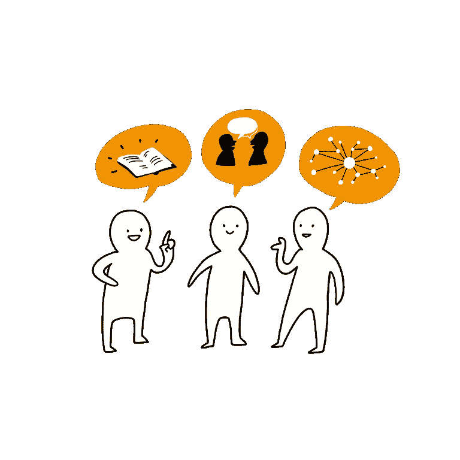
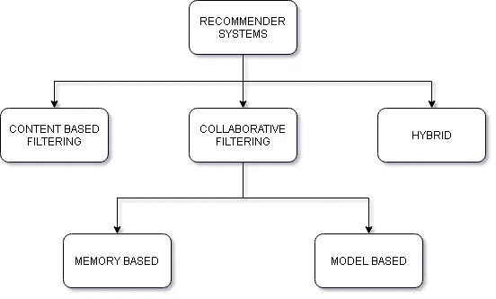
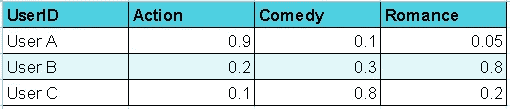
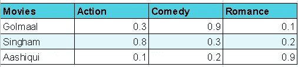
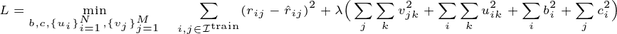
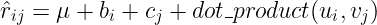
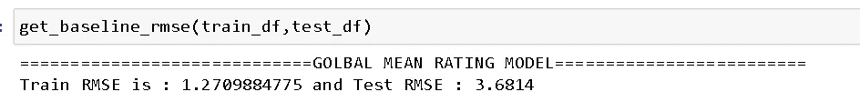
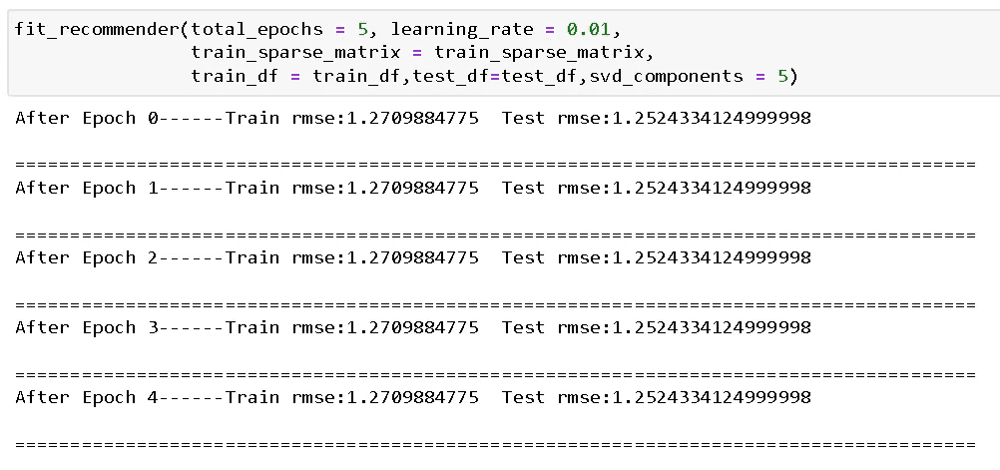
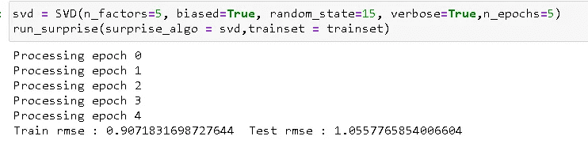

# 从零开始的推荐系统

> 原文：<https://towardsdatascience.com/recommender-system-from-scratch-fa6b70fc3e7f?source=collection_archive---------5----------------------->

## 直观的漫游



来源:[知识共享](https://creativecommons.org/licenses/by-sa/4.0/deed.en)

# 介绍

当我开始我的机器学习之旅时，有几个概念让我非常着迷，其中之一就是推荐系统。这是你在日常生活中经常看到的 ML 应用之一。在亚马逊购物、在 Myntra 买衣服、在网飞看电影的时候，我们到处都有推荐，当然，著名的****[**Netflix Prize competition**](https://en.wikipedia.org/wiki/Netflix_Prize#:~:text=The%20Netflix%20Prize%20was%20an,numbers%20assigned%20for%20the%20contest.)，阅读关于比赛、球队以及他们两年来在比赛中的努力让我对推荐系统感到非常兴奋(我建议你们看一下[这部关于获胜球队的](https://www.youtube.com/watch?v=ImpV70uLxyw)纪录片)。这篇博客将尝试给出一个从零开始构建一个非常基本的推荐系统的直观演示。****

# ****推荐系统****

****首先，什么是推荐系统，这是维基百科对推荐系统的定义。****

> ****推荐系统是一个信息过滤系统，它试图预测用户对一个项目的“评分”或“偏好”****

****嗯，这基本上概括了，基于这些预测，系统向顾客建议/推荐相关商品。****

****概括地说，有三种方法可以用来创建推荐系统****

*   ****协同过滤(我们将在博客中关注这一点)****
*   ****基于内容的过滤****
*   ****混合(以上两者的混合物)****

********

****来源:作者图片****

# ****协作与内容****

****协同过滤使用**过去的用户-项目交互来提出新的推荐，**例如，如果一个人喜欢电影 m1，并且另外 5 个人同时喜欢电影 m1 和电影 m2，则电影 m2 可以被推荐给该用户(具体地说，这是用户-用户协同过滤的一个例子)，而基于内容的过滤需要**关于用户(如年龄、性别等)和项目/电影(电影的类型、持续时间， etc)** 为了生成预测，协作方法的好处在于它们不需要**关于用户/项目的额外信息**而是从过去的用户-项目交互中提取有用的模式来创建它自己的特征，而不需要任何额外的信息****

# ******协同过滤的类型******

****有两种类型的协同过滤方法****

*   ****基于内存****
*   ****基于模型(我们将在这个博客中建立一个基于模型的推荐系统)****

## ******基于内存的******

****基于记忆的协同过滤直接使用**用户-项目交互矩阵**，并获取相似的用户/项目。****

*   ******用户-用户相似度:**它首先找到与我们给定的查询用户最相似的用户，然后根据最相似的客户评级预测项目偏好，例如，如果我们想预测客户 C 将如何获得电影 m1 的评级，那么我们将对与该用户相似的用户给出的评级进行加权求和，**“与你相似的用户也喜欢..”******
*   ******项目-项目相似度:**方法类似于用户-用户相似度，唯一的区别是这里相似度计算是以项目而不是用户为中心的，假设我们想为用户预测电影，那么我们将首先找到用户评分最高的电影，然后找到这部电影与所有其他电影的相似度，并建议前 K 部电影**“喜欢这个项目的用户也喜欢..”******

****对于相似度计算，我们使用**皮尔逊相关系数或调整后的余弦相似度**(将评分集中在零附近，以避免将未评分的项目视为负面项目，0 表示完全不喜欢)****

****基于模型的方法和基于记忆的方法之间的主要区别在于，我们**不学习任何参数/解决任何优化问题**在基于记忆的方法中，仅通过从用户-项目矩阵计算相似性来给出建议。****

****基于内存的方法的主要问题是它不可扩展，因为用户基数增加，用户-项目矩阵变得更加稀疏，计算相似性变得困难(尤其是计算用户-用户相似性)。****

## ****基于模型的****

****现在我们转到基于模型的方法，但在此之前，让我们讨论一下矩阵分解****

****矩阵分解将矩阵分解成多个因子，在最大似然术语中，存在一个低维的潜在特征空间，其中我们可以表示项目和用户，用户-项目矩阵的近似可以通过乘以这些用户-项目矩阵来获得。****

****作为一个例子，让我们假设我们已经将用户-电影矩阵分解为 3 个潜在维度，这不是它的确切含义，但为了给你一个直觉，我们可以将这 3 个潜在向量视为电影类型，如动作片、喜剧片、浪漫片。因此，当我们把一个用户和一部电影分成这三个维度时，我们实际上试图把用户和电影分成这些概念/类型。****

****************

****来源:作者图片****

****像在上面的例子中，我们已经用他们的潜在维度表示来表示用户、电影，每个维度表示一个类型，这个潜在向量表示帮助**计算用户和项目的交互，并最终帮助推荐项目，**例如，用户 A 更喜欢动作电影，现在如果我们计算用户 A 与所有三部电影的余弦相似性，我们将发现 Singham 具有最高的相似性，因为它在动作类型中具有高值，因此暗示这很可能是一部动作电影。*(注:这只是一个获得事物直觉的例子，这些潜在向量不具备这种直接的可解释性)*****

# ******代号******

****理论说够了，让我们谈谈代码吧！我们将构建一个非常简单的基于模型的推荐系统。为了解决机器学习问题(受监督的),我们总是有一个**优化问题，一个我们试图最大化/最小化**的函数，以在不过度拟合数据的情况下降低成本，并在此过程中通过梯度下降等技术学习我们的模型参数。因此，首先让我们定义我们的优化问题****

********

****来源:作者图片****

****其中预测等级(r_hat)计算如下****

********

****来源:作者图片****

****优化函数可能看起来有点吓人，但是让我们试着一点一点地分解它。****

****就像任何其他成本函数一样，该成本函数可以分解为两个部分，与第一部分(实际-预测)计算的**净成本相关联的**，第二项是**正则化项。******

****现在让我们把这些可学习的参数和最终的预测计算搞清楚。****

****我们可以将预测评级分为四个部分****

*   ******全局平均值(mu):** 全局平均值是我们的训练数据集中所有评级的平均评级，这一术语可以被认为是**我们的基线预测评级**，并且模型学习对此进行多少调整以获得正确的预测。****
*   ******用户偏见:**用户偏见可以被认为是一个捕捉用户行为的**术语，**例如，与其他用户相比，一些用户过于挑剔，因此他们倾向于给出稍低的评级。****
*   ******电影偏见:**电影偏见可以被认为是一个术语**捕捉一部电影的受欢迎程度**例如，有一些像《阿凡达》、《肖申克的救赎》这样的邪教经典电影通常有很高的评级，因此这些电影往往有更高的推荐评级。****
*   ******用户-电影交互:**最后，我们有一个术语，它是通过计算相似性 b/w 用户和电影潜在向量，基于特定用户和电影之间的交互来计算的(在上面的部分中解释)****

****好了，差不多了，我们已经定义了优化函数，现在我们需要最小化成本，在这种情况下，我们将 RMSE 作为我们的性能指标。****

## ******数据集******

****我们采用了一个非常受欢迎的数据集，名为 [MovieLens 100k](https://grouplens.org/datasets/movielens/100k/) [2]，该数据集包括从 1 到 5 的 100k 个评级，来自 1682 部电影的 943 个用户，并基于时间进行了 80-20 的训练测试划分，即使用前 80%的评级进行训练，剩余的 20%用于测试。****

****我们已经定义了成本函数，现在我们将计算梯度并更新模型参数以最小化成本。****

```
****for** each epoch: **for** each pair of (user, movie): b_i =  b_i - learning_rate * dL/db_i c_j =  c_j - learning_rate * dL/dc_j**
```

****为了简单起见，我们只将 **user_bias** 和 **movie bias** 作为可训练参数，我们使用 SVD 来计算用户和电影向量(你可以将 SVD 视为一种矩阵分解技术)。****

****这里 **b_i 是用户偏差**的数组，其中该数组的维数等于我们的训练集中的总用户数(最大用户指数)(每个用户都有偏差)，而 **c_j 指的是我们的训练集中的总电影数**(最大电影指数)。****

****她的 **dl/db_i 指衍生 w.r.t 用户偏差，dl/dc_j 指衍生 w.r.t 电影偏差**。****

****首先，让我们设定 RMSE 的上限，通过简单地设定所有预测评级到全球平均评级来计算 RMSE。****

********

****来源:作者图片****

****现在我们知道了上限，即 3.5 左右的任何值都可以作为全局平均值来预测所有值，我们已经为我们的推荐方法定义了定制方法，下面是代码****

```
****def fit_recommender**(total_epochs,learning_rate,train_sparse_matrix,train_df,test_df,svd_components = 5):
    *'''learns parameters for the recommednder'''*
    total_train_mse = []
    total_test_mse = []
    U1, Sigma, V1 = randomized_svd(train_sparse_matrix,      n_components=svd_components,n_iter=2, random_state=24)
    total_train_mse = []
    total_test_mse = []
    **for** epoch in range(total_epochs):
        **for** user,movie,rate in train_df[['user','movie','rating']].values:
            b_i[user] = b_i[user] - learning_rate *  **derivative_db**(user,movie,rate,U1,V1,mu,alpha) 
            c_j[movie] = c_j[movie] - learning_rate *  **derivative_dc**(user,movie,rate,U1,V1,mu,alpha)
        train_error = get_prediction(train_df,b_i,c_j,mu)
        test_error = get_prediction(test_df,b_i,c_j,mu)
        total_train_mse.append(train_error)
        total_test_mse.append(test_error)
        **print**("After Epoch {}------Train rmse:{}  Test rmse:{}".format(epoch,train_error,test_error))
     **print**("=======================================================")**
```

****我们的拟合方法首先使用 truncatedSVD 计算用户电影潜在向量表示(理想情况下，这些用户电影表示也应该在训练过程中学习)，然后通过执行梯度下降步骤在每个时期学习用户电影偏差，下面是我们运行定制拟合方法后的结果****

********

****来源:作者图片****

****训练和测试 RMSE 的都比我们的基线模型好，因此我们可以得出结论，模型确实从这些用户和电影偏见形式的数据中学习了一些隐藏的模式****

****现在你可能会觉得这是一个有点太多的手工工作，难道我们没有像 scikit_learn 这样的东西，我们只需要调用 fit 方法，所有的事情都是自动完成的，那么你将会得到一个**惊喜，**所有这些以及更多的事情都可以通过这个**神奇的库来完成，这个库被称为用于构建和测试推荐系统的惊喜**。****

****我们需要建立一个稍微不同的数据集来让惊奇发挥作用****

```
****from** surprise **import** Reader, Dataset
reader = Reader(rating_scale=(1,5))
*# create the traindata from the dataframe...* train_data = Dataset.load_from_df(train_df[['user', 'movie', 'rating']], reader)
*# build the trainset from traindata.., It is of dataset format from s*urprise library..
trainset = train_data.build_full_trainset() # we have to convert testset into list tuples of user,movie,rating
testset = list(zip(test_df.user.values, test_df.movie.values, test_df.rating.values))**
```

****从数据集类中，我们调用 load_from_df 函数，该函数以所需的格式构建训练集，现在让我们构建我们的推荐系统****

```
****def** run_surpise(surprise_algo,trainset):
    svd.fit(trainset)
    train_preds = svd.test(trainset.build_testset())
    train_actual_ratings, train_pred_ratings = **get_ratings**(train_preds)
    train_rmse = **get_errors**(train_preds) 
    test_preds = svd.test(testset)
    test_actual_ratings, test_pred_ratings = get_ratings(test_preds)
    test_rmse = get_errors(test_preds)    
    print("Train RMSE : {}  Test RMSE : {}".format(train_rmse,test_rmse))**
```

****现在，让我们运行我们的惊喜模型，并查看结果(优化函数与我们之前讨论的相同，现在我们正在学习用户、电影偏差**以及来自训练集的项目潜在向量**，即使用机器学习来执行矩阵分解)****

********

****来源:作者图片****

****不错的训练和测试 RMSE 改进，这只是一种算法，惊喜有许多其他预测算法可以使用请随意阅读官方[文档](https://surprise.readthedocs.io/en/stable/getting_started.html)为惊喜和尝试其他，这就像 scikit-learn，只是即插即用。****

## ****冷启动问题****

****在结束之前，我想讨论一下协同过滤方法的一个主要缺点，即冷启动问题。测试集中会有一些用户/电影根本没有出现在训练集中，因此你不能使用协作方法，因为你没有这些电影/用户的任何过去的交互。为了处理冷启动问题，我们可以引入额外的用户级、项目级特征，如用户年龄、电影类型等，基本上合并了基于内容和协作的方法以获得更好的预测。****

# ******结论******

****这个博客的目的是给你一个推荐系统的高层次概述，让你开始。对于那些感兴趣的人，我建议通过在实际数据集上进行尝试来获得一些实践经验。下面是博客中提到的代码的 Github 知识库的链接****

****资源库链接:[https://github . com/ravi 207/re commender system/blob/main/recommender _ system . ipynb](https://github.com/ravi207/RecommenderSystem/blob/main/recommender_system.ipynb)****

****这里有一些我觉得非常有用的好资源。****

*   ****[https://www . researchgate . net/publication/223460749 _ The _ big chaos _ Solution _ to _ The _ 网飞 _Grand_Prize](https://www.researchgate.net/publication/223460749_The_BigChaos_Solution_to_the_Netflix_Grand_Prize)****
*   ****[https://www.youtube.com/watch?v=UyAfmAZU_WI](https://www.youtube.com/watch?v=UyAfmAZU_WI)****
*   ****[https://www.youtube.com/watch?v=h9gpufJFF-0](https://www.youtube.com/watch?v=h9gpufJFF-0)****

# ******参考文献******

****[1][https://en.wikipedia.org/wiki/Recommender_system](https://en.wikipedia.org/wiki/Recommender_system)****

****[2]麦克斯韦·哈珀和约瑟夫·康斯坦。2015.电影镜头数据集:历史和背景。美国计算机学会交互式智能系统汇刊 5，4:19:1–19:19。[https://doi.org/10.1145/2827872](https://doi.org/10.1145/2827872)****