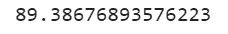

# 推荐系统:商品-顾客协同过滤

> 原文：<https://towardsdatascience.com/recommender-systems-item-customer-collaborative-filtering-ff0c8f41ae8a?source=collection_archive---------1----------------------->

## 用 Python 代码一步步解释稀疏性、相似性和隐式二元协同过滤


推荐器使用相似性作为距离的补充(作者的图像)

**动机:**

了解我们的客户应该对哪些商品高度感兴趣，这在许多业务中至关重要。回顾一下我们的 [FPGrowth](/market-basket-analysis-using-pysparks-fpgrowth-55c37ebd95c0) 数据挖掘，我们发现产品经常是相互关联的。因此，如果一个顾客购买了产品 A，那么这个顾客很可能也会购买产品 B，因为这两件商品是相关的(不管出于什么原因，可能就像[啤酒和尿布](https://www.forbes.com/forbes/1998/0406/6107128a.html?sh=2c7947b36260))。由于这个**关联**规则，我们可以估计客户在一次销售交易中购买的不止一种产品。为了增加一些额外的味道，能够向我们的客户推荐他们自己还不知道他们感兴趣(但他们确实感兴趣)的商品，这不是很棒吗？让我们继续下一步，学习如何用 Python 建立这样一个**推荐**系统。

**解决方案:**

我们将从 [**购物篮**](/market-basket-analysis-using-pysparks-fpgrowth-55c37ebd95c0) (在销售交易 id 级别上)转移到我们客户的更全面的购买行为(我们客户过去总体购买了哪些商品)，建立一个 ML **推荐**系统。我们的目标是向我们的客户推荐他们尚未购买但会非常感兴趣的产品(他们自己还不一定知道他们的需求)。这里的诀窍是看看其他**类似顾客**的购物习惯。由于我们没有任何可用的标记数据来告诉我们哪些客户彼此相似，我们将简单地从他们过去购买的相同**商品**之间的**联系中提取客户之间的相似性。一般来说，相似性是一个非常有趣的指标，用于许多分析目的，而不仅仅与商品-客户推荐相关联(例如，参见[我们的聊天机器人](/chatbot-a-complete-pycharm-app-part-2-of-3-distance-metric-46462a9ad4e4)中的单词/句子之间的相似性)。在购买历史中寻找相似性，我们预计客户的相似偏好也将延伸到未来。因此，如果客户 A 购买了产品 2、5 和 6(不一定在同一个篮子里)，而客户 B 购买了产品 2、5、6 和 9，那么我们可以估计客户 A 也对产品 9 感兴趣。请注意，产品 9 可能与客户 A 以前购买过的产品非常不同，因为我们要看的是客户之间的相似性(而不是商品之间的相似性)。建立在这个概念上的 ML 算法被称为**协同过滤** (CF)算法。**

## 数据管理

首先让我们看看我们的数据并做必要的**数据准备**(数据和 Jupyter 笔记本都存储在我的 [github 库](https://github.com/DAR-DatenanalyseRehberg/RecommenderBinaryCF)):

```
import pandas as pd
data = pd.read_excel('/content/gdrive/MyDrive/DDDDFolder/DDDD.xlsx')  
data.head()
```


这就是我们的数据帧最初的样子。希望它很容易适应您的数据。

因此，我们得到的是每个销售日的销售额、客户(例如，客户代码 0 是一个特定的客户)和销售项目(类似于客户，销售项目 0 是一个特定的销售项目)。其他栏目与我们的产品推荐无关，因此我们将删除这些栏目:

```
DataPrep = data[[‘SalesItem’, ‘SalesAmount’, ‘Customer’]] 
DataPrep.head()
```


我们将只使用销售项目、销售金额和客户作为我们推荐人的基础。

用熊猫的。info 函数我们看到在我们的 341422 个数据行中不存在 NaN(不是数字)值(这是一件好事):


现在我们想使用 groupby 计算出每个客户购买了哪些商品:

```
DataGrouped = DataPrep.groupby([‘Customer’,‘SalesItem’]).sum().reset_index() 
DataGrouped.head()
```


由于 Panda 的 Groupby 功能，每个客户和商品一行。

## 稀疏比密集好(Python 的禅)

我们的数据是这样的:36 个不同的客户(从 0 到 35)和 3751 个不同的商品。有趣的问题是，我们的顾客实际上购买了多少不同的商品？我们将使用 Numpy 的。用于获取不同数量的客户和商品的销售额的列表函数:

```
import numpy as np 
customers = list(np.sort(DataGrouped.Customer.unique()))
# a list of values, so customers now stores 36 unique customersproducts = list(DataGrouped.SalesItem.unique()) 
quantity = list(DataGrouped.SalesAmount)
```

使用 Panda 的数据帧，我们可以将 Numpy 的列表聚合回 Panda 的数据帧:

```
from pandas import DataFrame 
DfCustomerUnique = DataFrame(customers,columns=[‘Customer’]) DfCustomerUnique.head()
```


DfCustomerUnique 在一个数据框架中包含所有唯一的客户

现在我们可以构建稀疏矩阵:

```
from scipy import sparse 
from pandas.api.types import CategoricalDtype 
rows = DataGrouped.Customer.astype(CategoricalDtype(categories=customers)).cat.codes 
# We have got 35 unique customers, which make up 13837 data rows (index) 
# Get the associated row indices 
cols = DataGrouped.SalesItem.astype(CategoricalDtype(categories= products)).cat.codes 
# We have got unique 3725 SalesItems, making up 13837 data rows (index) 
# Get the associated column indices 
#Compressed Sparse Row matrix 
PurchaseSparse = sparse.csr_matrix((quantity, (rows, cols)), shape=(len(customers), len(products))) 
#len of customers=35, len of products=3725 
#csr_matrix((data, (row_ind, col_ind)), [shape=(M, N)]) 
#where data, row_ind and col_ind satisfy the relationship a[row_ind[k], col_ind[k]] = data[k]. , see [3]
PurchaseSparse
```


稀疏矩阵(不是熊猫 df)对于行切片和快速矩阵矢量积是有效的

我们总共有 35 个客户和 3725 件商品。对于这些用户/项目交互，这些项目中的 13837 个实际上有购买。根据矩阵的稀疏性，这使得:

```
MatrixSize = PurchaseSparse.shape[0]*PurchaseSparse.shape[1] # 130375 possible interactions in the matrix (35 unique customers * 3725 unique SalesItems=130375)PurchaseAmount = len(PurchaseSparse.nonzero()[0]) # 13837 SalesItems interacted with;sparsity = 100*(1 - (PurchaseAmount/MatrixSize))sparsity
```



由于我们将使用[矩阵分解](https://en.wikipedia.org/wiki/Matrix_factorization_(recommender_systems))进行协作过滤，89.3%的交互矩阵稀疏应该不成问题。简单地说，在我们的案例中，89.3%意味着只有 10.7%的客户-商品互动已经完成，这意味着大多数商品还没有被客户购买。据说协同过滤甚至可以很好地处理更稀疏的数据。当我们最终检查我们的体面推荐时，我们可以证明它是有效的。**余弦相似度**对于稀疏数据来说是一个很好的度量，所以我们将坚持余弦(而不是皮尔逊、欧几里德、曼哈顿等。).

## 二进制数据与销售额

我们的协同过滤将基于**二进制**数据(一组只有两个值的数据)，这是分类数据的一个重要特例。对于每个数据集，我们将在购买时添加 1。这意味着，该客户已经购买了该商品，不管该客户过去实际购买了多少。我们决定在推荐的例子中使用这种二进制数据方法。另一种方法是使用 SalesAmount 并将其规范化，以防您希望将购买的 SalesItems 的数量视为一种口味因素，这意味着某人购买了 SalesItem x 100 次——而另一个客户只购买了相同的 sales item x 5 次——并不喜欢它。我相信，在销售建议中，二元方法通常更有意义，但当然这真的取决于你的数据。

```
def create_DataBinary(DataGrouped):
DataBinary = DataGrouped.copy()DataBinary['PurchasedYes'] = 1
return DataBinary
DataBinary = create_DataBinary(DataGrouped)
DataBinary.head()
```


最后，让我们去掉 SalesAmount 列:

```
purchase_data=DataBinary.drop(['SalesAmount'], axis=1)
purchase_data.head()
```


这是我们为提出建议而准备的现成数据。

## 协同过滤

为了进行协同过滤，我们现在可以看看胡一帆、耶胡达·科伦和克里斯·沃林斯基的论文。据推测，脸书和 Spotify 基本上也使用本文描述的方法。你读过吗？你理解了吗，知道怎么把这个放进 Python 代码里吗？老实说，第一个问题我可以说是，但第二个问题肯定不行。如果你也有类似的回答，为了更好地理解，我很荣幸你能一步步地和我一起经历这一切。

CF 是研究和实现最广泛的推荐算法之一(根据 Aberger [ [2](https://www.semanticscholar.org/paper/Recommender-%3A-An-Analysis-of-Collaborative-Aberger-caberger/53bd928ceaab4572594590970b877da1278b7a79) ])。CF 是一种 ML 算法，它从许多客户(协作，因为它正在组合收集的信息)收集偏好或口味信息，并使用这些信息对其他客户的兴趣进行自动预测(过滤掉可能性较小的选项，以找到可能性最大的预测)。当然，我们只会推荐顾客尚未购买的商品。

## 显式比隐式好(Python 的禅)

..但是**含蓄**总比没有强。使用 implicit，我们无法真正判断我们的客户是否喜欢某个特定的产品。我们可以判断出顾客确实购买了特定的商品。此外，这些信息还可以细分为客户是否购买了某个特定的商品(二进制，是或否)或客户购买了该商品多少次(作为一种品味因素:该商品购买的次数越多，它似乎就越相关)。我们将在二进制水平上推荐客户购买的销售量(购买是或否)，因为我相信这与我们大多数读者最相关。我认为，在现实生活中，我们往往只能得到隐性反馈。隐性反馈，如购买的商品数量、网站点击量、观看的电影等。不是明确的反馈(“我喜欢”等)。所以有可能即使我们买了某本书，我们在阅读的时候并不真正喜欢它。尽管这是隐式反馈的一个缺点，但我们通常没有明确的客户反馈，所以我们必须坚持隐式反馈。此外，如果隐式反馈的数量超过了显式反馈的数量，我们可能会决定在隐式数据上构建我们的推荐引擎(有时大量数据会支配较少的数据，即使数据质量更好)。我们寻找顾客之间的联系，而不是产品之间的联系。因此，协同过滤仅依赖于观察到的客户行为来做出推荐，而不需要关于客户或项目的信息。

一句话:我们的建议是基于这样一个假设，即购买了相似数量产品的客户共享一个或多个隐藏的偏好。由于这种共有的**潜在的**或**隐藏的特征**，顾客很可能会购买类似的产品。

## 相似性度量

我们如何判断一个客户与另一个客户的相似程度？或者一个物品和其他物品的距离有多近？要回答这个问题，说明相似性方法是对距离的补充是有帮助的。虽然两点之间的距离可以使用欧几里德距离(通过计算连接两点的直线的长度)来获得，但相似性是关于点“有多接近”。相似性值通常表示为 0 到 1 之间的数字，其中 0 表示低相似性，1 表示高相似性。让我们把它分解成简单的 Google Sheets/ Microsoft Excel 公式(下面是使用 Google Sheets 的表单截图，你也可以在[我的 Github 库](https://github.com/DAR-DatenanalyseRehberg/RecommenderBinaryCF)中找到):

假设我们的 9 个客户购买了这 7 个销售项目，如下所示(1 表示已购买，0 表示未购买)，则“PurchaseHistory”选项卡如下所示:


例如，顾客 3 曾经购买过销售物品 2。

“PurchHistNorm”选项卡中的标准化数据如下所示:


二进制数据的缩放有意义吗？这个稍后会回答。

..因为例如对于客户 1，为了标准化，我们必须检查幅度:


因此，最终项目-项目相似性矩阵看起来像这样:


当然，一个产品总是与其自身相关度最高(销售项目 1 与销售项目 1 相关度最高，得分为 1)。我希望这个简单的电子表格示例能够帮助您了解建立项目-项目相似性背后的基本思想。

## 使用哪种相似性度量？

如果数据存在等级膨胀(不同的客户可能使用不同的量表)，建议使用 Pearson。如果我们的数据很密集(几乎所有属性都有非零值)并且属性值的大小很重要，则使用距离度量，如欧氏距离或曼哈顿距离。但是对于我们的稀疏单变量数据的例子，我们将坚持余弦相似性。

## Python 中的项目-客户矩阵

现在，我们将构建商品-客户矩阵。为了更方便，我们在每个 SalesItem 前添加 I 作为前缀。否则，我们将只有客户和销售项目编号，这可能会变得有点令人费解:

```
purchase_data[‘SalesItem’] = ‘I’ + purchase_data[‘SalesItem’].astype(str) 
DfMatrix = pd.pivot_table(purchase_data, values=’PurchasedYes’, index=’Customer’, columns=’SalesItem’)
DfMatrix.head()
```


因为我们只使用 1 和 0，所以我们不需要考虑标准化，这是一种缩放方法。标准化将数据的范围缩小到从 0 到 1:

X normalized = X Xmin/(Xmax Xmin)

另一种形式的缩放是标准化，它将数据的缩放比例缩小到平均值(μ)为 0，标准差(σ)为 1:

X standardized = Xμ/σ
但是空谈是没有用的，让我们来看看，即使我们归一化，结果当然是一样的:

```
DfMatrix=DfMatrix.fillna(0) 
#NaN values need to get replaced by 0, meaning they have not been purchased yet.DfMatrixNorm3 = (DfMatrix-DfMatrix.min())/(DfMatrix.max()-DfMatrix.min())DfMatrixNorm3.head()
```


我们需要通过 reset_index 和 rename_axis 将数据透视表转换成所需的格式:

```
DfResetted = DfMatrix.reset_index().rename_axis(None, axis=1) DfResetted.head() 
#Now each row represents one customer`s buying behaviour: 1 means the customer has purchased, NaN the customer has not yet purchased it
```


```
DfMatrix.shape
```


客户必须是 nvarchar！如果客户是 int，则在客户相似期间失败！

```
df=DfResetted 
```

我们需要用 0 替换 NaN 值，因为我们的函数不能处理 NaN 值。请注意，我们只是检查一个特定的客户是否购买了一个特定的项目，是或否。这就是所谓的二进制。如果客户购买了特定的商品，这意味着 1。如果不是，则为 0。由于这个二进制问题，使用任何进一步的缩放技术都没有用。

```
df=df.fillna(0) 
df.head()
```


现在我们创建一个只包含销售项目的数据框架，而客户则被编入索引。

```
DfSalesItem = df.drop(‘Customer’, 1) 
DfSalesItem.head()
```


因此，我们现在可以计算基于项目的推荐。出于比较原因，我们将标准化数据帧:

```
import numpy as np
DfSalesItemNorm = DfSalesItem/np.sqrt(np.square(DfSalesItem).sum(axis=0))   DfSalesItemNorm.head()
```


正在计算。计算余弦相似度的点矢量:

```
ItemItemSim = DfSalesItemNorm.transpose().dot(DfSalesItemNorm) ItemItemSim.head()
```


如果要导出此结果，请使用 item item sim . to _ excel(" export item-item . xlsx ")。

为项目的最近邻居创建占位符项目

```
ItemNeighbours = pd.DataFrame(index=ItemItemSim.columns,columns=range(1,10))
ItemNeighbours.head()
```


为项目的近邻创建占位符项目

循环浏览我们的相似性数据框架，并填写相邻的项目名称:

```
for i in range(0,len(ItemItemSim.columns)): ItemNeighbours.iloc[i,:9] = ItemItemSim.iloc[0:,i].sort_values(ascending=False)[:9].index #we only have 9 items, so we can max recommend 9 items (itself included) ItemNeighbours.head()
```


您可以看到第一列存储了项目本身。

```
ItemNeighbours.head().iloc[:11,1:9]
#it needs to start at position 1, because position 0 is item itself
```


现在我们去掉了第 1 列，它只是商品本身。

```
# You might want to export this result to Excel now
ItemNeighbours.to_excel(“ExportItem-Item-data_neighbours.xlsx”)
```

现在，我们将创建一个基于客户的推荐，我们需要我们的项目相似性矩阵。然后，我们将查看我们的客户购买了哪些商品，并获得每个商品的前 N 名邻居。之后，我们为每个邻居计算顾客的购买历史，并为他们计算相似性得分。所以最后我们只需要推荐得分最高的项目。因此，我们将创建一个相似性占位符矩阵，并填写客户列:

```
CustItemSimilarity = pd.DataFrame(index=df.index,columns=df.columns) CustItemSimilarity.iloc[:,:1] = df.iloc[:,:1] CustItemSimilarity.head()
```


最后，我们将计算相似性得分

```
def getScore(history, similarities):return sum(history*similarities)/sum(similarities)
```

这需要很长时间(35 个客户* 3725 个项目)，因为我们现在循环遍历行和列，用相似性分数填充空白空间(在这里找到一个[改进的解决方案](/recommend-using-scikit-learn-and-tensorflow-recommender-bc659d91301a))。请注意，我们将顾客已经消费过的商品评分为 0，因为没有必要再次推荐这些商品。

```
from timeit import default_timer as timer 
#to see how long the computation will take 
start = timer() for i in range(0,len(CustItemSimilarity.index)): for j in range(1,len(CustItemSimilarity.columns)): user = CustItemSimilarity.index[i] product = CustItemSimilarity.columns[j]if df.loc[i][j] == 1: CustItemSimilarity.loc[i][j] = 0 else: ItemTop = ItemNeighbours.loc[product][1:9] 
ItemTopSimilarity = ItemItemSim.loc[product].sort_values(ascending=False)[1:9] 
#here we will use the item dataframe, which we generated during item-item matrix 
CustomerPurchasings = DfSalesItem.loc[user,ItemTop] CustItemSimilarity.loc[i][j] = getScore(CustomerPurchasings,ItemTopSimilarity) end = timer() print(‘\nRuntime: %0.2fs’ % (end — start)) 
CustItemSimilarity.head()
```


如果出现一个奇怪的错误 tz=getattr(series.dtype，' tz '，None)..熊猫指数..那么这可能是因为使用 int #而不是 string 作为列标题

现在，我们将生成一个基于客户的建议矩阵，如下所示:

```
# Get the top SalesItems 
CustItemRecommend = pd.DataFrame(index=CustItemSimilarity.index, columns=[‘Customer’,’1',’2',’3',’4',’5',’6']) #Top 1,2..6 CustItemRecommend.head()
```


我们希望看到产品名称，而不是用相似性分数填充矩阵。因此循环:

```
for i in range(0,len(CustItemSimilarity.index)): CustItemRecommend.iloc[i,1:] = CustItemSimilarity.iloc[i,:].sort_values(ascending=False).iloc[1:7,].index.transpose() 
CustItemRecommend.head()
```


客户 0 的第一项建议是项目 1134，项目 999 是第二项，项目 2128 是第三项，依此类推。

```
CustItemRecommend.to_excel(“ExportCustomer-Item-CustItemRecommend.xlsx”) 
```

恭喜你，我们已经编码了一个二进制推荐引擎，它在一个小数据集上就足够了。让我们看看是否可以使用[另一个故事](/recommend-using-scikit-learn-and-tensorflow-recommender-bc659d91301a)中的相同数据集来增强性能和可伸缩性。你可以在[我的 Github](https://github.com/DAR-DatenanalyseRehberg/RecommenderBinaryCF) 中找到 Jupyter 笔记本和 Excel 的例子。

非常感谢您的阅读！希望这篇文章对你有帮助。请随时在 [LinkedIn](https://de.linkedin.com/in/jesko-rehberg-40653883) 、 [Twitter](https://twitter.com/DAR_Analytics) 或[工作室](https://jesko-rehberg.medium.com/virtual-reality-vr-for-education-a532aa5b6272)与我联系。

[](https://jesko-rehberg.medium.com/membership) [## 通过我的推荐链接加入 Medium-Jesko Rehberg

### 阅读杰斯科·雷伯格(以及媒体上成千上万的其他作家)的每一个故事。您的会员费直接支持…

jesko-rehberg.medium.com](https://jesko-rehberg.medium.com/membership) 

如果你想推荐使用 Scikit-Learn 或 Tensorflow 推荐器，你可能会发现这篇文章很有帮助:

[](/recommend-using-scikit-learn-and-tensorflow-recommender-bc659d91301a) [## 推荐使用 Scikit-Learn 和 Tensorflow 推荐器

### 针对每位客户售出的销售项目(二进制)的协作筛选

towardsdatascience.com](/recommend-using-scikit-learn-and-tensorflow-recommender-bc659d91301a) 

最初发表在我的网站 [DAR-Analytics](https://www.dar-analytics.de/AboutUs.html) 。

参考:

[1]http://yifanhu.net/PUB/cf.pdf[胡一帆、耶胡达·科伦和克里斯·沃林斯基，《隐式反馈数据集的协同过滤》](http://yifanhu.net/PUB/cf.pdf)

[2] Christopher R. Aberger，Recommender:a Analysis of Collaborative Filtering Techniques:[https://www . semantic scholar . org/paper/Recommender-% 3A-An-Analysis-of-Collaborative-aber ger-caberger/53bd 928 ce aab 4572594590970 b 877 da 1278 b7a 79](https://www.semanticscholar.org/paper/Recommender-%3A-An-Analysis-of-Collaborative-Aberger-caberger/53bd928ceaab4572594590970b877da1278b7a79)

[3] scipy.sparse.csr_matrix，[https://docs . scipy . org/doc/scipy/reference/generated/scipy . sparse . CSR _ matrix . html](https://docs.scipy.org/doc/scipy/reference/generated/scipy.sparse.csr_matrix.html)