# 利用 U-Net 从强引力透镜图像重建源星系图像

> 原文：<https://towardsdatascience.com/reconstruct-source-galaxy-images-from-strong-gravitational-lens-images-using-u-net-1d8221100601?source=collection_archive---------30----------------------->

## 如何生成遥远星系的无透镜图像

引力使遥远星系的光线弯曲，这使得它们看起来像透镜。下面的图像向我们展示了来自遥远类星体的光如何由于透镜星系的强大引力而弯曲，透镜星系的作用类似于类星体(源)和观察者之间的光学透镜。这产生了一个扭曲的类星体图像，显示在图像的右侧。

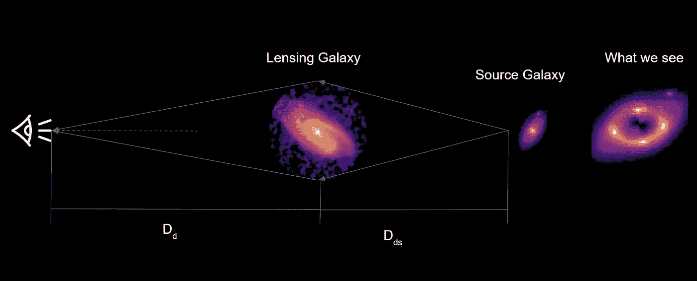

**强引力透镜的简单说明** **|** **作者图，星系图像**:曼德尔鲍姆、蕾切尔、莱克纳、克莱尔、利奥特、亚历克西、&罗、巴纳比。(2012).宇宙真实星系数据集。芝诺多。[http://doi.org/10.5281/zenodo.3242143](http://doi.org/10.5281/zenodo.3242143)

这个项目试图重建被引力透镜扭曲的遥远光源的原始图像。

使用[卷积神经网络](https://en.wikipedia.org/wiki/Convolutional_neural_network)、 [U-Net](https://en.wikipedia.org/wiki/U-Net) 和带有[结构相似性指数的均方误差](https://en.wikipedia.org/wiki/Structural_similarity)，我们能够生成这些星系的无透镜图像。即消除[强引力透镜](https://en.wikipedia.org/wiki/Strong_gravitational_lensing)的影响，生成源图像。此外，我们能够预测导致这种扭曲的强引力透镜的透镜参数。我们致力于开发一种算法来消除这种视觉效应，以便我们可以检测其他可能的未识别引力透镜。即重建源星系的图像。

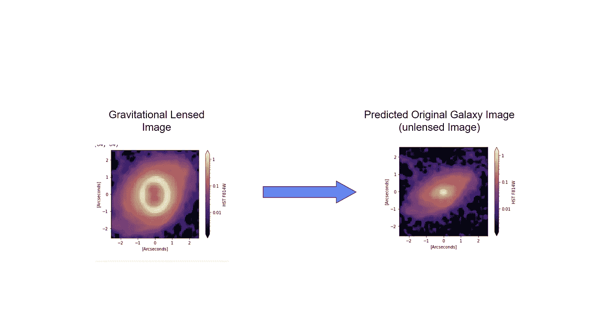

**解除强引力透镜效应|** **作者图，星系图像**:曼德尔鲍姆、蕾切尔、拉克纳、克莱尔、莱奥陶德、亚历克西、&罗、巴纳比。(2012).宇宙真实星系数据集。芝诺多。[http://doi.org/10.5281/zenodo.3242143](http://doi.org/10.5281/zenodo.3242143)

# 资料组

由于没有多少强引力透镜的图像可用，我们决定使用[宇宙数据集](https://zenodo.org/record/3242143)来模拟数据。Cosmos 数据集有 60K 个星系图像。我们利用红移特性过滤出星系，用于我们的项目。过滤星系后，我们使用[透镜体](https://github.com/sibirrer/lenstronomy)和随机生成的透镜参数来模拟源星系的透镜图像。我们还使用旋转[数据增强](https://github.com/JelleAalbers/minilensmaker)来生成更多的模拟数据。我们的数据集由生成的透镜图像和它的源真实星系对组成。这些图像是 64x64 灰度图像。基于 galaxy 独特的源 id，它们被分布到测试、验证和训练数据集，以避免数据集之间的数据泄漏。透镜图像用于预测星系引力透镜的透镜参数。给定透镜图像，无透镜图像是用于预测无透镜星系的同一星系的正确描述。

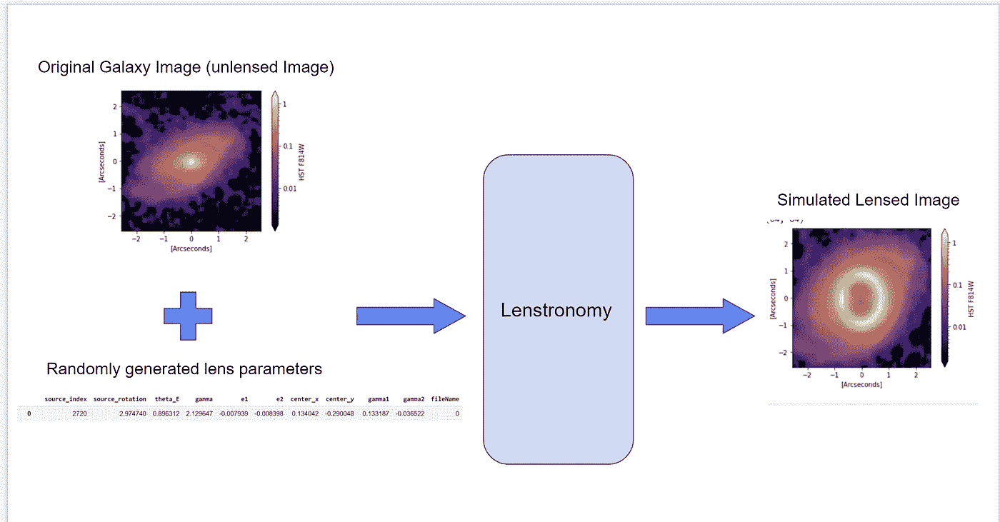

**数据增强创建模拟强引力透镜数据|作者图，** **星系图像**:曼德尔鲍姆、雷切尔、拉克纳、克莱尔、利乌托德、亚历克西、&罗、巴纳比。(2012).宇宙真实星系数据集。芝诺多。[http://doi.org/10.5281/zenodo.3242143](http://doi.org/10.5281/zenodo.3242143)

# 方法

我们把问题分成两步。

首先，预测 8 个[透镜参数](https://www.nature.com/articles/nature23463):

*   [爱因斯坦半径](https://en.wikipedia.org/wiki/Einstein_radius)(θ_ E)
*   透镜的幂律质量分布指数(伽马)
*   透镜的椭圆度分量(e1，e2)
*   镜头在图像中的位置(center_x，center_y ),单位为弧秒
*   透镜图像的外部剪切分量(γ1，γ2)。

其次，U-net 从它的透镜对图像生成无透镜源星系图像。

# 架构第 1 部分:预测透镜参数

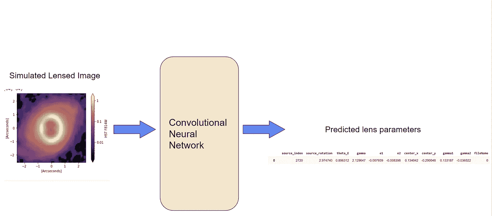

**预测透镜参数|作者图表，银河影像**:曼德尔鲍姆，瑞秋，拉克纳，克莱尔，利奥特，亚历克西，&罗，巴纳比。(2012).宇宙真实星系数据集。芝诺多。[http://doi.org/10.5281/zenodo.3242143](http://doi.org/10.5281/zenodo.3242143)

在我们预处理我们的图像之后，我们在具有三个块的卷积神经网络中使用我们的训练数据集，使用相应的透镜参数作为最后一层的输出，这产生了我们的第一部分的模型。在每个模块中，我们应用了 2D 卷积、最大池化、批量标准化和一个 Relu 激活函数。最后，我们将这些层展平，并将输入传递到两个密集的层中，一个是 Relu，另一个是线性函数。我们将所有 8 个要预测的参数指定为每个数据集中的标签，然后对数据集中的所有图像运行该函数。它能够跨所有三个数据集以良好的度量来预测透镜化参数。

第 1 部分的超参数:我们调整了 Adam 的学习速率、CNN 的层数、小批量和纪元。

```
model = models.Sequential()
model.add(layers.Conv2D(32, (3, 3),input_shape=(64, 64, 1),use_bias=**False**)) 
model.add(layers.MaxPooling2D((2, 2))) model.add(layers.BatchNormalization()) model.add(layers.Activation("relu"))
model.add(layers.Conv2D(64, (3, 3) ,use_bias=**False**)) model.add(layers.MaxPooling2D((2, 2))) model.add(layers.BatchNormalization()) model.add(layers.Activation("relu"))
model.add(layers.Conv2D(64, (3, 3),use_bias=**False**)) model.add(layers.MaxPooling2D((2, 2))) model.add(layers.BatchNormalization()) model.add(layers.Activation("relu")) model.add(layers.Flatten()) model.add(layers.Dense(64, activation='relu')) model.add(layers.Dense(8,activation='linear'))
```

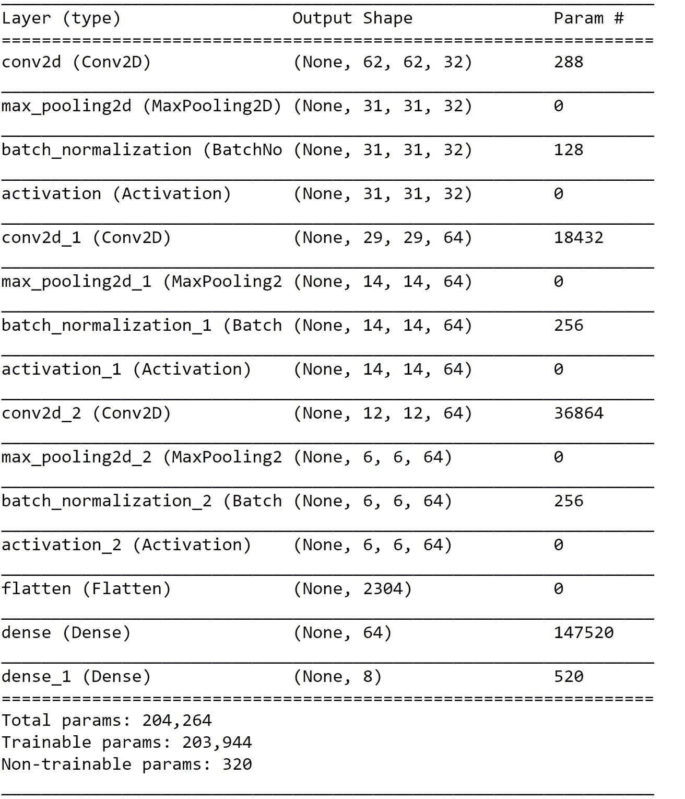

CNN 预测透镜参数

测试集的每个透镜参数类的“均方根误差”输出的度量:

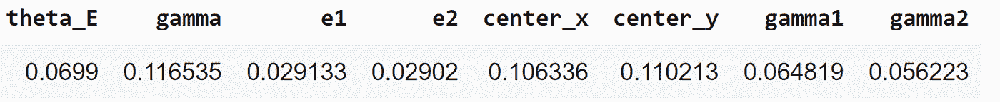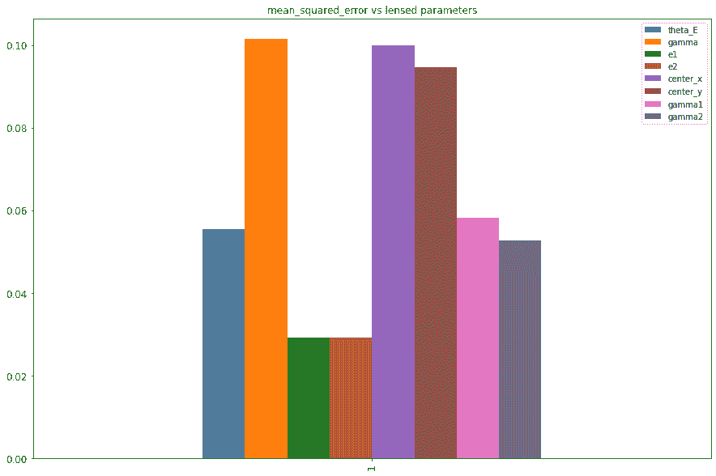

每个输出类参数的 RMS，**作者的图表，**

这表明θE(爱因斯坦半径)比透镜中心坐标和γ更容易预测，但比透镜椭圆度分量(e1，e2)更难预测。

# 架构第 2 部分:生成源星系图像

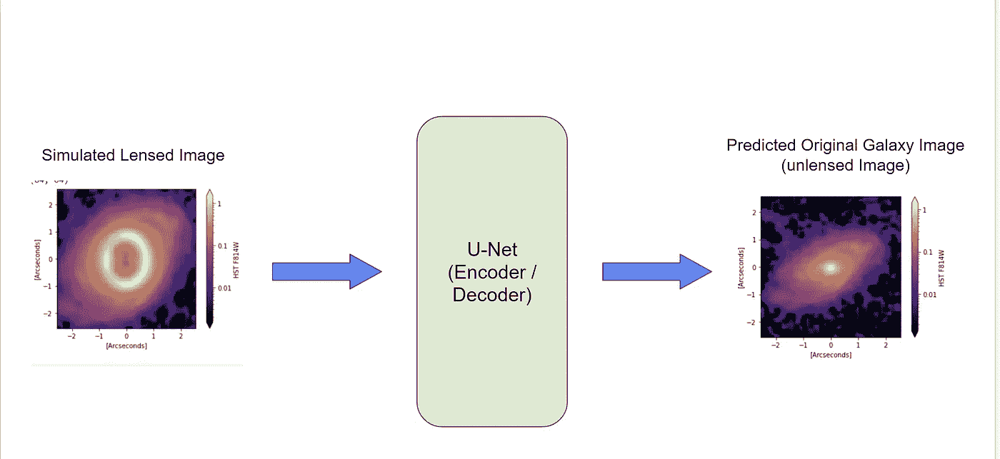

**使用 U-Net** **将有透镜的图像转换为无透镜的源星系图像|作者的图表，** **星系图像**:曼德尔鲍姆、雷切尔、拉克纳、克莱尔、利乌托德、亚历克西、&罗、巴纳比。(2012).宇宙真实星系数据集。芝诺多。[http://doi.org/10.5281/zenodo.3242143](http://doi.org/10.5281/zenodo.3242143)

在第二部分中，我们将一张有透镜的图像转换成一张无透镜的源星系图像。为此，我们使用我们的 U-net 编码器/解码器网络和图像相似性作为我们的误差/损失函数。

## U-Net 实验和超参数调谐

我们开始了一个简单的 [U-Net](https://en.wikipedia.org/wiki/U-Net) ，它具有多个 Conv2D、最大池、[转置卷积层](https://naokishibuya.medium.com/up-sampling-with-transposed-convolution-9ae4f2df52d0)，以及带有 MSE 损耗和 Adam 优化器的最后一层的线性激活。之后，我们在 U-Net 中添加了更多的隐藏块，提高了它的性能。然后我们实验了不同的激活函数:relu，elu 等。Relu 为我们提供了更好的中间层结果。然后，我们加入了对结果没有太大改善的辍学者，所以把它去掉了。此外，添加批处理规范化有助于 U-Net。仍然没有从人工误差分析中为螺旋星系生成更好的图像，所以我们决定使用不同的图像相似性损失函数。

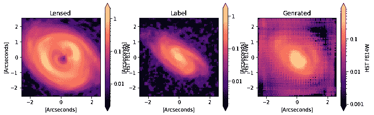

初始模型

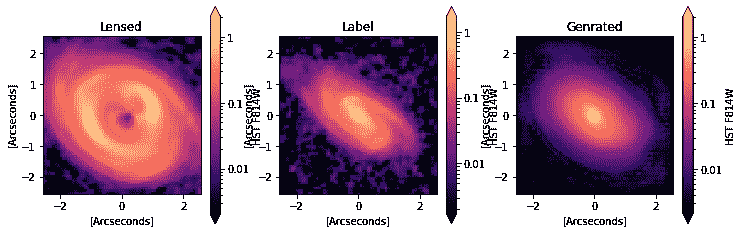

**MSE 生成正确形状的中间模型****|星系图像**:曼德尔鲍姆、蕾切尔、莱克纳、克莱尔、利奥特、亚历克西、&罗、巴纳比。(2012).宇宙真实星系数据集。芝诺多。【http://doi.org/10.5281/zenodo.3242143 

**指标和自定义损失函数:**

我们用图像结构相似性 SSIM 指数、峰值信噪比(PSNR)和均方误差(MSE)作为损失函数进行实验。SSIM 给了我们更好的结果。我们通过编写一个结合了 SSIM 和 MSE 的自定义损失函数来进一步改进我们的结果。

## 具有定制损耗功能的 U-Net

```
inputs = Input((64, 64, 1))s = Lambda(lambda x: x / 255) (inputs)
c1 = Conv2D(16, (3, 3),  padding='same',use_bias=False) (s)c1 = BatchNormalization()(c1)
c1 = Activation('relu')(c1)
c1 = Conv2D(16, (3, 3), padding='same',use_bias=False) (c1)
c1 = BatchNormalization()(c1)
c1 = Activation('relu')(c1)
p1 = MaxPooling2D((2, 2)) (c1)c2 = Conv2D(32, (3, 3),  padding='same',use_bias=False) (p1)
c2 = BatchNormalization()(c2)
c2 = Activation('relu')(c2)
c2 = Conv2D(32, (3, 3), padding='same',use_bias=False) (c2)
c2 = BatchNormalization()(c2)
c2 = Activation('relu')(c2)
p2 = MaxPooling2D((2, 2)) (c2)c3 = Conv2D(64, (3, 3), padding='same',use_bias=False) (p2)
c3 = BatchNormalization()(c3)
c3 = Activation('relu')(c3)
c3 = Conv2D(64, (3, 3), padding='same',use_bias=False) (c3)
c3 = BatchNormalization()(c3)
c3 = Activation('relu')(c3)
c3 = Conv2D(64, (3, 3), padding='same',use_bias=False) (c3)
c3 = BatchNormalization()(c3)
c3 = Activation('relu')(c3)
p3 = MaxPooling2D((2, 2)) (c3)c4 = Conv2D(128, (3, 3), padding='same', use_bias=False) (p3)
c4 = BatchNormalization()(c4)
c4 = Activation('relu')(c4)
c4 = Conv2D(128, (3, 3), padding='same',use_bias=False) (c4)
c4 = BatchNormalization()(c4)
c4 = Activation('relu')(c4)
p4 = MaxPooling2D(pool_size=(2, 2)) (c4)c5 = Conv2D(256, (3, 3), padding='same',use_bias=False) (p4)
c5 = BatchNormalization()(c5)
c5 = Activation('relu')(c5)
c5 = Conv2D(256, (3, 3),  padding='same',use_bias=False) (c5)
c5 = BatchNormalization()(c5)
c5 = Activation('relu')(c5)u6 = Conv2DTranspose(128, (2, 2), strides=(2, 2), padding='same') (c5)
u6 = concatenate([u6, c4])
c6 = Conv2D(128, (3, 3),  padding='same',use_bias=False) (u6)
c6 = BatchNormalization()(c6)
c6 = Activation('relu')(c6)
c6 = Conv2D(128, (3, 3),  padding='same',use_bias=False) (c6)
c6 = BatchNormalization()(c6)
c6 = Activation('relu')(c6)u7 = Conv2DTranspose(64, (2, 2), strides=(2, 2), padding='same') (c6)
u7 = concatenate([u7, c3])
c7 = Conv2D(64, (3, 3),  padding='same',use_bias=False) (u7)
c7 = BatchNormalization()(c7)
c7 = Activation('relu')(c7)
c7 = Conv2D(64, (3, 3),  padding='same',use_bias=False) (c7)
c7 = BatchNormalization()(c7)
c7 = Activation('relu')(c7)
c7 = Conv2D(64, (3, 3),  padding='same',use_bias=False) (c7)
c7 = BatchNormalization()(c7)
c7 = Activation('relu')(c7)u8 = Conv2DTranspose(32, (2, 2), strides=(2, 2), padding='same') (c7)
u8 = concatenate([u8, c2])
c8 = Conv2D(32, (3, 3), padding='same',use_bias=False) (u8)
c8 = BatchNormalization()(c8)
c8 = Activation('relu')(c8)
c8 = Conv2D(32, (3, 3), padding='same',use_bias=False) (c8)
c8 = BatchNormalization()(c8)
c8 = Activation('relu')(c8)u9 = Conv2DTranspose(16, (2, 2), strides=(2, 2), padding='same') (c8)
u9 = concatenate([u9, c1], axis=3)
c9 = Conv2D(16, (3, 3),  padding='same',use_bias=False) (u9)
c9 = BatchNormalization()(c9)
c9 = Activation('relu')(c9)
c9 = Conv2D(16, (3, 3), padding='same',use_bias=False) (c9)
c9 = BatchNormalization()(c9)
c9 = Activation('relu')(c9)out = Conv2D(1, (1, 1), use_bias=False) (c9)
out = BatchNormalization()(out)
outputs = Activation('linear')(out)# Optimizer
optimizer = tf.keras.optimizers.Adam(learning_rate=0.001)model = Model(inputs=[inputs], outputs=[outputs])model.compile(loss=mse_ssim_loss, optimizer=optimizer, metrics=['mse',ssim_loss,psnr_loss])model.summary()
```

# 结合了 SSIM 和均方误差的定制损失函数

```
def mse_ssim_loss(y_true, y_pred):
return tf.reduce_mean(tf.math.squared_difference(y_true, y_pred)) - tf.reduce_mean(tf.image.ssim(y_true, y_pred, 1.0))
```

这个损失函数也为螺旋星系带来了更好的结果。

val _ MSE:0.0023—val _ ssim _ loss:0.0468—val _ PSNR _ loss:30.6308。损失曲线。

**测试集改进模型的 U-Net 结果:**更多结果如下

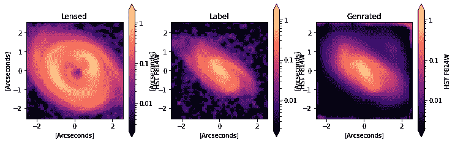

**改进后的模型还带有自定义损失函数生成图案|** **银河影像**:曼德尔鲍姆、蕾切尔、莱克纳、克莱尔、利奥特、亚历克西、&罗、巴纳比。(2012).宇宙真实星系数据集。芝诺多。[http://doi.org/10.5281/zenodo.3242143](http://doi.org/10.5281/zenodo.3242143)

# 见解和未来工作:

我们试图从我们的训练模型中为来自互联网的原始强引力透镜图像生成一个源，但我们需要对这些数据进行更多的预处理和噪声消除。我们也将尝试高斯噪声消除以及增加更多的数据(基于数据的方法)。我们还将对 RGB 图像进行实验，并继续完善这两个部分的模型。这样我们就可以更接近预测这些源星系的实际样子。此外，我们将公开模拟数据。

# 贡献

Git 储存库:[从强引力透镜图像生成源星系图像](https://github.com/madhumitadange/Generate-Source-Galaxy-Images-from-Strong-Gravitational-Lens-Images)

数据:[透镜数据](https://drive.google.com/drive/folders/1av08dbI44aa5R2LmY8hXxSSZbEaUuh8U?usp=sharing)

# 承认

我和我的团队成员 [Anand Bhavsar](https://profiles.stanford.edu/anand-bhavsar) 要感谢我们的导师 [Jelle Aalbers](https://profiles.stanford.edu/jelle-aalbers) 先生，他是斯坦福大学的 Kavli 博士后，天体物理学领域的专家，帮助我们建立数据，为我们建立模型提供指导和建议，并对我们的测试结果给予反馈。

# 更多结果:

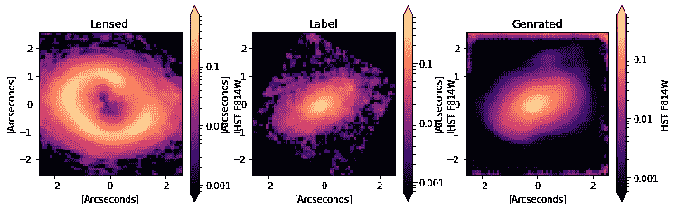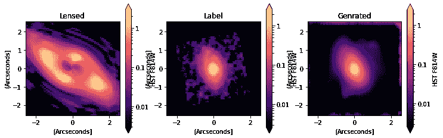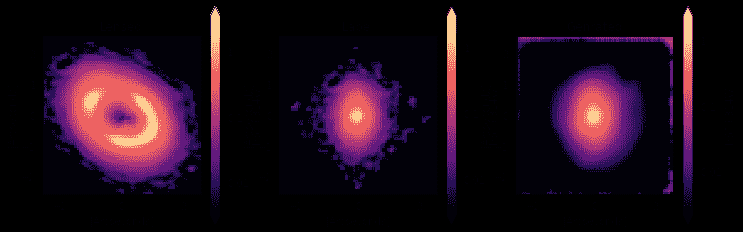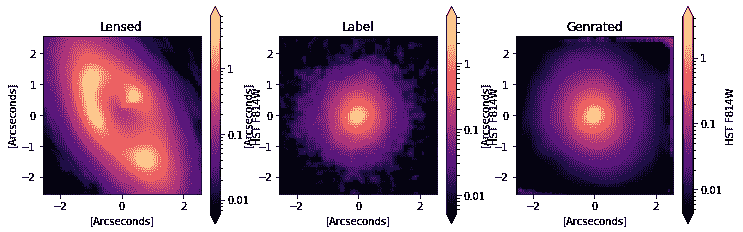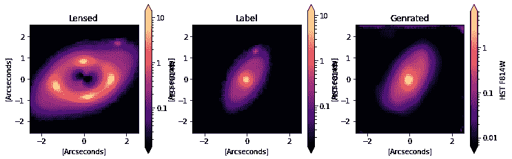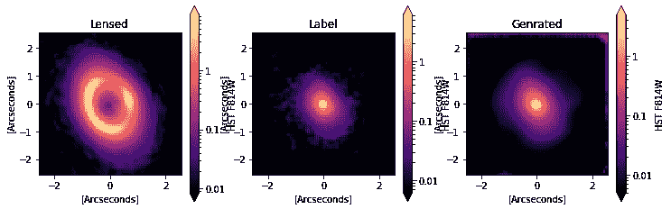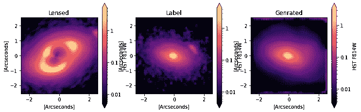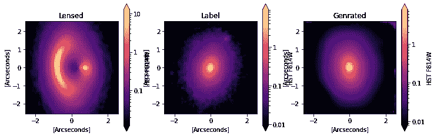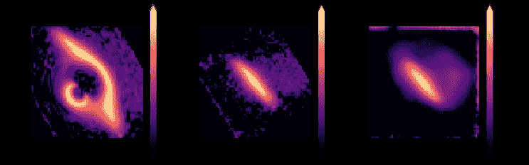

**样本输出图像|** **星系图像**:曼德尔鲍姆、蕾切尔、拉克纳、克莱尔、利乌托德、亚历克西、&罗、巴纳比。(2012).宇宙真实星系数据集。芝诺多。[http://doi.org/10.5281/zenodo.3242143](http://doi.org/10.5281/zenodo.3242143)

# 参考资料:

<https://en.wikipedia.org/wiki/Strong_gravitational_lensing>  

[宇宙真实星系数据集](https://zenodo.org/record/3242143)

<https://www.nature.com/articles/nature23463>  <https://github.com/sibirrer/lenstronomy>  

[结构相似度](https://en.wikipedia.org/wiki/Structural_similarity) (SSIM)

[峰值信噪比](https://en.wikipedia.org/wiki/Peak_signal-to-noise_ratio) (PSNR)

<https://kipac.stanford.edu/>    <http://spiff.rit.edu/classes/phys240/lectures/grav_lens/grav_lens.html>  <https://naokishibuya.medium.com/up-sampling-with-transposed-convolution-9ae4f2df52d0>  <https://up42.com/blog/tech/image-similarity-measures>  </understanding-semantic-segmentation-with-unet-6be4f42d4b47>  </nucleus-segmentation-using-u-net-eceb14a9ced4>  <https://www.tensorflow.org/tutorials/images/>  <https://www.nature.com/articles/nature23463>  <https://hubblesite.org/resource-gallery/images>  <https://www.freepik.com>  <https://www.flaticon.com/> 