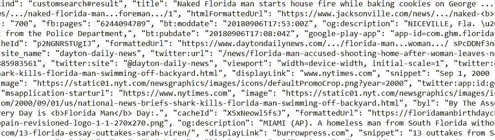
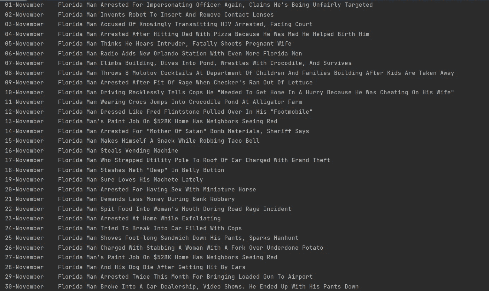
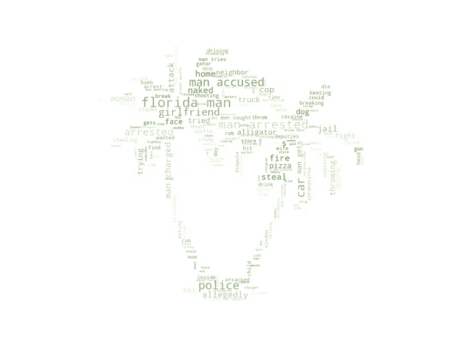

# 重建传奇的佛罗里达人的年代

> 原文：<https://towardsdatascience.com/reconstructing-the-year-of-the-legendary-florida-man-1aae9b7ed85e?source=collection_archive---------48----------------------->

## 一个用 Python 编写的数据科学微型项目，用于编辑每日头条

迈阿密海滩，佛罗里达人的潜在地点。图片由[塔蒙](https://pixabay.com/nl/users/tammon-2012621/?utm_source=link-attribution&amp;utm_medium=referral&amp;utm_campaign=image&amp;utm_content=1198921)通过[皮克斯贝](https://pixabay.com/nl/?utm_source=link-attribution&amp;utm_medium=referral&amp;utm_campaign=image&amp;utm_content=1198921)拍摄

你可能知道迷因。谷歌一下*‘佛罗里达人’+你的生日*，最奇怪的搜索结果就蹦了出来。一年中的每一天，这位神秘的佛罗里达男子似乎都在尝试比前一天更奇特、更暴力、更悲惨或更离奇的事情。通常，标题是如此的华而不实，以至于不禁让你会心一笑。

在谷歌上搜索佛罗里达人在你生日那天做了什么很有趣，但是你一定很好奇他在这一年的其他时间都做了什么(至少我是这样)。谷歌搜索 366 天有点太多了——尽管这可能比为它编写脚本更快——所以让我们试着用 Python 来实现自动化吧！我们执行了一个数据科学微型项目，涉足了一些云供应、web 抓取、多线程、字符串操作、正则表达式和单词云。

# 数据科学管道

对于任何数据科学项目(甚至是一个微型项目)，我发现利用加州大学圣地亚哥分校[1]概述的数据科学管道是有用的。它包含涵盖整个项目的五个阶段:

*   **获取**:使用 Google 定制搜索引擎和 Google CSE JSON APIs 来检索查询数据。
*   **准备**:可视化原始输出，从查询结果中过滤出标题。
*   **分析**:用一组禁忌词和相似性检查去掉不合适的标题。使用字符串操作和正则表达式产生统一样式的输出。
*   **报表**:显示样本输出，可视化单词云中的常用单词。
*   **行为**:根据项目撰写并发表一篇媒体文章。

数据科学管道(作者自己的作品，灵感来自[1])

# 设置 Google 自定义搜索

对于抓取谷歌的定制搜索引擎——在他们的常规搜索引擎上的自动请求是不允许的——我们使用[谷歌定制搜索 API](https://developers.google.com/custom-search/) 。这个 API 每天提供多达 100 个免费查询，以 JSON 格式返回输出。使用 Python，我们为每天创建一个查询，并将它们传递给 Google 定制搜索引擎 JSON API，以提取每个搜索的头条。关于创建和配置 API 和谷歌搜索定制引擎的更多信息，请查看我的教程[用 Python 抓取谷歌——一步一步的教程](https://wvheeswijk.medium.com/scraping-google-with-python-a-step-by-step-tutorial-11b38dd5691c)。在这个项目中，我们配置搜索引擎，使其在*中包含来自美国的结果。com* 域。

<https://medium.com/codex/scraping-google-with-python-a-step-by-step-tutorial-11b38dd5691c> [## 用 Python 抓取 Google 一步一步的教程

medium.com](https://medium.com/codex/scraping-google-with-python-a-step-by-step-tutorial-11b38dd5691c) 

# 生成数据查询

一旦自定义搜索引擎建立起来，我们就会创建一个包含 366 个生日的列表(是的，包括那个讨厌的 2 月 29 日)。2020 年是闰年，所以如果我们取那一年的所有日期(从*“1 月 1 日”*到“ *31 日-12 月”*)，我们就被覆盖了:

现在我们简单地将每个日期与*‘佛罗里达人’*连接起来，以有序的方式生成 366 个搜索查询:`search_term_list = [‘Florida Man‘ + date for date in date_list]`

准备好我们的查询列表后，我们就可以开始讨论了！

Denys Kostyuchenko 在 [Unsplash](https://unsplash.com?utm_source=medium&utm_medium=referral) 上的照片

# 运行查询

嗯，差不多准备好了。正如您所记得的，我们每天只能运行 100 个请求，我们绝对不想在这个宠物项目上花费四天时间。幸运的是，我们可以在一个帐户下提供多达 12 个 API，因此我们可以简单地创建四个副本，并通过切换键对每个副本依次运行 92 个查询。

让我们看看我们是否能做得更好！如果我们无论如何都必须将工作负载分布在四个独立的 API 上，我们还不如做一点多线程。很可能它不会为我们节省大量的时间，但是当我们处理一个需要大量等待时间的输入输出过程时，我们应该正确的处理它。

好了，*现在*我们准备隆隆作响。

让我们运行一个查询，并检查单个结果的外观。即使是`prettyprint`也不能让它变得漂亮，我们有 3660 个这样的输出。幸运的是，我们只对标题感兴趣。让我们看看我们的信息实际上需要什么，并做一些数据清理。

搜索查询的 JSON 输出示例

我们遇到的主要问题是，谷歌搜索页面上显示的真实标题由于篇幅原因往往不完整。*佛罗里达州一名男子在东圣路易斯将马桶扔出窗外……’*毫无疑问，这是一个扣人心弦的故事，但点击阅读全文正是我们试图避免的。我们选择的解决方案是改为读取字段`og:title`，它包含完整的标题。`og`代表 Open Graph protocol，这是一种数据格式，旨在使社交媒体之间的共享更容易。不幸的是，并不是每个网站都包括它，所以我们放弃了这些结果。尽管如此，仍然有大量的原始资料。

现在我们有了一本只有全称的字典；事情越来越有可读性了。与此同时，我们也注意到许多标题并不完全是我们想要的。是时候进行更深入的分析了。

瑞安·斯潘塞在 [Unsplash](https://unsplash.com?utm_source=medium&utm_medium=referral) 上的照片

# 数据分析

首先，我们要重新格式化标题。许多标题只包含小写单词，一个标题使用双引号，而另一个使用单引号，一些媒体在标题中发布自己的名字……我们需要一个漂亮、统一的格式，在标题中的某些模式上使用字符串操作和正则表达式，并相应地更新。一些例子:

在检查哪些标题是我们真正想要保留的之前对其进行格式化可能并不是最有效的方法，但是在过滤的时候让标题具有统一的格式肯定是有帮助的。此外，速度并不是这个脚本的关键目标。

已经很好地格式化了标题，让我们看看我们想要删除哪些。由于佛罗里达男子在流行文化中获得了相当大的吸引力，许多文章都是关于现象而不是他本人。在我们的概述中，我们不希望看到这样的标题污染我们的结果:

> — 90 天本年度最狂野佛罗里达男子头条(至今)
> —佛罗里达男子 2 月 28 日(2/28) //你是哪个佛罗里达男子？#弗洛里达曼
> ——“弗洛里达曼”挑战成为病毒式轰动:你试过吗？

为了删除上述结果，我们创建了一个禁忌集，以排除任何包含以下单词的标题:如“*、*、*、*、*、*、 *#、*、*？”*、月份以及社交媒体平台，例如“*Twitter”*和“*脸书”*。大写和小写变体也被考虑。这是一个有点反复试验的过程，需要几次迭代来检查是否所有的头条都符合预期的结果。此外，我们希望“*佛罗里达人”*成为每一个标题的前两个词，这样我们就能得到一个有凝聚力的列表。有关部署禁忌集的示例，请查看下面的`gist`。

我们正在取得进展。现在我们有了一套不错的标题，我们遇到的最后一个问题是重复。相似(甚至相同)的标题往往会连续几天成为新闻，例如:

> 一名打扮成弗雷德·燧石族的佛罗里达男子因驾驶“步兵车”超速行驶而被拦下

为了消除这样的结果，我们使用`difflib’s` `SequenceMatcher`执行重叠检查。它执行一个相当简单的检查来测量两个序列之间的重叠率，但是对于我们的目的来说它工作得相当好。由于将每个标题与未来日期的多个标题进行比较的计算量很大，我们将前瞻范围限制为 10 天。为了检查有意义的重叠，我们删除了子串*佛罗里达人*以及所有特殊符号，并将每个单词都变成小写。重叠阈值设置为 60%。这看起来很低，但是精确的匹配通常很难找到。

重叠检查效果很好，删除了许多类似的标题，但并没有完全完成工作。偶尔，这样的标题会出现:

> ——佛罗里达男子携带近 500 克大麻试图偷飞机见女友，警方称
> ——佛罗里达男子携带大麻偷飞机见女友

对于读者来说，很明显两个标题都是关于同一个事件的。虽然语义上有相似的意思，但是`SequenceMatcher`显然不能证实这一点。理论上，自然语言处理可能是一个不错的解决方案，例如，使用`Doc2Vec`库。不幸的是，我们只有 3660 个标题，太少了，不足以训练一个复杂的神经网络。构建匹配名词的自定义搜索听起来可行(例如，上面示例中的*、【Weed】、*、*、【Plane】、*、【女朋友】、*)，手动移除键也是可行的(尽管从自动化的角度来看并不令人满意)。在这一点上，我认为额外的设计工作不值得潜在的利益。鉴于这个项目缺乏真正的附加值或目的，人们应该知道何时停止。*

# 结果和可视化

经过这么多的努力，我们自然希望看到最终的概述。事不宜迟，让我们打印并展示我们精心策划的谷歌头条列表。实际上，[完整列表](https://wvheeswijk.medium.com/a-year-in-the-life-of-the-florida-man-dec4781a74a2)有点冗长，所以让我们坚持一个月:

11 月的示例输出

尽管这可能不是表示信息的最佳方式，但让我们创建一个单词云，用一个漂亮的视觉效果来包装这个项目。不过，常规的方形单词云已经有点过时了。为了活跃一下气氛，我们将云放入一些漂亮的棕榈树的形状中，从图像`mask = np.array(Image.open(“img/palm tree.jpg”))`创建一个`numpy`遮罩，并使用`wordcloud` 库中的`ImageColorGenerator`。

这就结束了——一张图片概括了佛罗里达人的一年，就像这个人自己一样难以理解！

用棕榈树图像的遮罩构建的词云(作者自己的作品)

*好奇更多？完整的项目代码可以在我的* [*GitHub 资源库*](https://github.com/woutervanheeswijk/florida_man_public) *中找到。*

想看完整的标题列表吗？结账:

<https://wvheeswijk.medium.com/a-year-in-the-life-of-the-florida-man-dec4781a74a2>  

# 外卖食品

*   为了研究佛罗里达人的生活，我们执行了一个数据科学微型项目，从数据摄取到报告和视觉呈现。
*   多线程通过多个 Google Cloud APIs 简化了抓取过程。
*   数据格式化结合了字符串操作和正则表达式，将标题转换成统一的样式。
*   循环使用一组禁忌词可以删除项目范围之外的标题。`SequenceMatcher`成功删除了大多数重复的标题。
*   使用`ImageColorGenerator`，图像遮罩用于生成定制形状的单词云。
*   佛罗里达人是个奇怪的家伙。说真的。

# 参考

[1]Altintas，I. & Porter，L. (2021) *UCSanDiegoX DSE200x:用于数据科学的 Python。*从 learning.edx.org 取回