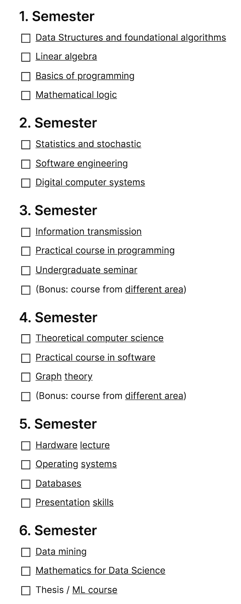

# 用在线课程重建计算机科学学士学位

> 原文：<https://towardsdatascience.com/recreating-a-computer-science-bachelor-degree-with-online-courses-3bb527635ca?source=collection_archive---------5----------------------->

## [办公时间](https://towardsdatascience.com/tagged/office-hours)

## 使用免费提供的信息创建您自己的课程

许多大学公开他们的课程，列出了获得学位的所有必修课程。计算机科学领域也不例外。使用这些可自由访问的资源(作为起点，见[麻省理工学院(英语)](https://www.eecs.mit.edu/docs/ug/freshman_roadmaps.pdf)、 [JMU(德语)](https://www.informatik.uni-wuerzburg.de/fileadmin/10030000/Studium/Studienverlaufsplaene/SVP_BA_Informatik_WS_Fokus_PI_2018.pdf)和[工具包(德语)](https://www.informatik.kit.edu/7731.php))，人们可以创建一个定制的时间表。

这篇文章试图重建一个计算机科学学士学位，但是使用在线资源。其中一些是免费的，其他的会收取少量的费用。总而言之，它们是学习类似于大学所教内容的一种廉价的替代方式。备注:对于所使用的资源，我通常会努力坚持参考课程。这并不总是可能的；参加大学课程显然能让你接触到更广泛的讲座。

自然，第一个课程和学期侧重于基础知识，许多课程在这个阶段是强制性的。在满足这些义务之后，你可以自由地从一系列讲座中进行选择。这就是你可以选择软件工程、逻辑或机器学习的方向，这也是这篇文章的重点。在我们详细介绍这些课程之前，先来看一下课程概述:

课程概述，图片由作者提供。该列表可在此处的概念[和此处](https://www.notion.so/CS-Bachelor-degree-with-online-courses-8d3b926b3f3c4f42922cf24c6058a8a3)的 GitHub [上获得。](https://github.com/phrasenmaeher/cs-degree-with-online-courses)

# 第一学期

第一学期只包括入门课程。你在数学、逻辑、算法和数据结构(通常缩写为 ADS)以及编程方面积累基础知识。

## 弹药分配系统(Ammunition Delivery System)

“算法和数据结构”关注的是算法和数据结构。第一部分，算法，向您介绍排序，其中包括快速排序，合并排序，以及许多其他。此外，您将学习根据这些算法的输入检查它们的运行时间，这是在 Big-O 符号的帮助下完成的。

第二部分，数据结构，介绍了广泛使用的数据结构。

这些结构用于存储数据，以便可以快速找到或更新相关信息。使用的结构包括红黑树、二分搜索法树和图。当然，您还将学习如何遍历这样的结构。Coursera 上的[数据结构和算法专业](https://www.coursera.org/specializations/data-structures-algorithms)就是教你这些话题的课程。

## 线性代数

这个讲座帮助你理解用于计算机科学的数学基础。这主要是关于矩阵计算、导数和函数。涵盖这些主题的课程是由伦敦帝国学院提供的[数学专业。从线性代数开始，继续优化函数，最后，学习如何压缩高维数据。](https://www.coursera.org/specializations/mathematics-machine-learning)

## 编程基础

这个讲座希望你获得编程的实践经验。因为这篇文章是关于机器学习的，所以选择 *python* 作为语言是必然的。我喜欢 python 的简单性——在你完成了[Python for Everybody Specialization](https://www.coursera.org/specializations/python)之后，你就会明白我的意思了。

## 逻辑

逻辑讲座集中于关系代数，从知识中推断事实，否定，以及进一步的数学证明概念。

这些话题听起来可能很无聊，但是学习它们也能在学习之外帮助你。我发现[逻辑入门](https://www.coursera.org/learn/logic-introduction)课程是最适合的——和以前的课程一样，不会总是 100%覆盖。你可以旁听课程，这让你可以免费使用资源，但不能参加分级考试——这是一个公平的交易！

# 第二学期

第一学期到此为止。第二学期继续以基础为主。你从学习统计学和概率论开始，加深你的数学理解。勾选后，你会听到软件工程和计算机基础知识。

## 统计和概率

作为一名数据科学家工作，或者同样意味着与数据打交道。处理数据包括探索。很明显，你不能一次处理 1000 张图片。这不是必需的，我们可以在统计的帮助下这样做。检查平均形状？有可能。列表的含义？有可能。数学在这里派上了用场。[概率统计:要 p 还是不要 p？](https://www.coursera.org/learn/probability-statistics)当然很适合这个。这个标题传达了幽默。

## 软件工程

有了我们的数学技能，我们可以进一步学习更多与计算机相关的东西。软件工程教授软件工程的概念:创建软件，使其适应性强，速度快，干净代码、继承和模式的基础。这个领域正在发生很多事情，课程[软件设计和架构专门化](https://www.coursera.org/specializations/software-design-architecture)教你更多关于 UML、OOP 和设计的知识。

## 计算机基础

本讲座涵盖了(现代)个人电脑的组成部分。我很难找到一个涵盖与我本科学习相同主题的讲座。最后，我选定了可汗学院的[电脑和互联网](https://www.khanacademy.org/computing/code-org/computers-and-the-internet)课程。如果你在找一本书，那么你可以读读《量子猫的 T4 计算》，这本书也讲述了计算机的历史。

# 第三学期

第二学期到此为止，第三学期已经开始了。它涵盖了信号传输、高级编程和一个本科生研讨会。

## 信号传输

这堂课的重点是从 A 到 b 获取数字数据。但如果传输出现泄漏，我们正在丢失信息，该怎么办？还是有背景噪音？嗯，有像过滤器或编码方案这样的技术可以解决这个问题。前往[数字信号处理专业](https://www.coursera.org/specializations/digital-signal-processing)了解更多信息。

## 编程 II

第二次编程讲座将建立在第一次的基础上，但会更深入地介绍 python。 [Python 3 编程专门化](https://www.coursera.org/specializations/python-3-programming)是继 [Python 之后的下一步](https://www.coursera.org/specializations/python)。

## 本科生研讨会

我查阅的参考课程包含了这样的占位性研讨会。只要你是从你的领域，CS & ML 中选择一个主题，你就很好。

参观一所大学，你需要根据一篇或多篇论文讲述一个主题。然后你写一份这个领域的分析，并在简短的讨论中展示你的发现。

这种设置很难用在线课程来复制。有两种解决方法可以克服这一点:你可以找一个志同道合的人，谈论你选择的领域，或者你可以参加另一门课程。最后一个是我的首选解决方案，由于这个复制学位专注于机器学习，因此可以遵循吴恩达在斯坦福大学的 [CS230 深度学习](https://cs230.stanford.edu)课程。这门课程给出了该领域的概述，由该领域最杰出的研究人员之一提出。

## 不同领域的讲座

这不是必须的，你可以把它看作一个额外的收获:听到一个来自不同领域的演讲。我推荐选择[生物](https://www.coursera.org/specializations/biology-everywhere?)来拓宽你的知识面。你也可以选择经济学，物理，化学，任何你好奇的。

# 第四学期

## 理论计算机科学

第四学期从一门艰难的课程开始:理论计算机科学。我记得当时和许多志同道合的人一起听这个讲座。这是一次艰难的演讲，我们非常尊重这个主题。它涵盖了可计算性、语言理论(不一定是人类语言)、决定论、收敛和复杂性理论。

找到一门涵盖大部分内容的在线课程很有挑战性，最终，我选择了[理论计算机科学导论](https://www.udacity.com/course/intro-to-theoretical-computer-science--cs313)

可计算性、复杂性和语言。我建议先学习这门课程，然后再学习这本书。

## 图论

如何找到 A 和 B 之间的最短路线？建模为图，我们可以选择 A 和 b 之间的最短子路线。但图存在于这样的(理论)问题、社会网络(谁跟随谁)、分子理论以及更多频繁使用的领域中。下面两门课会教你更多关于它们的知识:[图论](https://www.udemy.com/course/graph-theory/?utm_source=adwords&utm_medium=udemyads&utm_campaign=DSA_Catchall_la.EN_cc.ROW&utm_content=deal4584&utm_term=_._ag_88010211481_._ad_437497337007_._kw__._de_c_._dm__._pl__._ti_dsa-404285868850_._li_9042787_._pd__._&matchtype=b&gclid=CjwKCAjwhYOFBhBkEiwASF3KGQOf1tQk__W1xtK1CtPEF3sXgJMLGQ7GaNlmYNri2D2njK_L4-u0VBoCbf8QAvD_BwE)和[图论导论](https://www.coursera.org/learn/graphs)。

## 软件实用教程

这门课希望你创造一些东西。它不一定是荒谬复杂的东西。我推荐一个在 web 服务器上运行的简单脚本。在 [streamlit.io](https://streamlit.io/gallery) 查看画廊，并从中获得灵感。与其说是创造一个优秀的产品，不如说是学习一些新的东西。

## 不同领域的讲座

类似上学期，看看自己领域之外的。如果你上次听过生物讲座，现在就听一个关于[化学](https://www.coursera.org/learn/intro-chemistry#instructors)的。或者[物理](https://www.coursera.org/learn/how-things-work?)，[经济](https://www.coursera.org/learn/intro-economic-theories?)，[医学](https://www.coursera.org/specializations/anatomy)，[数学](https://www.coursera.org/learn/mathematical-thinking)。

# 第五学期

## 硬件讲座

在之前的讲座中，我们听到了构建计算机的组件。我们将扩展这一点，并将我们的重点转移到与较低层次的硬件交互上。看一下[嵌入式软硬件架构](https://www.coursera.org/learn/embedded-software-hardware)课程，了解一下底层固件。如果你热衷于发明新的组件，那么一门描述硬件的课程可能是个不错的选择。在这种情况下，查看[FPGA 设计的硬件描述语言](https://www.coursera.org/learn/fpga-hardware-description-languages)课程。

## 操作系统

现在使用电脑很容易。有效地使用你的工具集，那是另一个故事。当我开始用 PyCharm 编程时，我经常查阅文档来查找快捷键。有了它们的记忆，编程就容易多了。精通您的程序不仅仅局限于 ide，它还延伸到使用命令行、使用文本编辑器和权限管理。你不想花一生的时间去搞清楚工具，而是用它们创造东西。这就是[你的计算机科学教育](https://missing.csail.mit.edu)和[操作系统和你:成为超级用户](https://www.coursera.org/learn/os-power-user)课程的目的。

## 数据库

您可以使用数据库作为替代方案，而不是将您的数据存储在命名的文件夹中，看着混乱增长。求图像的平均数？找到所有给 5 颗星的用户？有了查询语言，数据库很容易让人提取有用的信息。因为 SQL 是与数据库交互的事实上的标准语言，所以每种主要的编程语言都有与数据库交互的接口。因为 python 是其中之一，所以它也提供了包来隐藏所有的复杂性。剩下的工作就是建立数据库和准备查询。在 IBM 的[数据库和 SQL for Data Science with Python](https://www.coursera.org/learn/sql-data-science) 课程中，您将学到更多。

## 关于一般资格的课程

在一个充满写作、阅读、演讲和展示的世界里，开设一门专门的课程是一个明智的想法。你将学到的东西不仅适用于你的学习，而且对你生活的其他领域也有帮助。而且，由于大学要求你写很多东西和做很多报告，所以从[报告技能开始比较好:写演讲稿、幻灯片和演讲专业化](https://www.coursera.org/specializations/presentation-skills)和[有效沟通:写作、设计和报告专业化](https://www.coursera.org/specializations/effective-business-communication)。

# 第六学期

你最后一个学期有两门课和你的论文。

## 数据挖掘技术

数据挖掘教你如何从许多领域分析和提取数据。无论是文本还是图像数据，这些技术都是普遍适用的。[数据挖掘专业](https://www.coursera.org/specializations/data-mining)专注于这些概念，从数据可视化、处理文本数据、发现模式开始，到聚类结束。

## 数据科学数学

到目前为止还缺乏具体的 ML 课程。这是由于学士学位主要涵盖基础知识，在最后几个学期只有部分选择自由。通常，学士学位之后是硕士学位，在那里概念被深化。这就是为什么我主要把课程限制在宽泛的教育上，这也是我所学课程的一部分。尽管如此，为了让你做好更多准备，最后一门课程涵盖了数据科学的数学基础。你可能会看到与你早期数学课程的相似之处，这是不可避免的。毕竟，这是一件好事:你可以听到相同的内容，但来自另一位老师。

## 学士论文/ ML 课程

听过广泛的讲座(但至今仍局限于数学和计算机科学领域)，你肯定会发现自己的兴趣所在。早期很难发现它们，但是随着经验的增长，你会了解自己的优势和劣势。记住它们，你就可以设计自己的论文项目，并在一篇简短的博文或视频中展示你的作品。另一个选择是参加吴恩达的[机器学习](https://www.coursera.org/learn/machine-learning?)课程，它将你在之前的课程中学到的东西联系起来。

# 接下来去哪里？

如果你在寻找更详细的资源，你可以看看这个 [GitHub 资源库](http://github.com/OSSU/computer-science)(感谢 [Bradley Grant](https://medium.com/@bagvwf) 分享这个！).