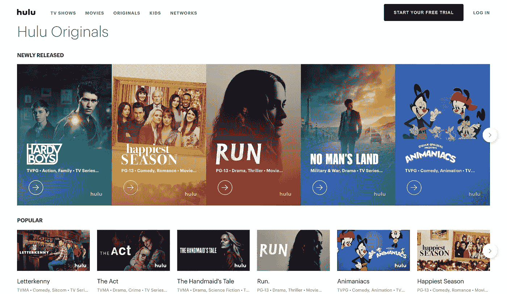
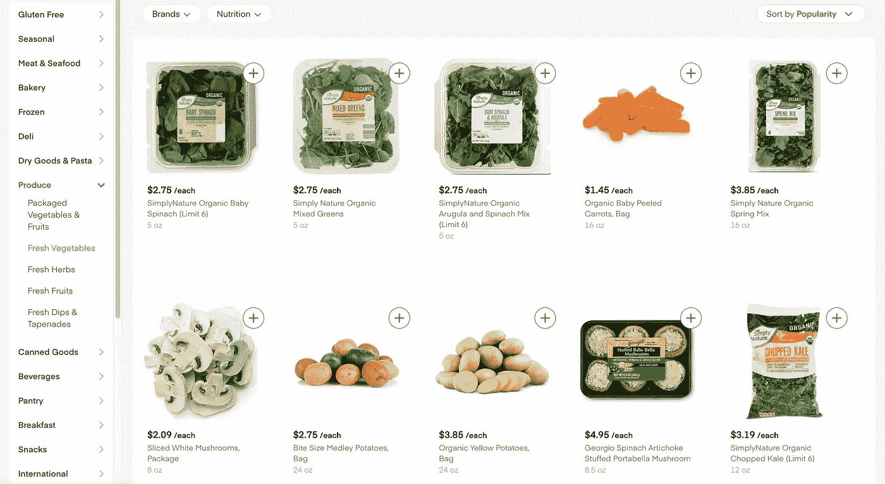
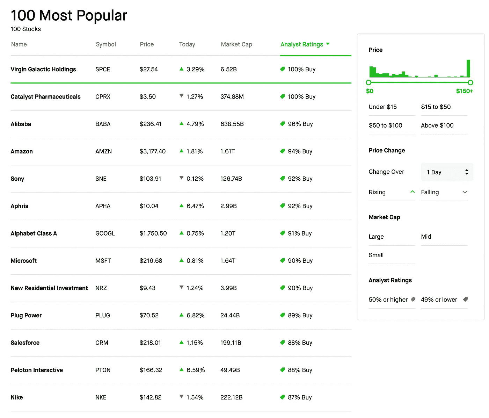

# 推荐系统系列第 8 部分:评估现实推荐系统时要考虑的 14 个特性

> 原文：<https://towardsdatascience.com/recsys-series-part-8-the-14-properties-to-take-into-account-when-evaluating-real-world-recsys-f71cc6e1f195?source=collection_archive---------29----------------------->

## 我们可以用多少种不同的方式来评估 RecSys？

***更新:*** *本文是我探索学术界和工业界推荐系统系列文章的一部分。查看完整系列:* [*第一部分*](/recommendation-system-series-part-1-an-executive-guide-to-building-recommendation-system-608f83e2630a) *，* [*第二部分*](/recommendation-system-series-part-2-the-10-categories-of-deep-recommendation-systems-that-189d60287b58) *，* [*第三部分*](/recommendation-system-series-part-3-the-6-research-directions-of-deep-recommendation-systems-that-3a328d264fb7) ，[*第四部分*](/recsys-series-part-4-the-7-variants-of-matrix-factorization-for-collaborative-filtering-368754e4fab5) ，[*第五部分*](/recsys-series-part-5-neural-matrix-factorization-for-collaborative-filtering-a0aebfe15883) ， [*第六部分*](/recommendation-system-series-part-6-the-6-variants-of-autoencoders-for-collaborative-filtering-bd7b9eae2ec7)

在信息检索中，评价指标用于判断和比较推荐模型在基准数据集上的性能。对其准确性进行良好的定量评估对于构建成功的推荐系统至关重要。

*   对于一个典型的**离线推荐**问题，我们从数据集中随机选取训练和测试样本。然后，我们在训练样本上建立一个预测模型，在测试样本上评估该模型，并使用选定的评估指标来衡量其性能。
*   对于一个**在线推荐**问题，我们想在一个受控的 A/B 测试平台上对表现最好的离线模型进行在线评估。在选择新模型之前，我们评估在线用户行为和其他性能指标的差异，以确定此类差异在统计上是否显著。

无论是离线还是在线情况，在选择推荐方法时通常会考虑各种属性。这些属性各有利弊，因此了解和评估它们对整体性能和用户体验的影响至关重要。在我研究这个话题的过程中，我看到了盖伊·妮莎和阿塞拉·古纳瓦德纳早在 2009 年的一篇综述，讨论了如何根据一组与应用相关的属性来比较推荐。这篇博文是我试图简洁地总结这些特性的尝试。

## 注意

*这篇文章是我正在进行的推荐系统系列文章的一部分:*

*   [*第 1 部分*](/recommendation-system-series-part-1-an-executive-guide-to-building-recommendation-system-608f83e2630a) *提供了推荐系统的高级概述，它们是如何构建的，以及它们如何用于改善各行各业的业务。*
*   [*第 2 部分*](/recommendation-system-series-part-2-the-10-categories-of-deep-recommendation-systems-that-189d60287b58) *很好地回顾了正在进行的关于这些模型的优势和应用场景的研究计划。*
*   [*第三部分*](/recommendation-system-series-part-3-the-6-research-directions-of-deep-recommendation-systems-that-3a328d264fb7) *提供了几个与推荐系统学者社区相关的研究方向。*
*   [*第 4 部分*](/recsys-series-part-4-the-7-variants-of-matrix-factorization-for-collaborative-filtering-368754e4fab5) *提供了可以构造的矩阵分解的 7 种变体的本质数学细节:从使用巧妙的侧面特征到应用贝叶斯方法。*
*   [*第 5 部分*](/recsys-series-part-5-neural-matrix-factorization-for-collaborative-filtering-a0aebfe15883) *提供了基于多层感知器的协同过滤模型的 5 个变体的架构设计，它们是能够以非线性方式解释特征的判别模型。*
*   [*第 6 部分*](/recommendation-system-series-part-6-the-6-variants-of-autoencoders-for-collaborative-filtering-bd7b9eae2ec7) *提供了基于自动编码器的协同过滤模型的 6 个变体的主类，这些模型是在学习潜在特征表示方面优越的生成模型。*
*   [*第 7 部分*](/recsys-series-part-7-the-3-variants-of-boltzmann-machines-for-collaborative-filtering-4c002af258f9) *提供了基于波尔兹曼机器的协同过滤模型的 3 种变体，它们与大脑中的学习有着显著的相似性。*

# 1-用户首选项

一个显而易见的选择是[进行用户研究(受试者内)](https://dl.acm.org/doi/10.1145/1502650.1502663)并要求参与者选择一个系统。这种评估不会将受试者限制在特定的属性上，人类通常更容易做出这样的判断，而不是为体验打分。然后，我们可以选择票数最多的系统。

但是，我们必须意识到一些问题:

*   我们假设所有用户都是平等的，这可能并不正确。**在用户研究中分配正确的重要性权重**可能并不容易。
*   我们还需要找到一种方法来**校准用户之间的分数**，因为用户的偏好水平可能会有很大差异。
*   虽然衡量用户满意度很重要，但是**将满意度分解成更小的部分**有助于理解系统并加以改进。

# 2 —预测准确性

预测准确性是推荐系统文献中讨论最多的属性。绝大多数推荐系统的基础是一个预测引擎。该引擎可以预测用户对项目的意见(例如，电影的评级)或使用的概率(例如，购买)。推荐系统的一个基本假设是，用户会更喜欢提供更准确预测的系统。因此，许多研究人员开始寻找能够提供更好预测的算法。

有三大类预测准确性测量:

## 2.1 —测量评级预测准确度

*来源:【https://www.hulu.com/hub/originals】<https://www.hulu.com/hub/originals>*

*在像网飞或 Hulu 这样的应用程序中，我们希望预测用户对某个项目的评分。在这种情况下，我们希望测量系统预测评级的准确性。用于评估预测收视率准确性的流行指标是[均方根误差](https://en.wikipedia.org/wiki/Root-mean-square_deviation)和[平均绝对误差](https://en.wikipedia.org/wiki/Mean_absolute_error)。与 MAE 相比，RMSE 对重大失误的处罚力度更大。*

*   ***标准化的 RMSE** 和**标准化的 MAE** 是已经通过评级范围标准化的 RMSE 和 MAE 的版本。*
*   ***平均 RMSE** 和**平均平均平均误差**针对不平衡的测试集进行调整。如果我们需要一个度量来表示任何项目的预测误差，那么最好是分别计算每个项目的 MAE 或 RMSE，然后取所有项目的平均值。*

## *2.2 —测量使用预测*

*在许多应用中，推荐系统并不预测用户对项目的偏好，例如评分，而是试图向用户推荐他们可能使用的项目**。例如，当视频被添加到队列中时，YouTube 会建议一组可能也很有趣的视频，因为添加了视频。在这种情况下，我们感兴趣的是系统是否正确地预测用户将这些视频添加到队列中(使用项目)。***

*在使用预测的离线评估中，我们通常有一个由每个用户使用过的项目组成的数据集。然后，我们选择一个测试用户，隐藏她的一些选择，并要求推荐者预测用户将使用的一组项目。对于推荐和隐藏的项目，我们有四种可能的结果:真阳性、假阳性、假阴性和真阴性。使用这些结果，我们可以计算[精度和召回](https://en.wikipedia.org/wiki/Precision_and_recall)数量。*

*通常，我们可以预期这些数量之间的权衡——虽然允许更长的推荐列表通常会提高召回率，但也可能会降低精确度。在向用户呈现的推荐数量是预先确定的应用中，最有用的兴趣度量是 K 处的[精度。](https://en.wikipedia.org/wiki/Evaluation_measures_(information_retrieval)#Precision_at_K)*

*在呈现给用户的推荐数量不是预先确定的其他应用中，最好在推荐列表长度的范围内评估算法，而不是使用固定长度。因此，我们可以计算[精确召回曲线或 ROC 曲线](https://www.biostat.wisc.edu/~page/rocpr.pdf)。虽然两条曲线都测量了实际推荐的偏好项目的比例，但是**精确回忆曲线**强调了推荐项目被偏好的比例。相比之下， **ROC 曲线**强调最终被推荐的非首选项目的比例。*

## *2.3 —排名措施*

*在像 Google 或 Bing 这样的搜索应用中，我们对预测明确的偏好不感兴趣，而是根据用户的偏好对结果/项目进行排序。这个**排名任务**可以用两种方式衡量:参考排名或者效用排名。*

*   *在**参考排名中，**我们按照评级和/或使用的降序对项目进行排名。[标准化的基于距离的性能测量](https://core.ac.uk/download/pdf/189742948.pdf)给正确预测由参考断言的每个偏好关系的系统满分，给与每个参考偏好关系相矛盾的系统最差分。*
*   *在**效用排名**中，我们按照效用递减的顺序对项目进行排名，并根据项目在推荐列表中的位置进行因子折扣。流行的指标包括 [R-Score](https://arxiv.org/pdf/1301.7363) 、[归一化累积折现收益](https://en.wikipedia.org/wiki/Discounted_cumulative_gain#Normalized_DCG)和[平均交互点击排名](https://en.wikipedia.org/wiki/Mean_reciprocal_rank)。*

# *3 —效用*

**

*来源:[https://www.wayfair.com](https://www.wayfair.com)*

*效用是系统或用户从推荐中获得的值。例如，像 [Wayfair](https://www.wayfair.com/) 或[亚马逊](https://www.amazon.com/)这样的电子商务网站利用推荐通过顾客购买来提高他们的收入。然而，用户效用或偏好很难捕捉和建模，[相当多的研究](https://arxiv.org/abs/1207.1361)已经[将](https://www.jmlr.org/papers/volume4/haddawy03a/haddawy03a.pdf)集中于[这个问题](https://hal.archives-ouvertes.fr/hal-01311758)。此外，不清楚如何汇总用户的用户效用来计算推荐者的分数。*

*在用户评价项目的应用程序中，我们可以使用[评价作为效用度量](https://arxiv.org/pdf/1301.7363)。*

*   *例如，在网飞，我们可以假设推荐一部 5 星电影比推荐一部 4 星电影对用户有更高的效用。由于用户可能会对评级做出不同的解释，因此在对用户进行汇总之前，应该对用户评级进行标准化。*
*   *虽然我们通常只给成功的推荐分配正效用，但我们也可以给不成功的推荐分配负效用。例如，如果用户不喜欢特定的推荐电影，那么网飞可以为该项目分配负效用(关于该用户)。*

*对于任何效用函数，标准评估是计算建议的预期效用。*

*   *在我们只预测单个项目的场景中，正确建议的价值是该项目的效用。*
*   *在我们预测 n 个项目的场景中，我们可以对列表中正确推荐的效用求和。*
*   *在我们为不正确的建议合并负效用的场景中，总和是所有建议(正确或不正确)的总和。*

# *4 —覆盖率*

## *4.1 —项目空间覆盖范围*

*覆盖率这个词指的是推荐系统可以推荐的项目的比例。对于这个定义，最简单的衡量标准是可以被推荐的所有项目的百分比。另一个衡量标准是[销售多样性](http://www.site.uottawa.ca/~nelkadri/CSI5389/Papers/143-Recommender%20Systems%20and%20their%20Impact.pdf)，它衡量当使用特定的推荐系统时，用户选择的不同商品有多不平等(如[基尼指数](https://en.wikipedia.org/wiki/Gini_coefficient)和[香农熵](https://en.wiktionary.org/wiki/Shannon_entropy))。*

## *4.2 —用户空间覆盖*

*覆盖范围也可以是系统可以推荐项目的用户或用户交互的比例。在许多应用中，由于对某些用户的预测可信度低，系统可能不会为该用户提供推荐。在这种情况下，我们可能更喜欢能够为更广泛的用户提供推荐的系统。因此，覆盖率可以通过进行推荐所需的用户简档的丰富程度来衡量，例如用户在接收推荐之前必须评级的项目的数量。*

## *4.3 —冷启动*

*众所周知的冷启动问题衡量了一组特定项目和用户的系统覆盖率。确定“冷”项目的一般方法是使用它在系统中存在的时间量或收集的数据量。然后，我们可以对正确预测较冷项目的系统给予更多信任，而对预测的热项目给予更少信任。一条经验法则是，在计算冷物品的系统精度时，明智的做法是评估是否需要权衡整个系统的精度。*

# *5 —自信*

**

*来源:[https://www.instacart.com](https://www.instacart.com)*

*对推荐的信任度可以定义为 [**系统对其推荐或预测的信任度**](https://dl.acm.org/doi/10.1145/358916.358995) 。它随着数据量的增长而增长。例如，如果 [Instacart](https://www.instacart.com/) 推荐可信度非常高的西兰花和具有相同评级但可信度较低的豆芽，购物者可以立即将西兰花添加到购物车中，但在决定购买之前可能会进一步阅读豆芽商品的描述，或许还有其成分。*

*也许最常见的置信度度量是预测值为真的概率或预测值周围的区间。预定义的部分(95%的真实值位于其中)。最普遍的置信方法是[提供可能结果的完整分布](http://citeseerx.ist.psu.edu/viewdoc/download?doi=10.1.1.63.7486&rep=rep1&type=pdf)。*

*给定两个推荐器，它们在其他相关属性(例如预测精度)上表现相似，可能希望选择能够提供有效置信度估计的一个。在这种情况下，给定两个具有相同准确度的推荐器，它们以相同的方式报告置信界限，我们将更喜欢更好地估计其置信界限的推荐器。*

*置信度界限的另一个应用是过滤推荐项目，其中预测值的置信度**低于某个阈值**。在这种情况下，我们假设推荐者不能预测所有值的分数，这是呈现前 n 个推荐时的典型情况。因此，我们可以围绕这个过滤过程设计一个实验，在通过去除低置信度项目来过滤两个推荐器的结果之后，通过比较这两个推荐器的准确度。我们可以在这样的实验中计算曲线，估计过滤项目的每个部分或不同过滤阈值的预测精度。该评估过程不要求两种算法在置信度方法上一致。*

# *6 —信任*

*虽然信心是系统对其评级的信任，但这里我们指的是**用户对系统推荐**的信任。例如，系统推荐用户已经知道并喜欢的几个项目可能是有益的。这样，即使用户从该推荐中没有获得任何价值，她也观察到系统提供了合理的推荐，这可以增加她对未知项目的系统推荐的信任。增强对系统信任的另一种常见方式是解释系统的建议。*

*评估用户信任的明显方法是[询问用户](https://dl.acm.org/doi/10.1145/1111449.1111475)在用户研究中系统推荐是否[合理](https://link.springer.com/article/10.1007/s11257-008-9051-3)。在一个在线测试中，假设对推荐者更高的信任会导致更多的推荐被使用，人们可以将被关注的推荐数量与对推荐者的信任度联系起来。*

*或者，我们也可以假设对系统的信任与重复用户相关，因为信任系统的用户在执行未来任务时会返回。然而，这种测量可能不能很好地分离其他用户满意度因素，并且可能不准确。*

# *7 —意外之喜*

**

*来源:https://www.scribd.com/*

*意外收获是**衡量成功推荐有多令人惊讶的指标**。我们可以把意外收获理解为推荐中对用户来说是新的相关信息的数量。例如，通过跟随 [Scribd](https://www.scribd.com/) 上的成功书籍推荐，读者了解到她喜欢的一位新作者，这可以被认为是偶然发现的。*

*为了避免人为标记，我们可以设计一个基于内容的项目之间的距离度量。然后，我们可以根据它与协同过滤系统中的一组先前评级的项目或基于内容的推荐系统中的用户简档的距离来对成功的推荐进行评分。因此，我们奖励系统远离用户档案的成功推荐。*

*我们也可以认为意外之喜是与“自然”预测的[偏差。给定一个高精度的预测引擎，它的推荐是“显而易见的”因此，对于预测引擎认为不太可能成功的推荐，我们会给予更高的意外收获分数。](https://link.springer.com/chapter/10.1007/978-3-540-78197-4_5)*

*在用户研究中，我们可以通过让用户标记他们认为出乎意料的推荐来评估推荐者的意外收获。我们还可以看到用户是否遵循了这些建议，这将使他们出乎意料地成功，因此也是偶然的。在一个在线实验中，我们可以假设我们的距离度量是正确的，并且只评估距离用户简档的距离如何影响用户遵循推荐的概率。*

# *8 —新颖性*

*小说推荐是用户对 不了解的 [**项。一个显而易见且易于实现的方法是过滤掉用户已经评级或使用过的项目。然而，在许多情况下，用户不会报告他们过去使用过的所有项目。这种方法不足以过滤掉用户已经知道的所有项目。**](https://www.aaai.org/Papers/AAAI/2006/AAAI06-267.pdf)*

*虽然我们显然可以通过[询问用户是否已经熟悉某个推荐项目](http://mtg.upf.es/system/files/publications/Celma-ACMRecSys2008_0.pdf)来衡量用户研究中的新颖性，但我们也可以通过离线实验来了解系统的新颖性。对于这样的实验，我们可以按时间分割数据集，即隐藏在特定时间点之后发生的所有用户评级。我们还可以隐藏在此之前发生的一些评分，模拟用户熟悉但没有报告评分的项目。当推荐时，对于在分割时间之后推荐和评级的每个项目，系统被奖励，但是对于在分割时间之前推荐但评级的每个项目，系统将被惩罚。*

*另一种评价新颖性的方法是假设受欢迎的物品不太可能是新颖的。因此,[可以使用精确度指标](https://dl.acm.org/doi/10.1145/1454008.1454015)来考虑新颖性。当系统正确地预测了不流行的项目时，它不会因为正确地预测了流行的项目而得到相同的分数。*

*最后，我们可以评估推荐中新信息的数量，以及推荐项目的相关性。例如，当项目评级可用时，我们可以将隐藏评级乘以推荐项目的一些信息度量来产生新颖性分数。*

# *9 —多样性*

**

*来源:https://www.tripadvisor.com/*

*多样性通常被定义为相似性的反义词。在某些情况下，建议一组相似的项目对用户来说可能不是很有用，因为可能需要更长时间来探索项目的范围。例如，考虑[猫途鹰](https://www.tripadvisor.com/)，在那里系统应该推荐旅行选项。为同一地点提供 10 个推荐的列表(仅在酒店和地点上有所不同)可能不如建议 10 个不同的地点有用。用户可以浏览各种位置并请求与其兴趣相关的更多细节。*

*测量多样性最常用的方法是使用项目间的相似性，通常基于项目内容。然后，我们可以基于项目对之间的和、平均、最小或最大距离来测量列表的多样性，或者测量将每个项目添加到推荐列表的值，作为列表中已有项目的新项目多样性的[。由于多样性可能以牺牲其他属性为代价(如](https://citeseerx.ist.psu.edu/viewdoc/download?doi=10.1.1.8.5232&rep=rep1&type=pdf)[精确度](https://dl.acm.org/doi/10.1145/1454008.1454030))，我们可以计算曲线来评估精确度的下降与多样性的增加。*

*在帮助信息搜索的推荐器中，我们可以假设[更多样化的推荐将导致更短的搜索迭代](https://link.springer.com/chapter/10.1007/3-540-44593-5_25)。我们可以在测量相互作用序列长度的在线实验中使用这个作为多样化的代理。为了验证这种说法，在比较不同的推荐器之前，使用相同的预测引擎试验不同的多样性阈值是有用的。*

# *10 —鲁棒性*

*稳健性是**在存在虚假信息**的情况下推荐的稳定性，虚假信息通常是为了影响推荐而故意插入的。例如，[一个 Airbnb 主机](https://www.airbnb.com/hosting)可能会通过注入虚假的客人资料来提高其房源的评级，这些客人资料对房源的评级是正面的。*

*这种影响推荐的尝试通常被称为[攻击](http://citeseerx.ist.psu.edu/viewdoc/download?doi=10.1.1.329.4891&rep=rep1&type=pdf)。当恶意用户故意查询数据集或注入虚假信息以从一些用户那里了解一些私人信息时，就会发生协同攻击。总的来说，创造一个针对任何攻击的免疫系统是不现实的。估计影响推荐的成本更有用，这通常通过注入的信息量来衡量。实现这一点的一种方法是[通过引入虚假信息来模拟攻击](https://citeseerx.ist.psu.edu/viewdoc/download?doi=10.1.1.60.1540&rep=rep1&type=pdf)，并根据经验测量成功攻击的平均成本。*

*另一种类型的健壮性是系统在极端条件下的稳定性，比如大量的请求。在许多情况下，系统健壮性与基础设施有关，比如数据库软件、硬件规格和可伸缩性。*

# *11 —风险*

**

*来源:https://robinhood.com/collections/100-most-popular*

*在许多情况下，建议可能与潜在风险相关联。例如，在像 [Robinhood](https://robinhood.com/) 这样推荐股票的应用程序中，规避风险的用户可能更喜欢预期增长较低、崩盘风险较低的股票。另一方面，寻求风险的用户可能更喜欢具有潜在高利润的股票。我们希望评估从建议中产生的预期价值，并最小化风险。*

*评估风险敏感系统的标准方法是通过考虑预期效用和 [**效用方差**](https://experts.umn.edu/en/publications/making-recommendations-better-an-analytic-model-for-human-recomme) 。例如，我们可以使用一个参数 q，在 E[X] + q * Var(X)上比较两个系统。当 q 为正时，这种方法偏好寻求风险的推荐者。当 q 为负时，系统偏好风险厌恶型推荐者。*

# *12 —隐私*

*在大多数协同过滤系统中，用户愿意公开自己对项目的偏好以获得有用的推荐。然而，对大多数用户来说，他们的偏好保持私密是很重要的。否则，私人信息泄露会导致类似于[目标](https://www.nytimes.com/2012/02/19/magazine/shopping-habits.html)中的啤酒-怀孕相关性的情况。*

*一般认为推荐系统**披露私人信息是不合适的，即使是对单个用户**。因此，对隐私的分析往往集中在最坏的情况，举例说明用户的私人信息可能被泄露的理论情况。另一种选择是定义不同的隐私级别，如 [k-identity](https://www.cs.cornell.edu/~danco/research/papers/privacy-sigir2006.pdf) ，并比较不同隐私级别下算法对隐私泄露的敏感度。*

# *13 —适应性*

**

*来源:[https://www.nytimes.com/trending/](https://www.nytimes.com/trending/)*

*真正的推荐系统可以在这样的环境中运行:项目集合快速变化**或者对项目的兴趣趋势变化**。明显的例子包括新闻推荐([《纽约时报》](https://open.blogs.nytimes.com/2015/08/11/building-the-next-new-york-times-recommendation-engine/))或标签推荐([《推特趋势》](https://help.twitter.com/en/using-twitter/twitter-trending-faqs))。当意外事件发生时，人们会对原本可能不感兴趣的文章/推文感兴趣。这个问题不同于冷启动问题是因为过去不感兴趣的老项目突然变得有趣了。*****

*****这种类型的适应可以通过在推荐项目之前分析所需的信息量来离线评估。如果我们对推荐过程进行顺序建模，我们可以在算法推荐一个故事之前记录所需的证据数量，即使是在离线测试中。*****

*****另一种类型的适应性是系统如何使[适应用户的个人偏好](http://citeseerx.ist.psu.edu/viewdoc/download?doi=10.1.1.100.7915&rep=rep1&type=pdf)或用户简档中的[变化。我们可以在向用户简档添加更多信息后，在离线实验中评估推荐列表的变化。然后，我们可以通过测量添加新信息前后推荐列表之间的差异来评估该算法。](http://citeseerx.ist.psu.edu/viewdoc/download?doi=10.1.1.2.1455&rep=rep1&type=pdf)*****

# *****14 —可扩展性*****

*****现实世界的推荐系统必须**扩大到数百万个项目**(谷歌新闻[或 YouTube](https://www2007.org/papers/paper570.pdf) )，即使是以准确性或覆盖范围等其他属性为代价。评估可伸缩性的标准计算机科学方法是根据时间或空间需求来衡量算法的计算复杂性。另一个更实际的方法是测量大型数据集的资源消耗。*****

*****可伸缩性通常是通过对不断增长的数据集进行实验来衡量的，展示了[随着任务规模的扩大，速度和资源消耗如何表现](http://citeseerx.ist.psu.edu/viewdoc/download?doi=10.1.1.113.6458&rep=rep1&type=pdf)。衡量可伸缩性所要求的折衷是很重要的。例如，测量数据子集的准确性性能对于特定的未来任务非常有用。*****

*****因为推荐系统被期望在线提供快速推荐，所以测量系统提供推荐的速度也是重要的。其中一个度量是系统的**吞吐量**(系统每秒可以提供的推荐数量)。我们还可以测量**延迟**(在线推荐所需的时间)。*****

# *****结论*****

*****推荐系统无疑是机器学习在实践中的主要成功案例之一。尽管他们取得了成功，但未来的研究仍有许多机会，特别是在评估他们的方法上。最佳解决方案是进行大规模的产学合作，弥合学术指标和商业价值之间的差距。另一个解决方案是更加强调以用户为中心和以影响为导向的评估指标。最后，希望改进当前的离线和在线实验方法，以处理多代理环境的复杂性并利用分布式计算。*****

*****请继续关注本系列的下一篇博文，它将探索市场中的推荐系统！*****

## *****参考*****

> *****妮莎和古纳瓦德纳(2011 年)。评估推荐系统。在*推荐系统手册*(第 257–297 页)中。马萨诸塞州波士顿斯普林格。*****

*****如果你想关注我在推荐系统、ML 研究和数据新闻方面的工作，你可以查看我的 [*中的*](https://le-james94.medium.com/) *和*[*GitHub*](https://github.com/khanhnamle1994)*，以及在*[*https://jameskle.com/*](https://jameskle.com/)*的其他项目。你也可以在* [*推特*](https://twitter.com/le_james94) *，* [*直接发邮件给我*](mailto:khanhle.1013@gmail.com) *，或者* [*在 LinkedIn*](http://www.linkedin.com/in/khanhnamle94) *上找我。* [*注册我的简讯*](http://eepurl.com/deWjzb) *就在你的收件箱里接收我关于机器学习在研究和生产中的最新想法吧！******