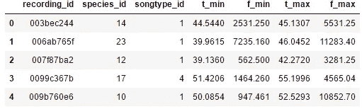
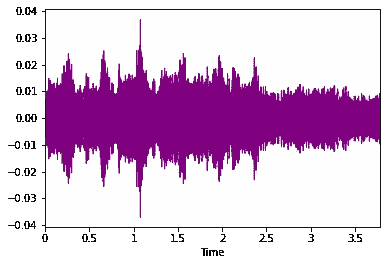
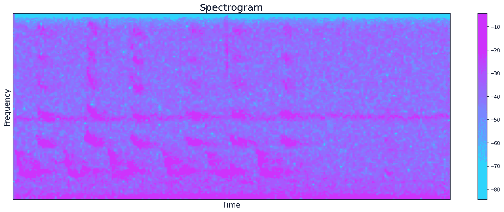
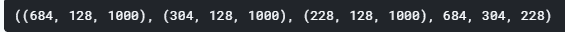
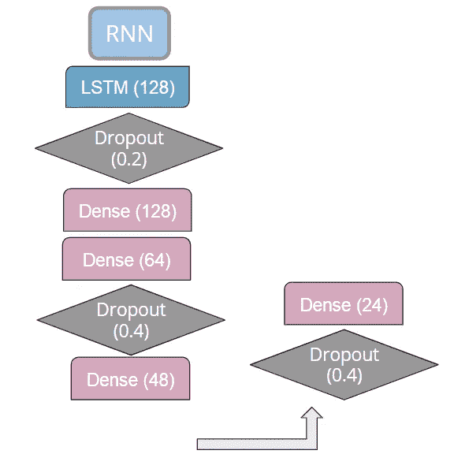
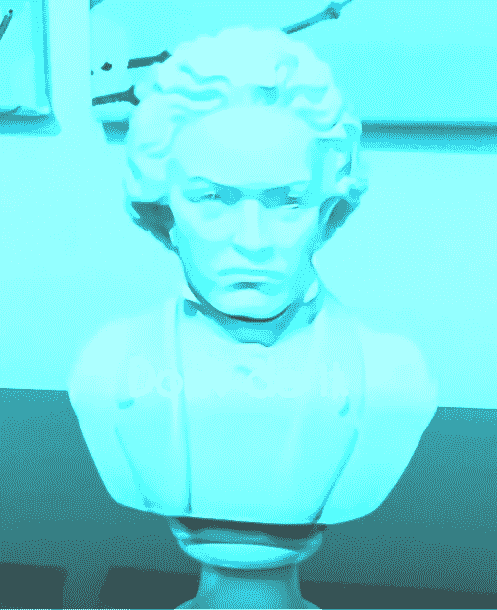
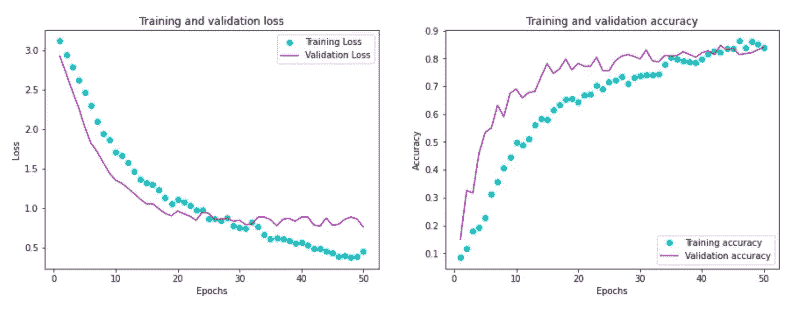
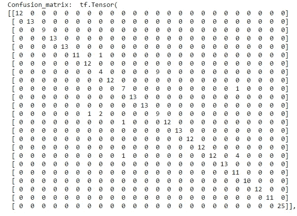

# 用于音频分类的递归神经网络

> 原文：<https://towardsdatascience.com/recurrent-neural-nets-for-audio-classification-81cb62327990?source=collection_archive---------4----------------------->

## 使用张量流进行音频分类的深度学习入门


作者图片

# 递归神经网络

RNNs 或递归神经网络是一种可以记住序列的深度学习算法。

*什么样的序列？*

*   手写/语音识别
*   时间序列
*   用于自然语言处理的文本
*   事情是这样的，依靠一个*先前的*物品

# 是指音频吗？

**是的。**除非音频是随机的垃圾流(不是波段)，否则音频信息往往遵循一种模式。

请看贝多芬月光奏鸣曲的前两小节:


作者图片

相当重复！*你怎么看他失聪后还坚持作曲？*模式识别和记忆。

也是天才。

# 本文解释了如何训练 RNN 根据音频信息对物种进行分类。

本例的数据是 Kaggle 竞赛[雨林连接物种音频检测](https://www.kaggle.com/c/rfcx-species-audio-detection/data)中的鸟类和青蛙录音。他们很可爱。


作者图片

要开始，加载必要的导入:

```
import pandas as pd
import os
import librosa
import librosa.display
import matplotlib.pyplot as plt
from sklearn.model_selection import train_test_split
from sklearn.preprocessing import normalize
import warnings
warnings.filterwarnings('ignore')
from sklearn.model_selection import train_test_split
import tensorflow
from tensorflow.keras.layers import LSTM, Dense
```

然后是数据帧:

```
os.chdir('/kaggle/input/rfcx-species-audio-detection')
df = pd.read_csv('train_tp.csv')
```

该数据集是一个 csv 文件，音频文件的名称列在 recording_id 下，标签列在 species_id 下，音频样本的开始/结束列在 t_min 和 t_max 下:

```
df.head()
```



使用 [librosa](https://librosa.org/doc/latest/index.html) 包加载并显示一个音频文件，如下所示:

```
sample_num=3 #pick a file to display
filename=df.recording_id[sample_num]+str('.flac') #get the filename
#define the beginning time of the signal
tstart = df.t_min[sample_num] 
tend = df.t_max[sample_num] #define the end time of the signal
y,sr=librosa.load('train/'+str(filename))
librosa.display.waveplot(y,sr=sr, x_axis='time', color='purple',offset=0.0)
```



## 建模的特征

[Librosa](https://conference.scipy.org/proceedings/scipy2015/pdfs/brian_mcfee.pdf) 有关于如何提取特征的很棒的教程[在这里](https://librosa.org/doc/latest/tutorial.html)。对于 RNNs，我发现最好的特征是 Mel 频率倒谱系数([MFCC](https://en.wikipedia.org/wiki/Mel-frequency_cepstrum))，一种声音的频谱特征。你可以这样计算:

```
hop_length = 512 #the default spacing between frames
n_fft = 255 #number of samples 
#cut the sample to the relevant times
y_cut=y[int(round(tstart*sr)):int(round(tend*sr))]
MFCCs = librosa.feature.mfcc(y_cut, n_fft=n_fft,hop_length=hop_length,n_mfcc=128)
fig, ax = plt.subplots(figsize=(20,7))
librosa.display.specshow(MFCCs,sr=sr, cmap='cool',hop_length=hop_length)
ax.set_xlabel('Time', fontsize=15)
ax.set_title('MFCC', size=20)
plt.colorbar()
plt.show()
```



## 提取所有文件的特征和标签并存储在 numpy 数组中:

```
def get_features(df_in):
    features=[] #list to save features
    labels=[] #list to save labels
    for index in range(0,len(df_in)):
      #get the filename        
      filename = df_in.iloc[index]['recording_id']+str('.flac') 
      #cut to start of signal     
      tstart = df_in.iloc[index]['t_min'] 
      #cut to end of signal
      tend = df_in.iloc[index]['t_max'] 
      #save labels
      species_id = df_in.iloc[index]['species_id'] 
      #load the file        
      y, sr = librosa.load('train/'+filename,sr=28000)
      #cut the file from tstart to tend 
      y_cut = y[round(tstart*sr,ndigits=None)
         :round(tend*sr, ndigits= None)]
      data = np.array([padding(librosa.feature.mfcc(y_cut, 
         n_fft=n_fft,hop_length=hop_length,n_mfcc=128),1,400)])
      features.append(data)
      labels.append(species_id)
    output=np.concatenate(features,axis=0)
    return(np.array(output), labels)
X,y=get_features(df)
```

## 将数据规范化并转换为 numpy 数组

```
X = np.array((X-np.min(X))/(np.max(X)-np.min(X)))
X = X/np.std(X)
y = np.array(y)
```

## 提取培训、测试和验证数据集

```
#Split twice to get the validation set
X_train, X_test, y_train, y_test = train_test_split(X, y, test_size=0.25, random_state=123, stratify=y)
X_train, X_val, y_train, y_val = train_test_split(X_train, y_train, test_size=0.25, random_state=123)
#Print the shapes
X_train.shape, X_test.shape, X_val.shape, len(y_train), len(y_test), len(y_val)
```



# 创建一个 RNN

在这个示例模型中，**长短期记忆** (LSTM)单元是进行记忆的部分，**丢失**随机将一部分数据的权重设置为零以防止过度拟合，**密集**单元包含与模型必须尝试拟合数据的自由度相关的隐藏层。数据越复杂，模型需要的自由度就越多*，同时要注意避免过度拟合(稍后会有更多的*)。最后的**密集**层输出 24 个种类，模型应该将音频记录分类到这些种类中。

## RNN 模型架构示例



作者图片

## 在 tensorflow 中，您可以像这样创建上面的 RNN 模型:

```
input_shape=(128,1000)
model = keras.Sequential()
model.add(LSTM(128,input_shape=input_shape))
model.add(Dropout(0.2))
model.add(Dense(128, activation='relu'))
model.add(Dense(64, activation='relu'))
model.add(Dropout(0.4))
model.add(Dense(48, activation='relu'))
model.add(Dropout(0.4))
model.add(Dense(24, activation='softmax'))
model.summary()
```

**激活**功能增加了模型的非线性。这里使用了 **relu** 函数，它将负权重清零。最后一个**密集**层的激活函数是 **softmax** ，它为每个类输出一个概率。Tensorflow 还有其他激活功能，你可以在这里阅读[。](https://www.tensorflow.org/api_docs/python/tf/keras/activations)

**输入形状**可能会令人困惑，因为尽管它看起来是 **2D** ，但实际上是 **3D** 。由于创建时选择的参数，这些 MFCCs 的形状恰好是高 128，长 1000，并且它们的数量与音频文件的数量一样多。如果我们只提取 dataframe.head()图中所示的 5 个音频文件的特征，则输入的形状将是 5×128×1000。该参数称为**批量大小**，它不包含在输入形状中。

## 编译模型

```
model.compile(optimizer='adam',loss='SparseCategoricalCrossentropy',metrics=['acc'])
```

[**Adam**](https://arxiv.org/abs/1412.6980) 优化器管理随机梯度下降的学习速率，是一个很好的开始。**损失**函数是**稀疏分类交叉熵**，当每个样本属于一个标签时使用[，而不是一个以上，**和**不是二元分类。这就是这个分类问题的情况，其中每个音频样本属于一个物种。](https://datascience.stackexchange.com/questions/41921/sparse-categorical-crossentropy-vs-categorical-crossentropy-keras-accuracy#:~:text=Use%20sparse%20categorical%20crossentropy%20when,0.5%2C%200.3%2C%200.2%5D).)

## 符合模型

```
history = model.fit(X_train, y_train, epochs=50, batch_size=72, 
                    validation_data=(X_val, y_val), shuffle=False)
```

## 关于过度拟合的一些词语



作者图片

**但是**你必须暂时过度拟合*才能知道过度拟合和欠拟合的界限在哪里(F. Chollet，2018)。*

## *从最简单的模型开始，一步一步来*

*试试这个:*

```
*input_shape=(128,1000)
model = tensorflow.keras.Sequential()
model.add(LSTM(**NUM**,input_shape=input_shape))
model.add(Dense(24, activation='softmax'))
model.summary()*
```

*其中 **NUM** 是比你的输出图层大一些的数字，添加图层直到你的模型开始溢出数据。*

*你如何知道这种情况何时发生？*

## *评估您的模型训练和验证集*

1.  *如果训练集和测试集之间的性能不同(例如，训练准确率为 99%，测试准确率为 89%)，则表明数据过拟合。*
2.  *当选择的验证度量(在这种情况下是准确性)开始降低时，停止迭代。在下图中，这大约发生了 50 个时期。*

```
*#Adapted from Deep Learning with Python by Francois Chollet, 2018
history_dict=history.history
loss_values=history_dict['loss']
acc_values=history_dict['acc']
val_loss_values = history_dict['val_loss']
val_acc_values=history_dict['val_acc']
epochs=range(1,51)
fig,(ax1,ax2)=plt.subplots(1,2,figsize=(15,5))
ax1.plot(epochs,loss_values,'co',label='Training Loss')
ax1.plot(epochs,val_loss_values,'m', label='Validation Loss')
ax1.set_title('Training and validation loss')
ax1.set_xlabel('Epochs')
ax1.set_ylabel('Loss')
ax1.legend()
ax2.plot(epochs,acc_values,'co', label='Training accuracy')
ax2.plot(epochs,val_acc_values,'m',label='Validation accuracy')
ax2.set_title('Training and validation accuracy')
ax2.set_xlabel('Epochs')
ax2.set_ylabel('Accuracy')
ax2.legend()
plt.show()*
```

**

## *使用混淆矩阵检查模型的预测效果:*

*如果所有条目都在矩阵的对角线上排成一行，则该模型在测试集上做出了完美的预测。其他的都被错误分类了。*

```
*TrainLoss, Trainacc = model.evaluate(X_train,y_train)
TestLoss, Testacc = model.evaluate(X_test, y_test)
y_pred=model.predict(X_test)
print('Confusion_matrix: ',tf.math.confusion_matrix(y_test, np.argmax(y_pred,axis=1)))*
```

**

## *现在你知道了*

*现在，您已经知道如何使用音频数据创建 RNN，方法是从一个简单的模型开始，然后添加图层，直到它能够尽最大能力预测数据。修改架构，直到您的模型开始过度拟合数据，以了解这个边界在哪里，然后返回并删除层。查找训练数据和测试数据之间的性能差异，并添加剔除层以防止过度拟合训练数据。寻找验证数据中的性能下降，以了解何时停止迭代。*

## *快乐造型！*

## *来源*

***萨卡尔、迪潘坚** (2021)个人通信。*

***Chollet，F.** 用 Python 进行深度学习(2018)，v. 361，纽约:曼宁。*

***Gervias，Nicolas，** (2021) 代码摘自[https://stack overflow . com/questions/59241216/padding-numpy-arrays-to-a-specific-size](https://stackoverflow.com/questions/59241216/padding-numpy-arrays-to-a-specific-size)，2021 年 1 月 10 日检索。*

***frenzykryger**(2021)[https://data science . stack exchange . com/questions/41921/sparse-category-cross entropy-vs-category-cross entropy-keras-accuracy #:~:text = Use % 20 sparse % 20 category % 20 cross entropy % 20 when，0.5%2C%200.3%2C%200.2%5D](https://datascience.stackexchange.com/questions/41921/sparse-categorical-crossentropy-vs-categorical-crossentropy-keras-accuracy#:~:text=Use%20sparse%20categorical%20crossentropy%20when,0.5%2C%200.3%2C%200.2%5D) ，2021 年 2 月 21 日检索。*