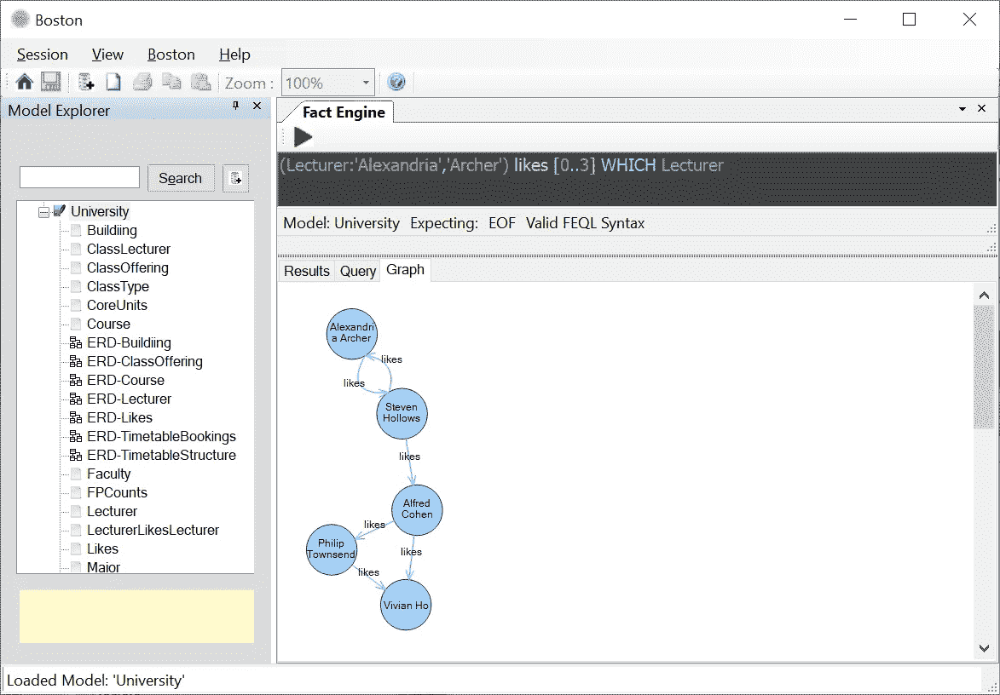
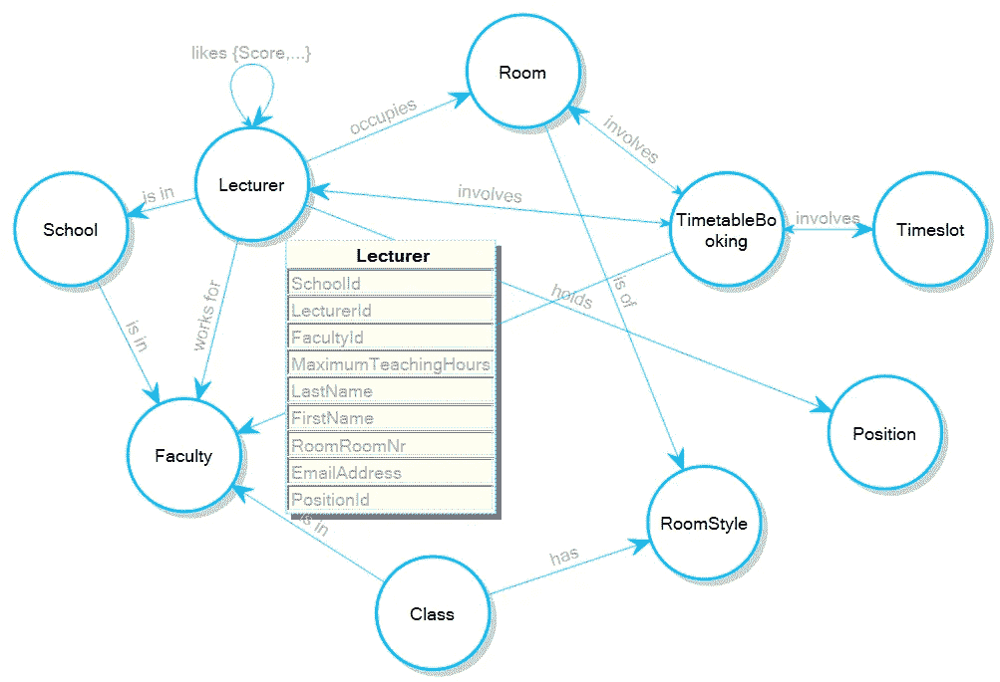
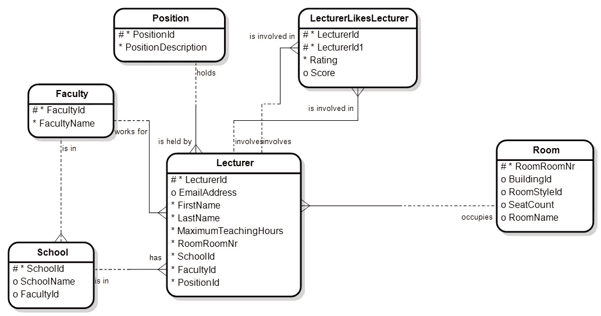
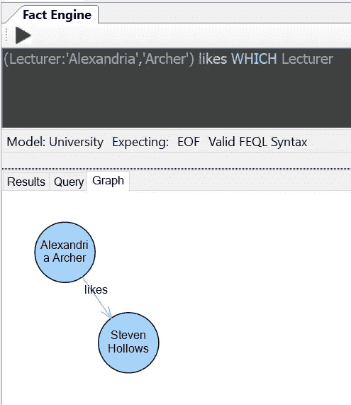
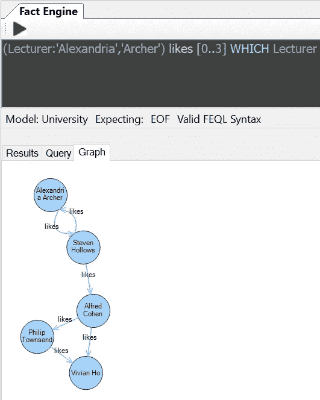
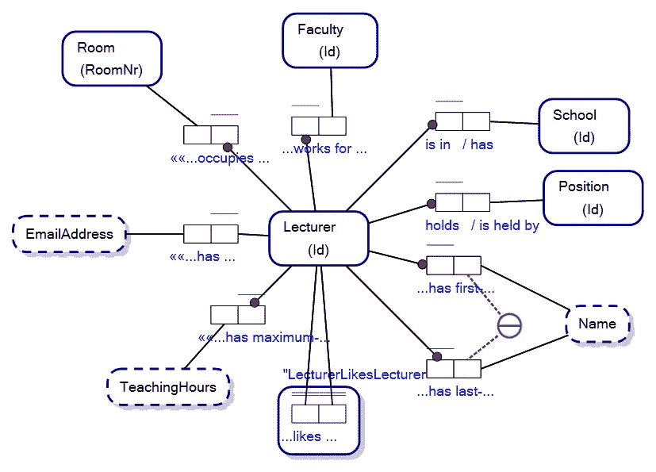
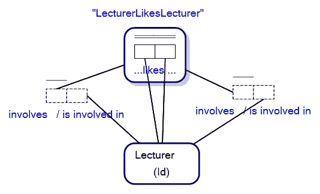

# 关系数据库上的递归图查询

> 原文：<https://towardsdatascience.com/recursive-graph-queries-over-a-relational-database-5e4c71782536?source=collection_archive---------25----------------------->

## 你从未见过的 SQLite

关系数据库上的递归图查询。图片作者。

FactEngine (www.factengine.ai)是一项从根本上改变人们看待数据库的方式的倡议。该倡议的本质是揭示如何将所有数据库视为多模型数据库(图形或关系数据库)。作为同类中的第一个，很难在不提及该倡议的情况下谈论该科学。但是让我们来看看科学…

专用的[图数据库](/what-is-a-graph-database-249cd7fdf24d)现在因为在属性图模式下工作而有些出名，如下所示:

显示讲师节点属性的属性图模式。图片作者。

上面的模式就是所谓的 ***有向图模式*** ，其中一个关系如 ***讲师在学校*** 被形象化地显示为一个箭头指向的 ***边(或图)*** 连接 ***节点*** *讲师*和*学校*。

专用图形数据库的制造商会让你相信这种类型的建模和相关的图形查询语言是那些专用图形数据库的权限。只有当你想让它成为图形数据库或关系数据库，而又没有工具将你的数据库可视化时，这才是真的。

关系数据库传统上被绑定到一个模式，该模式被形象地表示为一个实体关系图，如下所示:

实体关系图。图片作者。

您有时希望能够像查询图形数据库一样查询关系数据库，以使工作变得简单。

假设我们想要使用我们现存的模式查看一个虚构的讲师喜欢的每个人。我们应该能够使用简单的图形查询来查询数据库，如下所示:

图模式上的图查询。图片作者。

我们的查询，**(讲师:' Alexandria '，' Archer ')喜欢哪个讲师**，返回一个结果，Steven Hollows。

## 递归图查询

现在，专用图形数据库有一个窍门，那就是如果你想知道亚历山大·阿彻喜欢的讲师，他们喜欢谁，他们喜欢谁，他们喜欢谁，那么你可以修改查询，使其递归 4 层(0..3)深度，如:

图模式上的递归图查询。图片作者。

现在我们的查询返回多个讲师和他们喜欢的人。

专用图形数据库在这类事情上受欢迎的原因是，传统上，对于关系数据库，您必须用结构化查询语言(SQL)编写查询，如下所示:

> 选择【讲师】。名字，[讲师]。姓氏，[讲师 1]。名字，[讲师 1]。LastName
> FROM 讲师，
> 讲师讲师 1
> ，(带递归节点(讲师 Id，讲师 Id1，深度)As (
> 选择讲师 WITH 讲师。讲师 Id，讲师 Id1，0
> FROM 讲师 like 讲师，讲师
> WHERE[讲师]。名字= '亚历山大'
> 和[讲师]。LastName = 'Archer'
> 和讲师。讲师 Id =讲师。讲师 Id
> 工会
> 选择讲师。讲师号，讲师号。讲师 Id1，深度+ 1
> 从节点开始，讲师 like 讲师
> 从节点开始。讲师 Id1 =讲师类讲师。讲师 Id
> 限制 100
> )
> 从深度介于 EN 0 和 3
> 之间的节点
> 中选择讲师 Id，讲师 Id1
> 作为讲师喜欢的讲师
> 讲师喜欢的讲师。讲师 Id =讲师。讲师 Id
> 和讲师类讲师。讲师 Id1 =讲师 1。讲师 Id

这是一场噩梦。你真的不想花时间学习如何用 SQL 编写递归查询，然后费力地编写你想要的查询。

我认为，你想要的，能够实现这种事情，是创建你的关系数据库，然后用图形查询语言查询它。

即将发布的 Boston 和 FactEngine 允许您在关系数据库上进行递归图形查询和普通图形查询。FactEngine 中的标准图形查询如下所示:

FactEngine 查询语言中的图形查询。图片作者。

您使用[对象角色建模](/why-learn-object-role-modelling-4eebd93dcda2)创建您的数据库，它[自动为您提供数据库的图形和关系视图](/knowledge-hypergraphs-object-role-modeling-ef0f58f38066)，然后使用图形查询语言简单地查询您的数据库。

事实上，这篇文章是关于数据科学的可能性，以及如何以一种新的方式看待数据库，让生活变得如此简单。诀窍是完全摒弃图形和关系的概念，只需将数据库视为一组连接的对象类型。

我们模式的对象-角色建模视图类似于:

带有自然语言谓词的对象-角色模型。图片作者。

神奇的事情发生在我们的例子中，我们的讲师类讲师对象化事实类型具体化了*关系，并且有两个隐含的[链接事实类型](/link-fact-types-in-object-role-modeling-3c68c15eec92)，它们的整体组合为图形模式和实体关系图提供了主干。链接事实类型，下面显示为虚线事实类型:*

**

*具有隐含链接事实类型的对象化事实类型。图片作者。*

*本文中的查询是在 SQLite 关系数据库上执行的。FactEngine 查询语言(FEQL)中的图形查询自动转换为 SQL。例如，现存的倡议是为所有关系数据库创建基于图形的查询语言。FactEngine 查询语言只是关系数据库上图形查询语言的一个例子。*

## *关系数据库上图形查询的未来*

*本质上，我认为数据库的未来是一个*不太关心*的环境，在这个环境中，人们不会不关心他们数据库的底层管道(传统的图形或传统的关系)…只要你的数据库以适当的方式及时返回结果，并允许你在你认为合适的时候查询它。研究表明，在图形查询速度方面，传统的关系数据库可以匹配甚至超过专用的图形数据库[1][2]。毕竟，您已经花费了时间和精力来决定哪个数据库最适合您。我认为你想要的是有工具和合适的数据科学来允许你在你的数据库上做你想做的事情，并且不要大惊小怪。*

*感谢您的阅读，如果时间允许，我将写更多关于图形数据库、关系数据库、多模型数据库和对象-角色建模的文章。*

1.  *Rawlani，p .等人，“关系数据库的图形分析”，麻省理工学院，【https://dspace.mit.edu/handle/1721.1/100670 ，2020 年 8 月 24 日获取*
2.  *等，“关系数据库的图形分析”，麻省理工学院。*

*— — — — —结束— — — —*