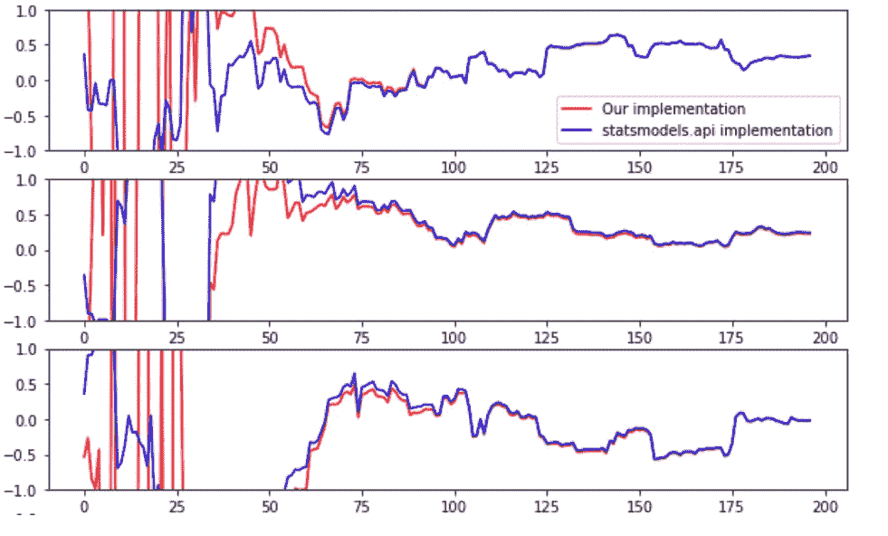
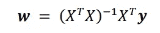
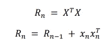
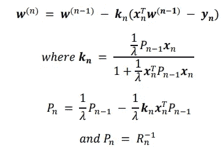
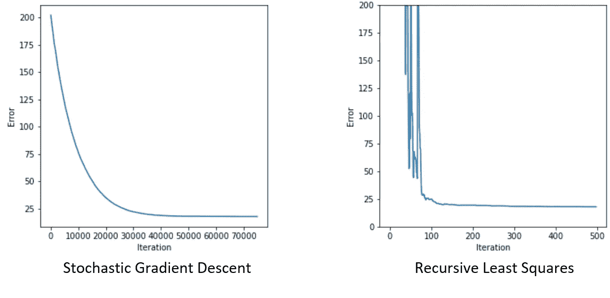

# RLS:动态学习

> 原文：<https://towardsdatascience.com/recursive-least-squares-learning-on-the-fly-f8bb878eb270?source=collection_archive---------17----------------------->

## 简单在线学习算法

## 一个简单的模型，当新的数据进来时，它可以动态地学习更新它的权重。

作者图片

# **为什么要递归最小二乘法？**

在线学习是人工智能研究领域中一个蓬勃发展的研究领域。当今世界的许多问题需要机器动态学习，并在收集新信息时进行改进或适应。

在本文中，我将解释如何适应最小二乘回归，以便在新数据到来时递归地计算最佳权重，从而使其适合在线学习应用程序。

# **最小二乘法**

有了足够的数据，回归问题可以通过最小化由一组权重和目标做出的预测的平方误差来解决。

其中 E 是误差的平方，y 是目标，X 是预测数据，w 是模型的权重

这有一个解析解，可以通过称为伪逆的线性代数来获得:

最小化平方误差的最佳权重集由上面的等式给出。

对于高维问题，计算上式中的逆运算可能非常昂贵。**逆运算与数据维度的平方成比例**。在在线设置中，每次有新的数据点时都必须执行该操作，这是不可行的。这种方法的另一个问题是没有考虑数据的年龄。在在线环境中，每秒钟都会有新数据出现，更新的数据可能比多年前获得的数据更重要。

因此，该方法必须适于在在线环境中实施。

# **秩一更新，逆序更新**

秩 1 更新允许通过使用使用矩阵 A 的逆矩阵及其向量的表达式来更新矩阵的逆矩阵加上向量乘以自身。首先，要求逆的项被分解为一个矩阵和一个向量加上它的转置的和。

其中 xn 是进入数据集的新数据点，Rn 是我们希望求逆的新矩阵

在每个时间步长，当接收到新的数据点时，Rn 可以表示为如上。

然后可以使用秩一更新来更新权重。如你所见，Rn 的更新逆矩阵已经被计算出来，而不需要执行矩阵的逆矩阵。更新的权重方程的完整推导不会显示，但是，这些方程足以实现您自己版本的递归最小二乘算法。

值得注意的是**更新的权重等于权重的先前估计减去增益项乘以预测误差。**这个结果在机器学习领域经常见到(看看随机梯度下降的更新公式，卡尔曼滤波，强化学习中的 Q-learning 等)。

# **RLS 击败 SGD 的地方**

上面显示的算法是用 python 实现的，并与非常流行的随机梯度下降(SGD)算法进行了比较。

随机生成由 500 个数据点组成的具有某种相关性的合成数据集。利用随机初始化的权重，可以应用 SGD 来逼近最佳拟合线。这可以与 RLS 算法进行比较。

作者图片

正如您所看到的，RLS 算法只需要大约 100 个数据点就可以达到完美的解决方案，而 SGD 算法需要大约 40，000 次迭代才能达到相同的解决方案(即使它可以访问所有数据)。不仅如此，RLS 还在动态学习，每次接收到一个新点时都会逼近伪逆解。

# **与其他实现相比**

最后，这个实现可以与公开提供的 python 库进行比较。

作者图片

该算法的实现与 statsmodels.api(一个流行的 python 库)提供的实现完全相同。上图显示了两种算法的三个权重的收敛，所有权重达到相同的值。

# **结论**

RLS 算法能够根据最小二乘解来估计最佳权重，而无需显式计算伪逆中的逆运算。这使得它成为在线学习应用的强大算法，在在线学习应用中，需要即时更新估计值。该模型与 SGD 进行了比较，结果表明，在适当的情况下，该算法可以大大优于更受欢迎的同类算法。

## 支持我👏

希望这对你有所帮助，如果你喜欢，你可以 [**关注我！**](https://medium.com/@diegounzuetaruedas)

您也可以成为 [**中级会员**](https://diegounzuetaruedas.medium.com/membership) 使用我的推荐链接，访问我的所有文章以及更多:[https://diegounzuetaruedas.medium.com/membership](https://diegounzuetaruedas.medium.com/membership)

## 你可能喜欢的其他文章

[可微发电机网络:简介](/differentiable-generator-networks-an-introduction-5a9650a24823)

傅立叶变换:直观的可视化