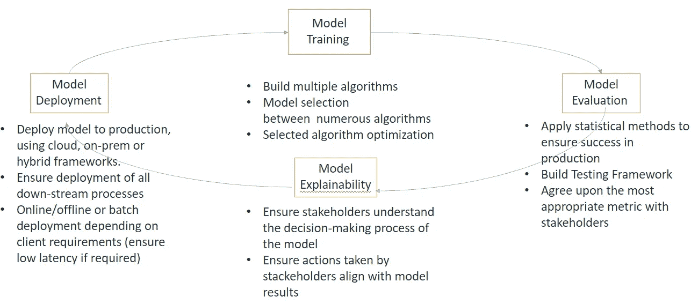

# 重新定义数据科学

> 原文：<https://towardsdatascience.com/redefining-data-science-d7f2026a021a?source=collection_archive---------40----------------------->

## 成功应用机器学习指南

由 [Unsplash](https://unsplash.com/s/photos/white-boards?utm_source=unsplash&utm_medium=referral&utm_content=creditCopyText) 上的 [Kvalifik](https://unsplash.com/@kvalifik?utm_source=unsplash&utm_medium=referral&utm_content=creditCopyText) 拍摄的照片

> 建立预测模型相对简单。然而，在整个企业中部署、扩展和维护多个模型并不简单。​

今天，一个成功的机器学习项目需要 90%的工程和 10%的科学。企业雇佣数据科学家开发端到端的机器学习解决方案。他们需要弥合科学方法和工程过程之间的差距。大多数数据科学家没有接受过大数据工程或分布式计算方面的培训，因此在功能工程、算法开发和部署阶段，扩展成为一个问题。

数据科学变得太模糊了。我们先来了解一下数据科学和机器学习的区别。

## 什么是机器学习？

机器学习(ML)不是数据科学的子领域。ML 是人工智能的一个子集，它最初是计算机科学的一个子领域，专注于解决人类可以做但计算机还不能做的任务。

请看下面的图表来总结我的观点:

机器学习算法基于经验(数据)自动执行大量小决策，并生成概率结果来解决业务关键问题。

## 什么是数据科学？

**数据科学**是一个基于三大支柱的跨学科领域:计算机科学、数学&统计学和商业知识。

这个定义有些松散。数据无处不在，无处不在。作为一名数据科学家，我需要解决涉及不同技能和数据复杂性的问题。构建复杂的量化算法需要强大的量化背景 ***统计线性代数、数据结构、*** 和 ***编程知识*** 。部署、管理和优化数据管道和基础设施以转换和传输数据需要强大的 ***数据工程技能*** 。将技术分析转化为定性行动项目，并将其发现有效地传达给不同的利益相关方，这需要高水平的沟通和*业务领域知识*。在任何阶段(模型开发、特征工程、ETL、模型部署)智能扩展解决方案都需要 ***大数据*** 和强大的 ***计算机科学*** 技能。

因此，数据科学家是一名专业人员，拥有前面描述的使用**机器学习**解决关键数据业务问题所需的所有高级技能。如果你的公司里有这些专业人士，那么你已经挖到了金子。让他们保持挑战和快乐。

然而，数据世界在不断发展，以前的问题变得越来越复杂。现在是时候重新定义数据科学，建立更专业的团队，以确保 ML 项目在生产中取得成功。

# 建立一个成功的 ML 团队

> “2018 年 1 月的 Gartner 数据科学团队调查发现，超过 60%的旨在实施的模型从未实际实施。”

为什么只有约 25%的数据科学项目能够真正投入生产？

公司雇佣背景和技能完全不同的数据科学家，并要求他们做同样的任务。我给你打个比方。

假设您正在庆祝贵公司上个季度取得的巨大成功。你办公室里有一架很棒的钢琴，所以你决定雇一名钢琴家。他美妙地演奏了几个小时。他知道如何制造钢琴吗？答案是否定的。但是他知道它是如何工作的，所以钢琴家能够演奏出优美的旋律。

所以，让我们把这个类比应用到数据上。作为分析部门的经理，你雇佣了两名数据科学家来领导一项 ML 实践。两人都有应用数学博士学位，有统计学背景和机器学习算法知识。9 个月后，他们在测试框架上创建了一个准确率高达 98%的令人敬畏的算法。然而，在生产的前三个月，性能下降了 30%。他们在自定义梯度提升算法上应用了集成学习，因此算法的可解释性变得技术性和复杂(黑盒模型)。由于生产中模型结果的不一致性，您决定在一项大投资后放弃该项目。

发生了什么事？—您未能包括一名关键团队成员。了解如何解决扩展问题、生产中的数据漂移、大数据、MLops 最佳实践和分布式计算的专业人士。你雇了一个知道如何制造钢琴的人，但不是一个知道如何在观众面前演奏的人。

> “科学是关于知道，工程是关于做。”
> 
> 亨利·彼得罗夫斯基

你需要一个填补科学和工程之间空白的专业人士。一个**机器学习工程师**。

因此，我看到两种类型的数据科学家在一起工作。我们需要在这两种不同的专业人士之间建立头衔上的区别。

这些学科需要不同的“思维模式”——一个采用更科学的方法，另一个采用更实际的工程方法。因此，我建议您的数据科学家在这些角色中更加专业化，以确保最佳性能。

企业应该雇佣与其商业目标一致的专业人士。公司可能不需要博士数据科学家来重新发明轮子。事实上，他们经常雇佣机器学习工程师来训练已经构建好的 ML 算法，以便在他们的公司成功应用机器学习。一旦企业组建了一个拥有合适“厨师”的 ML 团队，他们需要遵循一个与 ML 最佳实践相一致的“食谱”，以提高生产成功的可能性。我们将在下一节讨论这个“配方”。

# 机器学习项目生命周期

机器学习生命周期是一个迭代过程，确保项目的大规模运作。它支持科学(ML/DS 科学家)、工程(ML 工程师)和业务领域知识(利益相关者)之间的协作。此外，它通过一个从一开始就描述每个 ML 团队成员的角色并管理期望的架构来提高成功的概率。

> ML 项目生命周期是让你的 ML 团队获得实际商业价值的终极“配方”。

让我向你介绍我们的成功秘诀。

是的，我知道你在想什么！相当多的阶段，但是不用担心——为了便于解释，我们将把它分成三个不同的阶段。

你可以看到蓝色数字(ML 工程师)是如何参与几乎每一项任务的——我希望你同意我之前的说法，ML 学习项目需要 90%的工程学，只需要 10%的科学。一个 ML 工程师也应该能够在模型训练中采用“科学的思维方式”。事实上，我可以将 ML 工程师定义为接受过 MLOps 和大数据工程培训的下一代数据科学家。然而，如果你的公司想要使用“开箱即用”的算法，并且能够负担得起多年的研究和资源——雇用一名 ML 科学家。希望他能为你建立一个最先进的全新算法。

## 阶段 1: ML 数据工程

ML 项目生命周期是一个迭代的过程，因此每个阶段都很重要。任何阶段的错误都可能是有害的，并迫使 ML 团队回到流程的最开始。迭代不应该导致瘫痪。团队成员应该向利益相关者和管理者设定期望，他们可以在未来重新审视前进道路上的每一步。

然而，根据我的经验，第一阶段尤其重要。目标定义应该在 ML 团队和利益相关者之间设定现实的期望。数据收集准备和特征工程阶段占用了 ML 项目 80%的时间。所选功能将直接影响您使用的预测模型以及您可以实现的结果。

在第一阶段设计管道时，您需要选择正确的技术组合。例如，如果您应该确定哪种技术将允许您在数据收集和特征工程阶段扩展您的计算。您应该考虑以下事项:您需要一次一个观察值地摄取和处理实时数据的样本(在线学习)还是进行批量摄取和处理？部署呢？是否有低延迟要求？这些问题的答案超出了本文的范围。然而，我的观点是——你的团队在第一阶段做出的每个决定都会影响项目的结果。它们可能会加速其他阶段，也可能会产生瓶颈。

## 阶段 2:模型构建和部署

这是 ML 生命周期中迭代最多的阶段。我想强调的是，在算法进入部署阶段之前，您的团队需要确保利益相关者理解模型决策过程，并就定义“成功”的最合适的指标达成一致。在这个迭代项目中，模型可解释性是必须的。这将有助于利益相关者理解结果，并且由于算法行为的更好压缩，也将使您的团队能够改进算法。

## 第三阶段:MLOps

机器学习操作(MLOps)对 ML 生命周期的需求是毋庸置疑的。传统的软件系统基于确定性算法。

> **机器学习是随机的，不是确定性的**。我们都同意 ML 开启了一个全新的任务类别。然而，非确定性软件系统(ML 算法)应该仔细设计和测试。

这就是我看到许多公司失败的地方——机器学习模型的生命周期在许多方面不同于软件开发生命周期(SDLC)。软件工程师在进入生产之前，通过称为 Q/A 的整个测试软件基础设施测试这些传统的软件系统。

> *“生活在变化，我们的模型接受的实时数据也在变化，*”—Alexander Konduforov 承认。

在模型评估阶段，您的 ML 工程师应该已经创建了一个测试框架，以便从其他候选者中选择“冠军”。基本上，他们证明了该算法在特定时刻基于商定的度量分数工作。然而，一旦模型在生产中部署和运行，我们需要确保理解三个概念:

> **1。不要只关注代码版本，你需要一个地方来保存数据和模型版本。** MLOps 需要一个报告框架来保存数据和模型版本，以便重用和重新培训。
> 
> **2。算法会随着时间退化，这就需要监控。** MLOps 要求您监控模型输入(数据)和输出的统计数据。监控阶段的目标是帮助 ML 工程师建立一个稳定的环境。
> 
> **3。训练永无止境。**模型维护阶段确保识别模型退化的方法。一旦发现性能下降，ML 工程师和 ML 科学家应该分析算法行为，并决定重新训练或添加更多功能来增强性能。

# 关键要点:

*   机器学习端到端管道是产品——而不是模型本身。
*   任何企业的目标都是成功，要在 ML 领域取得成功，你的团队需要专业化。随着 ML 从研究转向应用商业解决方案，企业需要改进他们的操作流程。专业化是一种推动增长的创新。
*   一旦你设计了你的 ML 团队来交付所提到的能力，他们应该执行 ML 项目生命周期来确保端到端的项目在生产上的成功。
*   MLOps 有潜力使 ML 项目生命周期自动化，促进生产成功的变化，并弥合科学和工程之间的差距。

> 大规模机器学习的自动化是任何智能系统的关键。ML 不是未来——它正在发生。

请随时联系我-我们是一家国际咨询工程公司，拥有强大的应用机器学习团队。

谢了。

plopez@pkglobal.com

【pkglobal.com 情报与分析—PK

[**巴勃罗·萨尔瓦多·洛佩兹|领英**](https://www.linkedin.com/in/pablosalvadorlopez/)

[pablosalvador10(巴勃罗·萨尔瓦多·洛佩兹)GitHub](https://github.com/pablosalvador10)

参考资料:

[MLOps:用于机器学习的 DevOps 方法| AltexSoft](https://www.altexsoft.com/blog/mlops-methods-tools/)

[https://towards data science . com/the-machine-learning-life cycle-912 a 70647d 61](/the-machine-learning-lifecycle-912a70647d61)

<https://www.kdnuggets.com/2020/08/top-10-lists-data-science.html> 