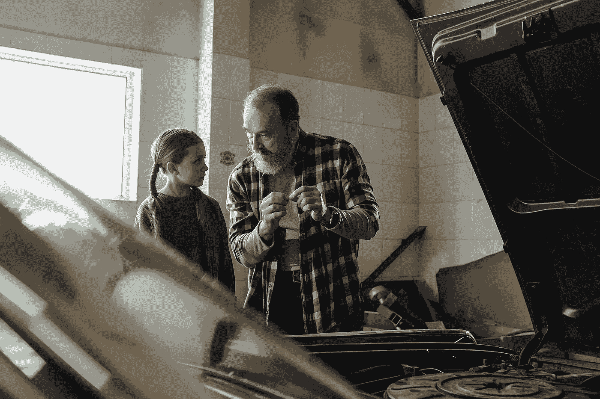

# 重新设计传统的统计学课程以教授数据消费者

> 原文：<https://towardsdatascience.com/redesigning-the-traditional-statistics-class-to-teach-data-consumers-8c057e55ddc4?source=collection_archive---------22----------------------->

## 我们是在教学生当司机还是机械师？

由 [cottonbro](https://www.pexels.com/@cottonbro) 在 Pexels.com[拍摄的照片](https://www.pexels.com/photo/man-in-black-and-white-plaid-dress-shirt-holding-smartphone-4481922/)

当人们发现我有统计学学位时，话题不可避免地会转向他们在大学上的统计学课。虽然有些人称赞这门课，并认为它很有用，但大多数人讲述了他们在理解这些概念时的挣扎。它并不经常出现在他们最喜欢的课程列表中。虽然我开玩笑说，我的工作保障在于许多人不喜欢统计学，但这错过了机会。为什么统计课几乎普遍存在负面体验？

# 打个比方:学开车和学做机械师

我相信有更好的方法来设计这些统计类。我来打个比方解释一下。假设你正在教某人如何开车。你会怎么做？一开始，你会告诉他们如何发动汽车，如何松开紧急刹车，如何调整座椅和后视镜。你肯定会解释油门踏板和刹车的区别，以及如何倒车。你可以讲述交通规则，并展示如何在交通中保持安全。经过一些练习，新司机会很快达到基本水平。

现在想想你怎么可能不教别人开车。你不会一开始就打开引擎盖，详细解释让汽车发挥作用的所有部件。你不会解释运动的物理原理和内燃机中发生的反应。如果汽车坏了，你也不会告诉他们如何修理。不知道引擎盖下发生了什么，也不知道油门踏板是如何连接到车轮上并使汽车行驶的，你也可以成为一名优秀的司机。了解汽车如何工作会很方便吗？当然可以。但是你不需要成为一名机械师来学习如何驾驶汽车。

# 类比在统计课中的应用

那和统计课有什么关系？我相信大多数统计学入门课程是为了迎合统计学家(技工)而不是数据消费者(司机)。虽然一个好的机械师价值连城，但并不是每个人都需要成为机械师。同样，虽然统计学家可以在处理数据时提供很多价值，但并不是每个人都需要成为统计学家。当然，你需要为那些将要成为统计学家的人上统计学入门课。但是更大的招生需求是面向所有学生的普通统计学课程。

因此，我们需要的不是描述统计学背后的东西，而是教授人们如何恰当地使用统计学的课程。你不需要理解概率密度函数和中心极限定理就能很好地使用数据。对于大多数人来说，知道如何计算标准差或如何从教科书后面的表格中查找 p 值没有什么价值。要成为一名合格的数据消费者，你不需要理解理论和数学方程式。

# 一种重新设计统计课的新方法

统计学入门课程需要彻底改革。大学应该提供一门适用于广大普通人群的单一的终结课程。本课程将涵盖以下主题:如何利用数据进行推理，数据分析的局限性，数据收集的影响，数据的基本可视化，以及如何从数据中得出不正确的结论。这不应该是数学教授教的，因为这不是数学课。相反，老师应该探索和提问，挑战假设，帮助人们看到问题的两面，并仔细权衡结论的有效性。这是一门用数据进行推理和批判性思考的课程。

因此，教学方法遵循类似于法学院课程的案例研究方法。学生们会研究一篇博客文章、报纸上的一篇文章，或者一项包含一些数据结论的科学研究。在任何感兴趣的主题中，都有大量好的和坏的例子可供选择。我在统计文献中看到了一些[在这方面的努力。但是，基于统计学理论基础的案例研究方法仍然专注于如何更好地培训技工。除非你有正确的内容，否则使用案例研究方法是不够的。同样，内容必须迎合数据消费者(驱动者)。](https://www.tandfonline.com/doi/full/10.1080/10691898.2017.1341286)

老师会仔细选择这些例子，以提供不同领域的各种应用，并突出不同的统计问题。然后学生们会做一个批判性的评估来决定研究的结论是否被数据所证实。他们可以考虑一些问题，如数据是如何收集的，在收集过程中可能会出现什么偏差，哪些数据没有收集，数据是如何分析的，等等。有了这些例子，学生成为了更好的数据消费者。

# 理想的结果

自从 COVID 疫情开始以来，关于数据的讨论越来越多。我看到越来越多的人试图利用研究数据来支持他们关于口罩、封锁、社会距离和疫苗的立场。虽然有令人钦佩的尝试使用数据来推动决策，但我也看到了许多数据使用的糟糕例子。当数据没有被很好地使用时，不可避免地会产生误解和错误的结论。统计学课程的重新设计是对这个错误信息问题的一个解决方案。案例研究方法将创造一代精明的数据消费者，并提高我们公共话语的质量。

*原载于 2021 年 8 月 21 日*[*【https://cocreativelythinking.com】*](https://cocreativelythinking.com/redesigning-the-traditional-statistics-class/)*。*