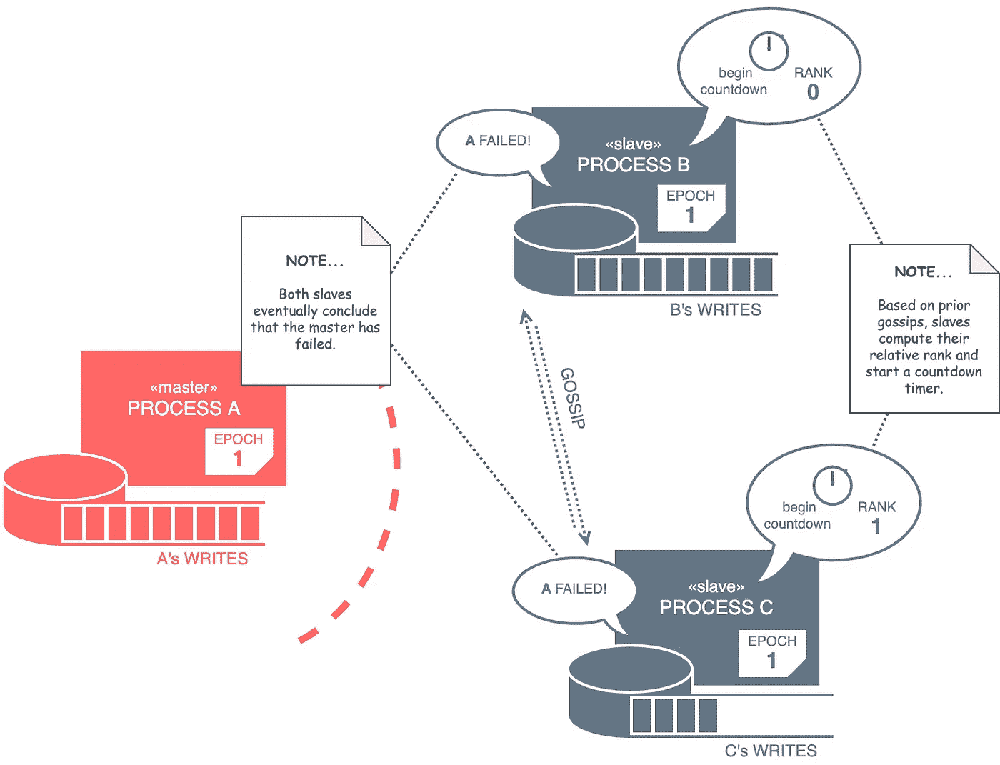
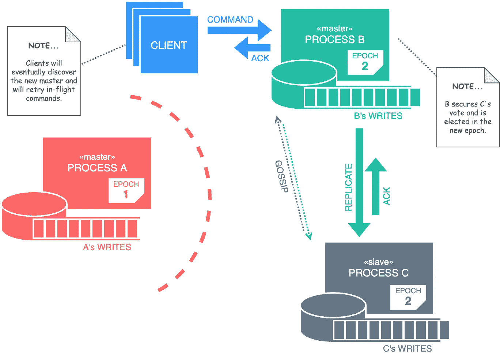

# Redis:在任何速度下都不安全

> 原文：<https://towardsdatascience.com/redis-unsafe-at-any-speed-f2731f738a25?source=collection_archive---------2----------------------->


[图片由 Unsplash 提供]

## [行业笔记](https://towardsdatascience.com/tagged/notes-from-industry)

## 代价换来的性能

NoSQL/NewSQL 产品的激增为软件工程界提供了大量可行的存储和检索数据的替代方案，这些方案具有各种形状和大小，具有不同的性能、可伸缩性、一致性和可用性特征。高度僵化且有些老化的关系数据模型不再被随意使用。结果，开发人员蜂拥至替代的持久性堆栈，这主要是由可伸缩性的前景和更好地符合其本地应用程序领域的数据模型所驱动的。有趣的是，人们很少关注他们不太时尚的特点；例如，事务支持、隔离级别、一致性、网络分区的处理、工具、安全性等等。

很难想出比 Redis 更受关注的数据存储。在栈溢出上，它连续三年被选为[最受欢迎的数据库](https://redislabs.com/blog/redis-named-loved-database-third-consecutive-year/)。它也是[AWS](https://www.theregister.com/2020/11/23/redis_the_most_popular_db_on_aws/)上最受欢迎的数据库，超过了 MySQL 和 Postgres，以及亚马逊专有的 NoSQL 产品。

这是我们中的一些人开始担心的地方，而且不无道理。当然，对于一个工程团队来说，寻找一个与他们的技术目标更加一致的数据库是非常正常的；例如，当应用程序利用以文档为中心的数据模型时，文档存储通常更容易使用。这不仅仅是一个工程师的突发奇想——这里的“愉快”直接转化为降低的复杂性、提高的开发人员生产力和士气，以及最终的“胜利”——对于业务来说，不是别的。但事实上，数据对组织及其利益相关者具有内在价值，当数据的持久性或一致性处于危险之中时，企业有权知道。不幸的是，工程团队在选择技术基础设施时优先考虑某些质量，往往忽略了对关键利益相关者至关重要的方面，他们可能被排除在决策循环之外。正如读者可能已经猜到的那样，这个讨论将集中在 Redis 的安全属性上——特别是持久化数据的持久性和一致性。

本文试图解释为什么 Redis 不适合用作 NoSQL 数据库，因为持久化数据的持久性和一致性是必不可少的。澄清一下，这不是针对 Redis 的。Redis 是一个优秀的缓存或二级数据存储，具有方便的 NoSQL 功能、分片、复制和尾随持久性。它在耐用性方面的损失，在吞吐量和延迟方面得到了弥补。在适当的情况下，Redis 是一个极好的技术选择。本讨论的背景是它作为高价值业务记录的主数据存储库的用途，这些业务记录有严格的持久性要求，并且一旦丢失或损坏就无法轻易恢复。

# 推荐阅读

在开始分析之前，有必要重申一些基本的[分布式计算概念](https://medium.com/@ekoutanov/distributed-computing-concepts-f6275078a81)。如果你已经认为自己对分布式数据库的架构很了解，那么跳到*期望*部分。

# 预期

Redis 集群属于由领导者-跟随者架构支持的复制状态机的范畴，在基于多数的法定系统的配置中包含多个进程。在分布式系统文献领域，这是一个众所周知的、久经考验的拓扑。根据我们陈述的持久性和一致性要求，系统需要满足布鲁尔[上限定理](https://en.wikipedia.org/wiki/CAP_theorem)的 CP(一致性和分区容忍)标准——换句话说，面对网络分区，它需要将数据一致性置于可用性之上。我强烈怀疑，大多数采用 Redis 集群并对持久性和一致性抱有强烈期望的人会很自然地认为 Redis 集群是一个 CP 系统，而不是 AP 系统。也就是说，假设 Redis 是安全的，或者至少，*足够安全*。

对于“足够安全”的含义，目前还没有达成普遍共识，而且也不可能达成共识，因为安全要求是由商业驱动因素决定的，而商业驱动因素对每个组织来说都是独一无二的。在这里，我将尝试为安全定义一个较弱的定义，它可能对相当多的应用程序都是合理的。我从与不同行业的众多客户打交道的个人经验中得出结论，我建议的是大多数从业者都会做出的合理假设。有人可能会说，这种对安全性的弱化不够客观；我说，没有某种基线，我们就无法前进。

“足够安全”的基于领导者-跟随者的复制状态机通常需要满足以下标准:

1.  **领袖奇点。**在任何给定时间，至多一个领导者可以操作，由配置中的法定数量的复制品(包括领导者)一致接受。前任被取代的领导者不能干涉现任领导者的行为。严格地说，安全性能允许零领导在琐碎的情况下；然而，在某些时候，必须有一个选举的领导者才能最终出现，从而满足活性属性。
2.  **复制功效。**所有副本(包括领导者)按照领导者规定的顺序忠实地将领导者发出的更新应用到它们的状态机。由引导者执行的所有更新被传递给一个法定数量的复制品(包括引导者)。未被复制副本的完整仲裁所接受的写入不得由主设备安装或向发起应用程序(客户端)确认。这个性质与 CAP 定理的 CP 约束有关。
3.  **法定人数交集。**根据我们之前的通信，法定人数系统中的每个有效法定人数至少通过一个过程与其他所有法定人数相交。
4.  **一致的副本提升。**在故障转移期间，只有一致的副本可以竞争领导权。其他的必须保持休眠状态。一旦副本被选中，它将从领导者停止的地方继续。请注意，可能有未确认的写入在领导者上挂起；安全属性不关心这些写操作；继任的领导人可以自行决定合并它们。
5.  **有界限的陈腐的坚持。**每个副本都连接到一个持久存储设备，该设备在进程失败后仍然存在。持久状态反映了在失败之前进程的瞬时状态，关于已经由复制品*在关于陈旧性*的一些商定界限内确认的写入。有限的陈旧性可以用经过的时间或未提交记录的数量来衡量。(后者更可取，因为它更准确地反映了最坏情况下的损失程度。)在运行时，该进程不会从其临时存储中丢弃数据，直到永久存储已经确认了相关的写入。重新启动的进程可以确定身份(偏移量、序列号等。)最近提交的写入。作为一个推论，一个重新启动的过程决不能自动取得领导权，即使它在失败前碰巧是领导者。

除了上述标准，我还提出了几个假设来补充弱安全属性:

1.  法定人数系统被设计为容许 *f* 失败，其中 *f ≥* 1。换句话说，我们正在处理一个高度可用的系统，其中单个进程的故障不会导致系统不可操作。实际上，对于基于多数的法定人数系统，我们至少需要三个过程。
2.  过程不受可能的共模故障的影响。共模故障涉及影响多个独立元素的单一原因；例如，电源故障或物理入侵事件。将服务器分散在不同的机架或更好的数据中心，可以降低共模故障的可能性。
3.  **流程配备有*P*故障检测器。**所有失败的进程最终都被所有正在运行的进程所怀疑；所有活动的进程最终都不会被怀疑。准确性-完整性对偶的精确调整虽然对活性有实际意义，但不影响安全性。
4.  **弱持久的持久性。**持久化的*数据以约定的可能性*被原始地召回，该可能性随着时间而减小。数据丢失和损坏很有可能被检测到。

上述弱安全属性与其常规(强)变体之间的差异集中在标准 5 和假设 4 中。它们放宽了通常的持久性标准，这些标准几乎肯定是在更理论化的环境中假设的。通常情况下，标准 5 类似于以下内容:

> *…持久状态准确地反映了流程在失败之前的瞬时状态，与副本已确认的写入相关。*

类似地，假设 4 应该是:

> *持久化的数据在未来的每一点都被原始地召回。*

我们在这里做出了两项重要的让步。首先，我们说，确认的写入不一定需要提交到稳定的存储，前提是这些写入在某个“合理”的时间段内被刷新，并且我们可以在重启时准确地检测到最后一次提交是什么。在实践中，这可能不是一个硬约束；更有可能的是，这将是一个软(尽力)执行。我们称之为“未提交的写入让步”。其次，我们不假设完美的存储—我们允许磁盘偶尔出现故障，尽管故障率应该在“可接受”的范围内，并且故障应该是可检测的。我们称之为“不完美磁盘让步”。请注意，弱化版本中标准 5 和假设 4 的措辞有点模糊:我们戏谑了术语“合理”和“可接受”,而没有进一步的澄清。

在处理多节点配置(假设 1)时，未提交的写入让步通常是可接受的，其中节点位于不同的机架或数据中心，并且共模故障的可能性足够低(假设 2)。即使副本没有将其更新提交到稳定的存储，并且最终由于过程失败而丢失写入，配置中的其他副本也将保持这些更新完好无损。这假设至少有一个幸存的仲裁有一个一致的副本，并且副本不会快速连续失败，以便任何幸存的副本都有机会被选为领导者，并将其状态传递给其对等体。标准 2 和 3 证明了这一假设的合理性，并支持标准 4。

不完美的磁盘让步只是清醒地接受现实。不管存储设备中采用的物理冗余的程度如何，都存在数据损坏的非零可能性。错误检测和纠正算法也是如此——它们本质上是概率性的。我们可以通过增加冗余来将故障的可能性降低到可以忽略的水平，冗余会导致成本和延迟。此外，配置的大小本身也有助于存储冗余。如果我们选择添加更多的处理节点，我们不必添加更多的磁盘；事实上，后者具有增加流程可用性的额外优势。

敏锐的读者会发现，拜占庭式的错误没有得到明确解决。在讨论不完美磁盘和共模故障时，我们偶然提到了它们。此外，网络可以拒绝流量，或者更糟的是，以一种接收者无法检测的方式改变数据包，从而以拜占庭的方式行事。后者在实践中是极不可能的，取决于错误检测算法的准确性。最后，软件可能会产生拜占庭错误，在这种情况下，进程可能会发出或保存任意数据，包括使其看起来像一个正常运行的程序的数据。拜占庭行为可能是实现缺陷的结果。这在实践中很有可能，因为软件是由人类制造的，而且 T2 的错误是人为的。更不用说，这些进程可能是恶意的。

# 分析

首先，几个条款来源于官方文件，作为序言。有些甚至本身就很有趣。至少，Redis 的所有用户都应该非常熟悉它们，不管他们对 Redis 或这篇文章有什么看法。在整个分析过程中，我们将通过它们的编号来引用它们。

1.  借助开箱即用的默认设置，Redis 作为一个半持久的数据存储区运行，牺牲了持久性，而有利于吞吐量和写入延迟。这在官方文档的 [Redis 持久性章节](https://redis.io/topics/persistence)中有详细说明。具体来说，AOF(仅附加文件)的默认刷新间隔为一秒钟，在此期间，已确认的写入可能会不可挽回地丢失。这是`appendfsync everysec`选项，它是 AOF 配置中的默认选项，也是推荐选项。
2.  持久性规范列出了`appendfsync always`选项，其中所有暂存的 AOF 写入在返回之前都要经过一个`fsync()`；然而，在这种模式下，Redis 的性能在官方文件中被描述为，逐字引用，“非常[原文如此]非常慢，非常安全”。因此，推荐使用`appendfsync everysec`选项，因为它“非常快而且非常安全”。读者会注意到 Redis 文档似乎回避了经验或定量的断言，而倾向于使用定性的形容词，如“非常”、“缓慢”、“快速”等。
3.  关于复制的第[章](https://redis.io/topics/replication)指出 Redis 在 leader-follower(按其说法是主-从)拓扑中采用异步复制协议，其中从设备独立于主设备对发起客户端的响应来重放主设备应用的写操作。在主设备响应的时候，从设备可能任意落后于主设备。
4.  从版本 3.0.0 开始，Redis 包含了 [WAIT](https://redis.io/commands/wait) 命令。`WAIT`在客户端上阻塞，直到所有以前的写入在指定的超时时间内被复制到用户指定数量的复制副本，返回超时前已确认的复制副本数量。表面上，`WAIT`将 Redis 的异步复制机制变成了同步复制机制。
5.  [WAIT](https://redis.io/commands/wait) 文档指出“WAIT 不会使 Redis 成为一个强一致的存储:虽然同步复制是复制状态机的一部分，但它不是唯一需要的东西”。它继续阐明“Sentinel 和 Redis 集群都将尽最大努力提升可用副本集中的最佳副本。然而[原文如此]这只是一种尽力而为的尝试[原文如此]，因此同步复制到多个副本的写入仍有可能丢失”。在这里，文档没有明确说明“尽力而为”的含义。具体来说，最佳副本升级失败的条件并没有被维护者公开。我们有责任解决这个问题。
6.  `WAIT`文档并未声明命令会阻塞，直到主服务器和/或副本服务器刷新了暂存的写操作，仅声明指定的最小数量的副本服务器“成功传输并确认了命令”。换句话说，`WAIT`命令是对相应副本的瞬态而非持久状态的断言。
7.  [复制章节](https://redis.io/topics/replication)指出“Redis 不是一个具有强一致性的 CP 系统”以及“确认的写入在故障切换期间仍可能丢失”。它继续说道，“使用`WAIT`，故障事件后丢失写入的概率大大降低到某些难以触发的故障模式”，但没有详细说明导致数据丢失的特定故障模式，也没有量化这些事件发生的可能性。表面上，这是指第 5 条，这是不完整的。它也可以指第 6 条。Redis 把细节留给了众所周知的“读者练习”。
8.  官方的 [Redis 集群规范](https://redis.io/topics/cluster-spec)描述了“从节点等级”算法，其中从节点相对于其对等节点在复制数据量方面建立其等级，并延迟领导者选举一段时间，该时间大致与其等级成比例。(我们说“大致”是因为等待时间包含随机延迟成分。)更完整(排序更接近 0)的从模块被设置为在不太完整(排序更接近 N-1，其中 N 是配置的复制品的数量)的从模块之前投票。
9.  在同一节中，集群规范声明“主设备不会以任何方式选择最佳从设备”。没有机制来确保后继的领导者在幸存的复制品中排名最高。

基于对 Redis 集群文档和“精美小册子”的随意阅读，更不用说它在行业中的广泛采用，大多数人会天真地认为 Redis 集群大致以如下方式工作。

当足够的进程和网络链接是可选的时，写操作从主服务器(进程 *A* )镜像到法定数量的副本服务器上。(基于前面例子中的三进程配置。)所有副本都参与一个八卦协议(定期交换心跳)，每个副本都知道其他副本的存在和复制高水位标记。(高水位线是最近复制的写入的标识。)如果客户端调用`WAIT`，写操作不会向客户端确认，直到它们暂时反映在大多数进程上。(没有`WAIT`，客户端立即返回。)此外，Redis 过程给每个连续视图分配一个单调递增的纪元编号，以便复制品同意它们是哪个视图的一部分。在下面的示例中， *A* 已经选择了{ *A* ， *B* }个仲裁进行复制，允许 *C* 进行跟踪。如果有足够数量的副本处于同步状态，尾随副本完全符合规则。


正常操作[图片由作者提供]

在某些情况下，主节点要么出现故障，要么与其余节点隔离。这两种情况实际上是等效的。结果是暂时停机，因为客户端无法将其请求路由到主服务器，或者主服务器无法将写入传递到仲裁，因此它永远不会响应。 *B* 和 *C* 都保持休眠状态；它们无法独立处理写操作，因为它们在当前时代都不是主服务器。


master @ epoch 1 失败[图片由作者提供]

副本最终会注意到主服务器没有心跳，并通过其本地*P*检测器推测其故障。这两个复制品都启动了一个倒计时定时器，该定时器根据其相对等级大致按比例启动。(还增加了一点随机性。)



故障检测[图片由作者提供]

最新的复制品的计时器最快到期，进程 *B* 获得 *C* 的投票成为新的主人。Redis 使用一个名为`FAILOVER_AUTH_REQUEST`的消息来获得对等副本的投票。那些支持将请求者设置为提议时代的新领导者的人用`FAILOVER_AUTH_ACK`来回应。 *B* 和 *C* 都增加它们的历元计数器，从而排除 *A* 的干扰。


故障转移[作者图片]

一旦 *B* 被指定为下一个纪元的新主机，客户端应用程序最终会发现这一事实，并将它们的请求路由到 *B* 。可能有写入在 *A* 中排队—可能 *A* 仍然存在；无论如何，这都不重要——那些写的东西还没有被确认，它们的丢失对客户来说应该是无关紧要的。到那时，任何进行中的请求都将被路由到新的主节点。



新主人@纪元 2[图片由作者提供]

请记住， *B* 和 *C* 无法判断 *A* 是否出现故障、被隔离或反应缓慢。如果 *A* 有效，它也将启动自己的倒计时定时器；然而，它将无法获得足够的票数以形成法定人数。*允许 A* 稍后重新加入，但必须先经过一个发现过程；如果 *A* 试图取得主控权，纪元计数器会在合并时阻止它。现在应该很明显，视图时代二重奏是至关重要的；没有它，主人将会被无条件地允许与他们的前奴隶乱搞。


被废黜大师的击剑[图片由作者提供]

理论如何符合现实？

Redis 群集的默认配置不安全。

默认异步复制模型(没有`WAIT`)意味着客户端可以从主机接收更新已经被接受的确认，而底层命令既不在主机自己的持久预写日志上，也不复制到甚至一个复制品上。这是从第 1 条和第 3 条中轻易推断出来的。如果主设备出现故障，配置中可能就没有副本包含主设备确认的所有写入。这里没有什么要补充的了。

我们现在来看看加强任何可配置参数是否能满足弱安全属性。我们可以选择的两个选项是`appendfsync always`和`WAIT`。两者都会以不同的方式对应用程序的性能产生重大影响。

强制 AOF 在每次写入时发出`fsync()`会使主节点线性化，但会显著影响总吞吐量。引用 Sanfilippo 在第 2 条中的话，表演退化为“非常非常慢”。我们不知道这到底意味着什么，但 Percona 进行的[基准测试](https://www.percona.com/blog/2009/12/10/redis-benchmarks-on-fusionio-round-1/)表明，与`appendfsync everysec`相比，性能损失大约为一个数量级。这听起来是一个显著的下降，但实际上可能已经足够了，这取决于您的吞吐量需求。不可否认，因为 Redis 主要是内存中的数据存储，在 Redis 术语中被认为“非常慢”的东西在 IO 绑定数据库的上下文中很容易被认为“非常快”。

在应用程序代码返回之前调用`WAIT`会影响延迟——我们会阻塞，直到副本确认写入，并且需要两次往返(`WAIT`是一个单独的命令)。额外的网络流量也会影响吞吐量。虽然额外的`WAIT`命令也会对主服务器产生一些影响，但是影响主要在客户端层面。进行两次调用是低效的，人们不禁想知道为什么`WAIT`不能是一个自动应用于所有命令的会话级属性，而不是一个显式命令。也就是说，使`WAIT`显式化在批处理中提供了一个优势——当多个命令需要作为一个非原子逻辑操作的一部分执行时，在最后调用单个`WAIT`会缩短整体延迟。但是对于需要单独确认的命令的串行执行，`WAIT`可能会极大地降低吞吐量和延迟。尽管如此，我们接受`WAIT`从客户端的角度将异步复制模型转变为同步模型*。(稍后将详细介绍。)*

除了效率和性能方面的考虑，问题是这些能否增强 Redis 的安全性，以及增强到什么程度？

强制 AOF 同步并不能使 Redis“足够安全”,因为我们宽松的安全标准已经考虑到了持久层中有限的陈旧性。具体来说，标准 5 规定，对于已确认的写入，允许持久存储落后于瞬态，直到某个界限。`appendfsync always`设置对于安全的强形式是必要的，其中不允许有滞后，但是如果配置中有一个以上的过程，它对于弱形式是多余的。为了理解为什么，考虑一个只有一个进程的配置——一个主进程，没有从进程。如果主服务器失败，系统将会非常安全，但不会被激活。如果主设备最终重新启动，其连接的存储将使其恢复到上次确认的状态。相反，有了`appendfsync everysec`，在没有其他副本的情况下，我们可能会丢失数据。然而，在配置中有多个节点的情况下，按照我们的标准 4，主节点的故障将导致主节点选举，并最终将控制权转移到与主节点一致的另一个副本节点。老师傅因为`appendfsync everysec`丢失了写不要紧；只要至少还有一个一致的副本(标准 2)，该副本就可以用于维护安全性和活性，并在离开的主设备最终重新加入时作为其种子。在多节点配置中，复制功效标准(2)是确定(弱)安全性的决定性因素；耐久性标准(5)的存在只是为了最小化丢失大部分复制品的影响。

那么，同步复制的使用满足复制效率标准(2)吗？它会使 Redis 集群“足够安全”吗？

号码

`WAIT`的使用部分满足标准 2。从客户端的角度来看，复制协议是同步的。这意味着，在一定数量的复制副本(包括主副本)确认收到这些写入之前，不会向客户端确认更新。但是，其他客户端可能会观察到分配的值，即使该值尚未稳定。确认可能无法到达，或者主服务器可能崩溃，最终导致在更新无效的备用法定人数中选举新的领导者。

作为一个具体的例子，再次回忆我们的可信配置，其中三个节点{ *A* 、 *B* 、 *C* }、 *A* 是当前的主节点。键 *x* 当前被赋予值`"1"`。客户 *N* 希望通过发布`SET x "2"`来更改`x`。命令成功返回。 *N* 然后通过调用`WAIT 1 0`做“正确的事情”并阻塞，直到写入被多数反映。与此同时，客户端 *M* 执行一个`GET x`并看到值`"2"`。新写入尚未被复制，并且在有机会复制之前 *A* 失败。首领选举随之而来， *B* 成为新的主人， *C* 成为奴隶。 *M* 发出另一个对`x`的读取并得到`"1"`。 *M* 早先对`x="2"`的观察被称为脏读。顺便提一下，这种行为对应于 ISO/ANSI SQL 标准下允许的最低*隔离级别。直截了当地说，就普遍接受的隔离级别而言，不会比这更差了。*

问题是`WAIT`没有全局同步复制；它只是从发起客户端的角度出发。`WAIT`不隔离事务。其他客户端可能会观察到不一致的结果，因为复制在本质上仍然是异步的。大多数用户会天真地认为 Redis 对单个更新自动操作，隔离级别至少是读提交。事实并非如此。标准 2 明确禁止这种行为，规定在更新稳定之前不能对外透露。

假设我们的应用程序不关心隔离。我们是否可以通过稍微放宽标准 2，将安全属性进一步稀释到“几乎足够安全”的水平(或者其他的反常情况)？在某些情况下，这可能是合适的，尽管有人可能会说，很少有认真对待数据一致性的组织愿意处理允许脏读的不断发展的数据集。尽管如此，我们还是不要纠结于人们*可能*期望什么。

使用`WAIT`很可能满足标准 2 的弱化形式，除非 Redis 中有我不知道的 bug。事实上，Redis 主机会将更新复制到一个 quorum 中。此外，Redis 使用的多数法定人数系统很容易满足“法定人数交集”标准。(还是那句话，除非有 bug。)我们将注意力转向标准 1 和 4——“领导者奇点”和“一致性副本提升”。这就是事情不顺利的地方。

考虑如何提升副本。为了扩展第 8 条，幸存副本的相对排序是通过在`src/cluster.c clusterGetSlaveRank()`中的本地检查来建立的，如下所示。这是一个简单的函数，它通过遍历复制状态的本地快照中对等副本的复制高水位标记来计算当前副本的相对等级。

```
int clusterGetSlaveRank(void) {
    long long myoffset;
    int j, rank = 0;
    clusterNode *master; serverAssert(nodeIsSlave(myself));
    master = myself->slaveof;
    if (master == NULL) return 0; /* Never called 
                     by slaves without master. */ myoffset = replicationGetSlaveOffset();
    for (j = 0; j < master->numslaves; j++)
        if (master->slaves[j] != myself &&
            !nodeCantFailover(master->slaves[j]) &&
            master->slaves[j]->repl_offset > myoffset) rank++;
    return rank;
}
```

`replicationGetSlaveOffset()`在`src/replication.c`中定义，返回当前节点从主节点接收到的复制偏移量的高水位标记；

```
long long replicationGetSlaveOffset(void) {
    long long offset = 0; if (server.masterhost != NULL) {
        if (server.master) {
            offset = server.master->reploff;
        } else if (server.cached_master) {
            offset = server.cached_master->reploff;
        }
    }
    /* offset may be -1 when the master does not support 
       it at all, however this function is designed to 
       return an offset that can express the amount of 
       data processed by the master, so we return a 
       positive integer. */
    if (offset < 0) offset = 0;
    return offset;
}
```

注意，排名完全是从*局部视角*计算出来的。一个进程如何确定它的每个对等体的复制偏移量？这是通过定期交换`PING` / `PONG`消息(以及偶尔的`MEET`消息)来实现的，作为其八卦协议的一部分。除其他属性外，标准消息头还包含发送方的复制偏移量。如果你对细节感兴趣，请看`src/cluster.c clusterBuildMessageHdr()`。

在建立等级中使用的复制偏移取自在最后一次消息交换期间公开的历史快照。在`myself->slaveof->slaves`数组中的`repl_offset`属性是值，单独来看，在某个时间点是正确的；然而，它们作为一个集合不一定是正确的(即，不是一致的快照)，并且它们不代表系统的当前状态。此外，在该阵列上的视图内(即，在一些法定数量的节点内)没有一致的协议。每个节点都有自己对偏移量的看法，这是基于它最后一次收到消息的时间。

在启动故障转移过程之前，作为故障检测的一部分，会交换额外的消息，这在一定程度上缓解了上述不一致性。如果主服务器死亡，复制将暂停一段时间，直到足够多的节点怀疑并同意主服务器的故障，此时，其中一个副本(排名最高)将试图被选中，然后是下一个最佳副本，依此类推，间隔大约一秒钟。假设主服务器处于静止状态，并且系统在诱导领导者选举之前有足够的时间来稳定，幸存的副本将*可能*有机会交换它们最近的复制偏移，这将停止前进。(这是一个可能的结果，而不是绝对的保证。)在此期间，节点将*可能*已经收敛于一组统一的复制偏移；即，每个节点将持有与其对等节点相同的意见。不幸的是，实际上事情并没有这么简单。

Redis 节点不能确定主节点实际上有故障。在异步系统中，完美的故障检测是不可能的，因为无法将无响应的进程与失败的进程区分开来。节点只能根据经过的时间使用*P*故障检测器进行推测。如前所述，这是通过 gossip 协议中的心跳来实现的。当副本怀疑主服务器已经死亡(通常是因为主服务器没有响应或者已经被分区)时，副本服务器启动本地排名过程，然后进行竞争投票，这是从它们各自的有利位置观察到的。一个代理大师可能没有意识到这个事件，他在一个它认为是正常运行的系统的范围内工作。我们称这些节点为僵尸。僵尸主机可能会继续接受写入并像往常一样复制它们，从而使之前的排序无效。碰巧的是，Redis 确实有一个防护机制，可以防止僵尸主机复制写操作，从而干扰新选出的主机。这是通过单调递增的`configEpoch`计数器实现的，该计数器由每个副本跟踪并与入站复制请求进行比较。僵尸的`configEpoch`总是比他们选出的继任者低，因此会被拒绝。满足标准 1(先导奇点)。然而，这一机制仅在领导人选举期间发挥作用，并在领导人任期内持续存在；在排名和投票之间有一段时间，僵尸主宰者可以自由支配其下属。基于不正确排名的投票可能会将过时的副本提升为主副本，在此过程中丢失已确认的写入。

有趣的是，就安全性而言，上面的故障条件并不是 Redis 唯一的失败。如果没有防备的僵尸主宰者被允许干扰原本清白的投票过程，那将是不幸的；然而，后者从一开始就远非完美无缺。从表面上看，投票过程似乎类似于流行的分布式共识算法，如 Viewstamped Replication (VR)、Zab 和 Raft，它们也是基于领导者-追随者拓扑结构，因为在任何给定的选举任期内不能投两次票，这保证了当选领导者在该任期内的排他性(标准 1)。然而，VR、Zab 和 Raft 规定只提升最新的副本(标准 4)，并且这些规定是绝对的，而不是尽力而为或概率性的。Redis Cluster 依靠投票时间的微小差异来设置最佳副本，两个连续排名的竞争者之间的差异在 500 到 1000 毫秒之间。(这些界限是不可配置的，并且包括随机性元素，以最小化具有并列等级的竞争副本的群集效应。)投票可能被延迟或者可能完全超时；一个低劣的复制品可能会在追求领导地位的过程中超越一个优秀的竞争者。(这似乎与现实生活中的公司或政治阶梯没什么不同。)不幸的后果:领导者的故障可能导致在转换到新领导者的过程中丢失确认的写入，即使那些写入已经被复制到配置中的大多数副本。这解释了第 9 条—事实上，代表集群选择最佳副本的努力很少。几个因素—网络状态、副本中的时钟、进程调度中的延迟、传输延迟的可变性，以及最后的主服务器的状态(即，它是死的还是活的)—都会对提升正确副本的可能性产生负面影响。

题外话:上述基于领导者的共识协议在异步网络假设下是可验证安全的，在异步网络假设下，没有可靠的时间概念，网络链路可能失败或被分割，消息可能延迟或无序到达。这些协议可以使用超时来推断故障，从而满足它们的*活性*标准；然而，在影响*安全*的任何方面，他们都不依赖于时间的统一流逝。信不信由你，你不需要梦寐以求的 *P* 故障检测器来实现一个绝对安全的共识协议。鼓励读者熟悉共识算法，特别是 Leslie Lamport ( [*【兼职议员*](https://lamport.azurewebsites.net/pubs/lamport-paxos.pdf) )、a.k.a. [*Paxos*](https://en.wikipedia.org/wiki/Paxos_(computer_science)) )和 Barbara lis kov([*view stamped Replication*](http://pmg.csail.mit.edu/papers/vr.pdf))的开创性工作，以及相位对称圆形结构和合作共识( [*Spire*](https://ieeexplore.ieee.org/document/9481103) )的最新研究。Redis 的维护者实施了一个自制的复制协议来支持一个已经在业界和学术界被仔细检查过的协议，这给他们自己造成了很大的伤害。

雪上加霜的是，我们无法以概率的方式轻松量化错误的副本升级导致的数据丢失。对于任何给定的配置，我们可以凭经验观察进程调度延迟和传输延迟的分布，以导出一个模型来帮助我们预测不完整副本被提升为领导者的可能性。作为单独的练习，我们还可以根据观察到的平均故障间隔时间(MTFB)来模拟故障转移的可能性。但是，在这种情况下，我们无法有意义地确定数据丢失的程度，因为理论上它可能是无限的——副本服务器可能落后于主服务器任意数量。在最不利的情况下，我们可能已经注册了一个新节点来增加复制因子；如果在新副本从空白状态同步的过程中发生故障转移，最坏的结果是全部数据丢失。类似地，一个现有的副本可能已经与其对等体进行了长时间的分区；如果分区合并与主分区同时发生，其影响可能同样是灾难性的。

这两种情况都比人们想象的更有可能发生。首先:当添加新的副本时，主节点和网络上的 IO 需求会增加，以使副本尽可能快地达到速度。网络和主机上的额外压力会导致资源饱和，并增加*感知的*故障的可能性。(记住，失败不一定是真实的；通过*P*故障检测器，延迟可以等同于故障。)对于第二种情况:分区通常是重新配置网络的结果；管理员可能会调整路由或防火墙规则，这两者都会导致分区被形成或恢复。或者，最关键的是，两者都有！先前被划分的(子)网络可以被合并，并且合并的网络可以被划分。我们都有过这样的尴尬时刻，友好的基础设施团队被要求解决一个问题，但最终在这个过程中引入了另一个问题。

# 推荐

提供的唯一明智的指导是，对于我们在此考虑的各种工作负载，着重避免 Redis 集群。当一个系统不能证明我们弱化的安全概念时，我们可以通过降低系统暴露和易受攻击的事件的可能性来使它变得稍微安全一点。因此，如果无情的约束阻止您从 Redis 切换到更合适的持久性堆栈，下面的内容可能会有所启发。

我们对脏读无能为力；这是你需要忍受的。使用`WAIT`对你没有帮助。

使用`appendfsync everysec`时缺乏 AOF 耐久性通常不是多节点配置中的问题，这些配置经过精心部署，以最大限度地减少共模故障。其他系统——特别是 Apache Kafka——也避免了本地写操作的`fsync`,以获得[性能](https://medium.com/swlh/why-kafka-is-so-fast-bde0d987cd03),这很有说服力。然而，他们(倾向于)使用 surefire 共识协议进行领导者分配(包括隔离)和复制。

在节点必须物理配置的地方，考虑启用`appendfsync always`。这可以防止轻微的共模故障(如断电)导致多个节点同时瘫痪。

我们可以通过过度指定群集来最小化不一致的副本升级的可能性。您可能不想满足于传统的 3 或 5 节点配置，而是希望过度配置集群，并将`WAIT`中的复制因子增加到明显大于简单多数。(`WAIT`将其`replicas`参数设为比所需的仲裁大小小一，因为它将主服务器从副本集中排除。)例如，一个集群有 7 个节点，复制因子为 6 ( `WAIT 5 ...` ) —一个主节点的故障会留下 5 个一致的副本和一个可能不一致的副本。显而易见的权衡:成本、增加的复制延迟和网络利用率，以及容忍更少故障的能力。

# 结论

Redis 集群在任何配置下都是不安全的，即使考虑到已经做出的所有让步。在默认配置中，Redis 的性能非常好，但是客观上不安全。当我们固定配置时，Redis 显示出边际改进，但是甚至不能满足我们愿意考虑的最宽松的安全属性，同时性能折衷变得明显。就目前情况来看，可以说“在任何速度下”都是不安全的。

Redis 对于特定的工作是一个有效的工具，并在其他关键领域做出了某些妥协。知道这些区域是什么！作为磁盘支持的高速缓存，Redis 已经无可匹敌。并且它的一些数据结构是非常好的。但是，如果您追求的是一个可扩展的 NoSQL 数据库，它提供一致性、持久性和某种程度的隔离(即，一个体面的安全概念)，那么您会在市场上找到客观上更适合您需求的替代产品。

# 相关阅读

# 雷迪斯 vs 金斯伯里

在 2014 年对 Redis 的评估中，Kyle Kingsbury——臭名昭著的用于验证分布式系统安全性的 Jepsen 套件的作者——推测 Redis“不可能是一个 CP 系统”,是一个“弱一致性、尽力而为的服务，就像一个缓存”在一次常规测试中，金斯伯里展示了[在一次网络分区中丢失了高达 56%的数据](https://aphyr.com/posts/283-call-me-maybe-redis)。Kingsbury 的发现是基于 Redis 早期版本的完整裂脑场景，运行 Sentinel——Redis 集群的前身。Kingsbury 最后的建议:Redis Sentinel(以及 Redis Cluster)作为数据库、锁服务或队列使用是不安全的。虽然几个问题已经得到解决，但复制协议基本上保持不变。

# Redis vs Hazelcast

2018 年，Redis 实验室的 Keren Ouaknine 发布了一项基准测试，显示 Redis 集群据称在具有持久持久性的写密集型工作负载中消灭了 Hazelcast 一种开源的内存数据网格。这出戏在 2019 年得到了 Hazelcast 的首席技术官 Greg Luck 的回报，他能够证明 Redis 集群中的[数据丢失与这里讨论的一致性副本提升问题无关。在一个类似的基准中，Luck 表明，由于所做的耐久性牺牲，结果不具有直接可比性，这一点作者要么没有披露，要么更有可能是没有意识到。在同等条件下，Hazelcast 明显更快。](https://hazelcast.com/blog/redis-load-handling-vs-data-integrity/)

在不使用`WAIT`的情况下，当写入吞吐量达到一定(适度高)水平时，负责对复制副本的复制命令进行排队的主服务器传输缓冲区将溢出，导致复制副本立即断开连接。这将导致无休止的循环——副本重新连接，缓冲区立即不堪重负，连接又被丢弃。只有当负载减少时，副本才能保持足够稳定的连接，最终赶上并保持同步。Luck 指出`WAIT`似乎可以解决同步问题，但是用 Luck 的话来说，它的使用将“显著降低 Redis 的吞吐量”，这与其他基准一致。勒克在结束语中总结道:“如果 Redis 用户认为建立副本意味着他们有数据冗余，并且需要多次失败才能丢失数据，那他们就错了。”

*这篇文章对你有用吗？我很想听听你的反馈，所以不要退缩。如果你对 Kafka，Kubernetes，微服务，或者事件流感兴趣，或者只是有什么疑问，* [*在 Twitter 上关注我*](https://twitter.com/i/user/562466177) *。我也是*[*Kafdrop*](https://github.com/obsidiandynamics/kafdrop)*的维护者，* [*有效的卡夫卡*](https://www.apachekafkabook.com/) *和* [*尖顶*](https://ieeexplore.ieee.org/document/9481103) *分布式共识算法的发明者。*