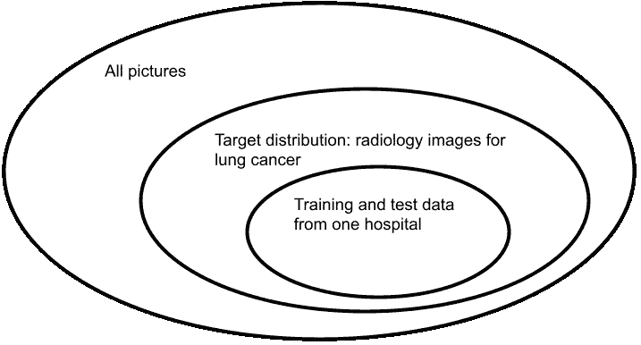
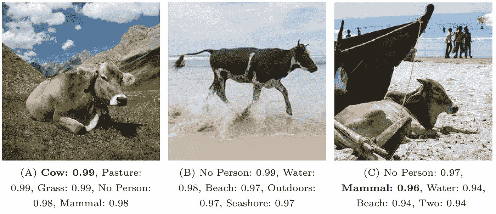
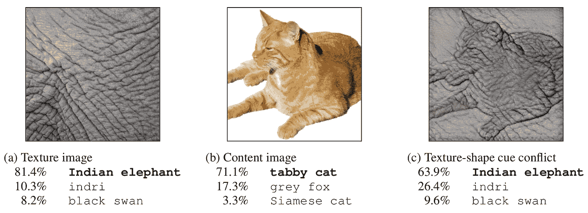
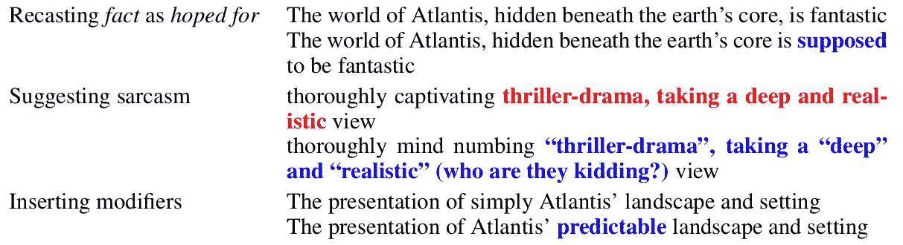
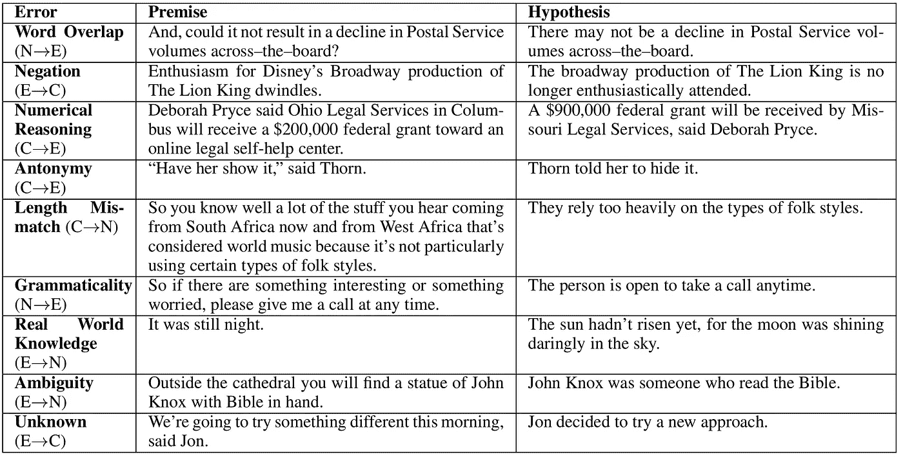

# 重新发现单元测试:ML 模型的测试能力

> 原文：<https://towardsdatascience.com/rediscovering-unit-testing-testing-capabilities-of-ml-models-b008c778ca81?source=collection_archive---------18----------------------->

## 身份鉴定有什么问题吗？我们如何识别能力？我们如何创建测试？该模型能推广到非分布数据吗？

受两篇论文[1，2]的启发，我最近一直在阅读和思考关于机器学习模型的测试。除了测量模型的平均预测精度之外，似乎还有一种测试模型能力的增长趋势，这让我想起了许多单元测试，并强烈地改变了如何考虑模型评估。

简而言之，我们可以尝试评估模型是否学习了某些*能力*，通常是问题的关键概念，要避免的常见错误的模式，或者人类如何处理任务的策略，而不是仅仅测量某个*目标人群*中的概括。我们可以测试一个模型是否已经分别学习了这些能力，这不同于标准的准确性评估，更类似于黑盒单元测试。总的来说，希望是*一个已经学习了预期能力的模型将对非分布数据和攻击更加健壮*。

# 传统精度评估及其假设

为了理解测试能力的相关性，理解传统准确性评估背后的假设和限制是很重要的。

示例机器学习挑战:在放射学图像中检测癌症。图片:[伊万·萨姆科夫](https://www.pexels.com/photo/man-people-woman-hand-4989186/)

首先，在评估模型时，我们不是测试模型对于所有输入是否都是"**正确的**(我们通常甚至没有一个规范来确定正确可能意味着什么)，而是测试它对于来自目标人群的输入是否**适合**，或者它对于一个问题是否**有用**。记住*[*所有的模型都是错的，但有些是有用的*](https://ckaestne.medium.com/model-quality-defining-correctness-and-fit-a8361b857df)*——*我们在努力识别有用的。一个准确率为 95%的模型可能非常适合一个问题，而对于一个问题的有用解决方案来说，5%的错误是可以接受的，比如说在放射图像中检测癌症。*

*第二，我们评估独立于训练数据的测试数据的模型，以测量该模型对看不见的数据的概括程度。重要的是，我们不关心对任何数据的推广，而只关心对来自 T2 目标人群的数据的推广。例如，我们不会期望癌症检测模型在风景摄影上工作得很好，但是我们希望它在用某些设备拍摄的放射学图像上工作得很好。与目标人群不匹配的数据称为**非分布**数据。*

*许多机器学习理论和实践中的一个关键假设(不总是明确的；我花了一段时间才意识到)就是训练和测试数据都是*独立抽取自同一个目标人群***——**独立同分布**或简称 **i.i.d.** 。主要策略是从目标人群中收集单个数据集，然后将其随机分为训练数据和测试数据，确保两者来自同一分布。任何 *i.i.d .评估策略*都将衡量该模型在该人群中的推广程度。也就是说，我们从我们想要推广的目标人群中选择训练数据，比如一家医院的放射学图像，然后根据从相同人群中提取的测试数据对其进行评估，以**衡量该模型在该目标人群** 中推广*的效果。****

***重要的是，如果训练和测试数据不是预期目标人群的代表性、无偏见的样本，整个方案就会失败。例如，如果我们希望我们的癌症检测器适用于所有类型的设备和患者统计数据，但我们在单个医院的单个扫描仪的扫描上对其进行了训练和测试，我们的模型可能会很好地推广到用于训练和测试的分布，但可能仍然不能很好地用于预期的目标人群。数据收集方式的系统偏差和目标分布随时间的变化是我们的培训和测试分布可能与目标分布不一致的进一步原因——这是在尝试部署机器学习解决方案时常见的问题。***

******

***训练和测试数据并不总是代表全部目标人群。除了目标人群，当然还有许多与问题无关的输入。图片作者。***

# ***超越训练分布的一般化***

***理想情况下，**我们希望模型能够很好地推广到看不见的数据，甚至是与模型的训练数据**所代表的群体不完全匹配的数据。如果我们想将一个问题从一个群体转移到另一个群体，比如说，在一家医院的设备和患者上训练的癌症模型转移到在其他设备上拍摄的放射学图像，或者转移到在原医院中没有很好代表的患者人口统计数据，这是很有用的。当世界和目标人群发生变化时，例如当一种新的时尚饮食导致非癌性放射学成像伪影的异常形式时，这种伪影在收集训练数据时或当新的放射学硬件被不同地校准时是不存在的，这同样是有用的。***

***事实上，与之前对 i.i.d .数据的离线评估相比，在生产中看到机器学习模型的准确性较低是非常常见的。生产数据的分布通常不同于训练数据的分布，这可能是因为最初没有代表性地采样，或者是因为随着世界的发展，分布发生了变化。***

***人们可以争辩说(许多机器学习研究人员也有力地争辩说)*我们没有理由批评一个对非分布数据做出错误预测的模型*。这类似于批评一个小学生在高中数学考试中没有取得好成绩。为什么我们会期望一个模型对我们还没有教会它的事情做出准确的预测？***

***对实际目标分布中的不良表现的典型反应是收集更多的训练数据以更好地代表目标分布，在采样方法中寻找潜在的偏差以确保代表性，并随着目标分布的变化更新训练和测试数据。***

***然而，我们希望我们可以找到一种训练模型的方法，使它们能够更好地泛化，甚至超越训练数据，这样，这些模型对训练数据收集中的潜在偏差更加鲁棒，对分布变化甚至敌对攻击更加鲁棒。***

# ***能力的承诺***

***最近在一些文献中出现的一种识别模型的策略是，尝试区分已经学习了人类发现对解决任务至关重要的关键**能力**的模型。简单地说，我们正在寻找更好地反映人类解决问题的策略的模型(或使用我们对该问题的其他形式的领域知识)，希望这些模型比模型可能提出的任何替代策略都更健壮。***

***功能本质上是特定于领域的，我看到的大多数讨论都是围绕 NLP 任务进行的，但这里有几个不同的例子:***

*   ***在情感分析中，一个模型应该能够理解*否定*、*表情符号*，以及*讽刺*。***
*   ***在对象检测中，模型不应该主要依赖于图像的背景，而应该更喜欢形状而不是纹理(就像人类一样)。***
*   ***在问题回答中，模型应该能够推理出*数字*和*同义词*，而不应该仅仅因为问题和答案之间的单词重叠而分心。***
*   ***在癌症检测中，模型应该像放射科医生一样在相同的区域寻找相同的模式。***

******

***对象检测模型应该在不受背景干扰的情况下推理所讨论的对象。Beery 等人【9】的例子和图片。***

***简而言之，关于这种做法可能奏效的理由如下:***

1.  *****对于每个训练问题，我们可以找到许多不同的模型，这些模型在训练和测试数据的分布上具有相似的准确性，但它们学习的模式非常不同。**其中一些模型比其他模型更能概括非分布数据。事实上，引导我进入这个兔子洞的谷歌论文[2]有几十个例子显示了许多学习问题的这种模式。***
2.  ***一些模型学习特定于用于训练和测试的分布的数据模式，但是不针对更大的问题进行推广。 数据集上捷径学习的例子比比皆是:物体检测器检测到草地上的奶牛，却检测不到沙滩上的奶牛，因为训练数据从来不包括沙滩上的奶牛[9]；坦克探测器[的城市传说](https://www.gwern.net/Tanks)学会了如何识别天气而不是坦克，因为所有有坦克的训练数据都是在晴天拍摄的，没有坦克的数据都是在雨天拍摄的；癌症检测器了解图像是在移动还是固定扫描仪上拍摄的，根据人类的判断判断患者是否足够健康，可以移动到扫描仪上[10]。在所有这些情况下，模型都找到了在训练和测试数据中运行良好的模式，但这仅仅是因为收集数据的方式不能代表模型最终应该使用的目标分布。***
3.  *****我们希望我们认为对解决问题很重要的学习模式，比如上面列出的能力，能够更好地推广。**基本原理是，能力代表我们已经拥有的领域知识，而不仅仅是在特定数据集中发现的模式，这些模式可能代表数据收集方式偏差导致的数据捷径。例如，我们期望在物体检测器中检测牛的形状应该是比分析图像的背景更健壮的机制。***
4.  ***因此，每当我们在具有相似精确度的多个模型之间进行选择时，我们应该选择具有更好学习相关能力的模型。我们甚至可能想要引导我们的训练(例如，通过模型结构、归纳偏差或训练数据扩充)来学习这些能力。请注意，这种方法并不像在符号人工智能的好日子里那样，只针对*推理和固定的能力列表。我们仍然从训练数据中学习模型，这些数据可能会发现各种模式，其中许多模式人类可能永远不会发现，但我们控制这个过程，以包括一些模式，这些模式为模型提供一些我们认为重要的功能，并将使模型更加健壮。****

# ***测试能力***

***让我们暂时搁置我们如何识别能力，假设我们已经知道我们想要测试的能力，比如情绪分析中的*理解否定*。同样，我们不测试模型是否正确地学习了功能*(即，我们不寻找单独的反例)，而是评估模型*对于受益于该功能的问题有多适合*。****

****为了测试一个能力，我们**管理特定于能力的测试数据**，独立于传统上用于一般准确性评估的 i.i.d .测试数据，并与训练数据的分布相匹配。也就是说，我们为每个功能单独创建测试数据，这样，拥有该功能的模型将比没有该功能的模型在该测试数据上实现更高的预测准确性。****

****有几种不同的策略:****

*   ******特定领域生成器:**一个非常常见的策略是从模板中生成测试数据，或者用特定的策略来生成需要该能力的数据示例[1，3，5，8]。比如测试一个情感分析模型是否理解否定，模板*“I { NEGATION } { POS _ VERB } the { THING }。”*可以自动填充各种否定、动词和事物，以生成许多测试句子，如*“我不喜欢这种食物”*这些句子都包含否定，并且都被认为具有消极情绪，尽管有积极的词语[1]。作为另一个例子，生成器可以创建具有一个对象的形状但填充了另一个对象的纹理的人工图像，以测试对象识别模型偏好形状而非纹理的能力[5]。人们通常需要为每个功能编写一个或多个生成器。****

********

****人工生成一张纹理-形状冲突的图片，以测试模型优先考虑形状而不是纹理的能力。Geirhos 等人【5】的例子和图片。****

*   ******改变现有的输入:**不是从零开始生成测试输入，而是通过修改现有的输入来生成新的测试输入[3，6]。例如，为了测试 NLP 模型理解同义词的能力，我们可以用同义词替换现有标记句子中的单词，以创建具有相同标签的新测试数据。对于与噪音和干扰相关的功能，我们也可以轻松地修改输入，为句子添加中性信息(例如，添加*“和假不真”* [3]或随机 URL[1])或自动引入错别字[3]。如果能力可以被表达为不变量(见[变形测试](https://ckaestne.medium.com/a-software-testing-view-on-machine-learning-model-quality-d508cb9e20a6))来描述一个模型的预测对于某些类型的修改应该如何改变(或不改变)，那么突变是特别有效的。****
*   ******众包测试创建:**当我们不能自动生成真实的测试时，我们可以让人类参与到任务中[4，6]。例如，这种策略可以用于测试情绪分析模型理解讽刺的能力，方法是要求人群工作者通过引入讽刺来最小程度地修改电影评论以翻转其情绪[6]；对于一个物体探测器，我们可以让人群工作者用不同的，可能是意想不到的背景来拍摄一个物体的照片[4]。在每种情况下，我们都需要为人类创建特定的指令，以创建挑战我们感兴趣的特定能力的测试用例。****

********

****人群工作者为改变一个句子(红色替换为蓝色)的情绪而做出的微小改变的例子，需要模型具有区分事实和希望、检测讽刺和理解修饰语的能力。来自 [Kaushik 等人](https://openreview.net/pdf/6267805abf4a2ab7b3f971c759b8c669e6060774.pdf)【6】的示例****

*   ******切片测试数据:**最后，我们还可以在一个大的测试数据池中搜索与我们的能力相关的测试实例，例如，所有包含否定的句子。如果我们想避免从原始测试数据中取样，我们也可以在生产中收集以前未标记的数据，识别潜在的挑战性案例，然后将它们标记为我们能力的测试数据。这种[测试数据切片](https://ckaestne.medium.com/a-software-testing-view-on-machine-learning-model-quality-d508cb9e20a6)的策略在测试模型中已经很常见，用于检查重要子群体的准确性和公平性——它也可能用于功能。****

****这些为能力筛选测试数据的策略都不便宜。除了已经为获取原始训练和测试数据所做的投资之外，编写生成器或雇佣人员来创建或标记测试数据涉及到大量的工作和成本。然而，正如所讨论的，希望在这些能力上做得更好的模型在训练数据的分布之外概括得更好，从多篇论文中得到有希望的结果。****

****旁白:培训与测试。这里的大多数讨论都有培训和测试的双重见解。正如我们可以筛选测试数据来测试模型是否已经学习了特定的能力，我们通常可以使用相同的过程来生成额外的训练数据，以驱动训练来更好地学习该能力。这种数据扩充是常见的，并且超出了 *i.i.d.* 的假设，就像测试能力一样，但是潜在地具有相同的好处。为了避免陷入另一个兔子洞，我不打算进入不同的数据增强策略以及它们如何与能力相关联，但是我期望能力方面的思考可能不仅是制定测试策略的途径，也是培训策略的途径。相反，数据扩充论文[例如，6]可以从识别能力的角度阅读，也可以为测试提供灵感。****

# ****识别能力****

****现在剩下的最后一个问题是:**我们如何识别要测试的能力？**令人惊讶的是，我没有看到任何论文明确讨论这一点。许多论文关注特定问题的单个功能或少数功能，并展示测试和检测更好模型的可行性，但通常没有任何理由说明为什么选择该功能而不是其他功能。字里行间似乎有几个不同的想法:****

*   ******分析常见错误:**大多数论文似乎都专注于模型所犯的特定常见错误[3，4，5，8]，其中大多数都是捷径推理，例如当模型使用图像的背景来识别前景中的对象时。一些常见的问题已经被社区很好地理解和广泛地研究，例如 NLP 模型使用单词重叠而不是理解文本的内容[8]或者模型关注纹理而不是形状[5]，使能力成为明确的候选。更系统地说，我们可以仔细分析一个有代表性的错误样本，以确定常见的问题类型，并将这些问题映射到能力——*压力测试*论文[3]就是一个很好的例子:研究人员对自然语言推理任务的模型所犯的 100 个错误进行了人工分类，发现除了单词重叠之外，错误输出通常与否定和反义词、数字推理、歧义和缺失的现实世界知识有关。虽然有些问题，比如缺少真实世界的知识，对模型(和人类)来说确实很难，但其他问题可以更容易地作为模型应该具有的可测试能力来捕获。****

********

****一个自然语言推理模型的错误分析:X->Y 表示 X 是预期的，但 Y 是预测的，选项有蕴涵(E，假设给定前提为真)，矛盾(C，假设给定前提为假)，或中性(N，真值无法确定)。纳伊克等人的表格[3]。****

*   ******利用关于问题的现有知识:**虽然我们通常会使用机器学习，因为我们并不完全了解如何解决问题，但对于许多问题，我们至少有一些部分了解。例如，在深度神经网络出现之前，语言学已经被研究了很长时间，我们知道很多关于，比如说，句子结构，单词如何联系，以及句子的哪些部分比其他部分更重要。许多功能似乎与我们已经拥有的关于问题的理论直接相关，包括来自*清单*论文[1]的 NLP 模型的大多数功能，包括同义词、匿名、识别命名实体、语义角色标记、否定和共指。****
*   ****观察人类:在我们没有领域知识的地方，我们可以研究人类如何解决问题。一个有趣的例子是*Learning the difference that make the difference*论文[4]，该论文观察了当被指示对一个句子进行最小程度的修改以改变其情感时，人类对文本做出了什么样的改变(示例如上图所示)。通过这种方式，他们确定了改变情绪的重要机制(通常但不一定对模型具有挑战性)，这些机制可以映射到能力，如讽刺和区分事实与愿望。****
*   ******源自需求:**一些能力对应于模型或期望目标的需求，通常是最终模型应该保持的不变量。这尤其包括*公平性要求*，这些要求在原始训练数据中可能不成立或不可见。例如，情感分析不应该根据句子中演员的性别而不同。****
*   ******从观察数据中发现因果关系:**机器学习社区的一个子领域专注于编码和发现因果关系，而不仅仅是统计关系[7]。如果我们能够发现和回顾因果关系，许多可能很好地映射到能力。****

****虽然我没有看到任何人明确地提供关于如何识别实际质量保证或模型开发活动的能力的指导，但是对常见问题、关于问题和非 ML 解决方案的知识以及需求的仔细分析似乎可以用来识别许多问题的能力。****

****如果我们最后一次查看癌症检测模型的示例，我们会发现我们可以使用这些策略中的许多策略:我们可能会发现，当亮度没有在多个扫描仪上校准时，现有的解决方案表现不佳(分析模型错误)，因此识别模型应该对不同亮度水平具有鲁棒性的能力，我们可以将这种能力很好地转化为测试数据，以识别那些学习这种能力的模型。我们可能会问放射科医生*为什么*他们不同意一个模型，以了解更多专家使用的模型可能缺少的功能(观察人类)。此外，我们可能还应该研究深度学习之前的文献，比如 90 年代早期医学成像研究中使用的策略，这些策略通常利用对问题的特定见解作为手工制作的数学模型的一部分。此外，关于癌症诊断的非机器学习文献也可能识别放射科医师在放射科医师的经验研究或放射科医师的培训材料(现有知识)中寻找癌症时使用的能力。****

****为了总结这一点，现在让我回到单元测试:识别功能，然后为它创建测试数据，这与创建单元测试时选择输入没有什么不同。虽然我们对机器学习问题没有强有力的规范，但我们对这个问题和过去的错误有一些了解。识别能力就像在不看程序实现的情况下为程序选择测试输入一样，被称为**黑盒测试**或基于规格的测试。从常见错误中识别功能，并开发测试以确保它们通常在未来的模型中被避免，这类似于**回归测试**，开发人员添加测试用例以避免未来的变化破坏现有的功能。****

# ****读物****

****[1]里贝罗、、吴同双、卡洛斯·盖斯特林和萨梅尔·辛格。"[超越准确性:使用清单](https://homes.cs.washington.edu/~wtshuang/static/papers/2020-acl-checklist.pdf)对 NLP 模型进行行为测试."美国 ACL 会议论文集，第 4902–4912 页。(2020).****

****[2] D'Amour，Alexander，Katherine Heller，Dan Moldovan，Ben Adlam，Babak Alipanahi，Alex Beutel，Christina Chen 等.[指定不足对现代机器学习的可信度提出了挑战](https://arxiv.org/abs/2011.03395)。arXiv 预印本 arXiv:2011.03395 (2020)。****

****[3]纳伊克、阿坎克沙、阿比拉莎·拉维钱德尔、诺曼·萨德赫、卡罗琳·罗斯和格雷厄姆·纽比格。"[自然语言推理的压力测试评估](https://www.aclweb.org/anthology/C18-1198.pdf)"第 27 届计算语言学国际会议论文集，第 2340–2353 页(2018)。****

****[4]巴尔布、安德烈、戴维·梅奥、朱利安·阿尔韦里奥、威廉·罗、克里斯托弗·王、丹尼·古特弗罗因德、约书亚·特南鲍姆和鲍里斯·卡茨。 [ObjectNet:一个大规模偏倚控制的数据集，用于推动对象识别模型的极限](https://openreview.net/forum?id=SkgnRNHgIS)。进行中。NeurIPS (2019)。****

****[5]盖尔霍斯、罗伯特、帕特里夏·卢比什、克劳迪奥·米切里斯、马蒂亚斯·贝赫、费利克斯·a·威奇曼和维兰德·布伦德尔。" [ImageNet 训练的 CNN 偏向于纹理；增加形状偏差可以提高精确度和鲁棒性](https://arxiv.org/pdf/1811.12231)。进行中。学习代表国际会议(ICLR)(2019)。****

****[6] Kaushik、Divyansh、Eduard Hovy 和 Zachary C. Lipton。"[学习与反事实增强数据](https://openreview.net/pdf/6267805abf4a2ab7b3f971c759b8c669e6060774.pdf)的差异。"进行中。学习表征国际会议(ICLR)(2020)。****

****[7]谢尔科普夫，伯恩哈德。"[机器学习的因果关系](https://arxiv.org/abs/1911.10500)" *arXiv 预印本 arXiv:1911.10500* (2019)。****

****[8]麦科伊、r .托马斯、埃莉·帕夫利克和塔尔·林森。[正确的原因是错误的:诊断自然语言推理中的句法启发](https://arxiv.org/pdf/1902.01007)。继续。ACL (2019)。****

****[9]贝利、萨拉、格兰特·范·霍恩和彼得罗·佩罗娜。"[未知领域中的识别](https://openaccess.thecvf.com/content_ECCV_2018/html/Beery_Recognition_in_Terra_ECCV_2018_paper.html)"在*欧洲计算机视觉会议(ECCV)* 的会议记录中，第 456–473 页。2018.****

****[10] Agrawal、Ajay、Joshua Gans 和 Avi Goldfarb。*预测机器:人工智能的简单经济学*。哈佛商业出版社，2018。****

******PS:关于命名的一句话。测试能力的想法隐含在许多论文和讨论中，但很少被有意命名为策略。我找到的论文，大部分是通过跟踪其他论文中的参考文献找到的。纳伊克等人[3]将测试能力的思想介绍为*“压力测试模型”，*甚至引用了一些软件工程教科书；*不规范*论文[2]采用了该术语。不过，我发现“压力测试”具有误导性:压力测试通常是指在高负载和随机性下测试性能和错误处理，但往往不太结构化。*清单*论文【1】引入了术语*“测试能力”，*我更喜欢这个术语。*“能力”*的概念表明，有多种不同的特征应该被测试，而不会与*“需求”*和*“规格”*混淆，这是我们在处理机器学习问题时经常不具备的。此外，我认为[黑盒单元测试](https://en.wikipedia.org/wiki/Software_testing#Black-box_testing)通常是一个有用的类比，因为我们正在测试系统的单个单元(模型),并且我们在不知道模型内部的情况下以某种系统化的方式这样做，一次一个能力。******