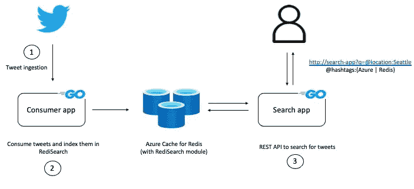
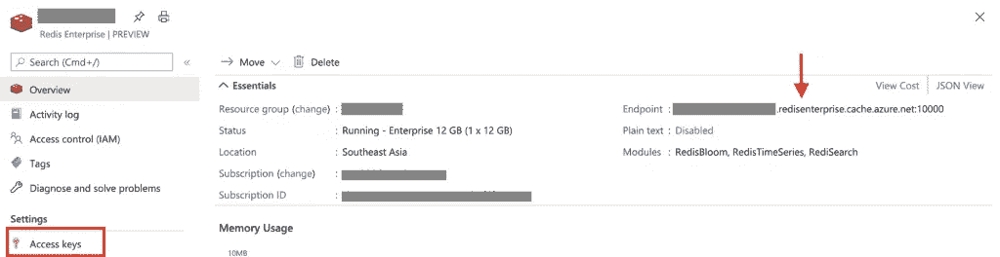

# 行动中的再研究

> 原文：<https://towardsdatascience.com/redisearch-in-action-redis-labs-52b170b56b43?source=collection_archive---------37----------------------->

## 一个实际的例子:实时摄取推文，并使用 Redis 灵活地查询它们

[Redis](https://redis.io/) 有一套[通用的数据结构](https://redis.io/topics/data-types-intro)，从简单的[字符串](https://redis.io/topics/data-types-intro#redis-strings)一直到强大的抽象，如 [Redis 流](https://redis.io/topics/streams-intro)。原生数据类型可以带您走很长一段路，但是有些用例可能需要一个解决方法。一个例子是 Redis 中使用二级索引的要求，以便超越基于关键字的搜索/查找，获得更丰富的查询功能。虽然您可以[使用有序集合、列表等等来完成工作](https://redis.io/topics/indexes)，但是您需要考虑一些权衡。

输入[重新搜索](https://oss.redislabs.com/redisearch/)！Redis 模块提供的 RediSearch 提供了灵活的搜索功能，这要归功于一流的二级索引引擎。它提供了强大的功能，如全文搜索、自动完成、地理索引等等。

为了展示 rede search 的强大功能，这篇博客文章提供了一个实际的例子，说明如何在使用[rede search Go 客户端](https://github.com/RediSearch/redisearch-go)构建的 [Go](https://golang.org/) 服务的帮助下，通过 [Azure Cache for Redis](https://docs.microsoft.com/azure/azure-cache-for-redis/cache-overview?WT.mc_id=data-13024-abhishgu) 使用 rede search。它旨在给你一套应用程序，让你实时摄取推文，并使用 RediSearch 灵活地查询它们。

具体来说，您将学习如何:

*   使用重新搜索索引
*   使用不同的重新搜索数据类型，如`TEXT`、`NUMERIC`、`TAG`等
*   如何构建一个应用程序来显示重新搜索功能
*   如何用几个命令将服务组件部署到 Azure
*   通过查询 RediSearch 分析推文数据

# 应用概述

如前所述，示例服务允许您实时使用 tweets，并通过 RediSearch 进行查询。



(图片由作者提供)

它有两个组成部分:

1.  **消费者/索引器:**读取 Twitter 流 API，创建索引，并在到达时不断添加 tweet 数据(在 Redis 散列中)。
2.  **搜索服务:**REST API，允许你使用再搜索[查询语法](https://oss.redislabs.com/redisearch/Query_Syntax/)搜索推文。

现在，我将深入探讨如何启动并运行该解决方案，以便您可以看到它的实际应用。然而，如果你有兴趣了解各个组件是如何工作的，请参考下面的部分的**代码遍历，以及本博客的 GitHub repo:[https://github.com/abhirockzz/redisearch-tweet-analysis](https://github.com/abhirockzz/redisearch-tweet-analysis)。**

**先决条件**

1.  首先，你需要一个微软 Azure 账户:[在这里免费获得一个](https://azure.microsoft.com/free/?WT.mc_id=data-13024-abhishgu)！
2.  上面列出的服务组件将使用本地 Docker CLI 命令部署到 [Azure 容器实例](https://docs.microsoft.com/azure/container-instances/container-instances-overview?WT.mc_id=data-13024-abhishgu)。Docker 和 Azure 之间的集成实现了这一功能。
3.  你需要 Docker 桌面版 2.3.0.5 或更高版本，用于 [Windows](https://desktop.docker.com/win/edge/Docker%20Desktop%20Installer.exe) 、 [macOS](https://desktop.docker.com/mac/edge/Docker.dmg) ，或者安装 [Docker ACI 集成 CLI 用于 Linux](https://docs.docker.com/engine/context/aci-integration/#install-the-docker-aci-integration-cli-on-linux) 。要使用 Twitter 流 API，您还需要一个 Twitter 开发者帐户。如果您还没有，请[遵循这些说明](https://developer.twitter.com/en/apply-for-access)。

首先，使用这个快速入门教程在 Azure 上设置 Redis 企业级缓存。完成设置后，确保手头有 Redis 主机名和访问密钥:



我们服务的两个组件都可以作为 Docker 容器获得:Tweet 索引服务和搜索 API 服务。(如果您需要构建自己的 Docker 映像，请使用 GitHub repo 上提供的相应 Docker 文件。)

现在，您将看到将这些部署到 [Azure 容器实例](https://docs.microsoft.com/azure/container-instances/?WT.mc_id=data-13024-abhishgu)是多么方便，这允许您在托管的、无服务器的 Azure 环境中按需运行 Docker 容器。

# 部署到 Azure

```
version: "2"
services:
  tweets-search:
    image: abhirockzz/redisearch-tweets-search
    ports:
      - 80:80
    environment:
      - REDIS_HOST=<azure redis host name>
      - REDIS_PASSWORD=<azure redis access key>
      - REDISEARCH_INDEX_NAME=tweets-index
  tweets-indexer:
    image: abhirockzz/redisearch-tweets-consumer
    environment:
      - TWITTER_CONSUMER_KEY=<twitter api consumer key>
      - TWITTER_CONSUMER_SECRET_KEY=<twitter api consumer secret>
      - TWITTER_ACCESS_TOKEN=<twitter api access token>
      - TWITTER_ACCESS_SECRET_TOKEN=<twitter api access secret>
      - REDIS_HOST=<azure redis host name>
      - REDIS_PASSWORD=<azure redis access key>
      - REDISEARCH_INDEX_NAME=tweets-index
```

一个`docker-compose.yml`文件定义了各个组件(tweets-search 和 tweets-indexer)。你所需要做的就是更新它来替换你的 Azure Redis 实例的值以及你的 Twitter 开发者帐户凭证。这是完整的文件:

[创建 Azure 上下文](https://docs.microsoft.com/azure/container-instances/quickstart-docker-cli?WT.mc_id=data-13024-abhishgu#create-azure-context):

```
docker login azure 
docker context create aci aci-context 
docker context use aci-context
```

克隆 GitHub repo:

```
git clone https://github.com/abhirockzz/redisearch-tweet-analysis 
cd redisearch-tweet-analysis
```

将两个服务组件作为[容器组](https://docs.microsoft.com/azure/container-instances/container-instances-container-groups?WT.mc_id=data-13024-abhishgu)的一部分进行部署:

```
docker compose up -p azure-redisearch-app
```

*注意，Docker 编写当前在 ACI 环境中可用的命令以* `*docker compose*` *开始。那跟* `*docker-compose*`不一样*用连字符。*

您将看到类似如下的输出:

```
[+] Running 1/3 
⠿ Group azure-redisearch-app Created 8.3s ⠸ tweets-search Creating 6.3s ⠸ tweets-indexer Creating 6.3s
```

等待服务启动，你也可以查看 [Azure 门户](https://docs.microsoft.com/azure/container-instances/container-instances-quickstart-portal?WT.mc_id=data-13024-abhishgu#view-container-logs)。一旦这两个服务都启动并运行，您可以检查它们各自的日志:

```
docker logs azure-redisearch-app_tweets-indexer 
docker logs azure-redisearch-app_tweets-search
```

如果一切顺利，推特消费者服务应该已经启动。它将读取一系列推文，并将它们保存到 Redis。

# 关键时刻到了。

是时候查询推文数据了。为此，您可以使用 IP 地址和完全限定的域名(FQDN)访问 Azure 容器实例中的 REST API(在[容器访问](https://docs.microsoft.com/azure/container-instances/container-instances-overview?WT.mc_id=data-13024-abhishgu#container-access)中了解更多)。要找到 IP，运行`docker ps`并检查输出中的`PORTS`部分

您现在可以运行各种查询了！在开始之前，这里有一个可以在搜索查询中使用的索引属性的快速概念:

```
**id** - this is a the Tweet ID ( TEXT attribute) 
**user** - the is the screen name ( TEXT attribute) 
**text** - tweet contents ( TEXT attribute) 
**source** - tweet source e.g. Twitter for Android, Twitter Web App, Twitter for iPhone ( TEXT attribute) 
**hashtags** - hashtags (if any) in the tweet (available in CSV format as a TAG attribute) 
**location** - tweet location (if available). this is a user defined location (not the exact location per se) 
**created** - timestamp (epoch) of the tweet. this is NUMERIC field and can be used for range queries 
coordinates - geographic location (longitude, latitude) if made available by the client ( GEO attribute)
```

(注意，我在下面的例子中使用了[卷曲](https://curl.se/)

设置搜索服务 API 的基本 URL:

```
export REDISEARCH_API_BASE_URL=<for example, http://20.197.96.54:80/search>
```

启动 simple 并查询所有文档(使用`*` ):

```
curl -i $REDISEARCH_API_BASE_URL?q=*
```

您将看到类似如下的输出:

```
HTTP/1.1 200 OK 
Page-Size: 10 
Search-Hits: 12 
Date: Mon, 25 Jan 2021 13:21:52 GMT 
Content-Type: text/plain; charset=utf-8 
Transfer-Encoding: chunked 
//JSON array of documents (omitted)
```

注意头文件`Page-Size`和`Search-Hits`:这些是从应用程序传递来的自定义头文件，主要用于演示分页和限制。对于我们的“获取所有文档”查询，我们在 Redis 中找到了 12 个结果，但是 JSON 主体返回了 10 个条目。这是因为 RediSearch Go API 的默认行为，您可以使用不同的查询参数来更改该行为，例如:

```
curl -i "$REDISEARCH_API_BASE_URL?q=*&offset_limit=0,100" 

offset_limit=0,100 will return up to 100 documents ( limit ) starting with the first one ( offset = 0).
```

或者，例如，搜索从`iPhone`发来的推文:

```
curl -i "$REDISEARCH_API_BASE_URL?q=@source:iphone"
```

您可能不总是需要查询结果中的所有属性。例如，这就是如何取回用户(Twitter 屏幕名称)和 tweet 文本:

```
curl -i "$REDISEARCH_API_BASE_URL?q=@location:india&fields=user,text"
```

对用户名进行查询怎么样(例如从`jo`开始):

```
curl -i "$REDISEARCH_API_BASE_URL?q=@user:jo*"
```

您也可以在查询中使用属性的组合:

```
bash curl -i $REDISEARCH_API_BASE_URL?q=@location:India @source:android
```

不如我们找找有特定标签的推文？可以使用多个 hashtags(用`|`分隔)？

```
curl -i "$REDISEARCH_API_BASE_URL?q=@hashtags:\{potus|cov*\}"
```

想知道最近有多少带有`biden`标签的推文被创建了吗？使用范围查询:

```
curl -i "$REDISEARCH_API_BASE_URL?q=@hashtags:{biden} @created:[1611556920000000000 1711556930000000000]"
```

如果你幸运地在 tweets 上获得了一些坐标信息，你可以尝试提取它们，然后查询坐标属性:

```
docker compose down -p azure-redisearch-app
```

这些只是几个例子。请随意进一步试验，尝试其他查询。[重新搜索文档中的这一部分](https://oss.redislabs.com/redisearch/Query_Syntax/#a_few_query_examples)可能会派上用场！

# 打扫

**重要提示:**完成后，不要忘记停止 Azure 容器实例中的服务和各自的容器:

使用 Azure 门户[删除您已经创建的 Azure Redis 实例](https://docs.microsoft.com/azure/azure-cache-for-redis/cache-go-get-started?WT.mc_id=data-13024-abhishgu#clean-up-resources)。

# 代码遍历

本节提供了单个组件代码的高级概述。这将使在 GitHub repo 中导航源代码变得更加容易。

**推文消费者/索引器:**

[go-twitter 库](https://github.com/dghubble/go-twitter)已经用于与 twitter 交互。

它向 Twitter 流 API 认证:

```
config := oauth1.NewConfig(GetEnvOrFail(consumerKeyEnvVar), GetEnvOrFail(consumerSecretKeyEnvVar)) 
token := oauth1.NewToken(GetEnvOrFail(accessTokenEnvVar), GetEnvOrFail(accessSecretEnvVar)) 
httpClient := config.Client(oauth1.NoContext, token) 
client := twitter.NewClient(httpClient)
```

并在单独的 goroutine 中收听一系列推文:

```
demux := twitter.NewSwitchDemux() 
demux.Tweet = func(tweet *twitter.Tweet) { 
  if !tweet.PossiblySensitive { 
    go index.AddData(tweetToMap(tweet)) 
    time.Sleep(3 * time.Second) 
  } 
} 
go func() { 
  for tweet := range stream.Messages { 
    demux.Handle(tweet) 
  } 
}()
```

注意`go index.AddData(tweetToMap(tweet))`——这是索引组件被调用的地方。它连接到 Redis 的 Azure 缓存:

```
host := GetEnvOrFail(redisHost) 
password := GetEnvOrFail(redisPassword) 
indexName = GetEnvOrFail(indexNameEnvVar) pool = &redis.Pool{Dial: func() (redis.Conn, error) { 
  return redis.Dial("tcp", host, redis.DialPassword(password), redis.DialUseTLS(true), redis.DialTLSConfig(&tls.Config{MinVersion: tls}
  }
```

然后，在重新创建索引之前，它会删除索引(以及现有的文档):

```
rsClient := redisearch.NewClientFromPool(pool, indexName) err := rsClient.DropIndex(true) schema := redisearch.NewSchema(redisearch.DefaultOptions). 
AddField(redisearch.NewTextFieldOptions("id", redisearch.TextFieldOptions{})). 
AddField(redisearch.NewTextFieldOptions("user", redisearch.TextFieldOptions{})). 
AddField(redisearch.NewTextFieldOptions("text", redisearch.TextFieldOptions{})). 
AddField(redisearch.NewTextFieldOptions("source", redisearch.TextFieldOptions{})). 
//tags are comma-separated by default 
AddField(redisearch.NewTagFieldOptions("hashtags", redisearch.TagFieldOptions{})). 
AddField(redisearch.NewTextFieldOptions("location", redisearch.TextFieldOptions{})). 
AddField(redisearch.NewNumericFieldOptions("created", redisearch.NumericFieldOptions{Sortable: true})). 
AddField(redisearch.NewGeoFieldOptions("coordinates", redisearch.GeoFieldOptions{})) indexDefinition := redisearch.NewIndexDefinition().AddPrefix(indexDefinitionHashPrefix) err = rsClient.CreateIndexWithIndexDefinition(schema, indexDefinition)
```

索引及其相关文档被删除，以便您可以从一个干净的状态开始，这使得实验/演示更加容易。如果您愿意，可以选择注释掉这一部分。

使用`HSET`操作将每条 tweet 的信息存储在`HASH`(名为`tweet:<tweet ID>`)中:

```
func AddData(tweetData map[string]interface{}) { 
conn := pool.Get() 
hashName := fmt.Sprintf("tweet:%s", tweetData["id"]) 
val := redis.Args{hashName}.AddFlat(tweetData) 
_, err := conn.Do("HSET", val...) 
}
```

Tweets 搜索公开了一个 REST API 来进行查询重搜索。所有选项(包括查询等。)是以查询参数的形式传递的。比如[*http://localhost:8080/search？q = @来源:iphone* 。](http://localhost:8080/search?q=@source:iphone.)提取所需的查询参数:

```
qParams, err := url.ParseQuery(req.URL.RawQuery) 
if err != nil { 
log.Println("invalid query params") 
http.Error(rw, err.Error(), http.StatusBadRequest) 
return 
} 
searchQuery := qParams.Get(queryParamQuery) 
query := redisearch.NewQuery(searchQuery)
```

`q`参数是强制的。但是，您也可以使用以下参数进行搜索:

*   **字段**:指定你想在结果中返回哪些属性，
*   **offset_limit** :如果您想要指定您想要搜索的位置的偏移量以及您想要包含在结果中的文档数量(默认情况下，offset 为 0，limit 为 10 —根据 RediSearch Go 客户端)。

例如:

```
http://localhost:8080/search?q=@source:Web&fields=user,source&offset_limit=5,100 
fields := qParams.Get(queryParamFields) 
offsetAndLimit := qParams.Get(queryParamOffsetLimit)
```

最后，结果被迭代并作为 JSON(文档数组)传回:

```
docs, total, err := rsClient.Search(query) 
response := []map[string]interface{}{} 
for _, doc := range docs { 
response = append(response, doc.Properties) 
} 
rw.Header().Add(responseHeaderSearchHits, strconv.Itoa(total)) 
err = json.NewEncoder(rw).Encode(response)
```

本节到此为止！

# Azure Cache for Redis 上的 Redis 企业层

Redis Enterprise 作为 Azure 上的原生服务，以两个新的 Redis Azure 缓存层的形式提供[这两个缓存层由微软和 Redis 实验室运营和支持。这项服务使开发人员能够访问 Redis 企业版的丰富功能，包括像 RediSearch 这样的模块。有关更多信息，请参见以下资源:](https://aka.ms/azure-redis-enterprise-tiers)

*   [面向 Redis 企业级的 Azure 缓存现已正式推出](https://redislabs.com/blog/azure-cache-for-redis-enterprise-tiers-general-availability/)
*   [深化我们与微软的合作伙伴关系，在云中发展 Redis 企业](https://redislabs.com/blog/microsoft-partnership-redis-enterprise-cloud/)
*   [微软和 Redis 实验室合作为开发者提供新的 Azure Cache for Redis 功能](https://azure.microsoft.com/blog/microsoft-and-redis-labs-collaborate-to-give-developers-new-azure-cache-for-redis-capabilities/)
*   [Redis 的 Azure Cache 上的 Redis Enterprise 特性](https://azure.microsoft.com/updates/redis-enterprise-features-on-azure-cache-for-redis-coming-soon/)

# 结论

这个端到端的应用程序演示了如何使用索引，接收实时数据以创建文档(tweet 信息),这些文档由 RediSearch 引擎进行索引，然后使用通用的查询语法来提取对这些 tweet 的见解。

想了解当您在 Redis Labs 文档[上搜索一个主题时幕后发生了什么吗？](https://docs.redislabs.com/latest/?_ga=2.77626132.1653715209.1616048817-375979169.1604497376)[查看这篇博文](https://redislabs.com/blog/building-real-time-full-text-site-search-with-redisearch/)了解 Redis 实验室网站如何将全文搜索与 RediSearch 结合在一起！或者，您可能对探索如何在无服务器应用程序中使用 RediSearch 感兴趣。

如果您仍在起步阶段，请访问[重新搜索快速启动页面](https://redislabs.com/modules/redisearch-quick-start/)。

如果您想了解更多关于 Azure Cache for Redis 的企业功能，可以查看以下资源:

*原载于 2021 年 3 月 30 日*[*https://redislabs.com*](https://redislabs.com/blog/redisearch-in-action/)*。*