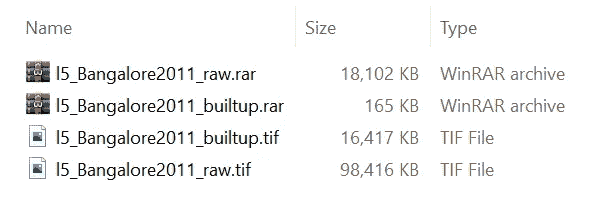

# 使用 Python 减少 GeoTIFF 磁盘空间的使用

> 原文：<https://towardsdatascience.com/reduce-geotiff-disk-space-usage-with-python-3b394b6c0572?source=collection_archive---------18----------------------->

## 导出大型栅格文件的良好实践


[克里斯蒂安·科伦](https://www.flickr.com/photos/132889348@N07)的[【二进制代码】](https://www.flickr.com/photos/132889348@N07/20446713629)在 [CC BY-SA 2.0](https://creativecommons.org/licenses/by-sa/2.0/?ref=ccsearch&atype=rich) 下获得许可

GeoTIFF 文件的大小有时绝对令人头疼。计算资源可用性的激增诱使我们在大量卫星数据上部署(或测试)我们的模型。虽然我们专注于优化代码/模型以有效利用资源，但我们中的许多人往往会忽略一些简单的概念，这些概念可以大大减少 GeoTIFF 文件的磁盘空间使用。在过去的几年里，我曾经犯过这个错误，直到我意识到“良好实践”可以在不影响数据质量的情况下减少 GeoTIFF 文件的大小。

在本教程中，我将使用 Python 的“pyrsgis”包演示两种不同的元素来减小单波段和多波段栅格文件的大小。第一个要素是使用正确的数据类型，第二个要素是使用压缩。

首先，我将使用来自我以前的博客之一的数据，这些数据可以在 GitHub 资源库中找到。您可以下载以下两个文件:

1.  [l5 _ Bangalore 2011 _ raw . rar](https://github.com/PratyushTripathy/Landsat-Classification-Using-Neural-Network/blob/master/l5_Bangalore2011_raw.rar)
2.  [l5 _ Bangalore 2011 _ builtup . rar](https://github.com/PratyushTripathy/Landsat-Classification-Using-Neural-Network/blob/master/l5_Bangalore2011_builtup.rar)

一个以“raw”结尾的是班加罗尔的 Landsat 5 多光谱数据，另一个是二元组合图层。我压缩了 GeoTIFF 文件(大约两年前),以减小 GitHub 上的文件大小。这种方法的问题在于可扩展性——我们不能一直压缩硬盘上的每一个 GeoTIFF 文件。下图显示了驱动器上 RAR 文件和提取内容的大小。



作者图片

# 第一部分:使用正确的数据类型减小文件大小

让我们使用' [*pyrsgis*](https://pyrsgis.readthedocs.io/en/master/) *'* 模块在 Python 中读取这些数据，并检查两个栅格的数据类型。下面的代码块将完成这项工作:

输出:

```
Data type of multispectral file: 6
Data type of single band file: 6
Following data types are supported:
{‘byte’: 1,
 ‘cfloat32’: 10,
 ‘cfloat64’: 11,
 ‘cint16’: 8,
 ‘cint32’: 9,
 ‘float’: 6,
 ‘float32’: 6,
 ‘float64’: 7,
 ‘int’: 3,
 ‘int16’: 3,
 ‘int32’: 5,
 ‘uint8’: 1,
 ‘uint16’: 2,
 ‘uint32’: 4}
```

可以注意到，这两个文件的数据类型都是 6，这是“float32”类型的数据。现在，我知道 Landsat 5 多光谱文件的像元值范围为[0，255]，单波段二进制类文件的值为 0 和 1，但是如果您不知道数据的值范围，可以通过显示最小值和最大值来轻松地做到这一点。

```
Min and max value of multispectral raster: 1.0 255.0
Min and max value of single band raster: -3.4028235e+38 1.0
```

多光谱栅格的范围符合预期，但二进制栅格的最小值不符合预期。这可能是由于栅格边缘附近的任意随机 NoData 像元造成的。可以使用以下代码修复它:

```
Min and max value of single band raster: 0 1
```

现在我们已经很清楚栅格中值的范围，下一个基本问题是正确的数据类型。对于不熟悉数据类型和像素深度(也称为卫星数据的光谱分辨率)的人来说，快速复习一下:数据类型决定了栅格将具有的值的类型，包括值的数量、值的范围、是否可以保存负数或小数等等。

“int8”类型是指包含 2 的 8 次幂整数值(256 个值)的数据。“uint8”数据类型也存储 256 个值，但意味着它只能保存“无符号”值(0 到 255)。而‘int 8’数据类型可以保存从-128 到 127 的值。但是' int8 '和' uint8 '都是整型值。另一个例子是“uint16”数据类型，它可以保存范围从 0 到 65535 的值(65536 个值— 2 的 16 次幂)。现在出现了“float”数据类型，它指的是十进制值，数字“32”和“64”决定了它能容纳多大的数。

这里的关键点是，如果栅格的实际像素值具有较低的像素深度，则存储具有较高像素深度的数据不是明智的选择，因为栅格文件会在驱动器上保留额外的空间。“正确”的方法是用尽可能低的数据类型导出数据。例如，让我们使用 pyrsgis 包将下载的栅格数据导出为“uint8”(也称为“byte”)数据类型。pyrsgis 包的细节可以在文档页面[这里](https://pyrsgis.readthedocs.io/en/master/api.html)找到。

现在在资源管理器中检查文件的大小。


作者图片

通过简单地导出较低数据类型的文件，多光谱栅格从 98 MB 减少到 24 MB，二进制栅格从 16 MB 减少到 4 MB。您可以在 GIS 软件中检查这两个文件，并发现这两个文件完全相同。很明显，使用正确的数据类型可以节省大量的磁盘空间，但是还有更多空间。

# 第二部分:使用压缩减小文件大小

如果我说您可以在不影响数据质量的情况下进一步减小文件的大小，那会怎么样呢？简单的方法是定义栅格文件的压缩类型。虽然压缩听起来像是压缩并创建一个. zip 或。rar 文件，在这种情况下它是不同的。

一些支持的压缩类型有“DEFLATE”和“LZW ”,在使用 pyrsgis 包导出 GeoTIFF 文件时，可以使用“compress”参数传递这些压缩类型。您可以通过使用以下代码来实现这一点。在这里，我使用“紧缩”压缩导出两个栅格。

在浏览器中检查栅格的大小。


作者图片

多光谱文件现在已减少到 19.5 MB，单波段栅格已减少到 165 KB。如果将这与我们开始时的 96 MB 和 16 MB 进行比较，这是磁盘空间使用量的巨大减少，大约比原来的小 5 到 100 倍。

过去使用这两种简单的技术，我已经成功地将 GeoTIFF 文件的大小从大约 58 GB 减少到不到 500 MB(小了 100 倍)。具体来说，58 GB 文件是使用 QGIS 中的*栅格计算器*工具生成的全国 30m 网格化人口栅格。

尝试一下，看看这些如何为你推出。如果您在 Python 中安装 GDAL 或 pyrsgis 包时遇到问题，请查看下面的帖子，该帖子演示了安装和设置环境的自动化方法。

[***Python 和 GDAL 安装自动化适用于 Windows 10***](/python-and-gdal-installation-automated-for-windows-10-f22686595447)

希望这有助于你提高你的游戏:)