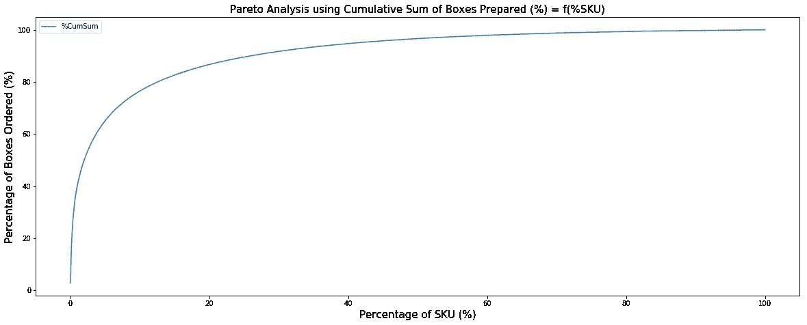

# 使用 Python 根据帕累托原则减少仓库空间

> 原文：<https://towardsdatascience.com/reduce-warehouse-space-with-the-pareto-principle-using-python-e722a6babe0e?source=collection_archive---------20----------------------->

## 使用 python 实现的 80/20 规则如何优化您的布局、降低空间利用率并提高拣选效率


仓库货架布局—(图片由作者提供)

*如果你对供应链数据科学相关的文章感兴趣，可以随意看看我的作品集:*[*【https://samirsaci.com】*](https://samirsaci.com/)

一位名叫维尔弗雷多·帕累托的意大利经济学家在 1906 年提出了一个数学公式来描述意大利的财富分配。他发现 80%的财富属于 20%的人。


维尔弗雷多·帕累托—维基百科([链接](https://fr.wikipedia.org/wiki/Vilfredo_Pareto#/media/Fichier:Vilfredo_Pareto_1870s2.jpg))

几十年后，这一规则已被推广到许多其他应用，包括供应链和物流管理。

这一原则被称为“帕累托原则”、“80-20 法则”或“琐碎的多数和关键的少数法则”，可以翻译为物流从业者

*   贵公司 80%的收入来自 20%的参考
*   80%的货物在 20%的提货地点提货
*   80%的补货量将在 20%的提货地点进行

在本文中，我们将使用一个真实的操作示例来探索如何应用这个[帕累托原则](https://youtu.be/130AKb2DejM)

*   **1** 月份的拣货单
*   **144339**订单行
*   **59372**订单
*   **4864**活动参考

💌新文章直接免费放入你的收件箱:[时事通讯](https://www.samirsaci.com/#/portal/signup)

如果你喜欢看，看看这篇文章的视频版本

# 帕累托原理的可视化

> 你可以在这个 Github 资源库中找到完整的代码:[链接](https://github.com/samirsaci/pareto-warehouse-layout)。
> 我的其他项目组合: [Samir Saci](https://samirsaci.com/)

## I .利用熊猫进行数据处理

你可以在这里下载数据集:[链接](https://gist.github.com/samirsaci/b5237504ac7129dad775ae8e5284570b)。

1.  **导入库和数据集**

**2。计算每 SKU(箱)准备的体积**

为了绘制帕累托图，我们需要

*   合计每个 SKU 挑选的箱子数量
*   按盒子数量降序排列数据框
*   计算盒子的累积和
*   计算 SKU 的累计数量

结果

在第 5 行中，您可以看到 0.1%的 SKU 代表 12.7% (20，987 箱)。

## 二。帕累托原理的可视化

1.  **第一可视化**

使用您处理过的数据框架，让我们现在绘制(%BOX) = f(%SKU)来显示帕累托原理



帕累托原理的可视化(二)——(图片由作者提供)[ [教程](https://youtu.be/130AKb2DejM)

**2。为 80/20** 添加标记

标记 1: x = 20%的 SKU(蓝色)
标记 2: y = 80%的方框(红色)


帕累托原理的可视化(二)——(图片由作者提供)[ [教程](https://youtu.be/130AKb2DejM)

> 洞察力
> 
> 我们可以看到，在拥有 20%的 SKU (sku_80 = 12.55%)之前，已经达到了 80%的量的阈值。

*试着自己看看有多少%的方框代表了 10%的 SKU 被选中。*

<http://samirsaci.com>  

# 如何优化仓库空间？

我们如何利用这些见解来提高您的拣选效率并减少空间占用？

## I .将高转速 SKU 归入专用拣货区


基于提货数量百分比的仓库热图示例—(图片由作者提供)

上面的**热图**是帕累托原则的 2D 表示，将每个 SKU 与其提货地点联系起来。

**优化杆**
通过将非常高的旋转分组到靠近码头的特定区域，减少拣选过程中的平均距离。

要了解更多信息，请看我以前的文章:使用 Python Scipy ( [链接](/optimizing-warehouse-operations-with-python-part-2-clustering-with-scipy-for-waves-creation-9b7c7dd49a84?sk=95043aee5f3dffd8e7469cda2b7a9a73))的空间聚类提高仓库生产率。

## 二。为非常低的周转次数增加提货地点的密度

**什么是补给任务？**


具有 4 个存储级别的完整托盘提货位置示例—(图片由作者提供)

第一层是位于地面的**拣货位置；**这是仓库提货人拿箱子准备订单的地方。

当您的提货地点的数量水平低于某个阈值时，您的 WMS 将触发补充任务:从存储层(第 3 层)取出托盘，并将其放入提货地点(第 1 层)。

**帕累托原则如何影响您的提货地点布局？**


全托盘(左)|半托盘(中)|货架(右)有三层存储的提货位置—(图片由作者提供)

完整托盘库位类型是指每个 SKU 占用一个地板托盘库位。

但是，我们可以通过使用来增加位置的密度

*   半托盘位置:每个地板托盘位置 2 个 SKU
*   货架位置:每层托盘位置 9/2 SKU

**表面优化与补给移动次数**

半托盘和货架的一个主要问题是与全托盘相比存储容量有限。对于每月挑选的相同数量，半托盘的补货量是原来的 2 倍，货架的补货量甚至更多。

使用帕累托原则和 SKU 旋转分析将帮助我们通过使用以下规则选择提货地点类型来找到最佳折衷方案

*   全托盘/半托盘位置:**仅适用于高跑步者(前 20%)**
*   货架位置:针对 **80%的低销量者，他们的销量只占总销量的 20%**

这些阈值必须适应您的仓储业务的特殊性

*   **劳动力每小时成本(欧元/小时)**和你的**提货生产率(生产线/小时)**和**补货(移动/小时)**
*   **仓库租赁费用(欧元/平方米/月)**
*   **您箱子的尺寸(宽(毫米)x 高(毫米)x 长(毫米))**这将决定您不同提货地点的存储容量

目标是找到高补货生产率(满托盘)和减少地面占用(货架)之间的最佳折衷。

**基于上述布局的快速示例**

```
**Pallet dimension**: 0.8 x 0.12 (m x m)
**Alley width**: 3.05 (m)
**Dx:** 0.1 (m) Distance between two pallets
**Dy**: 0.15 (m)**Ground surface occupied(including alley)**
**Full Pallet** = (0,8 + 0,1) x (1,2 + 0,15 + 3,05/2) = 2,5875 (m2)
**Half Pallet** = 2,5875 / 2 = 1,29375 (m2)
**Shelves** = 2 x 2,5875/9 =  0,575 (m2)**Warehouse Rental Cost (Jiaxing, China)**
C_rent = 26,66 (Rmb/Sqm/Month) = 3,45 (Euros/Sqm/Month)**Forklift Driver Hourly Cost**
C_driv = 29 (Rmb/Hour) = 3,76 (Euros/Hour)**Replenishment Productivities**
Full Pallet: 15  (Moves/Hour)
Half Pallet: 13  (Moves/Hour)
Shelve     : 3,2 (Moves/Hour)**Picking Location Capacity**
Full Pallet: 30 (Boxes)
Half Pallet: 15 (Boxes)
Shelve     : 4  (Boxes)
```

示例 1: **极高转速**


极高旋转 SKU 的估计—(图片由作者提供)

> 结论
> 全托盘定位是最便宜的解决方案

例 2: **高转速**


高旋转 SKU 的估计—(图片由作者提供)

> 结论
> 半托盘定位是最便宜的解决方案

例 3: **低速旋转**


低旋转 SKU 的估计—(图片由作者提供)

> 结论
> 货架位置是最便宜的解决方案

# 超出

基于您的优化布局，您可以构建一个模拟模型来评估几种单一提货人路线问题策略对您的提货生产率的影响

<https://www.samirsaci.com/improve-warehouse-productivity-using-order-batching-with-python/>  

# 结论

*关注我的 medium，了解更多与供应链数据科学相关的见解。*

我们在这里介绍了一个简单的方法，如何在您的仓库拣货订单配置文件中可视化和应用 Pareto 原则，以估计优化的潜力。

在第二个参考链接中，您可以找到一系列应用上述概念的文章，通过减少拣货员的步行距离来提高拣货效率。

# 关于我

让我们连接上 [Linkedin](https://www.linkedin.com/in/samir-saci/) 和 [Twitter](https://twitter.com/Samir_Saci_) ，我是一名供应链工程师，正在使用数据分析来改善物流运作和降低成本。

如果你对数据分析和供应链感兴趣，可以看看我的网站

<https://samirsaci.com>  

# 参考

[1] [乔瓦尼·布西诺](https://journals.openedition.org/ress/730)，维尔弗雷多·帕累托社会学的意义，《欧洲社会科学杂志》，[链接](https://journals.openedition.org/ress/730)

[2] [Samir Saci](https://medium.com/u/bb0f26d52754?source=post_page-----308c258cb66f--------------------------------) ，使用 Python Scipy 的空间聚类提高仓库生产率，[链接](/optimizing-warehouse-operations-with-python-part-2-clustering-with-scipy-for-waves-creation-9b7c7dd49a84?sk=95043aee5f3dffd8e7469cda2b7a9a73)