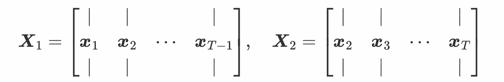

# 高维时间序列预测的降秩向量自回归模型

> 原文：<https://towardsdatascience.com/reduced-rank-vector-autoregressive-model-for-high-dimensional-time-series-forecasting-bdd17df6c5ab?source=collection_archive---------10----------------------->

# 介绍

如今，随着数据收集/可用性技术的显著发展，我们有更多的机会来处理许多科学和工业领域中的多种时间序列数据。时间序列数据有多种类型，包括单变量时间序列、多变量时间序列和多维时间序列。对于多元时间序列，数据具有多个时间相关变量，并且每个变量都依赖于其他变量。因此，向量自回归(VAR)模型是多元时间序列分析的经典方法，主要是因为它能够识别时间相关变量的共同演化模式。

然而，有一种特殊情况，如果我们有大量的变量(例如，数千或数百万个变量)，但只有有限数量的时间步长，那么多元时间序列将是高维的。例如，图 1 直观地展示了高维时间序列数据的风险值模型。这里，高维时间序列数据被表示为**“瘦高”矩阵**。


图一。高维多元时间序列的 VAR 模型图解{ **x** 1， **x** 2， **x** 3， **x** 4}。该模型由系数矩阵*(即一个方阵)参数化。*

*在这个简单的图示中，不难看出系数矩阵中的参数很多，超过了时间序列观测值的数量。在大多数情况下，这个风险值模型是不适定的，因为它会受到**过度参数化**问题的影响。为了解决 VAR 中的这一问题，一个重要的方向是开发矩阵分解参数化的**降秩 VAR** 模型。*

*在这篇博文中，我们介绍了一个用于多元时间序列分析的降秩 VAR 模型。该模型是由*韦卢*、*赖恩塞尔*和*威彻恩*于 1986 年提出的[1]。在此之前， *Velu* 在威斯康星大学未发表的博士论文中也讨论了某些降秩自回归模型的估计。后来在 1998 年， *Velu* 和 *Reinsel* 出版了《多元降秩回归:理论与应用》一书[2]。*

*虽然降秩 VAR 有很长的历史，但在过去的几十年里，这篇论文并没有引起太多的关注。由于我们有许多种高维时间序列数据，许多高维 VAR 模型实际上持有与降秩 VAR 相似的思想。*

*本帖不限于之前最降级的 VAR 论文内容。我们还提供了降秩 VAR 模型的简单模型描述，并给出了一个玩具例子来说明其应用。此外，我们用 Python 重现了这个模型，特别是用 Numpy 包。*

# *模型描述*

*图 1 显示了 VAR 的基本思想。给定时间序列数据 ***X*** 的大小 *N* -by- *T* 其中 *N* 是变量的数量， *T* 是时间步长的数量，则在任何时间步长 *t* 中，一阶 VAR 或 VAR(1)的形式为*

**

*其中 ***x*** *t* 表示时间 *t* 的快照向量，大小为*N*-1。 ***A*** 是系数矩阵，大小为 *N* -by- *N* 。*

*为了解决 VAR 中的过度参数化问题，我们可以假设系数矩阵*具有降低的秩，并且定义两个矩阵***【W】***(大小为 *N* -by- *R* )和 ***V*** (大小为 *R* -by- *N* )，使得**

*****一***=***WV*****

**其中系数矩阵通过矩阵分解被重新参数化。在这种情况下，它导致一个降秩的 VAR 模型，如图 2 所示。很明显，如果我们施加一个合适的降秩 *R* ，分量矩阵 ***W*** 和 ***V*** 中的参数将小于系数矩阵*中的参数。这实际上为解决高维时间序列数据中 VAR 的过参数化问题提供了一条技术路径。***

******

***图二。由组件矩阵 **W** 和 **V** 参数化的降秩风险值模型的图示。这里， **W** 是高瘦矩阵，而 **V** 是矮胖矩阵。***

***从机器学习的角度来看，为了估计降秩 VAR 模型中的参数，我们可以将自回归误差公式化为 L2 范数损失函数:***

******

***对于这个优化问题，我们可以得到向量形式的 ***W*** 和 ***V*** 的闭式解。然而，向量形式并不是开发算法的最佳选择。这里，我们考虑一个新的优化问题:***

******

***我们定义的地方***

******

***并且 ***W*** 和 ***V*** 的闭合解现在由下式给出***

******

# ***算法***

***由于 ***W*** 的闭式解涉及 ***V*** ，而*的闭式解涉及 ***W*** ，我们可以使用交替最小化方案。对于最小二乘解，算法实际上是交替最小二乘(ALS)。这个迭代算法只有三个主要步骤:****

*   ***用随机值初始化 ***W*** 和 ***V*** 。***
*   ***迭代第一步:用上面提到的最小二乘解更新 ***W*** 。***
*   ***迭代第二步:用上面提到的最小二乘解更新 ***V*** 。***

***我们可以在 Python 中为降秩 VAR 模型定义一个函数。***

```
***import numpy as npdef rrvar(data, R, pred_step, maxiter = 100):
    """Reduced-rank VAR algorithm."""

    N, T = data.shape
    X1 = data[:, : -1]
    X2 = data[:, 1 :]
    V = np.random.randn(R, N)
    for it in range(maxiter):
        W = X2 @ np.linalg.pinv(V @ X1)
        V = np.linalg.pinv(W) @ X2 @ np.linalg.pinv(X1)
    mat = np.append(data, np.zeros((N, pred_step)), axis = 1)
    for s in range(pred_step):
        mat[:, T + s] = W @ V @ mat[:, T + s - 1]
    return mat[:, - pred_step :]***
```

***这是一种降秩 VAR 算法，其中我们有多变量时间序列数据和降秩等输入。***

# ***玩具示例***

***我们通过考虑以下示例来评估该算法:***

******

***示例数据的大小为 20 乘 10，这是一个“高瘦”数据。我们将尝试将降秩设置为 2，并测试算法。***

***用 Python 编写代码:***

```
***X = np.zeros((20, 10))
for i in range(20):
    X[i, :] = np.arange(i + 1, i + 11)
pred_step = 2
R = 2
mat_hat = rrvar(X, R, pred_step)
print(mat_hat)***
```

***结果是:***

```
***[[11\. 12.]
 [12\. 13.]
 [13\. 14.]
 [14\. 15.]
 [15\. 16.]
 [16\. 17.]
 [17\. 18.]
 [18\. 19.]
 [19\. 20.]
 [20\. 21.]
 [21\. 22.]
 [22\. 23.]
 [23\. 24.]
 [24\. 25.]
 [25\. 26.]
 [26\. 27.]
 [27\. 28.]
 [28\. 29.]
 [29\. 30.]
 [30\. 31.]]***
```

***结果与地面真实数据完全一致。***

# ***结论***

***降秩 VAR 是高维数据下一种重要的时间序列预测方法。它有许多优点，如压缩系数和解决 VAR 中的过参数化问题。除了降秩 VAR 中的矩阵分解工具，还有一些其他工具，如张量分解。依靠这篇文章，不难将降秩 VAR 模型扩展到更高阶。***

# ***参考***

***[1]韦卢，R. P .，赖因塞尔，G. C .，，威彻恩，D. W. (1986 年)。多时间序列的降秩模型。*生物计量学*，73(1)，105–118。***

***[2]韦卢和赖因塞尔(1998 年)。多元降秩回归:理论与应用。斯普林格科学与商业媒体。***

***[3]陈新宇(2021)。多维时间序列预测的矩阵自回归模型。中等。网址:[https://towards data science . com/matrix-auto regressive-model-for-dimensional-time-series-forecasting-6a 4d 7d ce 5143](/matrix-autoregressive-model-for-multidimensional-time-series-forecasting-6a4d7dce5143)***