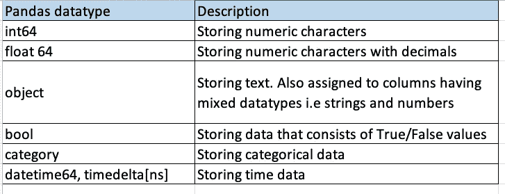
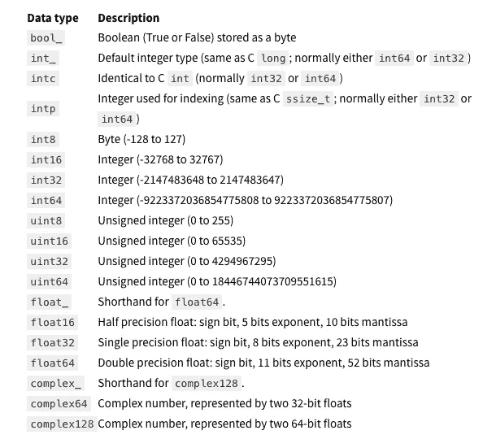
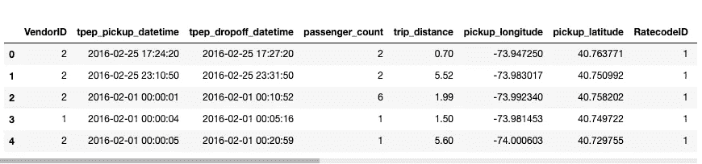
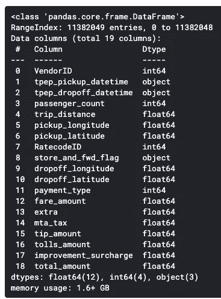
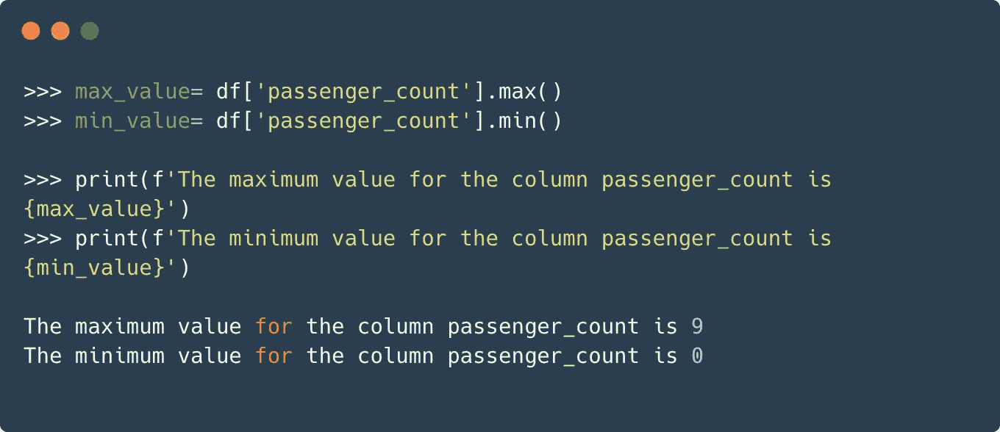
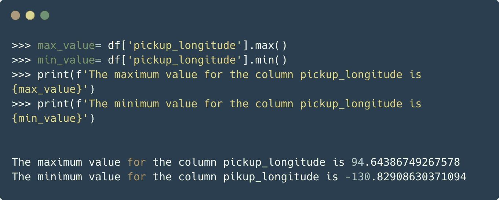
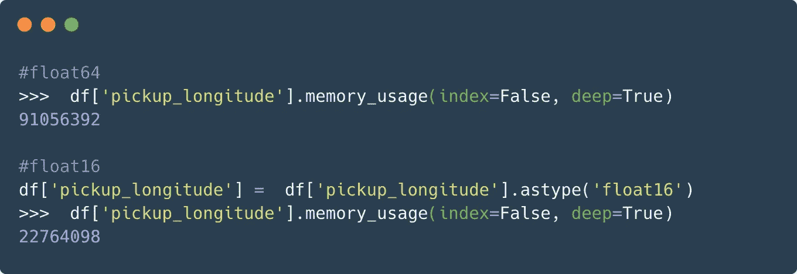
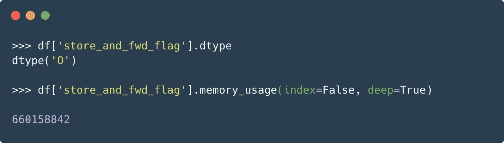
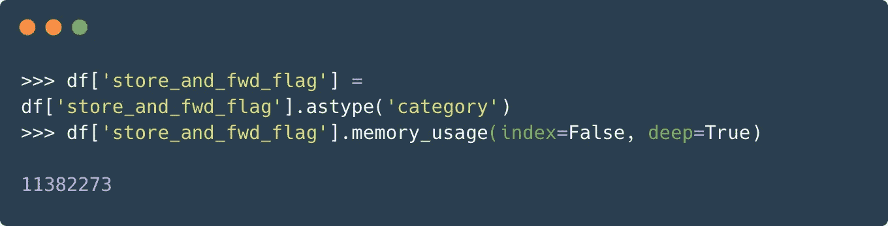

# 使用较小的数据类型减少熊猫的内存使用

> 原文：<https://towardsdatascience.com/reducing-memory-usage-in-pandas-with-smaller-datatypes-b527635830af?source=collection_archive---------14----------------------->

## [理解大数据](https://towardsdatascience.com/tagged/making-sense-of-big-data)

## 通过有效使用数据类型来优化 pandas 的内存使用


照片由[托尔加·乌尔坎](https://unsplash.com/@tolga__?utm_source=medium&utm_medium=referral)在 [Unsplash](https://unsplash.com?utm_source=medium&utm_medium=referral) 拍摄

用熊猫管理大型数据集是一个相当常见的问题。因此，开发了许多库和工具来减轻这种痛苦。以下面提到的 pydatatable 库为例。

[](/using-pythons-datatable-library-seamlessly-on-kaggle-f221d02838c7) [## 在 Kaggle 上无缝使用 Python 的数据表库

### 在 Kaggle 上管理大型数据集，无需担心内存不足的错误

towardsdatascience.com](/using-pythons-datatable-library-seamlessly-on-kaggle-f221d02838c7) 

尽管如此，还是有一些技巧和提示可以在一定程度上帮助我们解决熊猫的记忆问题。他们可能不会提供最好的解决方案，但这些技巧有时会被证明是方便的。因此，了解他们没有坏处。在我以前的一篇文章中，我谈到了在 pandas 中加载大型数据集的两种替代方法。

[](/loading-large-datasets-in-pandas-11bdddd36f7b) [## 在 Pandas 中加载大型数据集

### 有效地使用分块和 SQL 来读取 pandas 中的大型数据集。🐼

towardsdatascience.com](/loading-large-datasets-in-pandas-11bdddd36f7b) 

这些技术是:

*   **分块:将数据集细分成更小的部分**
*   **使用 SQL 和 pandas 读取大数据文件**

本文是上述技术的延续。因此，如果你还没有读过上一篇文章，现在读一读是个不错的主意😃。在本文中，我们将介绍通过有效使用数据类型来优化内存使用的方法。但是首先，让我们详细了解熊猫的数据类型。

# 熊猫数据类型

数据类型是指数据在内存中的存储方式。为了更简洁，我在这里引用[维基百科](https://en.wikipedia.org/wiki/Data_type):

> **数据类型**或简称为**类型**是数据的一种属性，它告诉编译器或解释器程序员打算如何使用数据。

主要的数据类型包括整数、浮点数、布尔值和字符。`pandas`图书馆也遵循同样的论述。以下是 pandas 支持的各种数据类型的简要概述:



作者图片

int 和 float 数据类型有更多的子类型，这取决于它们用来表示数据的字节数。以下是完整的列表:



[出处](https://jakevdp.github.io/PythonDataScienceHandbook/02.01-understanding-data-types.html) : r *下* [*麻省理工执照*](https://opensource.org/licenses/MIT) *。*

这是一个很长的列表，但让我们触及几个关键点:

*   数据类型名称后面的数字表示存储一个值所需的内存位数。例如，`int8`使用 **8 个**位或 1 个字节；`int16`采用 16 位或 2 字节，依此类推。
*   范围越大，消耗的内存就越多。这意味着`int16`使用的内存是`int8`的两倍，而`int64`使用的内存是`int8`的八倍。
*   `uint8`、`uint16` 等。指无符号整数，而 `int`指有符号整数。分配的内存量没有区别，但是顾名思义，对于`uint8`，无符号整数只能存储正值，即 0–255。这同样分别适用于`uint16`、`uint32`和`uint64`。

数据类型很重要，因为数据的存储方式决定了可以用它做什么。

# 观看活动中的事物

既然我们已经对 pandas 的各种数据类型及其表示有了很好的了解，那么让我们看看在使用它们时优化存储的方法。我将使用一个包含 1.6 GB 数据的文件来总结 2016 年 3 月的[黄色出租车出行数据。我们将从使用`read_csv()`函数将数据集导入熊猫的数据帧开始:](https://www.kaggle.com/bharath150/taxi-data?select=yellow_tripdata_2016-03.csv)

```
import pandas as pd
df = pd.read_csv('yellow_tripdata_2016-03.csv')
```

让我们看看它的前几列:



作者图片

默认情况下，当 pandas 加载任何 CSV 文件时，它会自动检测各种数据类型。这是一件好事，但有一个问题。如果一列全部由整数组成，默认情况下，它会将`int64` dtype 分配给该列。类似地，如果一列由浮点值组成，则该列被赋予`float64` dtype。

```
df.info()
```



作者图片

如上所述，在这种情况下使用了三种数据类型:

*   `int64`对于整数值，
*   `float64`对于浮点值和、
*   `object`日期时间和分类值的数据类型

## 数据

在检查我们的数据框架时，我们发现某些列的最大值永远不会大于 **32767。**在这种情况下，使用`int64`作为数据类型是不明智的，我们可以很容易地将其简化为`int16`。我们通过一个例子来更具体的理解一下。

为了进行演示，让我们分析一下`passenger count`列并计算它的内存使用情况。为此，我们将使用熊猫的`[memory_usage](https://pandas.pydata.org/pandas-docs/stable/reference/api/pandas.DataFrame.memory_usage.html)()`功能。


为了理解较小的数据类型是否足够，让我们来看看该列的最大值和最小值。



由于该列只包含最大值为 9 的正值，我们可以轻松地将数据类型降级为`int8`，而不会丢失任何信息。


这大大减少了所使用的内存。我们再举一个例子。这次我们将分析由浮点值组成的`pickup_longitude`列。



现在，您可能会同意，对于经度(和纬度)列，最多两位小数的值在传递信息方面是合适的。另一方面，在减少内存使用方面的优势将是巨大的。我们可以将数据类型从`float64`改为`float16`，这样可以减少 1/4 的内存使用。



这太棒了。我们可以通过分析其他列来类似地向下转换它们，这样可以节省大量的内存。

## 分类数据

到目前为止，我们只看了数字列。有没有一种方法也可以优化分类列？是的，也有减少分类列内存消耗的方法。让我们以`**store_and_fwd_flag**` 列为例，按照上一节所示，计算存储它所需的内存。



数据类型“O”指的是`object`数据类型。现在，如果我们要查看该列中的唯一值，我们将得到:


只有两个唯一值，即 N 和 Y，分别代表 No 和 Yes。在值的数量有限的情况下，我们可以使用一种更紧凑的数据类型，称为`[Categorical](https://pandas.pydata.org/pandas-docs/stable/user_guide/categorical.html)` dtype。以下是来自[文档](https://pandas.pydata.org/pandas-docs/stable/user_guide/categorical.html)本身的摘录:

> 类别是一种 pandas 数据类型，对应于统计学中的分类变量。分类变量采用有限的、通常是固定的可能值(类别；R 中的级别)。例子有性别、社会阶层、血型、国家归属、观察时间或通过李克特量表的评级。

如果我们将对象类型向下转换为分类数据类型，内存使用量的减少将如下所示:



同样，也实现了相当数量的内存减少。

最后，我们还可以在加载 CSV 文件时为不同的列指定数据类型。这对于加载时抛出内存不足错误的数据很有用。


# 结论

在本文中，我们看到了如何优化数据集使用的内存。如果我们的 RAM 有限，并且我们的数据集放不进内存，这就特别有用。然而，看看其他一些能够更有效地处理大数据问题的库将会很有帮助。