# 通过主动学习降低模型训练成本

> 原文：<https://towardsdatascience.com/reducing-model-training-cost-with-active-learning-255b40a2aa98?source=collection_archive---------39----------------------->

## 高斯过程模型的完整案例研究

在 [Unsplash](https://unsplash.com?utm_source=medium&utm_medium=referral) 上由 [nine koepfer](https://unsplash.com/@enka80?utm_source=medium&utm_medium=referral) 拍摄的照片

在回归分析中，标注训练样本通常非常耗时，并且会占用很大一部分计算预算。

在我们的工程团队中，我们一直面临这种挑战。

我们的任务是设计航空发动机部件。在给定设计参数的情况下，我们需要不断地训练回归模型来预测产品性能。对我们来说，标记训练样本需要进行高保真的物理模拟，这很容易需要几天甚至几周的时间才能在集群上运行。

显然，如果模型需要许多样本才能达到令人满意的精度，由此产生的计算负担将是一场噩梦。

幸运的是，我们找到了一个简单的解决方案，可以在保持预测准确性的同时大幅减少训练样本的数量。这个解决方案就是**主动学习**。

基本思想很简单:我们从一个小的训练数据集开始，然后随着训练的进行逐渐丰富训练数据集。在每一次学习迭代中，我们标记一个新的样本，对于该样本，当前模型预计会产生最大的*预测误差*。

这种直观的策略在实践中表现得非常好。在某些情况下，我们可以训练一个同样精确的模型，只需要原来计算预算的 1/3！

在这篇文章中，我想和你分享我们主动学习策略背后的技术细节。为此，我会

*   呈现整体工作流程；
*   讨论如何基于**偏差-方差分解**估计预测误差；
*   浏览一个完整的案例研究，看看这个想法在实践中是如何应用的。

我还创建了一个配套的 [**Jupyter 笔记本**](http://bit.ly/35bQd2g) ，演示了如何在 Python 中进行主动学习。这篇文章中的所有插图都复制在笔记本上。

> 我们在这里讨论的主动学习策略着重于建立一个在参数空间中处处精确的模型。如果您更关心构建一个仅在底层函数的全局最大值/最小值附近准确的模型(这是执行优化任务所需的特性)，请看看这篇文章，了解另一种实现这一点的主动学习策略:

</an-introduction-to-surrogate-optimization-intuition-illustration-case-study-and-the-code-5d9364aed51b>  

**目录**
[1。主动学习工作流程](#b3a0)
[2。偏差-方差分解](#f05d)
[3。估计预测误差](#a0db)
[4。案例分析](#2005)
∘ [4.1 测试函数](#466e)
∘ [4.2 模型](#49ba)
∘ [4.3 第一次迭代](#628d)
∘ [4.4 第二次迭代](#202e)
∘ [4.5 第三次迭代](#a953)
∘ [4.6 进一步迭代](#91ac)
∘ [4.7 确定收敛【T33](#bb01)
[参考](#7d94)
[关于作者](#baf4)

# 1.主动学习工作流程

实施主动学习包括以下步骤:

1.  基于当前可用的数据训练模型；
2.  使用**学习功能**来决定下一个要贴标签的样品；
3.  标记所选样本；
4.  用标记的样本丰富当前的训练数据集；
5.  重复步骤 1–4，直到模型达到目标精度。

下面给出了上述步骤的直观说明。

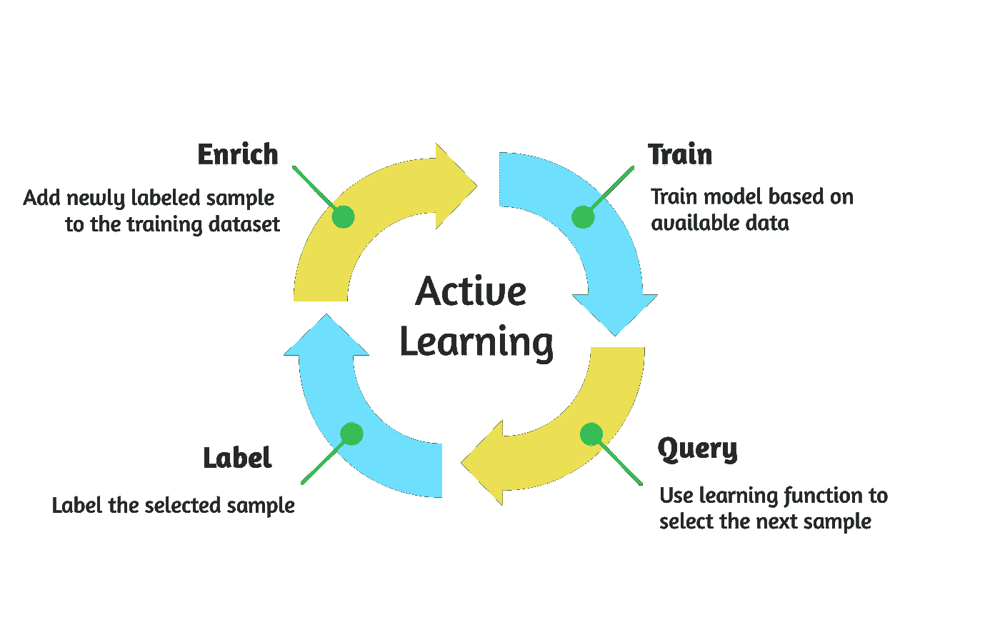

图 1 主动学习流程。(图片由作者提供)

主动学习确保在每次迭代中选择并标记对模型准确性贡献最大的样本。结果，需要更少的样本来达到期望的精度，从而降低了总的计算预算。

主动学习有两个关键因素:

*   该模型可以估计其预测的不确定性；
*   精心设计的学习功能。

首先，模型要估计自己的预测不确定性，通常是以预测方差的形式。这一点至关重要，因为方差值反映了模型对基础输入输出函数的了解。

第二，我们需要一个专门设计的学习函数，它编码了我们希望我们的模型如何学习。这个学习函数指导样本富集:在每次学习迭代中，最大化或最小化学习函数的样本被选择和标记。

对于我们当前的情况，由于我们想在模型产生最大预测误差的地方加强我们的模型，我们将使用一个学习函数来计算未知样本的预测误差。随后，在每次迭代中，我们将标记那些最大化所采用的学习函数的看不见的样本之一，并将其附加到当前的训练数据集。

问题来了，我们如何设计一个学习函数，可以计算出未知样本的预测误差？偏差-方差分解可能对此有所启发。

# 2.偏差-方差分解

我们将未知样本的预测误差 *x* 定义为真实函数值 *y* ( *x* )(我们假设它是确定性的)和模型预测值 *M* ( *x* )之间的平方差:

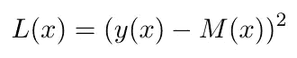

由于模型预测 *M* ( *x* )不确定*，*相关的预测误差 *L* ( *x* )也将不确定。因此，我们可以将 *L* ( *x* )视为随机变量，并使用其平均值 E[ *L* ( *x* )]来表示我们对样本 *x* 的预期预测误差。

经过[冗长的代数运算](https://en.wikipedia.org/wiki/Bias%E2%80%93variance_tradeoff#Bias%E2%80%93variance_decomposition_of_mean_squared_error)，我们可以写出 E[ *L* ( *x* )]为:

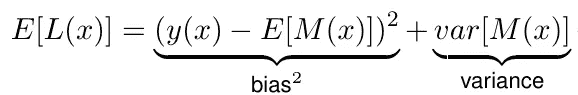

其中规定预期预测误差 E[ *L* ( *x* )]可以分解为

*   偏差项，表示模型预测和实际函数输出之间的平均差异；
*   描述模型预测方差的方差项。

上面这个方程就是机器学习中著名的*偏差-方差分解*。期望预测误差 E[ *L* ( *x* )]是我们的目标学习函数。

# 3.估计预测误差

然而，在实践中，我们无法使用上面简单形式的方程来计算 E[ *L* ( *x* )]:尽管获得方差值很容易(=模型预测方差)，但是计算真实的偏差值是根本不可能的，因为真实的函数输出 *y* ( *x* )是未知的(否则我们首先就不需要建立模型了！).

为了避免这个问题，我们可以用真实偏差值的近似值来代替。具体来说，我们可以使用**留一交叉验证误差**来估计未知样本的预测偏差 *x* *。以下是步骤:

1.我们计算所有训练样本 *xᵢ* ， *i* =1，…，n 的交叉验证误差:

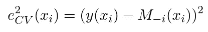

这种计算是通过首先用除了[ *xᵢ* 、 *y* ( *xᵢ* )]之外的所有训练样本训练一个新模型，然后计算真实标签 *y* ( *xᵢ* )和在 *xᵢ* 的新模型预测之间的平方差来完成的。

2.我们找到最接近训练样本 *xᵢ* 到 *x* *的*，简单地用这个训练样本的交叉验证误差作为 *x* *的预测偏差:*

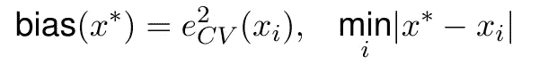

一旦我们知道如何正确估计未知样本的预测偏差值 *x* *，我们现在可以将估计的偏差项插回到 E[ *L* ( *x* )]等式中，并计算所需的预期预测误差值。

我们主动学习策略中缺失的部分终于找到了！

# 4.个案研究

是时候通过一个案例研究来看看这种主动学习策略在实践中的表现了。

## 4.1 测试功能

我们选择以下测试函数:

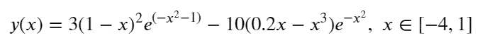

我们的目标是训练一个回归模型来逼近这个测试函数。在实际设置中， *y* ( *x* )具有未知表达式，只能通过复杂、耗时的计算机模拟来评估。因此，为了反映现实，在下面的模型训练过程中，我们将

*   将 *y* ( *x* )视为黑盒函数；
*   限制 *y* ( *x* )评估的数量，即标注尽可能少的训练样本。

在我们开始模型训练之前，让我们先画出这个函数来获得一些直觉。

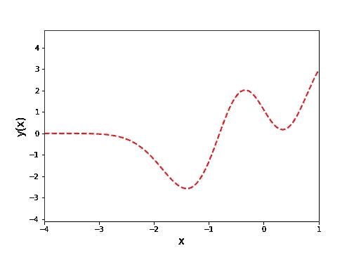

图 2 采用的测试函数。(图片由作者提供)

从图中可以看出，这个测试函数描述了输入𝑥和输出 *y* 之间相当复杂的关系(𝑥):在范围[-4，-3]内存在一个平坦的区域，而多模态响应支配着剩余的区域)。由于 y*y*(𝑥)在参数空间的表现非常不同，因此构建一个全局精确的回归模型具有挑战性。

## 4.2 模型

在本案例研究中，我们选择**高斯过程** ( **GP** ) 作为期望的回归模型。这里，来自 Scikit-learn 的 GP 实现被用来训练 GP 模型。

我们喜欢这种模型类型，因为它在小数据区域表现很好，而且它自动估计其预测不确定性:它将其预测 *M* ( *x* )分配给正态分布:*M*(*x*)*~ N*(*μ*(*x*)*、σ* ( *x* )，其中*μ* *σ* ( *x* )将作为 E[L( *x* )]方程中的方差项。

## 4.3 第一次迭代

首先，我们基于均匀分布在参数空间中的 5 个样本来训练初始 GP 模型。生成的 GP 模型如下所示。

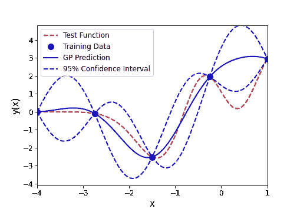

图 3 初始 GP 模型。(图片由作者提供)

正如我们所看到的，由于训练样本数量不足，GP 预测与测试函数匹配不佳。同时，预测方差很大，这意味着 GP 模型对其预测不太有信心。如果我们仔细观察区域[0，1]，最初的 GP 模型已经完全错过了“山谷”景观。更糟糕的是，95%的置信区间未能覆盖“谷”！显然，我们需要更多的训练样本。

现在，让我们通过向当前训练数据集添加新样本来开始主动学习过程。为此，我们将确定一个 *x* *，使其对所有可能的 *x* 最大化 E[L( *x* )】。E[L( *x* )]的计算基于我们之前讨论的偏差-方差分解。

在下图中，我们在左侧重新绘制了 GP 预测，在右侧绘制了整个参数空间的 E[L( *x* )]分布。

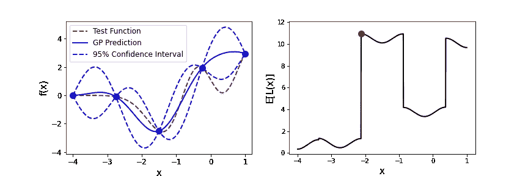

图 4 第一次迭代。(图片由作者提供)

最大 E[L( *x* )]值用绿点标出，出现在 *x* *=-2.12。这是初始 GP 模型预测误差最大的地方。

因此，在第一次迭代中，我们将通过调用测试函数计算 *y* ( *x* *)来标记样本 *x* * 】,并将新数据[ *x* *=-2.12，*y*(*x**)=-0.89]追加到当前训练数据集中。

## 4.4 第二次迭代

使用新丰富的训练数据集，我们可以更新 GP 模型及其预测，如下图左所示。

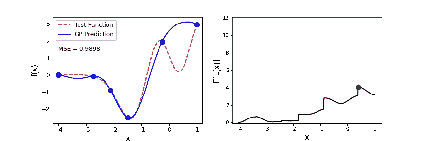

图 5 第二次迭代。(图片由作者提供)

丰富的训练数据集极大地提高了 GP 模型在区域[-4，-1.5]中的准确性。这也可以在右侧的 E[L( *x* )]图中看到，在该图中，预期预测误差在同一区域中相对较小。

采用主动学习策略的一个好处是，它自动检测出模型精度仍然较低的区域，可以进一步提高。在这次迭代中，E[L( *x* )]的最大值出现在 *x* *=0.38 处，这恰好是当前 GP 模型偏离真实测试函数最大的地方。

这正是我们想要我们的主动学习策略表现的方式！在现实中，当我们不知道底层函数是什么样子时，主动学习的这一功能可以真正帮助我们定位最有价值的样本以提高模型准确性，从而降低整体模型训练成本。

在这第二次迭代中，我们将把新数据[ *x* *=0.38， *y* ( *x* *)=0.18]追加到当前训练数据集中。

## 4.5 第三次迭代

我们不断用新增加的训练数据集更新 GP 模型。在下面左图中，我们可以看到更新后的 GP 模型的性能，总共有 7 个训练样本。

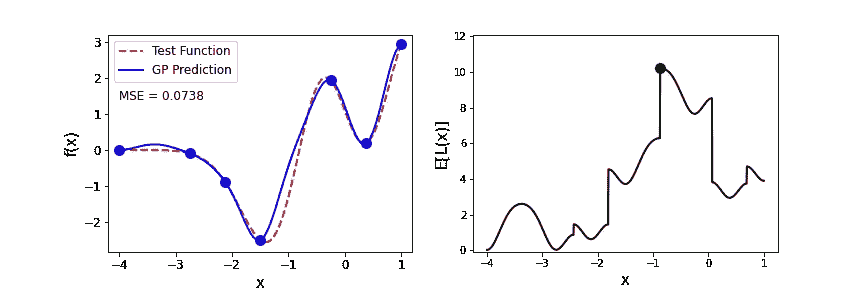

图 6 第三次迭代。(图片由作者提供)

由于新添加的训练样本，更新的 GP 模型现在可以轻松捕获“山谷”区域[0，1]。事实上，当前的 GP 模型在整个参数空间的任何地方几乎都是准确的，正如 GP 预测和真实测试函数之间显著降低的 MSE 值所表明的那样。

但是，请注意，与上一次迭代相比，E[L( *x* )]再次上升。这种现象实际上很普遍，因为 GP 模型学到了一些“新奇”的东西，这极大地改变了它的“世界观”。下一次迭代应该可以解决这个问题。

在这第三次迭代中，我们将把新数据[ *x* *=-0.87，*y*(*x**)=-0.46]追加到当前训练数据集中。

## 4.6 进一步迭代

现在我们已经到了第四次迭代。像往常一样，在左边，我们有 GP 预测。右边是 E[L( *x* )]图。

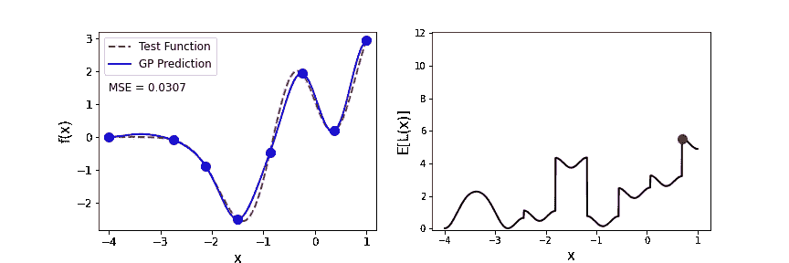

图 7 第四次迭代。(图片由作者提供)

现在 GP 预测与潜在的测试函数更加一致。同时，E[L( *x* )]值相对于上一次迭代再次下降。这是个好消息！我们回到了正轨。

我们继续更多的迭代。这是我们在 7 次迭代后得到的结果，即我们当前的训练数据集有 12 个样本。

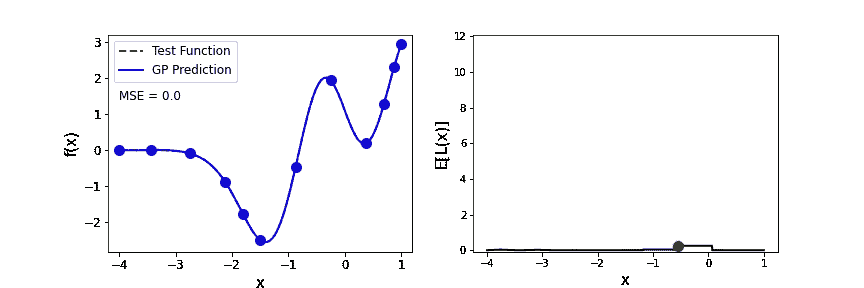

图 8 最后一次迭代。(图片由作者提供)

我们可以清楚的看到 E[L( *x* )]最大值明显下降。相应地，GP 预测与真实的测试函数几乎没有区别。

## 4.7 确定收敛性

实际上，我们无法获得底层函数的确切形式。因此，我们不能通过计算 MSE 来判断模型的准确性。那么，我们如何确定何时停止主动学习迭代呢？

根据我的经验，我建议在迭代期间监控最大 E[L( *x* )]值的演变，并使用以下规则来确定何时终止训练:

> 在第一次迭代时，当前最大 E[L( *x* )]值低于最大 E[L( *x* )]值的 **5%** 。

当然，确切的百分比可以根据您的精度要求和可用的计算预算来定制。我更喜欢 5%，因为它通常在我的项目中工作得很好。

这是当前案例研究的最大 E[L( *x* )]值的收敛历史。在第 8 次迭代时，最大 E[L( *x* )]值小于初始最大 E[L( *x* )]值的 5%。因此，我们在这里终止我们的学习迭代，并决定不再丰富更多的样本。

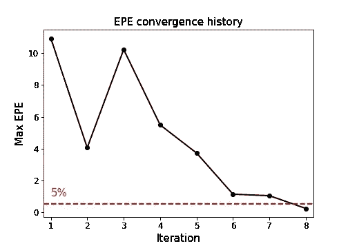

图 9 The 辐合历史。(图片由作者提供)

# 5.外卖食品

在本文中，我们介绍了主动学习策略的基本思想、工作流程和技术细节，这可以显著降低模型培训成本。这一战略的主要特点包括:

*   在每次迭代中，它将样本放在模型预计具有最大预测误差的地方；
*   预测误差估计基于偏差-方差分解；
*   采用留一交叉验证来逼近偏倚项；
*   当最大预测误差值下降到初始预测误差值的 5%以下时，可以终止学习。

我们在这里讨论的主动学习策略主要集中在建立一个在所研究的参数空间内处处精确的模型。如果你也有兴趣建立一个只在底层函数的全局最大值/最小值附近精确的模型(这是执行优化任务所需的特性)，看看这篇文章，学习另一个主动学习策略:

</an-introduction-to-surrogate-optimization-intuition-illustration-case-study-and-the-code-5d9364aed51b>  

# 参考

[1] H. Liu，J. Cai，Y. S. Ong，*一种通过最大化期望预测误差进行克立格元建模的自适应采样方法*，2017，计算机与化学工程。

# 关于作者

> 我是一名博士研究员，研究航空航天应用的不确定性量化和可靠性分析。统计学和数据科学是我日常工作的核心。我喜欢分享我在迷人的统计世界中学到的东西。查看我以前的帖子以了解更多信息，并在 [*中*](https://shuaiguo.medium.com/) *和* [*Linkedin*](https://www.linkedin.com/in/shuaiguo16/) 上与我联系