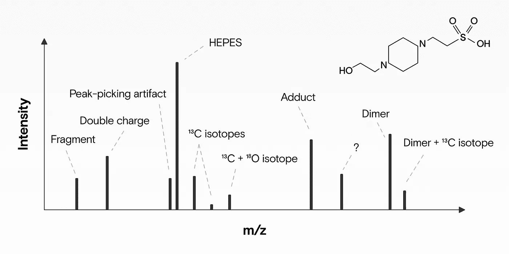
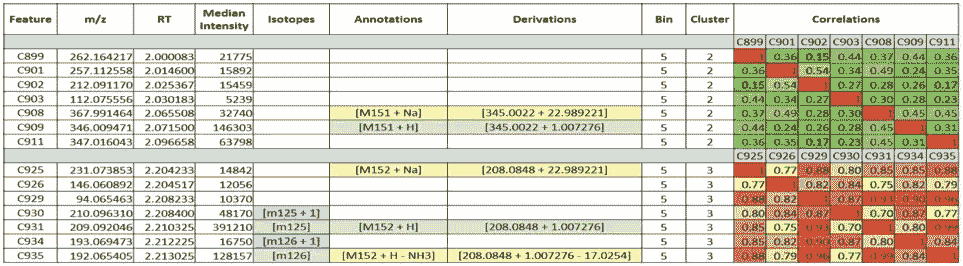

# 使用 Binner 降低非靶向代谢组学中的噪声

> 原文：<https://towardsdatascience.com/reducing-noise-in-untargeted-metabolomics-with-binner-fd7d4e946e0f?source=collection_archive---------33----------------------->

## 一种新的特征标注方法

来源:作者

我们采访了软件工具 [Binner](http://metscape.ncibi.org/binner.html) 的合著者之一 Hani Habra:这是一个桌面应用程序，用于注释电喷雾电离液相色谱质谱(ESI-LC/MS)产生的非靶向代谢组学数据中的同位素、加合物和来源内片段。

像 Binner 这样的工具大大降低了非目标代谢组学数据集的复杂性。没有它们，就很难从测量中获得有意义的见解，因为噪音往往会淹没我们要寻找的信号。

# 一种代谢物如何产生多种信号

来源:作者

如果我们用电喷雾电离质谱仪分析生物样品(例如，血液)，那么单个代谢物(例如，血液中的小分子)不仅仅产生一个信号，而是许多信号。这有四个原因:

1.  **同位素**:一个分子通常有几种同位素版本(同位素)。这意味着它是同一个分子，但它的一个或多个原子具有不同数量的中子。例如:地球上约 1.1%的碳原子有 7 个中子，而不是 6 个。如果我们的分子有 1 个碳原子，那么我们可能还会观察到第二个质量峰，其质量(M+1)高出约 1 道尔顿，在质谱中的丰度大约低 99%。
2.  **加合物:**两个或两个以上分子结合形成新分子。我们想要测量的一部分分子也与其他分子结合形成新的分子(加合物)。可能形成的加合物取决于许多因素:如何制备样品(例如，使用哪种溶剂:丙酮或甲酸)、如何储存样品，以及是以正离子模式还是负离子模式运行机器。一个简单而常见的例子是钠原子(Na)或质子(H+)加入时形成的加合物。
3.  **碎片:**当分子在质谱仪中被电离时，一些离子变得能量不稳定，并可能随后分裂。通常其中一个碎片带有中性电荷，因此无法被检测到，而其他带电荷的碎片离子——现在更小了——仍然存在。这些片段作为额外的信号出现。如果我们知道预期会有什么样的中性损失，那么我们就可以把这些碎片和原始分子组合在一起。
4.  **多聚体:**除了带电物质外，两种或多种代谢物单体之间可形成复合物，产生的 m/z 值通常约为单个代谢物的 2-3 倍。

因此，原本只是一个分子的东西变成了许多测量结果——这是任何分析的一个重大障碍。

# 为什么分离信号会增加下游分析的难度

所以一个分子产生不止一个而是许多信号。这使得我们很难精确地确定我们正在测量的样品中有多少特定的分子。

这提出了几个重要的问题:

*   **模式更难发现**:如果你在寻找两组患者(例如，患病者和未患病者)之间的差异，如果信息分散在许多信号中，找到这些差异将会更加困难。你寻找的模式可能会完全消失。
*   **多重比较创造机会模式:**我们搜索的信号越多，我们就越有可能找到一个看似很好的模式，它实际上是由机会产生的(见[多重比较问题](https://en.wikipedia.org/wiki/Multiple_comparisons_problem#:~:text=In%20statistics%2C%20the%20multiple%20comparisons,based%20on%20the%20observed%20values.&text=The%20more%20inferences%20are%20made,erroneous%20inferences%20are%20to%20occur.))。我们拥有的独特化合物越多，这个问题就越严重。
*   **特征是冗余的:**源自相同源离子的信号可能是高度相关的。因此，当有趣的特征数量成倍增加时，我们的下游分析就变得更加繁琐和多余。
*   **生物相关性被隐藏:**冗余特征之间的相关性使得寻找相关代谢物变得更加困难——使得更加难以了解所涉及的生物途径。
*   **信号被错误识别:**我们拥有的信号越多，就越容易出错。我们可能会把不属于一起的信号联系起来，或者我们可能会把一个信号识别为它自己的代谢产物，而它实际上是从另一个信号衍生而来的。

所有这些都让我们更难找到我们想要的有意义的见解。更重要的是，我们甚至可能发现一些完全错误的见解。

这就是为什么正确识别尽可能多的衍生特征并**将它们组合在一起**非常重要。确定信号如何组合在一起的过程被称为注释，因为我们用它们如何从先驱离子发展的描述来注释信号。这就是宾纳帮助我们做得更好的地方。

# 在 Binner 之前，特征注释是如何工作的

Binner 并不是第一个帮助标注要素的工具。R-tool 相机已经流行了快 10 年了，还有很多其他的。

在 Binner 之前，有五种以注释工具为特征的主要技术用于确定哪些信号属于一起:

*   **保留时间分组/阈值**:相关特征的保留时间必须非常相似，即这些特征应该共洗脱。通常，该工具会为保留时间组设置一定的容差，如果两个信号之间的间隔超过该设置，则该工具会创建一组新的要素。
*   **相关性**:源自同一代谢物的特征可能相关。因此，您可以使用批中的所有测量值来计算要素之间的相关性，成对相关性较高的要素更有可能属于同一组。
*   **聚类**:在通过保留时间宁滨特征并计算成对相关性之后，工具通常使用几种聚类算法中的一种来基于相似性度量(例如相关性)将特征分组在一起。
*   **色谱峰形相似性**:加合物和碎片应具有相似的峰形，因为它们来自相同的代谢物，后者以特定的丰度曲线离开液相色谱柱。
*   **相对加合物频率**:基于先验知识和在相似数据集中观察到的不同加合物的频率，我们可以假设哪些片段比其他片段更可信。

Binner 结合了几种现有的技术，然后更进一步，提供了有用的可视化。

# 宾纳如何注释特征

像其他工具一样，Binner-Hani Habra 共同开发的工具-自动对来自同一代谢物的特征进行分组。

它旨在显著减少数据集中的要素，尽可能在数据集中的要素和现实世界的化合物(分子)之间保留 1-1 关系。

以下是宾纳工作原理的逐步概述:

1.  **宁滨保留时间** : Binner 根据洗脱或保留时间的差异将特征分组到称为箱的独立单元中。
2.  **计算相关性**:接下来，它根据 bin 中每个特征的丰度值计算成对相关性。
3.  **检测同位素**:它发现并分组特征的 C13 同位素版本，假设同位素的丰度随着其质量的增加而减少(因为 C13 的丰度自然低于 C12)。
4.  **分层聚类**:接下来，Binner 使用相关向量对特征进行聚类，并优化聚类数量，以最小化每个特征的平均轮廓值。
5.  **以最丰富的特征为中心**:使用最丰富的特征作为以下加合假设的基础。
6.  **测试假设以解释质量差异**:然后，Binner 测试最常见的离子，包括用户提供的加合物和中性损失/收益列表，以解释质量差异。然后，它保持注释特定组中最大数量的特征的假设。
7.  **重复:**最后，宾纳试图注释剩余的离子，从下一个最丰富的未注释离子开始。

# 注释文件如何指导宾纳的假设

与其他一些工具一样，您可以为 Binner 提供一个注释文件，其中包含您希望在数据集中看到的电荷携带、中性增益和中性损耗。

与其他一些工具不同，Binner 并不局限于您提供的加合物配方。它还允许注释文件中定义的任何东西的加合组合。所以如果你指定一个电荷载流子为 Na (22.982)，中性增益为 Na — H + NaCOOH (89.97)，那么可以想象 Binner 会将特征标注为“M+Na + Na — H + NaCOOH”(可以简化为 M+2Na-H+NaCOOH)。

但是宾纳并没有止步于此——它不仅仅做自动注释。

# 使注释透明

Binner 还为其注释提供了可视化解释。这有助于您理解为什么要以特定的方式对特性进行分组和注释，从而增强您对注释的信心。

Binner 还显示可用于查找和定义新的、以前未知的加合物以添加到注记文件中的信息，从而显著增加可注记的要素数量。

让我们来看看这是如何工作的。

# 可视化特征相关性和注释

对于 Binner 找到的每个聚类，它会向您显示

*   **它选定的注释**，以及导致该注释的中性损失和加合的计算；
*   **聚类中每个特征之间的相关性**，既有值又有热图。

每个聚类中最丰富的要素以绿色突出显示，其他要素以黄色突出显示。

看到每个注释背后的推理也可以让你快速地进行合理性检查。例如，如果你看到多个加合物被标注:M+COOH+NaCOOH，M+COOH+ **2** NaCOOH，M+Cl+ **3** NaCOOH，M+Cl+ **4** NaCOOH，M+Cl+ **5** NaCOOH，那么因为每个“步骤”都存在，所以你可以看到，即使是非常复杂的加合物 M+Cl+ **5** NaCOOH，也很可能是一个合理的注释。

但是，如果“2、3 和 4”从集群中丢失，那么像 M+Cl+ **5** NaCOOH 这样的复杂加合注释似乎不太可能是正确的。

宾纳还会给你提示，帮助你找到复杂的新加合物(T21)，哈尼称这个过程为“深度注释”

# 深度注释:寻找新颖、复杂的加合物

即使在勤奋的自动化注释之后，许多特性仍然不会被注释。

事实上，由于源内事件，加合物和碎片离子可以形成什么还没有完全了解。因此，现有的注释文件是不完整的——它们没有包括所有可能发生的加合和中性损失。

深度注释有助于您发现可能要添加到注释文件中的当前未知的加合物:

*   Binner **收集数据集中所有未标注离子之间的质量差**。
*   它统计了每个质量差异的频率，**突出显示了最频繁的**。
*   然后**提出哪些加合物可以解释**这些常见的质量差异。

查看最常见的差异不仅可以向您展示您可能想要添加到注释文件中的加合物，还可以帮助您解释这些通常很复杂的加合物是如何形成的。这里有一个例子:

一个常见的质量差是 43.9639，可以注释为+2Na-2H；另一个常见的质量差是 67.9877，对应的是+NaCOOH。这些合在一起可以解释一个常见但先前未知的质量差 111.952，相当于+2Na-2H+NaCOOH。然后您可以将它添加到您的注释文件中。

可视化常见的质量差异可以帮助您找到注释文件的新颖、合理的补充，这反过来又可以帮助 Binner 注释更多以前未注释的特征。

# 马上试试宾纳

你可以在这里下载安装宾纳:[https://binner.med.umich.edu/](https://binner.med.umich.edu/)。很简单。

# 宾纳背后的团队

宾纳是由威廉·杜伦和詹尼斯·威金顿开发的；该项目由 Maureen Kachman 博士(分析化学家兼代谢组学核心董事总经理)和 Alla Karnovsky 博士(密歇根大学计算医学和生物信息学副教授)以及 Hani 的博士顾问领导，George Michailidis 博士对该项目做出了大量的统计/数字贡献。

# 您正在优化您的代谢组学工作流程吗？

我们的机器学习团队在代谢组学工作流程方面拥有丰富的经验。如果您担心如何将研究代码转化为健壮的生产应用程序，[请联系](https://datarevenue.com/en-contact)。