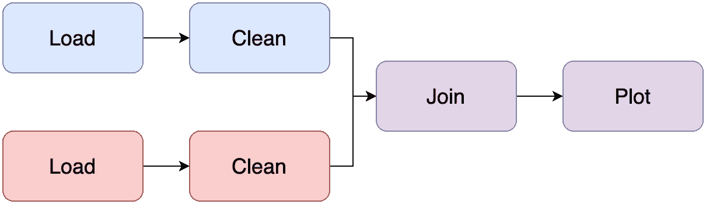
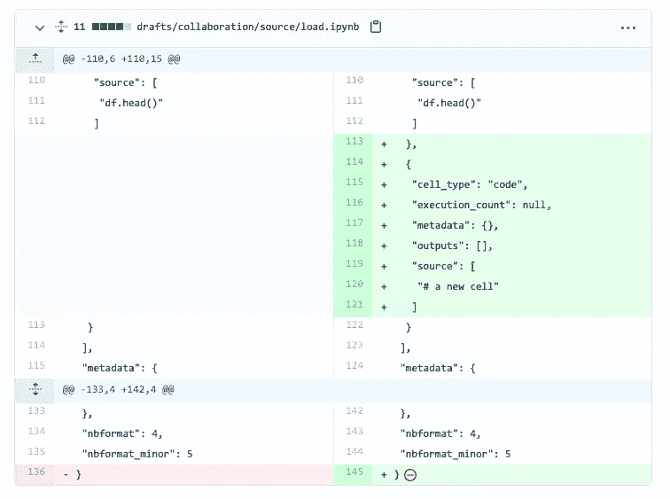
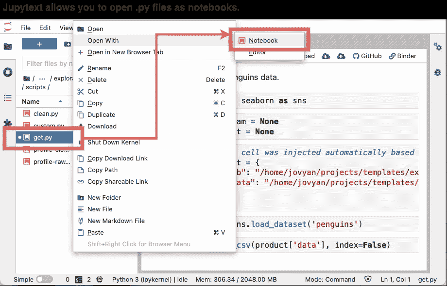

# 将 Jupyter 笔记本重构为可维护的管道:分步指南(第一部分)

> 原文：<https://towardsdatascience.com/refactoring-a-jupyter-notebook-into-a-maintainable-pipeline-a-step-by-step-guide-part-i-e9e9789c3368?source=collection_archive---------15----------------------->

## 从 Jupyter 开发可维护的项目

## 将 Jupyter 笔记本转换成模块化可维护项目的详细指南。


图片作者。

> ***更新:我们发布了*** `[***soorgeon***](https://github.com/ploomber/soorgeon)` ***，一款自动重构遗留笔记本的工具！***
> 
> 更新:第二部[此处可用](https://ploomber.io/blog/refactor-nb-ii/)。

在过去的几个月里，我们与许多数据团队进行了交谈，以帮助他们开始使用 [Ploomber](https://github.com/ploomber/ploomber) 来开发可维护的和生产就绪的管道。经常出现的一个问题是，*我们如何重构现有的笔记本电脑？*这个博客系列提供了一步一步的指南，将单体 Jupyter 笔记本转换成可维护的流水线。

为了确保你知道第二部何时上映，[在 Twitter 上关注我们](https://twitter.com/intent/user?screen_name=ploomber)或[订阅我们的时事通讯](https://www.getrevue.co/profile/ploomber)。让我们开始吧。

# 介绍

驻留在`.ipynb`中的代码变得非常混乱。因此，在笔记本创建几天后，这样的文件包含数百个单元格和几十个表格和图表是很常见的。

这种笔记本就是我们所说的 Jupyter monolith:一个包含从数据加载、清理、绘图等所有内容的笔记本。不幸的是，维护 Jupyter monolith 是非常困难的，因为任务之间没有明确的界限，并且没有一种简单的方法来单独测试各个部分。所以我们的目标是把一个凌乱的笔记本变成这样:



图片作者。

# 步骤 1:确保笔记本运行

假设您的项目目前如下所示:

这种文件布局是典型的:`.py`文件可能包含一些实用函数，但是大部分代码都在`analysis.ipynb`笔记本中。在重构我们的代码之前，让我们首先添加三个有助于我们测试管道的文件:

1.  从属关系:`requirements.txt`
2.  Ploomber 管道规格:`pipeline.yaml`
3.  一份`analysis.ipynb`(取名`pipeline.ipynb`)。我们创建一个副本来保存我们的原始输出单元格作为参考。

如果你已经有一个`requirements.txt`，使用它。否则，创建一个包含以下内容的文件:

您的`pipeline.yaml`应该是这样的:

然后，添加以下内容作为`pipeline.ipynb`的顶部单元格:

并用`parameters`标记该单元格。[点击此处](https://ploomber.io/s/params)获取细胞标记说明。

此时，您的项目如下所示:

现在，让我们创建一个虚拟环境并运行我们的管道。创建虚拟环境的确切步骤取决于您使用的包管理器和虚拟环境管理器；如果在 Linux/macOS 上使用`pip`，这里有一些示例代码:

由于缺少依赖关系，管道可能会崩溃(也就是说，您将看到一个`ModuleNotFound`错误)。所以首先，使用`pip install {name}`安装任何缺失的依赖项，并在`requirements.txt`中添加一个带有包名的新行；请重试，直到管道运行。

我们的`requirements.txt`文件包含运行项目所需的依赖项列表。尽管如此，它并没有指定特定的版本；因此，今天运行`pip install -r requirements.txt`并在一个月后运行它将会产生一组不同的依赖版本(例如`pandas 1.2`对`pandas 1.3`)，这可能会破坏我们的管道。要防止这种情况，请执行以下操作:

`pip freeze`打印依赖项及其相应版本的详尽列表。下次运行您的管道时，您可以执行`pip install -r requirements.lock.txt`来获得您当前拥有的相同环境。确保每次修改`requirements.txt`时都重新生成`requirements.lock.txt`。

如果您消除了`ModuleNotFound`错误，但是您仍然看到其他类型的错误，您的管道可能由于不同的原因而损坏。所以让我们进入下一阶段来解决这个问题。

# 步骤 2:使用数据样本进行冒烟测试

数据管道往往是长时间运行的过程，可能需要几个小时才能运行。为了加速调试过程，我们让它快速失败，修复错误，然后重复。

要启用快速测试，首先，在`analysis.ipynb`笔记本的`parameters`单元格中添加一个新变量:

并向您的`pipeline.yaml`添加一个新参数:

我们希望`sample`参数控制是使用整个数据集还是一个样本。现在，定位笔记本中正在加载或下载*原始数据*的所有单元格，例如:

并在那里使用`sample`参数:

您可以用一部分数据重现数据管道中的许多错误。这里的目标是加快执行时间，以便更快地删除这些错误。既然我们的管道默认使用一个样本运行，让我们重新运行它:

要运行整个数据集，执行`ploomber build --help`，您将看到要传递的 CLI 参数来切换`sample`参数。

继续使用示例运行管道，直到它成功执行。

## 解决常见不兼容问题的一些建议

在执行笔记本时，一个常见的错误来源是最初用于开发它的依赖版本(如`pandas 1.2`)与最新版本(如`pandas 1.3`)不同。如果任何库引入了破坏 API 的更改，您的管道将不再运行。修复依赖版本问题是一个反复试验的过程，所以要注意错误的类型，并查看库的文档来寻找 API 中的变化。如果是这种情况，请降级依赖关系，直到问题得到解决:

如果您做了这样的更改，记得再次生成`requirements.lock.txt`文件。

如果由于 API 更改而无法追溯错误，事情会变得更加复杂，所以让我们进入下一步。

# 第三步:修复破裂的管道

*注意:如果步骤 1 中创建的管道运行正常，可以跳过这一步。*

这一步的目标是确保您的笔记本从开始运行到结束。最有可能的是，该项目不包含任何测试，所以您必须知道代码是否做了它应该做的事情的唯一参考是原始的`analysis.ipynb`笔记本和记录的输出。

在 Jupyter 中打开`pipeline.ipynb`并从上到下运行它(确保转动`sample=False`以使用整个数据集)。然后，在每个单元格上，比较`analysis.ipynb`的输出(如果有的话),确保它匹配。这就是你的判断发挥作用的地方，因为一些代码行可能涉及随机过程(例如，绘制随机数)；因此，输出不会完全匹配。

继续，直到:

1.  输出不匹配，或者
2.  密码被破解了

## 如果密码被破解了

如果某个单元格出现问题，请执行以下操作:

前面的命令从最新引发的异常开始调试会话。

`%pdb`进入 Python 调试器；学习如何使用它对于调试 Python 代码是非常宝贵的。Ploomber 的文档包含了一个在数据科学项目中使用调试器的例子。如果您想在调试模式下学习每个可用的命令，请查阅[文档](https://docs.python.org/3/library/pdb.html#debugger-commands)。

希望通过使用调试器，您能够找到并修复错误。

## 如果输出不匹配

这个场景比前一个场景更具挑战性，因为我们的代码没有失败，所以我们不知道在哪里调试。然而，您可能对代码中失败的地方有所了解；在每个地方，您都可以启动调试会话。

假设故障单元如下所示:

在仔细检查之后，您确定`process_data_frame`调用了`some_function`，并且错误可能就在那里。所以你去`some_function`源代码并编辑它:

现在，当调用`process_data_frame(df)`时，依次调用`some_function(df)`，调试会话将开始。

调试不是一件容易的事情，但是使用调试器比在你的代码中使用`print`语句要好得多。查看 Ploomber 文档中的调试示例[来学习一些调试技巧。](https://ploomber.readthedocs.io/en/latest/user-guide/debugging.html)

# 第四步:将`.ipynb`转换为`.py`

此时，您应该能够从头到尾无误地执行您的管道。这个步骤和接下来的步骤确保您的管道保持可维护性和稳定性。

对每个`git push`进行小的提交和测试对于确保您知道何时您的管道中断是至关重要的。此外，在修改了十行代码的提交中发现问题要比在二十次提交和数百行源代码更改之后容易得多。不幸的是，`.ipynb`很难管理，因为它们是包含代码和输出的 JSON 文件。例如，如果您有一个`pipeline.ipynb`文件，编辑单个单元格，并提交新版本，您将看到如下内容:



图片作者。

杂乱无章，很难说是什么发生了变化。为了解决笔记本不同的问题，我们将使用`jupytext`把我们的`.ipynb`文件转换成`.py`:

但是不要担心！多亏了 jupytext 的 Jupyter 插件，你仍然可以将它们作为笔记本打开。



图片作者。

*注意:* Jupytext 有许多输出格式，查看[文档](https://github.com/mwouts/jupytext)了解更多信息。

一旦您将`pipeline.ipynb`转换为`.py`，请更新您的`pipeline.yaml`文件:

确保一切仍然正常工作:

```
ploomber build
```

如果管道运行，删除`pipeline.ipynb`。

# 下一个

到目前为止，我们能够在一个全新的环境中执行我们的管道:我们安装依赖项，然后执行`ploomber build`，但是我们的管道仍然是一个整体:我们所有的代码都在一个文件中。在本系列的下一部分中，我们将解决这个问题，并开始将我们的逻辑分成更小的步骤。

为了确保你知道第二部何时上映，[在 Twitter 上关注我们](https://twitter.com/intent/user?screen_name=ploomber)或[订阅我们的时事通讯](https://www.getrevue.co/profile/ploomber)。回头见！

> 更新:第二部[此处可用。](https://ploomber.io/blog/refactor-nb-ii/)

发现错误？[点击这里让我们知道](https://github.com/ploomber/posts/issues/new?title=Issue%20in%20post%3A%20%22Refactoring%20a%20Jupyter%20notebook%20into%20a%20maintainable%20pipeline%3A%20A%20step-by-step%20guide%20%28Part%20I%29%22)。

*原载于*[*ploomber . io*](https://ploomber.io/posts/refactor-nb-i)*。*