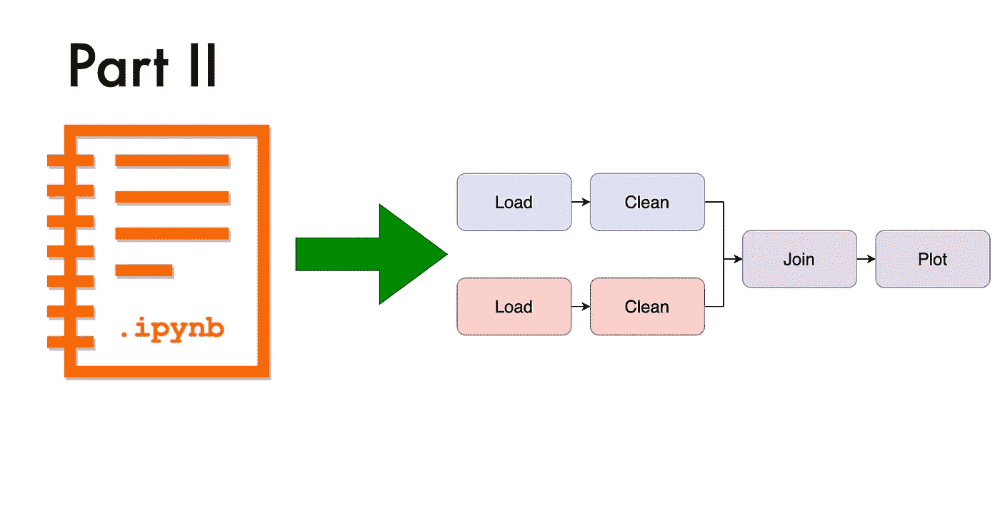
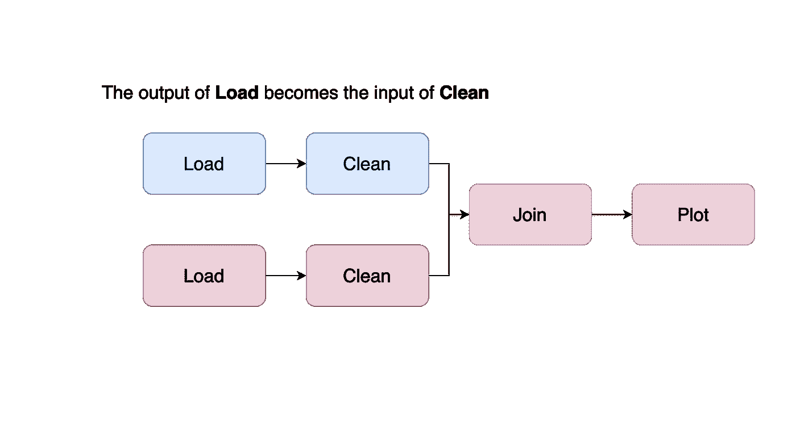
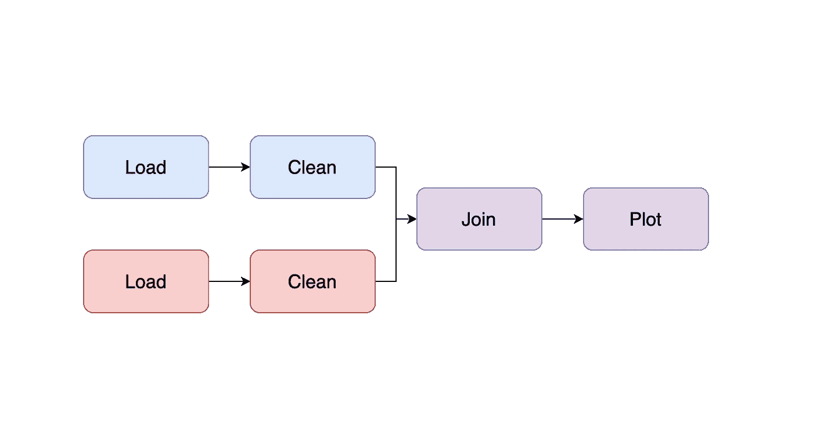
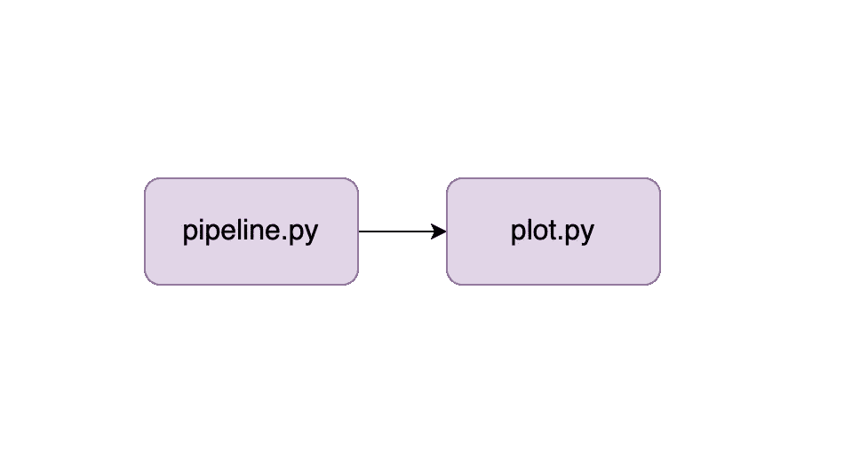
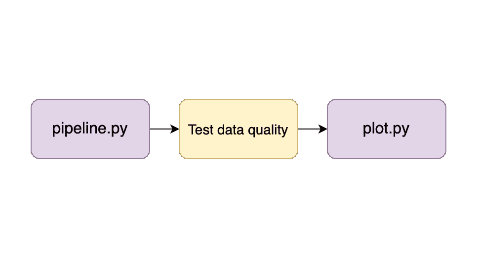
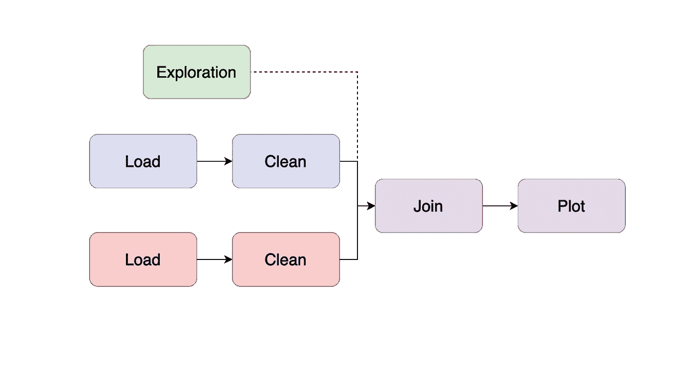
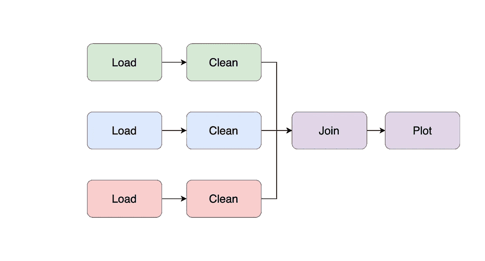

# 将 Jupyter 笔记本重构为可维护的管道:分步指南(第二部分)

> 原文：<https://towardsdatascience.com/refactoring-a-jupyter-notebook-into-a-maintainable-pipeline-a-step-by-step-guide-part-ii-138a8c395764?source=collection_archive---------25----------------------->

## 从 Jupyter 开发可维护的项目

## 将 Jupyter 笔记本转换成模块化可维护项目的详细指南。

图片作者。

> ***更新:我们发布了*** `[***soorgeon***](https://github.com/ploomber/soorgeon)` ***，一款自动重构遗留笔记本的工具！***

在本系列的第一部分[中，我们描述了如何从传统笔记本过渡到我们可以用`ploomber build`执行的单任务流水线。在第二部分，我们将打破单一的笔记本，将我们的工作模块化为更小的任务。](https://ploomber.io/blog/refactor-nb-i/)

# 步骤 5:确定任务

存在于单个文件中的项目很难调试，因为变量可能会意外交互。因此，我们想要一个有清晰边界的结构化项目，一个“任务”的输出成为下一个任务的输入；我们称之为*数据管道*。

图片作者。

在这一步，我们检查代码以确定应该在哪里拆分笔记本。例如，假设您的笔记本看起来像这样:

你的代码可能会比这个例子更加广泛和混乱，但是目标是在代码段之间定义*分割*。例如，在这个例子中，我们对数据做了三件事:加载、清理和绘图；因此，我们可以把它分成三个部分。我们通过添加 Markdown 标题来做到这一点，这样我们可以快速识别每个部分的开始和结束位置(要了解如何在 Jupyter 中插入 Markdown 单元格，[单击此处](https://jupyter-notebook.readthedocs.io/en/stable/examples/Notebook/Working%20With%20Markdown%20Cells.html))。

*注意:* Markdown 有多种类型的标题；一个 H1 头球看起来像这样`# I'm an H1 heading`，而一个 H2 头球看起来像这样:`## I'm an H2 heading`。

大多数笔记本都比这本书混乱得多，所以在定义节之前，您可能需要稍微重新组织一下代码单元。如果要加载多个数据集，请确保每个部分一次只处理一个数据集:

定义好笔记本的分区后，请转到下一步。

# 第六步:打破整块石头！

这一步是我们最终打破整体，并开始组装一个多级管道。通过在任务之间提供明确的界限，我们为每个任务建立了更精确的目的，并且可以快速测试我们的输出。

定义任务边界有些武断，但这里有一些经验法则:

1.  在单独的分支中转换每个数据集(例如，如果使用两个数据集，您的管道应该有两个分支)；当两个数据集需要连接时，合并分支。
2.  对于每个数据集:一个任务是下载数据，另一个任务是清理数据(如果在 ML 管道上工作，还有一个任务是生成要素)。
3.  如果处理 ML 管道:一个任务用于连接所有特征和标签，一个用于训练模型，另一个用于评估。

例如，假设我们有两个数据集需要加载、清理和绘制，我们希望我们的管道看起来像这样:

图片作者。

所以现在是时候把我们的项目分成两个文件了。按照我们的例子，我们向后应用切割，我们制作的第一个切割在我们的笔记本的末尾:

我们将绘制数据的代码移到一个新的脚本中，并编辑我们的`pipeline.yaml`文件:

编辑完`pipeline.yaml`文件后，执行以下命令来生成`plot.py`文件:

我们在这里做了一些改变。首先，我们修改第一个任务的第一个产品，因为它现在生成两个输出:笔记本和数据集 B 的干净版本。然后，我们添加了一个新任务，它执行`plot.py`(将绘制数据集 B 的代码复制到这里)并生成另一个笔记本。

我们希望实现以下目标:

图片作者。

如何实现这一点需要解释如何在 Ploomber 中构建管道。很简单，只需要做一些代码修改，把标绘代码移到`plot-b.py`；查看我们在[文档中的完整示例。](https://ploomber.readthedocs.io/en/latest/get-started/spec-api-python.html)

一旦你学会了 Ploomber 的基础，重复同样的过程，直到你有一个包含许多小脚本的管道。确保使用`ploomber build`运行管道，并检查输出是否仍然匹配。

# 步骤 7:添加集成测试

到目前为止，我们已经手动检查了每个管道任务的已执行笔记本输出，以确保在进行更改后结果仍然匹配。不幸的是，从长远来看这是不实际的，所以让我们自动化它。

构建我们的管道允许我们嵌入验证每个输出完整性的集成测试。例如，让我们假设我们已经将我们的分析分解为两个步骤(如上一节中的图像所示)；我们可以在执行下一个任务之前测试每个任务的输出:

图片作者。

为了测试我们的管道任务，我们可以在每个阶段定义一些期望的属性；例如，我们可以声明数据集 B 的干净版本必须具有以下属性:

*   列`age`中没有 NAs
*   正数小于 100 的列`age`
*   列`category`必须有值`a`、`b`或`c`

我们可以将这样的数据期望转换成集成测试，以便在每次运行管道时验证它们。最简单的方法是在每个任务的末尾添加一些`assert`语句:

或者，我们可以使用 Ploomber `on_finish`钩子在任务正确执行后运行任意函数。要获得完整的示例，请查看我们的[管道测试教程](https://ploomber.readthedocs.io/en/latest/user-guide/testing.html)。

测试数据管道很棘手；请查看我在 2020 年 PyData 全球大会上的演讲，我会详细介绍这一点。

# 步骤 8:在每个`git push`上运行您的管道

到目前为止，我们已经通过执行`ploomber build`在本地测试了我们的管道。然而，最好在每个`git push`上自动执行管道；启用自动化测试就是创建一个小脚本来安装依赖项并运行我们的管道:

如何在每个`git push`上运行一些脚本取决于我们使用的 git 服务。例如，如果使用 GitHub，我们可以使用 [GitHub Actions](https://docs.github.com/en/actions) ，所有托管 git 库的服务都提供类似的东西；查看 git 服务的文档以了解更多信息。

# 结语:保持你的管道正常运行

恭喜你！您现在有了一个健壮的、可维护的管道，它允许您更快、更有信心地引入变更。但是记住永远保持这种方式；如果不小心处理，很容易将管道退化为类似于我们已经开始的东西。因此，这里有一些应对你可能遇到的情况的技巧。

## 修改任务

无论何时你必须修改一个任务，都要一小步一小步地去做，并且运行你的管道来确保在每一个小的修改之后一切都正常工作。

## 添加新数据集

如果需要向分析中添加新的数据集，请创建一个新的笔记本。然后，探索这些数据，直到您对其有了基本的了解，并决定是否将其纳入您的管道。

如果您决定将数据集合并到管道中，通过将您的探索性代码作为新任务合并到管道中来添加一个新分支(记住将您的`.ipynb`转换为`.py`文件):

图片作者。

随着你对数据了解的越来越多，你可能会开始添加代码来清理它，如果你正在开发一个机器学习管道，你可能会开始创建功能；所以把逻辑分解成更小的部分；典型的结构如下:

图片作者。

记得添加集成测试。此外，确保加载 take 的任务可以使用一个`sample`参数来运行带有数据样本的代码，以便进行快速测试。

添加新的数据集是项目中的一个里程碑，因此请确保记录下来。我强烈建议您创建一个`CHANGELOG.md`文件来记录项目中这些类型的重大变更:

## 删除数据集

如果不再需要某个数据集，请删除处理该数据集的整个分支。保留死代码没有任何意义。确保你在你的`CHANGELOG.md`档案中记录了这一点。

## 代码质量

为了保持项目的可维护性，保持代码的可读性是必不可少的。像 [flake8](https://github.com/PyCQA/flake8) 和 [black](https://github.com/psf/black) 这样的包是对你的代码进行 lint 和自动格式化的好选择。要了解更多关于林挺的知识并获得保持代码整洁的技巧，请查看我们的指南[写整洁的笔记本](https://ploomber.io/posts/clean-nbs/)。

# 最后的想法

转换传统的基于笔记本电脑的管道需要花费很多精力，但这是值得的。根据我的经验，许多数据项目失败是因为它们建立在薄弱的基础上，阻碍了它们取得稳定的进展。通过构建和测试您的管道，您已经走在了游戏的前面，您将能够自信地对您的工作进行更改，并确保您可以随时重现您的结果。

发现错误？[点击这里让我们知道](https://github.com/ploomber/posts/issues/new?title=Issue%20in%20post%3A%20%22Refactoring%20a%20Jupyter%20notebook%20into%20a%20maintainable%20pipeline%3A%20A%20step-by-step%20guide%20%28Part%20II%29%22)。

*最初发布于*[*ploomber . io*](https://ploomber.io/posts/refactor-nb-ii)