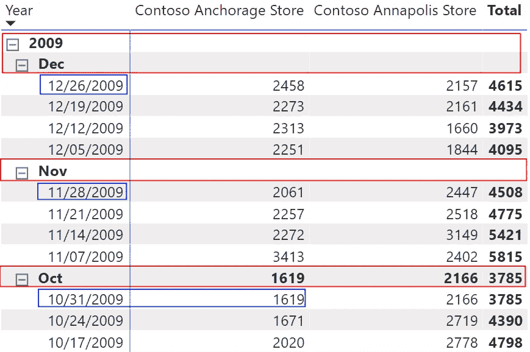
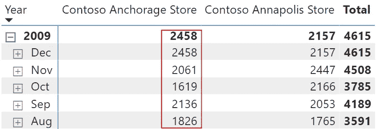
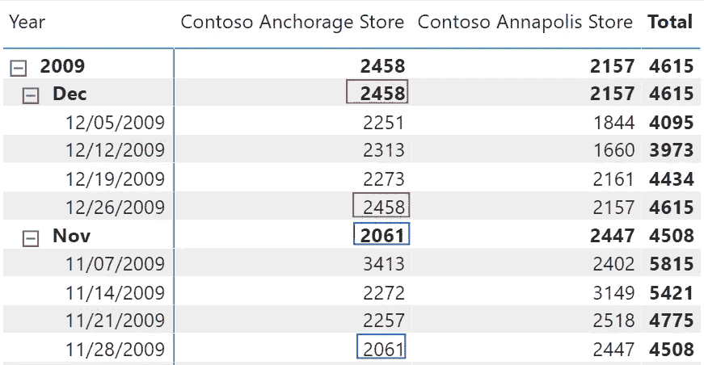
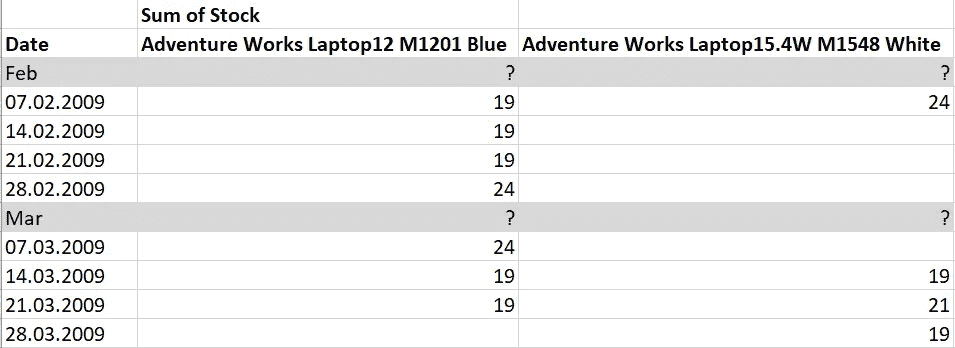
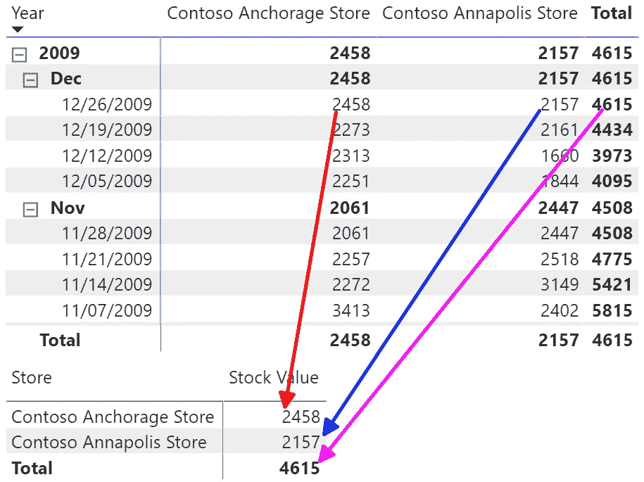
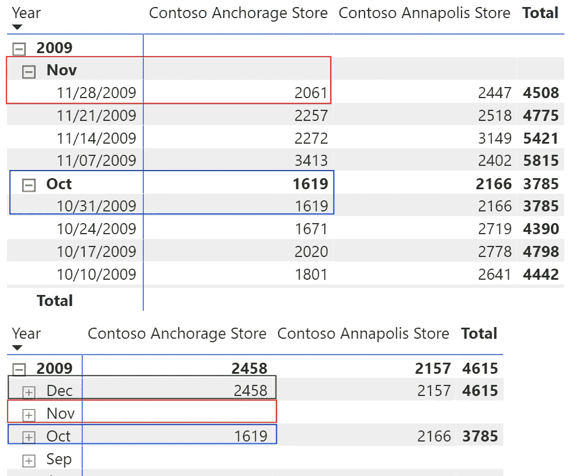
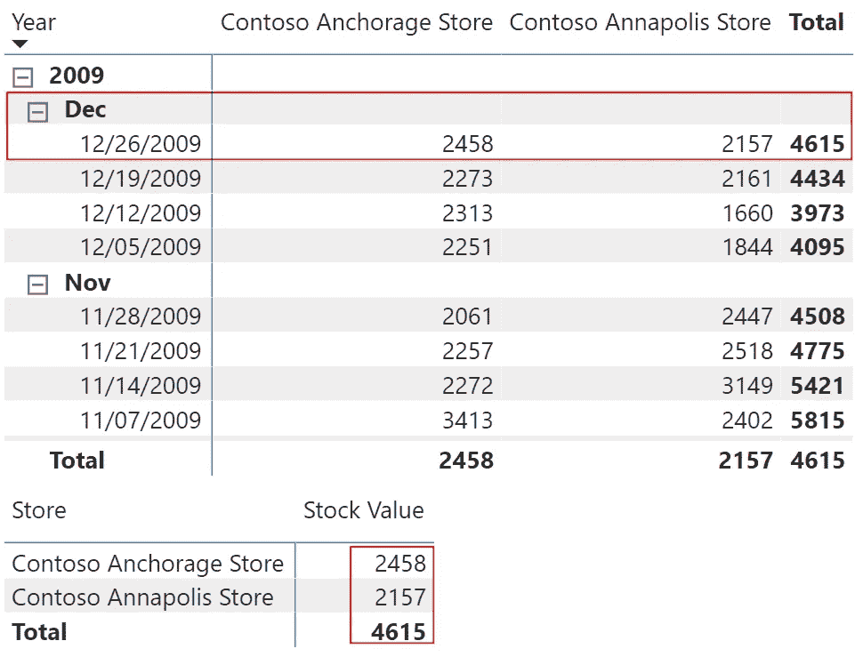

# DAX 中半可加测度的精化

> 原文：<https://towardsdatascience.com/refinement-of-semi-additive-measures-in-dax-4e148fa83f56?source=collection_archive---------28----------------------->

## 在之前的故事中，我解释了一些关于半加性测度的细节。这里有更多关于这个话题的提示


丹尼·米勒在 [Unsplash](https://unsplash.com?utm_source=medium&utm_medium=referral) 上的照片

# 介绍

在我的故事[中，我解释了一些关于半加性度量和可能的副作用的细节。](/a-hard-lesson-on-filter-context-with-power-bi-and-dax-c0ce5f657af4)

在与一些客户讨论了这些解决方案后，我们发现了基础措施的一些奇怪的后果。现在，我将向您展示如何解决这些后果，并为您提供更详细的解决方案的灵感。

# 让我们从数据开始

对于本文，我使用了微软的 Contoso 数据集。

您可以从这里获得 Power BI 文件: [ContosoSalesForPowerBI](https://www.microsoft.com/en-us/download/details.aspx?id=46801)

由于 Power BI 文件缺少库存表，所以我从这里获得了原始数据库: [Microsoft Contoso BI 零售业演示数据集](https://www.microsoft.com/en-us/download/details.aspx?id=18279)

我将它加载到 Azure SQL 数据库中。我在数据库上创建视图来创建一个纯星型模式，而不是原始的雪花型模式，并且只将需要的数据导入到 Power BI 文件中。

我使用了自己创建的日历表，而不是原始的日期表，并使用了原始数据集的库存表。

# 基础措施

基本度量具有以下定义:

```
Last Stock by Date Variant 1 =VAR LastDateWithInventory = LASTNONBLANK(‘Date’[Date],
    SUM(‘Inventory’[OnHandQuantity]))VAR Result =
    CALCULATE(
        SUM(‘Inventory’[OnHandQuantity]),
        LastDateWithInventory)RETURN
    Result
```

此度量通过 SUM()表达式的结果获取最后一个日期。然后返回该日期的表达式结果。

问题是，当您使用日期层次结构时，LASTNONBLANK()返回包含数据的周期的最后一个日期。

因此，当此最后日期存在值时，该度量将仅返回一个值。

示例见下图:



图 1-没有小计值的结果

因为我们只有 2009 年 10 月最后一天的数据，所以我们只能看到这个月的小计。该度量不返回其他月份的小计，也不返回 2009 年的总计，因为不存在 31 个月份的数据。2009 年 12 月

在对《使用 Power BI 和 Power Pivot for Excel 分析数据》一书*(商业技能)* *进行了一些研究后，我发现了这个变体:

```
Last Stock by Date Variant 2 =VAR LastDateWithInventory = **LASTNONBLANK(‘Inventory’[DateKey],
    NOT ( ISEMPTY(‘Inventory’) )**
    )VAR Result =
    CALCULATE(
        SUM(‘Inventory’[OnHandQuantity])
        ,TREATAS(LastDateWithInventory
                ,’Date’[Date])
    )RETURN
    Result
```

不同之处在于度量如何使用数据评估最后一个日期。LASTNONBLANK()从库存表中获取最新的日期。

CALCULATE()使用 LASTNONBLANK()的结果，并借助 TREATAS()将库存表中的日期映射到日期表。

你可以在下面的图片中看到结果。



图 2 —每月总计的新度量



图 3——日级别的详细新度量

在图 2 中，您可以看到我们得到了每个月的结果。

# 哪个结果是正确的？

但是，这可能不是正确的结果。正如您在图 3 中看到的，我们用数据获得了最后一天的值。

如果我们想获得一个月中最后一天的股票价值，但是我们没有该月最后一天的数据，那么结果可能是不正确的。

下表显示了两种产品的库存:



图 4—原始库存数据

看看二月的 M2101 蓝色笔记本电脑。
二月底，股票是 24。

但是三月有什么？
股票是 19 还是 0？

这同样适用于 M1548 白色笔记本电脑。
二月的股票可以是 24 也可以是 0。三月也一样。是 19 还是 0？

这取决于数据的定义。数据定义了两个度量中哪一个是正确的。

如果没有库存数量的日期意味着库存是空的，那么 0 将是三月和两种产品的正确结果。另一方面，如果我们只在某些事情发生变化时才获得库存数量，那么最新的值(19)将是 products 和 March 的正确结果。

要考虑的数据定义是使用半累加性度量时需要考虑的一个问题。但是还有更多可能的问题。

# 没有时间背景会发生什么

有时我想创建一个不设置日期过滤器的报告。在本例中，我想从 Inventory 表中获取最新的库存数量。

要解决这样的请求，我需要遵循两步走的方法:

步骤 1:为库存数据的最后日期添加一个标志。

我将使用[上下文转换](https://www.sqlbi.com/articles/understanding-context-transition/)向库存表添加一个计算列:

```
Is Last Snapshot =VAR LastSnapshot = CALCULATE(
    MAXX(‘Inventory’
    ,’Inventory’[DateKey])
    ,ALL(‘Inventory’)
    )VAR Flag = IF(‘Inventory’[DateKey] = LastSnapshot, TRUE(), FALSE())RETURN
    Flag
```

现在我可以创建一个度量，它检查日期是否被过滤。否则，该度量将只针对*是最后一个快照* = TRUE()的行。

所需测量的代码如下:

```
Last Stock by Date Variant 3 =VAR LastDateWithData =
    LASTNONBLANK(‘Date’[Date],
        SUM(‘Inventory’[OnHandQuantity])
    )VAR isTime =
    ISFILTERED ( ‘Date’ )RETURN
    IF (
        isTime
        ,CALCULATE(
            SUM ( ‘Inventory’[OnHandQuantity] )
            ,TREATAS( LastDateWithData
            ,’Date’[Date]
            )
        )
        ,CALCULATE (
            SUM ( ‘Inventory’[OnHandQuantity] ),
            FILTER ( ‘Inventory’
                ,‘Inventory’[Is Last Snapshot] = TRUE ()
                )
            )
        )
```

如您所见，该度量基于基本度量的第一个变体。

结果如下:



图 5—有日期和无日期的库存

这项措施有两个好处:

1.  如果没有筛选日期，您可以定义要使用的日期。
2.  性能提高了约 30%,因为基于具有两个不同值的列过滤库存比基于相关(日期)表过滤数据要容易得多。

如果您使用第二种方法，就不需要这个解决方案，因为它会返回相同的结果。

好了，现在我们有三种半可加测度的工作方法。但是当我们有矛盾的需求时会发生什么呢？

# 结合多种需求

我的一个客户要求我开发一种方法来计算正确的股票数量。

他加载股票数据的 ETL 过程被设计成每天加载当前的股票数量，甚至在周末也是如此。

主要的请求是只显示每个月最后一天的库存数量。

当用户没有在报告中选择任何日期时，该度量必须返回最近可用的库存数量。

第三个变体正好提供了所需的结果。

但是当月呢？没有当月最后一天的可用数据。这意味着该度量不会返回任何值，这是错误的。

现在我需要创造一种方法来改变这种行为。

第一步是在实际过滤器上下文中选择具有最新数据集的日期:

```
VAR LastDateWithData =
LASTNONBLANK (
        ‘Inventory’[DateKey]
        ,SUM ( ‘Inventory’[OnHandQuantity] )
        )
```

但是，由于我还需要库存表中数据的最后可能日期，所以我需要另一个变量:

```
VAR LastDateWithData_FromData =
CALCULATE (
    LASTNONBLANK (
        ‘Inventory’[DateKey]
        ,NOT ISEMPTY ( ‘Inventory’ )
        )
    ,REMOVEFILTERS(‘Inventory’)
    )
```

REMOVEFILTERS('Inventory ')的使用确保了我可以获得整个 Inventory 表的最后一个可能的日期。

如果您有一个标记最新股票价值的计算列，您可以使用一个更简单的公式，就像上面显示的公式创建[Is Last Snapshot]列，

```
VAR LastDateWithData_FromData =
    CALCULATE(
        MAX(‘Inventory’[DateKey])
        ,’Inventory’[Is Last Snapshot]
        )
```

现在，我需要计算存储在变量 LastDateWithData_FromData 中的日期所在月份内的所有日期:

```
VAR AllDatesWithLastData =
    CALCULATETABLE(
        SUMMARIZE(
            ‘Date’
            ,’Date’[Date]
            )
        ,FILTER(‘Date’
        ,INT( ‘Date’[MonthKey] ) = ( YEAR(LastDateWithData_FromData) * 100 ) + MONTH(LastDateWithData_FromData)
        )
        ,ALL ( ‘Date’[Date] )
        )
```

最后一个变量是检查日期表上是否有过滤器:

```
VAR isTime =
    ISFILTERED ( ‘Date’ )
```

现在我可以组合所有内容并返回正确的值:

```
RETURN
    IF (
        AND ( isTime, NOT LastDateWithData IN AllDatesWithLastData )
        ,CALCULATE(
            SUM ( ‘Inventory’[OnHandQuantity] )
            ,TREATAS( LastDateWithData
                    ,’Date’[Date]
                    )
        )
        ,CALCULATE (
            SUM ( ‘Inventory’[OnHandQuantity] ),
            FILTER ( ‘Inventory’
                     ,‘Inventory’[Is Last Snapshot] = TRUE () )
             )
         )
```

关键部分是 IF 条件。

1.  当日期表
    上出现过滤器时
2.  实际筛选器上下文中的日期不是库存表中最新数据集所在月份的一部分

2-a .返回由变量 LastDateWithData 过滤的股票数量。
需要 TREATAS()来将过滤器的沿袭修正到数据表中

3.如果 If 条件不为真，则

3-a .我们要么是上个月出现在数据中的
要么是

3-b .日期表上没有过滤器

结果看起来像下面的截图:



图 6—最终结果

第一个表显示了第三个变量的结果，第二个表显示了组合测量的结果。

在下面的屏幕截图中，您可以比较度量的第三个变量的结果与没有对日期表进行任何筛选的组合度量的结果。



图 7 —没有日期过滤器的最终结果

如您所见，第二个表显示了数据集中最后一天的库存数量:2009 年 12 月。

# 全部措施

在这里，您可以找到组合所有变量的测量的完整代码:

```
Last Stock by Date Variant 4 =
VAR LastDateWithData =
    LASTNONBLANK (
        ‘Inventory’[DateKey]
        ,SUM ( ‘Inventory’[OnHandQuantity] )
        )VAR LastDateWithData_FromData =
    CALCULATE(
        MAX(‘Inventory’[DateKey])
        ,’Inventory’[Is Last Snapshot]
        )// CALCULATE (
// LASTNONBLANK (
// ‘Inventory’[DateKey]
// ,NOT ISEMPTY ( ‘Inventory’ )
// )
// ,REMOVEFILTERS(‘Inventory’)
// )VAR AllDatesWithLastData =
    CALCULATETABLE(
        SUMMARIZE(
            ‘Date’
            ,’Date’[Date]
         )
         ,FILTER(‘Date’
         ,INT( ‘Date’[MonthKey] ) = ( YEAR(LastDateWithData_FromData) * 100 ) + MONTH(LastDateWithData_FromData)
         )
         ,ALL ( ‘Date’[Date] )
         )VAR isTime =
     ISFILTERED ( ‘Date’ )RETURN
    IF (
        AND ( isTime, NOT LastDateWithData IN AllDatesWithLastData )
        ,CALCULATE(
            SUM ( ‘Inventory’[OnHandQuantity] )
            , TREATAS( LastDateWithData
                       ,’Date’[Date]
                       )
        )
        ,CALCULATE (
            SUM ( ‘Inventory’[OnHandQuantity] ),
            FILTER ( ‘Inventory’
                   ,‘Inventory’[Is Last Snapshot] = TRUE () )
                   )
)
```

在这个 DAX-Measure 中，您可以找到变量 LastDateWithData_FromData 的两个变量。

# 注意——不要简单地复制和粘贴本文中的代码

在开始复制本文中显示的代码之前，您需要仔细确定想要的结果。

哪种变体最符合您的需求？

最后一种组合变体是最慢的，但也是最灵活的。但是，你需要这样的灵活性吗？如果没有，使用更简单的变体。

此处显示的变体适用于 Power BI 和 SQL Server Analysis Services (SSAS)。

但是，当您专门在 Power BI 中工作时，您可能会对使用

```
Last Stock by Date =
    LASTNONBLANKVALUE('Date'[Date],
        SUM('Inventory'[OnHandQuantity])
    )
```

同样，您需要用不同的场景测试结果，并决定这种变体是否在任何情况下都能提供正确的结果。

# 结论

我总是试图理解需求，并向我的客户展示不同的场景，以确保我们谈论的是同一件事。很难避免认为“这很容易。我知道我的客户在问我什么。但是最重要的是，至少要经历两到三次迭代，才能确保双方对解决方案的预期有相同的理解。

最后但同样重要的是，试着理解为什么一个度量返回一个特定的结果。

当你理解你的方法是如何工作的，以及为什么结果会因不同的场景而不同时，你的生活会变得容易得多。

一旦你理解了你的指标是如何工作的，你就离成为 DAX 大师更近了一步。


吉姆·泰格曼在 [Unsplash](https://unsplash.com?utm_source=medium&utm_medium=referral) 上的照片

我希望你喜欢这个旅程，谢谢你一直读到最后。

*书籍参考:
使用 Power BI 和 Power Pivot for Excel 分析数据(业务技能)
微软出版社
ISBN-13:978–1509302765
ISBN-10:150930276 x