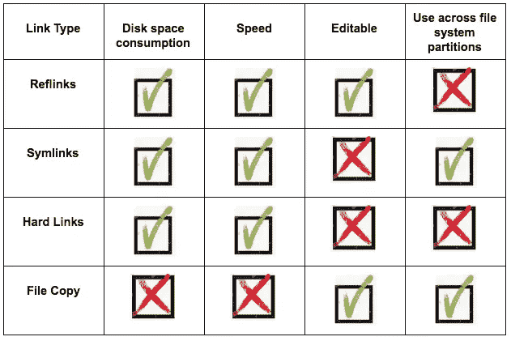
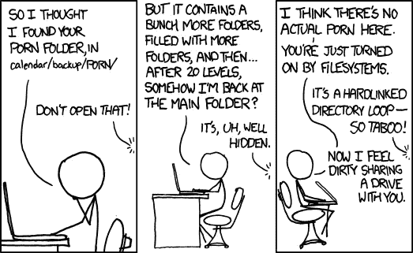
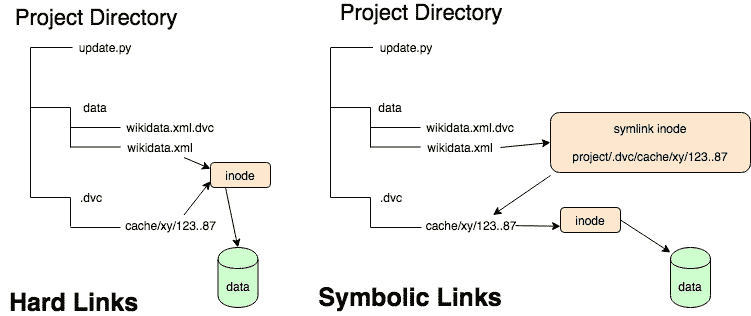
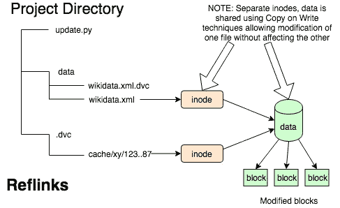

# 参考链接与符号链接与硬链接，以及它们如何帮助机器学习项目

> 原文：<https://towardsdatascience.com/reflinks-vs-symlinks-vs-hard-links-and-how-they-can-help-machine-learning-projects-b77b89cdbab1?source=collection_archive---------19----------------------->

## [行业笔记](https://towardsdatascience.com/tagged/notes-from-industry)



作者图片

硬链接和符号链接自古以来就有了，我们无时无刻不在使用它们，甚至连想都没想过。在机器学习项目中，当建立新的实验时，它们可以帮助我们在机器学习项目中快速有效地重新排列数据文件。然而，对于传统的链接，我们冒着错误编辑污染数据文件的风险。在这篇博文中，我们将回顾使用链接的细节，现代文件系统中一些很酷的新东西(引用链接)，以及 DVC(数据版本控制，[https://dvc.org/](https://dvc.org/))如何利用这一点的例子。

当我在学习机器学习时，我希望有一个工具能让我们像检查常规软件工程项目一样检查 ML 项目。也就是说，在任何给定的时间检索项目的状态，基于项目的早期状态创建分支或标签(用 Git ),处理与同事的协作，等等。让 ML 项目与众不同的是巨大的数据量，数以千计的图像、音频或视频文件，经过训练的模型，以及使用 Git 等常规工具管理这些文件的难度。在我之前的文章中，我解释了为什么 [Git 本身是不够的](/why-git-and-git-lfs-is-not-enough-to-solve-the-machine-learning-reproducibility-crisis-f733b49e96e8)，为什么 Git-LFS 不是机器学习项目的解决方案，以及一些看起来对管理 ML 项目的工具有用的[原则](https://dev.to/robogeek/principled-machine-learning-4eho)。

事实证明，DVC 非常擅长管理 ML 项目数据集和工作流程。它与 Git 协同工作，可以显示与任何 Git 提交相对应的数据集的状态。只需签出一个提交，DVC 就可以重新安排数据文件，使其与提交时的数据完全匹配。

考虑到潜在的数十亿字节的数据几乎在瞬间被重新排列，这个速度是相当神奇的。所以我在想:DVC 是如何完成这个魔术的？

# 重新排列千兆字节训练数据的诀窍

事实证明，DVC 像 Git 一样快速地重新排列数据和模型文件的秘诀是链接文件而不是复制文件。当然，Git 在检查提交时会将文件复制到位，但是 Git 通常处理相对较小的文本文件，而不是 ML 项目中使用的大型二进制 blobs。像 DVC 那样链接一个文件，速度快得令人难以置信，可以在眨眼之间重新排列任何数量的文件，同时避免复制，从而节省磁盘空间。

实际上，使用文件链接技术对这个领域来说并不新鲜。一些数据科学团队使用符号链接来节省空间并避免复制大型数据集。但是符号链接并不是唯一可以使用的链接。我们将从将文件复制到适当位置的策略开始，然后使用硬链接和符号链接，最后使用一种新类型的链接 reflinks，它在文件系统中实现了[写时复制功能](https://en.wikipedia.org/wiki/Copy-on-write)。我们将以 DVC 为例，说明工具如何使用不同的链接策略。

# 测试设置

因为我们将测试不同的链接策略，所以我们需要一个样例工作空间。工作区设置在我的笔记本电脑上，一台 MacBook Pro，主驱动器用 APFS T4 文件系统格式化。进一步的测试是在用 [XFS](https://en.wikipedia.org/wiki/XFS) 格式化的 Linux 驱动器上进行的。

使用的数据是从两个不同的日子检索的维基百科网站的两个“存根文章”转储。每个都是大约 38 GB 的 XML，给我们足够的数据来类似于一个 ML 项目。然后我们建立一个 Git/DVC 工作区，在这里可以通过检查不同的 Git 提交在这两个文件之间切换。

```
$ ls -hl wikidatawiki-20190401-stub-articles.xml
-rw-r--r--  1 david  staff    35G Jul 20 21:35 wikidatawiki-20190401-stub-articles.xml
$ time cp wikidatawiki-20190401-stub-articles.xml wikidatawiki-stub-articles.xmlreal    14m16.918s
...
```

作为一项基本措施，我们将注意到，将这些文件复制到工作区大约需要 15 分钟。很明显，如果在存储库中切换提交需要 15 分钟，那么 ML 研究员的生活不会很愉快。

相反，我们将探索 DVC 和其他一些工具使用的另一种技术——链接。现代操作系统支持两种类型的链接:硬链接和符号链接。一种新的链接类型，Reflink(写时复制)，开始在 Mac OS X 和 Linux 的新版本中可用(为此需要所需的文件系统驱动程序)。我们将依次使用它们，看看它们的效果如何。

DVC 在其文档中讨论了与三种链接类型相对应的四种策略(第四种策略是复制文件)。所使用的策略取决于文件系统的功能，以及“`dvc config cache.type`”命令是否更改了配置。

DVC 默认使用引用链接，如果不可用，就退回到文件复制。它避免使用符号链接和硬链接，因为存在意外缓存或存储库损坏的风险。我们将在接下来的章节中看到所有这些。

# 使用文件复制的版本化数据集

在签出 Git 标记时将文件复制到适当位置的基本(或幼稚)策略相当于以下命令:

```
$ rm data/wikidatawiki-stub-articles.xml
$ cp .dvc/cache/40/58c95964df74395df6e9e8e1aa6056 data/wikidatawiki-stub-articles.xml
```

这可以在任何文件系统上运行，但是复制文件需要很长时间，并且会消耗两倍的磁盘空间。

奇怪的文件名是怎么回事？它是 DVC 缓存中的文件名，十六进制数字是 MD5 校验和。DVC 缓存中的文件通过该校验和进行索引，允许同一文件有多个版本。 [DVC 文档](https://dvc.org/doc/user-guide/dvc-files-and-directories#structure-of-cache-directory)包含了更多关于 DVC 缓存实现的细节。

实际上，DVC 是这样运作的:


作者图片

为了设置工作空间，我们创建了两个 Git 标记，每个标记对应于我们下载的一个文件。关于版本化数据集的 [DVC 示例](https://dvc.org/doc/get-started/example-versioning) ( [或本替代教程](https://techsparx.com/software-development/ai/dvc/versioning-example.html))应该会让您对设置工作空间涉及的内容有所了解。为了测试不同的文件复制/链接模式，我们首先更改 DVC 配置，然后检查给定的 Git 提交。运行“`dvc checkout`”会将相应的数据文件插入到目录中。

哦，伙计，那确实花了很长时间。这个的 Git 部分非常快，但是 DVC 花了很长时间。这是意料之中的，因为我们告诉 DVC 执行文件复制，我们已经知道使用`cp`命令复制文件大约需要 16 分钟。

至于磁盘空间，显然现在有数据文件的两个副本。一个拷贝在 DVC 缓存目录中，另一个拷贝在工作区中。



来源:[https://www.xkcd.com/981/](https://www.xkcd.com/981/)(知识共享)

# 使用硬链接和符号链接的版本化数据集

显然，复制文件来处理数据集版本是缓慢的，并且是对磁盘空间的低效使用。在类 Unix 环境中，一个自古以来就存在的选项是硬链接和符号链接。虽然 Windows 历史上不支持文件链接，但“`mklink`”也可以支持这两种类型的链接。



作者图片

硬链接是 Unix 文件系统模型的副产品。我们所认为的文件名实际上只是目录文件中的一个条目。目录文件条目包含文件名和“inode number ”,它只是 inode 表中的一个索引。Inode 表条目是包含文件属性和指向实际数据的指针的数据结构。硬链接只是两个具有相同索引节点号的目录条目。实际上，它是出现在文件系统中两个位置的完全相同的文件。硬链接只能在给定的装入卷中进行。

符号链接是一个特殊的文件，其属性包含指定链接目标的路径名。因为它包含路径名，所以符号链接可以指向文件系统中的任何文件，甚至可以跨已挂载的卷或跨网络文件系统。

这种情况下的等效命令是:

```
$ rm data/wikidatawiki-stub-articles.xml
$ ln .dvc/cache/40/58c95964df74395df6e9e8e1aa6056 data/wikidatawiki-stub-articles.xml
```

这是一个硬链接。对于符号链接，使用“`ln -s`”。

然后执行硬链接场景:


作者图片

符号链接场景是相同的，但是将`cache.type`设置为`symlink`。两种情况下的时间是相似的。

两秒钟(或更短)肯定比复制文件所需的 16 分钟要快得多。它发生得如此之快，以至于我们用了“瞬间”这个词。文件链接比到处复制文件要快得多。这是一个巨大的胜利。

至于磁盘空间消耗，请考虑以下情况:

```
$ ls -l data/
total 8
lrwxr-xr-x  1 david  staff   70 Jul 21 18:43 wikidatawiki-stub-articles.xml -> /Users/david/dvc/linktest/.dvc/cache/2c/82d0130fb32a17d58e2b5a884cd3ce
```

该链接占用的磁盘空间可以忽略不计。但是有一个问题需要考虑。

好吧，看起来不错，对吧？快速，没有额外的空间消耗…但是，让我们想想如果你在工作区编辑`data/wikidatawiki-stub-articles.xml`会发生什么。因为该文件链接到 DVC 缓存中的文件，所以缓存中的文件会被更改，从而污染缓存。你需要采取额外的措施，并学会如何避免这个问题。 [DVC 文档](https://dvc.org/doc/user-guide/update-tracked-file)中有使用 DVC 时避免该问题的说明。这意味着永远记住使用一个特定的过程来编辑数据文件，虽然不是一个交易破坏者，但不太方便。不过更好的选择是使用 reflinks。

# 使用引用链接的版本化数据集

硬链接和符号链接在 Unix/Linux 生态系统中已经存在很长时间了。我第一次使用符号链接是在 1984 年的 4.2BSD 上，硬链接可以追溯到更早。硬链接和符号链接都可以用来做 DVC 做的事情，即快速重新安排工作目录中的数据文件。但是在过去的 35 年多时间里，文件系统肯定有了一两个进步吧？



作者图片

确实有，Mac OS X 的“`clonefile`”和 Linux 的“`reflink`”功能就是例子。

写链接时复制，也称为引用链接，提供了一种快速将文件链接到工作区的解决方案，同时避免了污染缓存的任何风险。硬链接和符号链接方法因其速度而大获全胜，但这样做有污染缓存的风险。使用引用链接，写时复制行为意味着如果有人修改数据文件，缓存中的副本不会被污染。这意味着我们将拥有与传统链接相同的性能优势，以及额外的数据安全性优势。

也许，你和我一样，不知道什么是 reflink。这种技术意味着在磁盘上复制一个文件，这样“副本”就是一个类似于硬链接的“克隆”。与两个目录条目引用同一个索引节点条目的硬链接不同，引用链接有两个索引节点条目，共享的是数据块。它和硬链接一样快，但是有一个重要的区别。对克隆文件的任何写入都会导致分配新的数据块来保存该数据。克隆的文件看起来发生了变化，而原始文件未被修改。克隆非常适合复制数据集的情况，允许在不污染原始数据集的情况下修改数据集。

与硬链接一样，引用链接仅在给定的已装入卷内起作用。

参考链接在 Mac OS X 上很容易找到，在 Linux 上也很容易找到。此功能仅在某些文件系统上受支持:

*   Linux: BTRFS，XFS，OCFS2
*   麦克·OS X:APFS

APFS 在 macOS 上是开箱即用的，苹果强烈建议我们使用它。对于 Linux，XFS 是最容易设置的，如本教程所示。

对于 APFS，等效的命令是:

```
$ rm data/wikidatawiki-stub-articles.xml
$ cp -c .dvc/cache/40/58c95964df74395df6e9e8e1aa6056 data/wikidatawiki-stub-articles.xml
```

使用`-c`选项，macOS `cp`命令使用`clonefile(2)`系统调用。`clonefile`函数设置命名文件的 reflink 克隆。在 Linux 上，`cp`命令使用`--reflink`选项。

然后运行测试:


作者图片

正如预期的那样，性能类似于硬链接和符号链接策略。我们了解到引用链接和硬链接、符号链接一样快，磁盘空间消耗也可以忽略不计。

这个链接很酷的一点是，即使文件是连接的，你也可以编辑文件，而不用修改缓存中的文件。被改变的数据在幕后被复制。

在 Linux 上，相同的场景以相似的性能运行。

# 结论


来源——DVC

我们已经了解了如何有效地管理大型数据集，就像机器学习项目中的典型情况一样。如果我们需要重新访问此类项目中的任何开发阶段，我们将需要一个系统来有效地重新安排大型数据集以匹配每个阶段。

我们已经看到，在任何 Git 提交时保存文件列表是可能的。有了这个列表，我们可以将这些文件链接或复制到工作目录中。这正是 DVC 在项目中管理数据文件的方式。使用链接，而不是文件复制，让我们快速有效地在项目的不同版本之间切换。

Reflinks 是文件系统的一个有趣的新特性，非常适合这个场景。Reflinks 创建起来和传统的硬链接和符号链接一样快，让我们可以快速复制一个文件，或者整个目录结构，而消耗的额外空间可以忽略不计。而且，由于 reflinks 在链接的文件中保存修改，它们给了我们比传统链接更多的可能性。在本文中，我们研究了在机器学习项目中使用引用链接，但它们也用于其他类型的应用程序。例如，一些数据库系统利用它们来更有效地管理磁盘上的数据。现在你已经了解了引用链接，你将如何使用它们呢？

*此文最初发布于* [*dev.to*](https://dev.to/robogeek/reflinks-vs-symlinks-vs-hard-links-and-how-they-can-help-machine-learning-projects-1cj4)