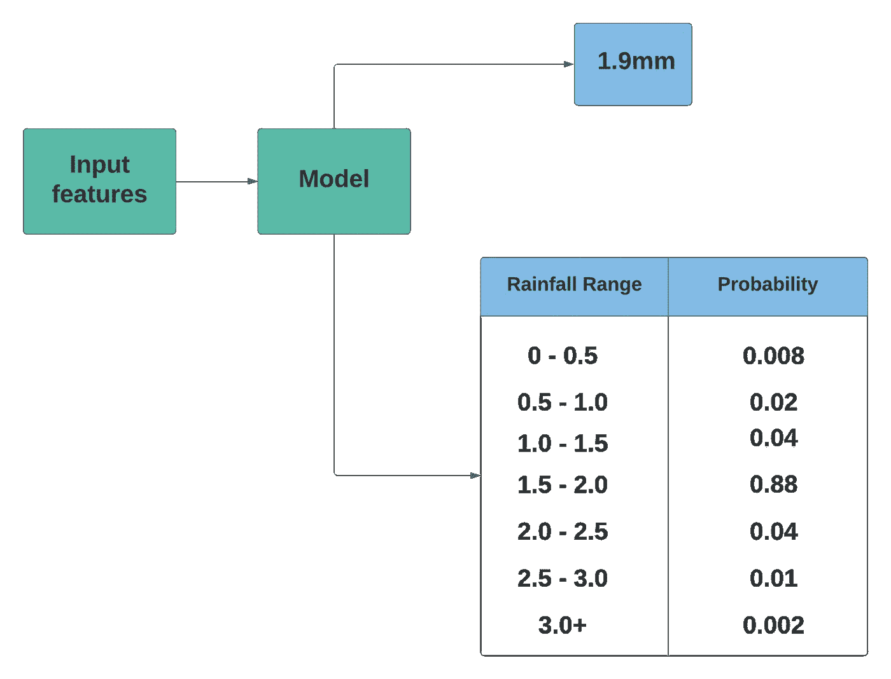
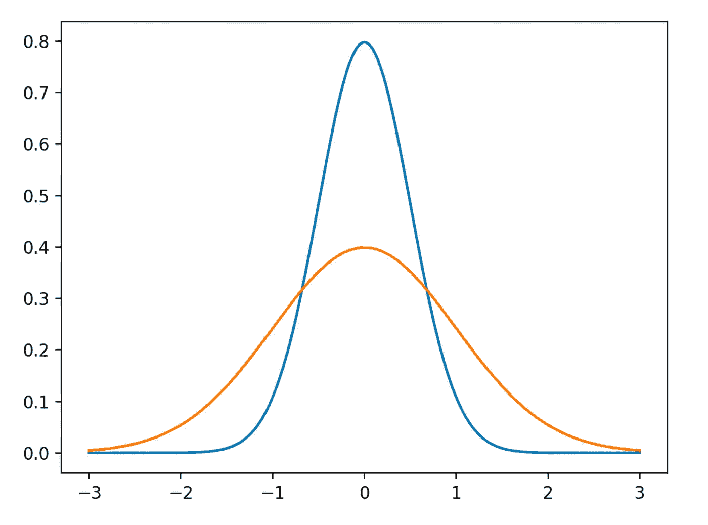

# 重构——代表机器学习中的问题

> 原文：<https://towardsdatascience.com/reframing-representing-problems-in-machine-learning-e1805130db29?source=collection_archive---------23----------------------->

## 如何在定义你的 ML 问题时进行整体思考

詹姆斯·皮科克在 [Unsplash](https://unsplash.com/s/photos/inversion?utm_source=unsplash&utm_medium=referral&utm_content=creditCopyText) 上拍摄的照片

我希望你在保持健康的同时阅读这封邮件。本周，我想让你思考一下你是如何构建你的 ML 问题的。我将介绍重构设计模式，它打破了表示问题的挑战。

设计模式是一种将专家的经验和知识标准化的方式，以解决任何领域的主要挑战。我们在人工智能领域已经走得太远了，是时候我们至少开始讨论这些设计模式了。

# 再构造

重构设计模式解决了使用变化的上下文输出提出直观的机器学习问题的挑战。这里，我们改变问题输出的表示。例如，一个直观的回归问题可以被重构为一个分类问题，反之亦然。

让我们更深入地理解这一点。

## 问题

每个机器学习项目都是从框定问题开始的。我们试图回答这样的问题:“这是一个有人监督的问题还是无人监督的问题？”，“我们在使用什么功能？”，“如果问题被监督，标签是什么？”、“什么样的精度或误差值是可接受的？”。您尝试根据手头的数据和构建模型的业务目标来回答这些问题。

举个例子，我们想预测给定位置在 20 分钟内的降雨量。现在，这似乎是一个简单的时间序列预测问题，我们将考虑历史气候和天气条件来预测降雨量。或者，这也可以定义为回归问题，因为标签(降雨量)是一个实数(例如 0.5 厘米)。

在多次训练您的模型后，您意识到所有您预测的降雨量都偏离了实际值。模型显示将会下 0.2 厘米的雨，但实际上却下了 0.4 厘米，这对于相同的特征集来说是令人惊讶的。问题是我们应该如何处理这种不确定性？我们应该如何改进我们的预测？

## 解决办法

这里的关键问题是降雨量遵循概率分布。对于相同的天气条件和特征，有时会下雨 0.2 厘米，有时会下雨 0.4 厘米。回归模型仅限于预测单个数字，而且预测正确的几率很小。

我们可以将我们的目标重新定义为一个分类问题，而不是试图使用回归模型来预测降雨量。这种转换可以通过不同的方式实现。一种方法是使用离散概率分布将输出建模为多类分类。该模型将返回一定范围内降雨量的概率，如下所示:

按作者

分类模型允许我们预测不同范围内降雨量的概率分布，而不是估计分布的平均值。这种模拟分布的方法是有利的，因为降水量不呈现正态分布，而是遵循[特威迪分布](https://rmets.onlinelibrary.wiley.com/doi/abs/10.1002/joc.1063)，这允许点的出现率为零。

在[的谷歌研究论文](https://arxiv.org/pdf/2003.12140.pdf)中采用了同样的方法，他们记录了一个 512 路分类模型来预测给定位置的降雨量。

# 为什么有效

在构建 ml 驱动的应用程序时，重构问题会有所帮助。我们不是将预测缩小到一个单一的实数，而是将预测目标放宽到一个离散的概率分布。

这种权衡的形式是由于 bucketing 造成的精度损失，但我们获得了全概率密度函数(PDF)的口才。与这种离散化的预测相比，回归模型的僵化本质使它们不太擅长学习。

# 反过来——我们什么时候应该坚持回归？

有些情况下，你会想把一个问题重新组织成一个回归任务。回答这个问题的一个问题是，我们希望我们的预测有多精确？

PDF(概率密度函数)的锐度影响回归模型的精度。

按作者

更清晰的 PDF 表示输出分布的标准偏差更小，而更宽的 PDF 表示标准偏差更大。因此有更多的差异。在密度函数非常尖锐的情况下，最好使用回归模型。

这些重构原则可以应用于许多应用中，如构建推荐引擎、客户细分等。通常，我们有多种合适的方法，但重要的是在你制定解决方案之前，全面地思考问题。

# 本周有趣的读物

这是我决定从本周开始增加的一个新的部分，我将分享至少一个有趣的博客/文章/章节，来自一本我读得非常喜欢的书。

本周有趣的阅读是网飞如何使用 ML 来提高其流媒体质量 。有趣的是，他们是如何从播放数据中构建这个机器学习问题的，这些数据是他们在向全球 1.17 亿观众播放时收集的。

该博客解释了分解网络质量和表征的复杂问题，并使用统计建模来预测网络在给定过去 15 分钟数据的情况下未来 15 分钟的吞吐量的思想。他们考虑的变量范围之广令人震惊。你会喜欢读这个的！

本周就到这里，下周五见！在那之前保持安全，戴上口罩！

# 和我联系！

如果你觉得这有帮助，可以考虑订阅[我的时事通讯](https://dswharshit.substack.com/)，因为我每周都会继续揭开这些挑战的神秘面纱。

如果您有一些建议、问题或想法，请随时回复本博客或对视频发表评论，或者您可以通过 [Twitter](https://twitter.com/tyagi_harshit24) 或 [LinkedIn](https://harshit-tyagi.medium.com/) 与我联系。