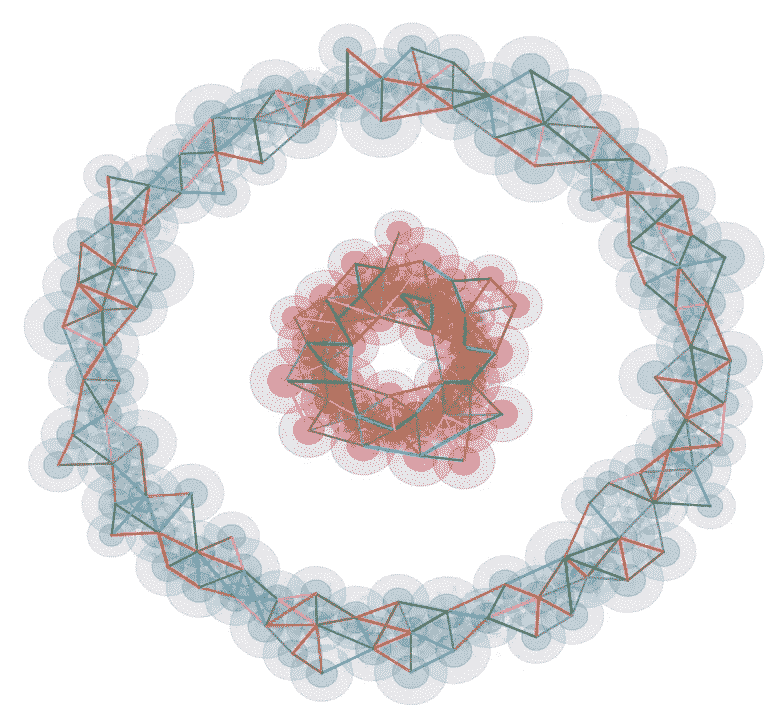
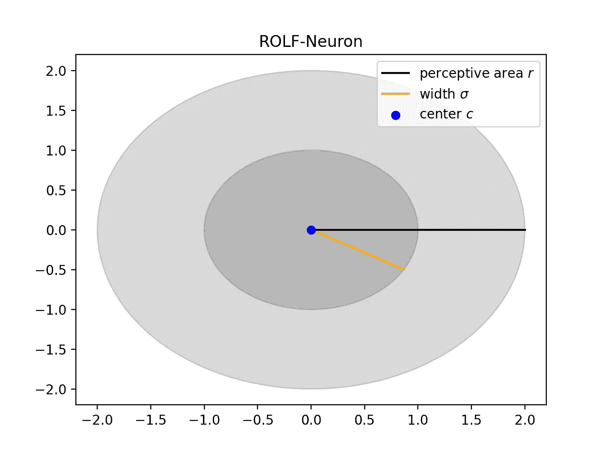
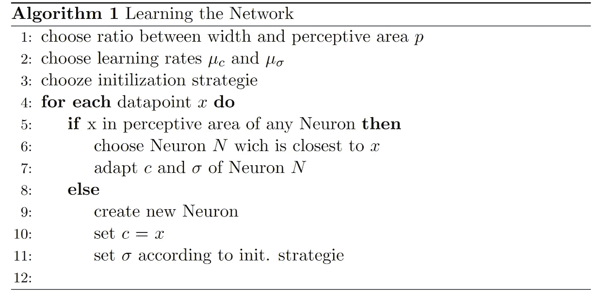
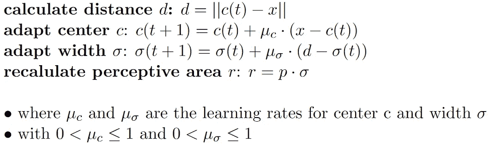
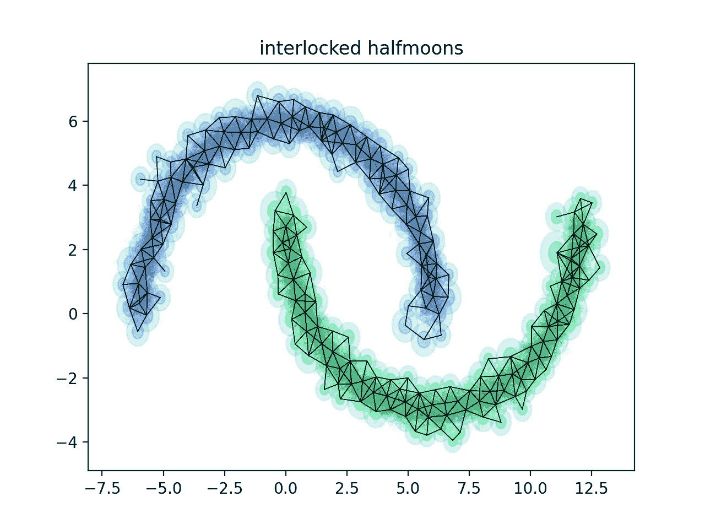
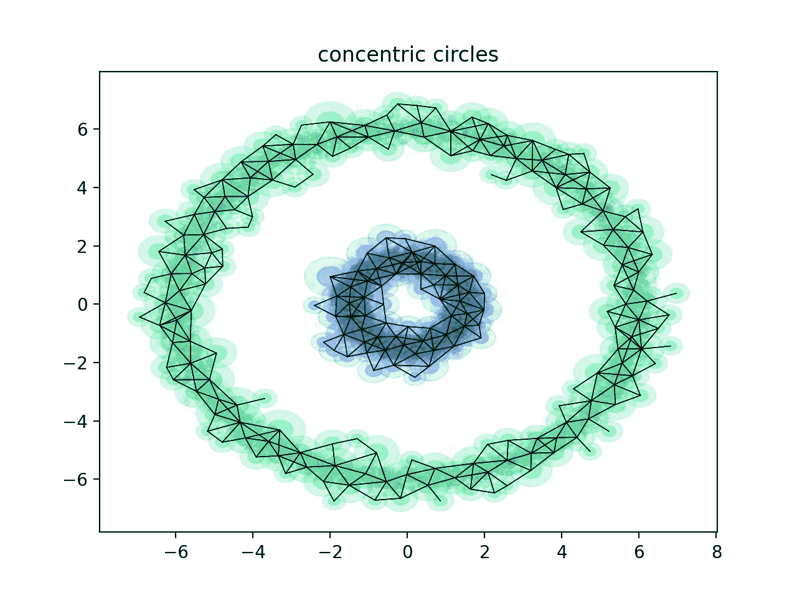

# 区域和在线学习领域

> 原文：<https://towardsdatascience.com/regional-and-online-learnable-fields-cbb18b74e01e?source=collection_archive---------37----------------------->

## **一种新的，不太新的聚类算法**

(图片由作者提供)

这篇文章将引导你了解地区和在线学习领域。一个看似未被识别的聚类算法，它提供了 k-Means 和 k-Nearest-neighbors 的几个优点。

# 区域和在线学习领域

首先由 Rolf Schatten、Nils Goerke 和 Rolf Eckmiller 在 2005 年提出，区域和在线可学习领域是一种在线和无监督的聚类技术[1]。总的想法是用所谓的 ROLF 神经元来近似我们的数据点，在后面的步骤中，可以将这些神经元连接起来形成簇。该算法源于 k-Means 和 k-Nearest-Neighbors，旨在对它们进行改进。让我们先来看看，前者有哪些地方可以加强。

# k-Means 和 KNN 哪里可以改进？

1.  原始 k-Means 算法的一个常见问题是我们必须预先选择聚类数 k。虽然有时我们可以做出有根据的猜测，但大多数时候我们不得不求助于某种形式的试错法。这需要时间，最好将 k 的选择合并到聚类过程本身中。
2.  另一个问题是，k-Means 不能聚类某些形状，如两个同心圆或两个互锁的半月形。一般来说，当聚类不是圆形或者当它们的质心彼此靠近时，k-Means 失败。
3.  k-Means 不是在线自适应的。假设您在两个聚类上训练了 k-Means，现在用第三个聚类的数据点来呈现它。这些点将被分配给训练期间发现的两个集群。这是不希望的，并且如果该算法将为所述点创建新的聚类，或者将它们标记为“未知”会好得多。
4.  此外，kNN 还面临着复杂性的问题。为了给一个聚类分配一个数据点，我们必须计算它到所有训练点的距离。你可以想象，如果我们有大量的训练点，这将很快变得计算效率低下。因此，我们必须找到一种方法来减少距离计算的数量。

## ROLF 神经元

区域和在线可学习领域的核心是所谓的 ROLF 神经元。这些充当我们的数据点的原型，并且有他们负责的区域。这个区域被称为感知领域。ROLF 神经元由 3 个参数组成:

1.  中心 *c* ，定义神经元在空间中的位置。
2.  宽度 *σ* ，定义了每个神经元的宽度。
3.  感知领域 *r = p* ⋅ *σ* ，定义其负责的区域。初始设置时，常数 *p* 对所有神经元都是相等的。它定义了每个神经元的感知范围和宽度之间的比率。

**p = 2** (图片作者)

# 学习网络

这基本上分两步走，首先，我们必须在我们的训练数据中找到 ROLF 神经元或原型。之后，我们在它们之间构建一个邻域图，最终定义聚类。

# 如何找到罗尔夫神经元？

首先，我们反复检查所有的训练模式，看看它们是否在一个已经存在的神经元的感知范围内。如果在多个神经元的感知范围内，我们选择最接近模式的那个神经元。在我们决定了这个所谓的“获胜神经元”之后，我们调整它的中心 *c* 和宽度 *σ* 。

(图片由作者提供)

如果模式不在任何现有神经元的感知范围内，我们根据初始化策略创建一个新的。这个策略必须在一开始就选择。我们稍后将讨论这方面的细节。

# 获胜神经元如何适配？

设 *x* 为训练模式， *c* 为获胜神经元的中心。为了调整中心 *c* 和宽度 *σ* ，我们首先必须计算 *c* 和 *x* 之间的距离 *d* 。之后，我们将 *c* 向 *x* 移动，并将 *σ* 向 *d* 调整。最后，我们重新计算感知领域。

(图片由作者提供)

从公式中，我们可以看到常量参数 *p* 的使用。它允许神经元接受 *σ之外的模式。*如果 x 和 c 之间的距离大于 *σ，*前者增加*。在相反的情况下，它会减少。没有 *p，*感知范围只能缩小，因为只有在 *σ* 内的点才会被接受。*

# 如何初始化一个新的神经元？

当我们初始化一个新的神经元时，我们总是将 *c* 设置为模式 *x* 。我们改变的值是神经元的宽度 *σ* 。这可以通过四种不同的方式来设置。

1.  **Init-σ →** 将 *σ* 初始化为恒定值
2.  **最小值-σ** →将 *σ* 初始化为所有现有神经元的最小值 *σ*
3.  **最大值-σ** →初始化 *σ* 为所有已经存在的神经元的最大值 *σ*
4.  **均值-σ** →初始化 *σ* 为均值 *σ* 整体已经存在的神经元

现在，观察力敏锐的读者可能会想:如果我选择均值-σ作为策略，我该如何初始化第一个神经元？毕竟，没有σ值来计算平均值。嗯，这是正确的。第一个神经元的σ总是必须由预定义的值来设置。接下来的一切将由你选择的策略决定。

# 建设社区

在学习算法的第二步中，我们希望将我们之前发现的神经元分组为簇。这是通过构建一个邻域图来实现的，其中具有重叠感知域的神经元用一条边连接起来。从数学上来说，如果两个神经元的中心距离小于其感知范围(半径)之和，则这两个神经元是连通的。

(图片由作者提供)

现在，所有可以通过一系列边连接的神经元都属于同一个簇。它们的感知区域的联合是总区域，其中在预测期间新的数据点被分配给所述聚类。

# ROLF 的优势

1.  该算法可以自己选择聚类数 *k* 。
2.  该算法不受聚类形状的限制。特别是 k-均值，连锁半月形和同心圆的问题案例可以用 ROLF 聚类。下一节将给出例子。
3.  通过用 ROLF 神经元表示训练数据点，只需对前者进行距离计算。此外，必须专门存储神经元，而模式将仅呈现一次，然后可以被丢弃。这也减少了内存的使用。
4.  该算法可以自己检测异常值，然后据此采取相应的行动。

# 表演

现在，我想向大家展示几个地区和在线可学习领域在实践中表现的例子。

20000 点，219 个神经元(图片由作者提供)

在给出的例子中，你可以看到 ROLF 是如何将 k-Means 的两个失败案例进行聚类的。对于这两个例子，对于 *c* 和 *σ* 使用了 0.05 的学习率。用最小σ策略初始化新的神经元。第一个神经元初始化为σ = 0.4，而 *p* 设置为 2。黑线显示了邻域图形。两个数据集都由 20000 个点组成，并减少到约 1%的神经元。绿色和蓝色区域显示了点将被分配给相应的聚类的位置。

20000 点，239 个神经元(图片由作者提供)

# 评论

1.  ROLF 神经元的中心 c 的维数不一定是 2。在最初的论文中，ROLF 被用于从 720 维的输入空间中聚类点[1]。
2.  用于生成示例的代码可以在[这里](https://github.com/JoWohlen/Medium_Code/tree/main/ROLF)找到。

# 来源:

[1] Schatten R .，Goerke N .，Eckmiller R. (2005)区域和在线可学习领域。在:Singh S .，Singh M .，Apte C .，Perner P. (eds)模式识别和图像分析。ICAPR 2005。计算机科学讲义，第 3687 卷。斯普林格，柏林，海德堡。[https://doi.org/10.1007/11552499_9](https://doi.org/10.1007/11552499_9)