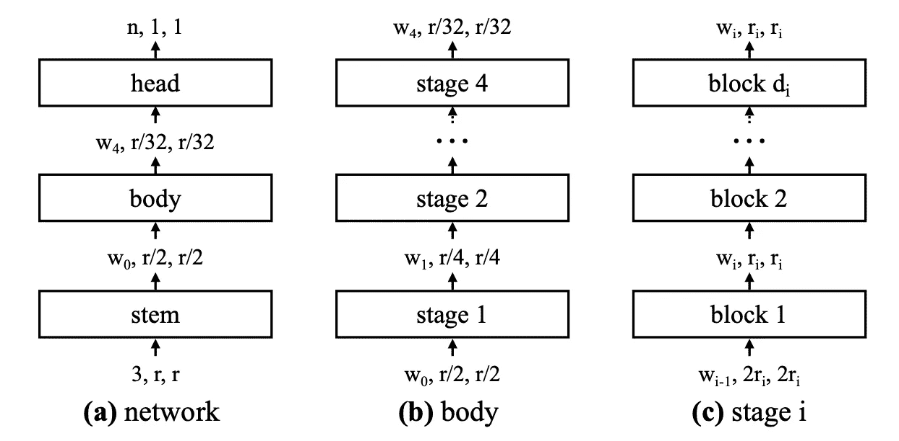

# RegNet:最灵活的计算机视觉网络体系结构

> 原文：<https://towardsdatascience.com/regnet-the-most-flexible-network-architecture-for-computer-vision-2fd757f9c5cd?source=collection_archive---------5----------------------->

## 为高效率或高精度而缩放的模型设计

传统上，卷积神经网络架构是为一个特定目的而设计和优化的。例如，ResNet 模型系列在最初发布时就在 ImageNet 上进行了最高精度的优化。顾名思义，MobileNets 是为在移动设备上运行而优化的。最后，EfficientNet 被设计成在视觉识别任务中非常高效。

在他们的论文“设计网络设计空间”中，Radosavovic 等人决定设定一个非常不同寻常但非常有趣的目标:他们着手探索和设计一个高度灵活的网络架构。一个可以被调整为高效的或者在移动设备上运行的，但是当被调整为最佳分类性能时也是高度准确的。这种适应应该通过在量化的线性函数(一组具有特定参数的公式)中设置正确的参数来控制，以**确定网络的宽度和深度**。

网络设计空间的可视化。空间不断优化，以达到一个更小的设计空间与最好的模型。来源:[【1】](https://openaccess.thecvf.com/content_CVPR_2020/papers/Radosavovic_Designing_Network_Design_Spaces_CVPR_2020_paper.pdf)

他们采用的方法也是非传统的:他们没有手工制作模型架构，而是建立了他们所谓的网络设计空间。

# **从网络设计空间中导出 RegNet 模型**

如果您只是在这里看到 RegNet 模型的描述，请随意跳过这一部分。我强烈建议您阅读全文，因为如果不了解网络设计领域，就很难理解 RegNet。**说到底，RegNet 其实不是一个架构，而是一个网络设计空间**。

一个**网络设计空间**不仅仅是，顾名思义，由不同的模型架构组成，而是由**不同的参数组成，这些参数定义了一个可能的模型架构空间**。这与神经架构搜索不同，你所做的只是尝试不同的架构，搜索最合适的架构。这些参数可以是宽度、深度、组等。网络的一部分。RegNet 也仅使用许多不同架构中的一种类型的网络块，例如瓶颈块。

为了达到最终的 RegNet 设计空间，作者首先定义了一个所有可能模型的空间，他们称之为 **AnyNet。**该空间通过不同参数的各种组合创建各种模型。所有这些模型都使用一致的训练机制(时期、优化器、权重衰减、学习率调度程序)在 ImageNet 数据集上进行训练和评估。

AnyNet 设计空间的统计数据，W4 代表第 4 阶段的网络宽度。来源:[【1】](https://openaccess.thecvf.com/content_CVPR_2020/papers/Radosavovic_Designing_Network_Design_Spaces_CVPR_2020_paper.pdf)

从这个 AnyNet 空间，**他们通过分析什么参数负责 AnyNet 设计空间中最佳模型的良好性能，创建初始 AnyNet 设计空间**的逐步简化版本。**基本上，他们正在试验不同参数的重要性，以便将设计空间缩小到只有好的型号。**

这些从当前设计空间到更窄设计空间的改进包括设置共享瓶颈比率和共享组宽度，将宽度和深度参数化以随后期阶段增加。

最后，他们到达优化的 **RegNet 设计空间**，其中仅包含好的模型以及定义模型所需的量化线性函数！

# RegNet 设计空间

该网络由多个阶段组成，该多个阶段由多个块组成，形成茎(开始)、体(主要部分)和头(结束)。

RegNet 由茎、体和头组成。来源:[【1】](https://openaccess.thecvf.com/content_CVPR_2020/papers/Radosavovic_Designing_Network_Design_Spaces_CVPR_2020_paper.pdf)

在主体内部，定义了多个阶段，每个阶段由多个块组成。如前所述，在 RegNet 中只使用了一种类型的块，即具有群卷积的标准剩余瓶颈块。

用群卷积实现剩余瓶颈阻塞。在右侧，应用了步幅 2。来源:[【1】](https://openaccess.thecvf.com/content_CVPR_2020/papers/Radosavovic_Designing_Network_Design_Spaces_CVPR_2020_paper.pdf)

如上所述，RegNet 模型的设计不是由诸如深度和宽度的固定参数定义的，而是由所选参数控制的**量化线性函数。**优化后，**块宽**计算如下:

uj 是 j 阶段的块宽度，w0 是初始宽度，wa 是斜率参数。j 从 0 开始，到网络的深度结束。来源:[【1】](https://openaccess.thecvf.com/content_CVPR_2020/papers/Radosavovic_Designing_Network_Design_Spaces_CVPR_2020_paper.pdf)

值得注意的是，对于每个额外的块，每个块的宽度以 *wa* 的因子增加。
作者随后引入一个额外的参数 *wm* (这可以由你设置)并计算 *sj* :

引入 *wm* 计算 sj 的必要公式。来源:[【1】](https://openaccess.thecvf.com/content_CVPR_2020/papers/Radosavovic_Designing_Network_Design_Spaces_CVPR_2020_paper.pdf)

最后，为了量化 *uj* ，作者舍入 *sj* 并计算量化的每块宽度:

使用初始宽度和 wm 的 sj 次幂计算的每块宽度。来源:[【1】](https://openaccess.thecvf.com/content_CVPR_2020/papers/Radosavovic_Designing_Network_Design_Spaces_CVPR_2020_paper.pdf)

既然已经计算了每个块的宽度，让我们移动到阶段级别。为了得出每个阶段 *i* 的宽度，所有具有相同宽度的块被简单地计数以形成一个阶段，因为一次所有的块应该具有相同的宽度。

现在要在 RegNet 设计空间之外创建一个 RegNet，必须设置参数 *d* (深度) *w0* (初始宽度) *wa* (斜率) *wm* (宽度参数) *b* (瓶颈)和 *g* (组)。

作者现在不同地设置这些参数，以获得具有不同属性的不同 RegNets:

*   为移动使用而优化的 RegNet
*   一个有效的 RegNet
*   高度精确的 RegNet

让我们看看这些网络与其他架构相比表现如何。

# 结果

首先，让我们检查 RegNet 的移动性能。

与其他架构相比的 RegNets。X 或 Y 代表剩余块或挤压退出块，其余代表网络所需的触发器。来源:[【1】](https://openaccess.thecvf.com/content_CVPR_2020/papers/Radosavovic_Designing_Network_Design_Spaces_CVPR_2020_paper.pdf)

在所需的 FLOPS 数量相同的情况下，两种 RegNets 都优于其他移动优化网络，或者表现出相似的性能。但是它并没有就此停止。

如简介中所述，**RegNet 被设计成高度灵活的**。接下来的两次评估完美地展示了这一点。

首先，RegNets 高效性能与 EfficientNet 架构。

RegNet 与 EfficientNet。来源:[【1】](https://openaccess.thecvf.com/content_CVPR_2020/papers/Radosavovic_Designing_Network_Design_Spaces_CVPR_2020_paper.pdf)

令人印象深刻的是，在所有比较中，RegNet 都有优势。**要么是在更高的训练和推理速度下具有相似的准确性，要么是更准确和更快，特别是在低端。**此外，作者声称 **RegNetX-F8000 大约比 EfficientNet-B5** 快 *5* × *。这是一个不可思议的飞跃！*

当 RegNet 被配置为高精度时，结果看起来也不错。

RegNet 与 ResNet 和 ResNe(X)t 的比较来源:[【1】](https://openaccess.thecvf.com/content_CVPR_2020/papers/Radosavovic_Designing_Network_Design_Spaces_CVPR_2020_paper.pdf)

这再次显示了 RegNet 的灵活性:**模型可以指定为高效快速或者高度准确。**这在以前的单一架构中是可能的。

# 包装它

在本文中，您了解了 RegNet，这是一个高度灵活的模型设计空间，采用了非常不同的方法。RegNet 不是单一的架构，它是一个由量化的线性函数定义的设计空间。虽然我希望这个故事能让你对这篇论文有一个很好的初步了解，但是还有很多东西需要发现。因此，我会鼓励你自己阅读这篇论文，即使你是这个领域的新手。你必须从某个地方开始；)

如果你对论文中介绍的方法有更多的细节感兴趣，请随时在 Twitter 上给我留言，我的账户链接在我的媒体简介上。

我希望你喜欢这篇论文的解释。如果你对这篇文章有任何意见，或者如果你看到任何错误，请随时留下评论。

**最后但同样重要的是，如果你想在高级计算机视觉领域更深入地探索，考虑成为我的追随者**。我试着每周发一篇文章，让你和其他人了解计算机视觉研究的最新进展。

参考资料:

[1] Radosavovic，Ilija 等，“设计网络设计空间”*IEEE/CVF 计算机视觉和模式识别会议论文集*。2020.[https://open access . the CVF . com/content _ CVPR _ 2020/papers/Radosavovic _ Design _ Network _ Design _ Spaces _ CVPR _ 2020 _ paper . pdf](https://openaccess.thecvf.com/content_CVPR_2020/papers/Radosavovic_Designing_Network_Design_Spaces_CVPR_2020_paper.pdf)