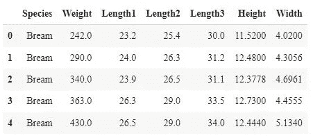
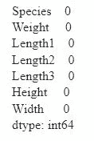
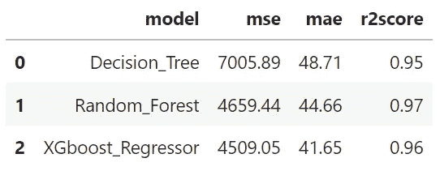
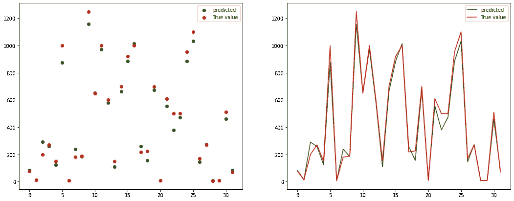

# 初学者回归分析—第二部分

> 原文：<https://towardsdatascience.com/regression-analysis-for-beginners-using-tree-based-methods-2b65bd193a7?source=collection_archive---------3----------------------->

## 建立鱼体重预测模型

## 使用基于**树的算法**(决策树、随机森林、XGboost)构建一个 ML 回归模型


在 [Unsplash](https://unsplash.com?utm_source=medium&utm_medium=referral) 上 [veeterzy](https://unsplash.com/@veeterzy?utm_source=medium&utm_medium=referral) 拍摄的照片

[简介](#2c5b)
[Part 2.1 构建机器学习管道](#c735)
∘ [第一步:收集数据](#df15)
∘ [第二步:可视化数据(自问自答)](#e32c)
∘ [第三步:清洗数据](#cbb8)
∘ [第四步:训练模型](#8b21)
∘ [第五步:评估](#be25)
∘

∘ [什么是随机森林？](#b782)
∘ [什么是极限梯度推进？(XGBoost)](#d410)
∘ [决策树 vs 随机森林 vs XGBoost](#f509)
∘ [线性模型 vs 基于树的模型。](#5f46)
[结论](#b5b6)

# 介绍

正如我在[上一篇文章](https://medium.com/@gkeretchashvili/how-to-start-your-data-science-machine-learning-journey-2af667e96d1)中解释的那样，真正的数据科学家从问题/应用的角度思考问题，并在编程语言或框架的帮助下找到解决问题的方法。在[第一部分](/fish-weight-prediction-regression-analysis-for-beginners-part-1-8e43b0cb07e)中，鱼重估计问题是使用线性 ML 模型解决的，但是，今天我将介绍**基于树的算法**，如**决策树、随机森林、XGBoost** 来解决相同的问题。在文章第 2.1 部分的前半部分，我将建立一个模型，在第 2.2 部分的后半部分，我将从理论上解释每种算法，将它们相互比较，并找出其优缺点。

[**YouTube 视频**](https://www.youtube.com/watch?v=8ryqWBf8TdY&t=401s) 决策树！

# 第 2.1 部分构建机器学习管道

为了建立一个 ML 模型，我们需要遵循下面几乎所有模型的流水线步骤。


作者图片

由于我们正在解决的问题与之前相同，所以一些流水线步骤将是相同的，例如 1。收集数据和 2。将数据可视化。但是，其他步骤会有一些修改。

## **第一步:收集数据**

数据是公共数据集，可以从 [Kaggle](https://www.kaggle.com/aungpyaeap/fish-market) 下载。

```
**import** pandas **as** pd
**import** seaborn **as** sns
**import** matplotlib.pyplot **as** plt
**from** itertools **import** combinations
**import** numpy **as** np
data **=** pd**.**read_csv("Fish.csv")
```

## **第二步:可视化数据(问自己这些问题并回答)**

*   数据看起来怎么样？

```
data**.**head()
```



*   数据是否有缺失值？

```
data**.**isna()**.**sum()
```



*   数字特征的分布是什么？

```
data_num **=** data**.**drop(columns**=**["Species"])

fig, axes **=** plt**.**subplots(len(data_num**.**columns)**//**3, 3, figsize**=**(15, 6))
i **=** 0
**for** triaxis **in** axes:
    **for** axis **in** triaxis:
        data_num**.**hist(column **=** data_num**.**columns[i], ax**=**axis)
        i **=** i**+**1
```


*   目标变量(重量)相对于鱼种的分布情况如何？

```
sns**.**displot(
  data**=**data,
  x**=**"Weight",
  hue**=**"Species",
  kind**=**"hist",
  height**=**6,
  aspect**=**1.4,
  bins**=**15
)
plt**.**show()
```


关于物种的目标变量分布表明，有些物种，如狗鱼，与其他物种相比具有巨大的重量。这种可视化为我们提供了关于“**物种”**特征如何用于预测的附加信息。

## 第三步:清理数据

```
from sklearn.model_selection import train_test_split
from sklearn.preprocessing import  LabelEncoder
from sklearn.tree import DecisionTreeRegressor
from sklearn.ensemble import RandomForestRegressor
import xgboost as xgb
from sklearn.metrics import mean_squared_error, mean_absolute_error, r2_score
data_cleaned =   data.drop("Weight", axis=1)
y = data['Weight']x_train, x_test, y_train, y_test = train_test_split(data_cleaned,y, test_size=0.2, random_state=42)
print(x_train.shape, x_test.shape, y_train.shape, y_test.shape)# label encoder
label_encoder = LabelEncoder()
x_train['Species'] = label_encoder.fit_transform(x_train['Species'].values)
x_test['Species'] = label_encoder.transform(x_test['Species'].values)
```


我们使用基于树的模型，因此我们不需要特征缩放。此外，为了将文本转换成数字，我刚刚使用 **LabelEncoder 为每种鱼分配了唯一的数值。**

## **第四步:训练模型**

```
**def** evauation_model(pred, y_val):
  score_MSE **=** round(mean_squared_error(pred, y_val),2)
  score_MAE **=** round(mean_absolute_error(pred, y_val),2)
  score_r2score **=** round(r2_score(pred, y_val),2)
  **return** score_MSE, score_MAE, score_r2score**def** models_score(model_name, train_data, y_train, val_data,y_val):
    model_list **=** ["Decision_Tree","Random_Forest","XGboost_Regressor"]
    *#model_1*
    **if** model_name**==**"Decision_Tree":
        reg **=** DecisionTreeRegressor(random_state**=**42)
    *#model_2*
    **elif** model_name**==**"Random_Forest":
      reg **=** RandomForestRegressor(random_state**=**42)

    *#model_3*
    **elif** model_name**==**"XGboost_Regressor":
        reg **=** xgb**.**XGBRegressor(objective**=**"reg:squarederror",random_state**=**42,)
    **else**:
        print("please enter correct regressor name")

    **if** model_name **in** model_list:
        reg**.**fit(train_data,y_train)
        pred **=** reg**.**predict(val_data)

        score_MSE, score_MAE, score_r2score **=** evauation_model(pred,y_val)
        **return** round(score_MSE,2), round(score_MAE,2), round(score_r2score,2)model_list **=** ["Decision_Tree","Random_Forest","XGboost_Regressor"]
result_scores **=** []
**for** model **in** model_list:
    score **=** models_score(model, x_train, y_train, x_test, y_test)
    result_scores**.**append((model, score[0], score[1],score[2]))
    print(model,score)
```

我训练了决策树，随机森林 XGboost 并存储了所有的评估分数。

## **第五步:评估**

```
df_result_scores **=** pd**.**DataFrame(result_scores,columns ["model","mse","mae","r2score"])
df_result_scores
```



基于树的模型

结果真的很吸引人，因为你记得线性模型取得了[低得多的结果](/fish-weight-prediction-regression-analysis-for-beginners-part-1-8e43b0cb07e)(也如下所示)。因此，在我们进行任何类型的超参数调整之前，我们可以说，在这种数据集中，所有基于树的模型都优于线性模型。


线性模型

## **第六步:使用 hyperopt 调节超参数**

今天，我们使用**超视**来调整使用[**TPE 算法的超参数。**](https://proceedings.neurips.cc/paper/2011/file/86e8f7ab32cfd12577bc2619bc635690-Paper.pdf)TPE 算法不是从搜索空间中取随机值，而是考虑到已知某些超参数赋值(x)与其他元素的特定值无关。在这种情况下，搜索比随机搜索更有效，比贪婪搜索更快。

```
**from** hyperopt **import** hp
**from** hyperopt **import** fmin, tpe, STATUS_OK, STATUS_FAIL, Trials
**from** sklearn.model_selection **import** cross_val_scorenum_estimator **=** [100,150,200,250]

space**=** {'max_depth': hp**.**quniform("max_depth", 3, 18, 1),
        'gamma': hp**.**uniform ('gamma', 1,9),
        'reg_alpha' : hp**.**quniform('reg_alpha', 30,180,1),
        'reg_lambda' : hp**.**uniform('reg_lambda', 0,1),
        'colsample_bytree' : hp**.**uniform('colsample_bytree', 0.5,1),
        'min_child_weight' : hp**.**quniform('min_child_weight', 0, 10, 1),
        'n_estimators': hp**.**choice("n_estimators", num_estimator),
    }

**def** hyperparameter_tuning(space):
    model**=**xgb**.**XGBRegressor(n_estimators **=** space['n_estimators'], max_depth **=** int(space['max_depth']), gamma **=** space['gamma'],
                         reg_alpha **=** int(space['reg_alpha']) , min_child_weight**=**space['min_child_weight'],
                         colsample_bytree**=**space['colsample_bytree'], objective**=**"reg:squarederror")

    score_cv **=** cross_val_score(model, x_train, y_train, cv**=**5, scoring**=**"neg_mean_absolute_error")**.**mean()
    **return** {'loss':**-**score_cv, 'status': STATUS_OK, 'model': model}

trials **=** Trials()
best **=** fmin(fn**=**hyperparameter_tuning,
            space**=**space,
            algo**=**tpe**.**suggest,
            max_evals**=**200,
            trials**=**trials)

print(best)
```


最佳超参数的结果

这是算法在 200 次试验后找到的最佳超参数的结果。但是，如果数据集太大，可以相应减少试验次数。

```
best['max_depth'] **=** int(best['max_depth']) *# convert to int*
best["n_estimators"] **=** num_estimator[best["n_estimators"]] #assing value based on indexreg **=** xgb**.**XGBRegressor(******best)
reg**.**fit(x_train,y_train)
pred **=** reg**.**predict(x_test)
score_MSE, score_MAE, score_r2score **=** evauation_model(pred,y_test) 
to_append **=** ["XGboost_hyper_tuned",score_MSE, score_MAE, score_r2score]
df_result_scores**.**loc[len(df_result_scores)] **=** to_append
df_result_scores
```


结果太棒了！与其他算法相比，超调模型非常好。例如，XGboost 将 MAE 的结果从 41.65 提高到 36.33。这是一个很好的说明，超参数调整是多么强大。

## **第七步:选择最佳模型和预测**

```
*# winner*
reg **=** xgb**.**XGBRegressor(******best)
reg**.**fit(x_train,y_train)
pred **=** reg**.**predict(x_test)
plt**.**figure(figsize**=**(18,7))
plt**.**subplot(1, 2, 1) *# row 1, col 2 index 1*
plt**.**scatter(range(0,len(x_test)), pred,color**=**"green",label**=**"predicted")
plt**.**scatter(range(0,len(x_test)), y_test,color**=**"red",label**=**"True value")
plt**.**legend()

plt**.**subplot(1, 2, 2) *# index 2*
plt**.**plot(range(0,len(x_test)), pred,color**=**"green",label**=**"predicted")
plt**.**plot(range(0,len(x_test)), y_test,color**=**"red",label**=**"True value")
plt**.**legend()
plt**.**show()
```



预测与真实

可视化清楚地展示了预测值和真实值的接近程度，以及调优后的 XGBoost 的性能。

# 第 2.2 部分分析最大似然算法

## 什么是决策树？

决策树是一种受监督的 ML 算法，擅长捕捉特征和目标变量之间的非线性关系。算法背后的直觉类似于人类的逻辑。在每个节点中，该算法找到将数据分成两部分的特征和阈值。下图是一个决策树。


鱼体重预测决策树

首先，让我们看看图中每个变量代表什么。我们以第一个节点为例。

**宽度≤5.154** :算法决定分割数据样本的特征和值阈值。

**样本= 127** :拆分前有 127 个数据点。

**value = 386.794** :预测特征(鱼重)的平均值。

**Squared _ error = 122928.22:**同 MSE(真，pred)——其中 pred 同**值**(样本的平均鱼重)。

所以基于**宽度≤5.154** 阈值的算法将数据分成两部分。但问题是算法是怎么找到这个阈值的？有几个分割标准，因为回归任务 CART 算法试图通过以贪婪的方式搜索来找到阈值，使得两个子组的 MSE 的加权平均值最小化。


例如，在我们的案例中，在第一次分割后，两个小组的加权平均 MSE 与其他分割相比是最小的。

```
J(k,t_k) = 88/127 *20583.394 + 39/127 *75630.727 = 37487.69
```

**决策树的问题:**

树对训练数据中的微小变化非常敏感。数据的微小变化可能会导致决策树结构的重大变化。这个限制的解决方案是随机森林。

## **什么是随机森林？**

随机森林是决策树的集合。随机森林背后的直觉是构建多个决策树，并且在每个决策树中，不是搜索最佳特征来分割数据，而是在特征的子集中搜索最佳特征，因此这提高了树的多样性。然而，它比简单的决策树更难理解。此外，它需要建立大量的树，这使得算法对于实时应用来说很慢。一般来说，算法训练起来很快，但创建预测却很慢。决策树的一个改进版本也是 XGBoost。

## **什么是极限梯度提升？(XGBoost)**

XGBoost 也是一种基于树的集成监督学习算法，它使用了[梯度推进](https://en.wikipedia.org/wiki/Gradient_boosting)框架。这种算法背后的直觉是，它试图用新的预测器来拟合前一个预测器产生的残余误差。它非常快，可伸缩，可移植。

## **决策树 vs 随机森林 vs XGBoost**

因此，在我们的实验中，XGboost 在性能方面优于其他产品。从理论上讲，决策树是最简单的基于树的算法，它有不稳定的局限性——数据的变化会引起树结构的巨大变化，但是它有很好的可解释性。随机森林和 XGboost 更复杂。区别之一是随机森林在过程结束时组合结果(多数规则)，而 XGboost 在过程中组合结果。一般来说，XGBoost 比随机森林有更好的性能，但是，当我们的数据中有很多噪声时，XGboost 不是一个好的选择，它会导致过拟合，并且比随机森林更难调整。

## 线性模型与基于树的模型。

*   线性模型捕捉自变量和因变量之间的线性关系，这在现实世界的大多数情况下并非如此。然而，基于树的模型捕捉更复杂的关系。
*   线性模型大多数时候需要特征缩放，而基于树的模型不需要。
*   基于树的模型的性能是线性模型的大多数倍。我们的实验很好地说明了这一点，最佳超调优线性模型达到了 66.20 MAE，最佳基于树的模型达到了 36.33，这是一个很大的改进。
*   基于树的算法比线性模型更容易解释。

# 结论

如前所述，哪种算法最有效并没有现成的答案，一切都取决于数据和任务。这就是为什么要测试和评估几种算法的原因。然而，了解每种算法背后的直觉、它们的优缺点以及如何应对其局限性是有益的。

> 这里是我的 GitHub 中的[完整代码](https://github.com/gurokeretcha/Fish-Weight-Prediction-Beginners/blob/main/Fish_Weight_Prediction_(Regression_Analysis_for_beginners)%E2%80%8A_%E2%80%8APart%C2%A02.ipynb)。
> 
> 你可以在[媒体](https://medium.com/@gkeretchashvili)上关注我，了解最新文章。

[](https://medium.com/@gkeretchashvili) [## gurami keretcashvili-培养基

### 一个数据科学家不是懂 python，Sklearn，TensorFlow 等的人。但是谁知道如何玩…

medium.com](https://medium.com/@gkeretchashvili) 

# **参考文献**

[1] Stephanie Glen [决策树 vs 随机森林 vs 梯度推进机器:简单解释](https://www.datasciencecentral.com/profiles/blogs/decision-tree-vs-random-forest-vs-boosted-trees-explained) (2018)

[2] Vishal Morde [XGBoost 算法:愿她统治多久！](/https-medium-com-vishalmorde-xgboost-algorithm-long-she-may-rein-edd9f99be63d) (2019)

[3] GAURAV SHARMA，[你应该知道的 5 种回归算法——入门指南！](https://www.analyticsvidhya.com/blog/2021/05/5-regression-algorithms-you-should-know-introductory-guide/)

[4] Aarshay Jain，[使用 Python 代码在 XGBoost 中调整参数的完整指南](https://www.analyticsvidhya.com/blog/2016/03/complete-guide-parameter-tuning-xgboost-with-codes-python/)

[5][scikit-learn.org](https://scikit-learn.org/)，[决策树](https://scikit-learn.org/stable/modules/tree.html)，[了解决策树结构](https://scikit-learn.org/stable/auto_examples/tree/plot_unveil_tree_structure.html#sphx-glr-auto-examples-tree-plot-unveil-tree-structure-py)

[6][hyperpt:分布式异步超参数优化](http://hyperopt.github.io/hyperopt/)

[7] XGboost， [XGBoost 参数](https://xgboost.readthedocs.io/en/latest/parameter.html#general-parameters)

[8]TINU·罗希斯·D，(2019)超参数调整—超点贝叶斯优化(Xgboost 和神经网络)

[9]工作管理，[你需要知道的替代超参数优化技术—hyperpt](https://www.analyticsvidhya.com/blog/2020/09/alternative-hyperparameter-optimization-technique-you-need-to-know-hyperopt/)(2020)

[10] Aurelien Geron，使用 Scikit-learn 和 Tensorflow 进行动手机器学习(2019 年)