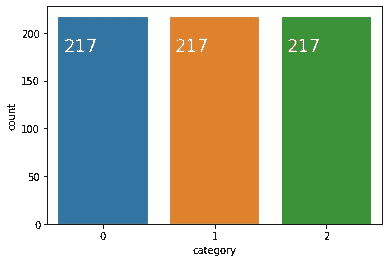

# 分类回归|实践经验

> 原文：<https://towardsdatascience.com/regression-for-classification-hands-on-experience-8754a909a298?source=collection_archive---------10----------------------->

## 具有核心概念的逻辑回归和 *Softmax* 回归


[兰斯·安德森](https://unsplash.com/@lanceanderson?utm_source=unsplash&utm_medium=referral&utm_content=creditCopyText)在 [Unsplash](https://unsplash.com/s/photos/architecture?utm_source=unsplash&utm_medium=referral&utm_content=creditCopyText) 上拍照

在我们的生活中，我们都开发了许多回归模型。但是只有少数人熟悉使用回归模型进行分类。所以我的意图是揭示这个隐藏世界的美丽。

众所周知，当我们想要从多个自变量中预测一个连续的因变量时，我们使用线性/多项式回归。但是到了分类的时候，就不能再用那个了。

> 基本上，分类是预测一个标签，回归是预测一个数量。

为什么线性回归不能用于分类？主要原因是预测值是连续的，而不是概率性的。所以我们无法得到一个确切的类来完成分类。浏览下面的预测，你会进一步理解。


作者图片

概率介于 0 和 1 之间。但是在线性回归中，我们预测的是一个绝对数字，其范围可以在 0 和 1 之外。

是的，您仍然可以将该值标准化到 0–1 的范围内，但是结果可能会更糟。这是因为线性回归拟合受包含异常值的影响很大。即使一个小的异常值也会破坏你的分类。

另一方面，使用线性回归进行多类预测是没有意义的。线性回归假设顺序在 0、1 和 2 之间，而在分类体系中，这些数字仅仅是分类占位符。

为了克服上述问题，有两个很好的解决方案。

1.  逻辑回归—用于二元分类
2.  Softmax 回归-用于多类分类

我用红酒质量数据集(在 Kaggle 中)向你展示这一点。

<https://www.kaggle.com/uciml/red-wine-quality-cortez-et-al-2009>  

原始数据集在 [UCI 机器学习知识库](https://archive.ics.uci.edu/ml/datasets/wine+quality)中公开。

> 注意:我今天不会执行任何详细的预处理或降维技术，因为我的意图是主要在分类模型上向您介绍。

好吧！首先，我们将看到如何使用逻辑回归实现二元分类。

# 逻辑回归

在应用模型之前，让我们先了解一下逻辑回归中的一些核心概念。

我将通过一个例子向您展示逻辑回归是如何工作的。考虑投掷硬币的两种结果概率。


作者图片

让我们把显示头部的概率作为 p，显示尾部的概率作为 q，然后我们定义一个新概念叫做**赔率**作为 **p/q.**

在这种情况下，我们只有两种可能。那不是头就是尾。所以我们可以把 q 写成 1-p，现在我们将看到 p 的变化，它可以从 0 变化到 1。我们取 3 个公平点，用赔率来分析。


作者图片

现在我们可以得到几率的对数。那么它将被称为 **Log Odds** 或**Logit【Log(p/q)】**。这些对数优势仅适用于 2 个类别的值条件。


作者图片

如你所见，它呈现出对称分布。当 p=0.5 时，Logit 函数不偏向任何人。当 p=1 时，受到+inf 的青睐，同时 q (p-1)受到-inf 的青睐。这个特征是逻辑回归的直觉，因为它可以用它的性质对二元问题进行分类。


作者图片

然后我们可以从这个 Logit 函数推导出逻辑函数。


作者图片

如果我们绘制图表，它将被视为如下。


作者图片

下图简要显示了逻辑回归的工作原理。


作者图片

您可以更深入地挖掘片段，如分析损失函数(二元交叉熵)和制定决策边界。这超出了本文的范围，因为需要更多的时间来解释。让我们看看实现，没有任何进一步的原因。

首先，让我们将 CSV 文件加载到熊猫数据框架中。

```
wineData = pd.read_csv('winequality-red.csv')
wineData.head()
```


作者图片

这里我们将质量作为目标列。

```
wineData.quality.unique()
```

我们可以把葡萄酒的质量分为 3 到 8 级


作者图片

这其实是一个多类分类问题。(有 6 节课)我将在 softmax 回归上解释这个场景。为了解释逻辑回归，我添加了另一个具有以下条件的列。

*   如果葡萄酒质量大于或等于 6 = >“好”(编码为 1)
*   否则= >“坏的”(编码为 0)

添加类别列后，我删除了质量列。所以现在我们的目标将是类别列。

```
wineData['category'] = np.where(wineData['quality'] >= 6, 1, 0)
wineData = wineData.drop(['quality'], axis = 1)
wineData.head()
```


作者图片

让我们来看看数据分布，以观察任何阶级的不平衡。如果您为类别列绘制计数图，您将看到如下图。


作者图片

我们可以看到阶级不平衡。你可以丢弃一些数据点，或者使用**重采样** **技术**如欠采样(例如:接近缺失)或过采样(例如:SMOTE)来克服这个问题。至于简单性，我放弃了数据点。之后，您可以观察到一个平衡的数据集，如下所示。


作者图片

您可以进一步分析特征之间的任何相关性。这是所有列的相关矩阵。


作者图片

让我们对此做一些小的预处理。首先，我将分离数据集进行训练和测试，因为我们需要查看准确性度量。

```
target = wineData['category'].copy()
features = wineData.drop('category', 1)X_train, X_test, y_train, y_test = train_test_split(features, target, test_size = 0.2, random_state = 101)
```

数据集没有正确标准化。在应用模型之前，让我们对数据应用标准的缩放函数。

```
scaler = StandardScaler()# we only fit the training data to scaler
scaler.fit(X_train)train_scaled = scaler.transform(X_train)
test_scaled = scaler.transform(X_test)X_train = pd.DataFrame(train_scaled, columns = X_train.columns)
X_test = pd.DataFrame(test_scaled, columns = X_test.columns)
```

标准化后，训练集如下。


作者图片

现在我们可以应用逻辑回归模型。Scikit-learn 库为逻辑回归提供了一个简单的实现。

```
from sklearn.linear_model import LogisticRegression

logReg = LogisticRegression()
logReg.fit(X_train,y_train)
```

太容易了吧！我们可以通过调用`model.predict`函数来获得测试集的模型预测。

```
predictions = logReg.predict(X_test)
y_hat = pd.DataFrame(predictions, columns=["predicted"])
```


作者图片

嘣！没有任何连续值。如你所见，我们的预测以类的形式出现。进一步的精度测量可以计算如下。

```
from sklearn.metrics import classification_report
print(classification_report(y_test,y_hat))
```


作者图片

这里我们只做了标准化就达到了 76%的准确率。此外，您可以使用异常值处理、转换和离散化技术来改进这个模型。

让我们也画出混淆矩阵。

```
from sklearn.metrics import confusion_matrixcf_matrix=confusion_matrix(y_test,y_hat)
ax= plt.subplot()
sns.heatmap(cf_matrix/np.sum(cf_matrix), annot=True,fmt='.2%', cmap='Blues', ax=ax);  
ax.set_xlabel('Predicted labels');
ax.set_ylabel('True labels'); 
ax.set_title('Confusion Matrix');
```


作者图片

从混淆矩阵的结果中，我们可以看到我们的模型表现得相当好。

太好了！我们成功地实现了逻辑回归模型。现在让我们看看 softmax 回归是如何工作的。

# Softmax 回归

正如我之前提到的，Softmax 回归用于多类分类。希望大家还记得逻辑回归的最后一张图。Softmax 的工作方式与此类似，但这里我们有多个类。请参见下图。


作者图片

对于一个给定的数据点，我们逐个计算那个数据点属于每一类的概率，然后就可以在其中找到最大的概率。它将是该数据点的正确类别。

让我们看看计算是如何进行的。


作者图片

这被称为 Softmax 函数。


作者图片

为了估计 w 权重，我们需要最小化损失函数。它被称为范畴交叉熵。

最终，我们可以找到 max(softmax)来预测正确的类。

好吧！让我们亲身体验一下。之前我已经将葡萄酒质量分为好的和坏的。这里，我将原始列离散化为

*   如果葡萄酒质量大于或等于 7 = >“好”(编码为 2)
*   如果葡萄酒质量等于 6 = >“好”(编码为 1)
*   否则= >“坏的”(编码为 0)

所以这将把我们引向一个多类分类问题。(有 3 个类)让我们检查数据分布。


作者图片

这里我们也可以看到阶级的不平衡。让我们去掉一些数据点来消除不平衡。完整的实现可以在我的 colab 笔记本上看到。删除后，数据将如下所示。



作者图片

> 注意:如果要应用重采样技术，应该仅将其应用于训练数据。(分成训练和测试后)

好吧！让我们做一个训练测试分割，并应用一些预处理技术。拆分和标准化与之前相同。标准化之后，你的训练集如下。


作者图片

现在让我们应用 Softmax 回归。

我们将再次使用 scikit-learn 中的逻辑回归，但是我们需要将 multi_class 参数设置为`multinomial`,以便该函数执行 softmax 回归。我们还需要一个支持 softmax 回归的解算器，比如 solver='lbfgs '。

这些求解器用于查找最小化成本函数的参数权重。

```
softReg = LogisticRegression(multi_class = 'multinomial', solver = 'lbfgs')
softReg.fit(X_train,y_train)
```

测试数据的模型预测如下。

```
predictions = softReg.predict(X_test)
y_hat = pd.DataFrame(predictions, columns=["predicted"])
print(y_hat.head())
```


作者图片

很简单，对吗？因此，我们的 softmax 回归模型能够对多类问题进行分类。让我们看看评价。


作者图片

从分类报告中，我们可以看到 70%的准确率。这实际上并不坏，因为我们没有去深度预处理阶段。正如我前面说过的，可以通过适当的预处理技术和重采样技术来进一步增强这一点。


作者图片

如混淆矩阵所示，我们的模型很好地分类了 0 和 2 类，但在识别 1 类时有一些问题。你可以试试上面建议的方法，然后告诉我结果。我的笔记本会支持你的实现。

太好了！现在你知道如何使用回归进行分类了。

# 资源

*   完整的合作实验室 Python 笔记本。

<https://colab.research.google.com/drive/1QyVpFToKva_NceVKUzQ1cbYmKEbTSFsr?usp=sharing>  

*   红酒质量数据集。

这个数据集在数据库内容许可(DbCL)1.0 版下，在 [UCI 机器学习库](https://archive.ics.uci.edu/ml/datasets/wine+quality)和 Kaggle 中公开提供。

<https://www.kaggle.com/uciml/red-wine-quality-cortez-et-al-2009>  

[1] Paulo Cortez，葡萄牙吉马雷斯米尼奥大学，[http://www3.dsi.uminho.pt/pcortez](http://www3.dsi.uminho.pt/pcortez)a . Cerdeira，F. Almeida，T. Matos 和 J. Reis，葡萄牙波尔图 Vinho Verde 地区葡萄栽培委员会，2009 年

# 结论

今天我们学习了如何使用回归技术来解决分类问题。具体来说，我们学习了逻辑回归和 softmax 回归中的主要直觉和核心概念。此外，我们已经从头开始实现了这两个模型。

感谢您通读这篇文章。希望对你有帮助。欢迎留言，提出您的宝贵意见和建议。关注我获取[介质](https://medium.com/@yasassandeepa007)最新文章。注意安全！快乐学习！❤️