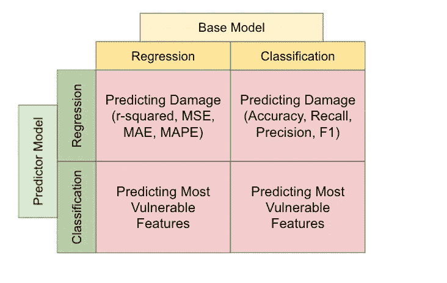
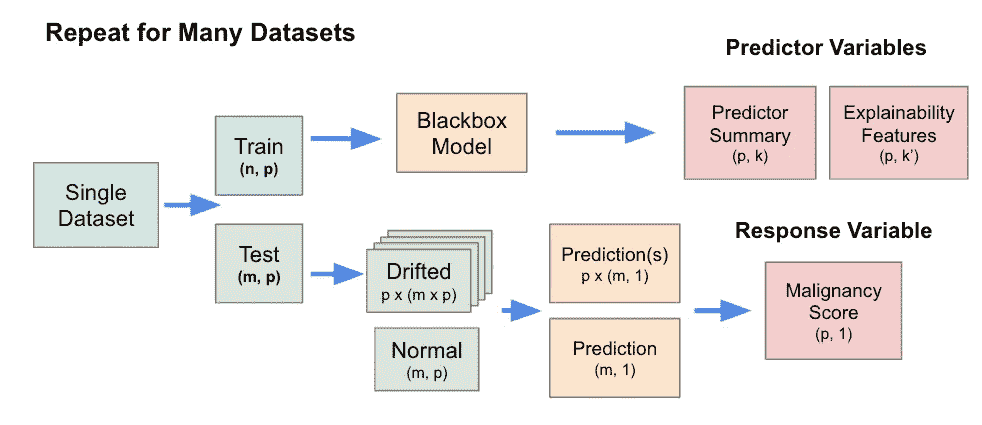
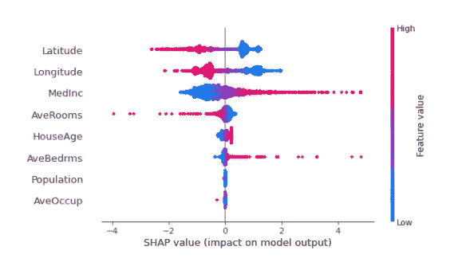
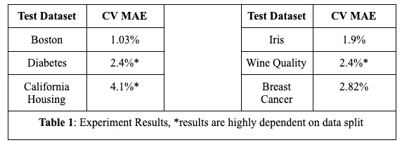
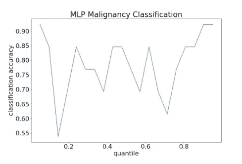
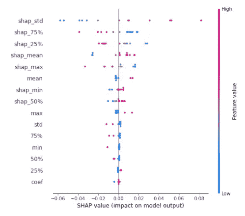

# 回归归回归:数据分布和模型不可知漂移恶性肿瘤检测

> 原文：<https://towardsdatascience.com/regression-for-regressions-data-distribution-and-model-agnostic-drift-malignancy-detection-4d09d98e4135?source=collection_archive---------30----------------------->

## 为人工智能提供透明度和可解释性不仅是最负责任的事情，而且还可以帮助我们找到改进数据驱动产品的方法，并为用户提供价值。

由[卢克·切瑟](https://unsplash.com/@lukechesser?utm_source=medium&utm_medium=referral)在 [Unsplash](https://unsplash.com?utm_source=medium&utm_medium=referral) 上拍摄的照片

随着大规模机器学习系统部署在世界各地的脆弱空间，没有制衡的黑箱模型变得越来越危险。

例如，在一个医疗保健系统中，无法解释的人工智能模型正在为慢性病的分类或某些风险因素的回归提供动力。每个预测都会对人类生活产生实际影响，我们在“训练与生产”准确性方面的典型差异现在变得更加重要。

更讽刺的是，由于生产数据分布变化而导致的这些错误中的一些可能要到数年后才会出现(如慢性病预测的情况)，这使得“防止数据漂移损害”与一旦发生的“检测数据漂移”同等重要。为此，我们希望*预测漂移损害*并创建专门针对当前模型弱点的备份模型。但在此之前，我们需要一种方法来首先解释和理解我们的模型，从而了解我们的模型的弱点。

在这篇博客中，我们将探索一种替代方法来保护模型免受不可信概念和特征漂移的影响:**使用回归模型的回归来预测潜在数据漂移的恶性程度**。

为模型创建通用模型的想法受到了元学习中最近发表的文章的启发，但我们没有使用传统的梯度方法，而是对以后生成我们自己的特征感兴趣。

# **1 问题陈述**

在这篇博客中，我们将模型性能称为**恶性**，因为并非所有的数据分布变化都会导致显著的性能下降，并且并非每个模型的所有评估指标都是相同的(我们将在下一节中看到)。

**图 1** :作者的问题陈述

为了简化我们的问题陈述，我们在上图 1 中划分了我们可能面临的问题。我们正在创建一个**预测器模型**，它从任意**基础模型的数据分布汇总和模型汇总中获取特征。**

在纵轴中，我们区分预测模型，因为回归模型可用于直接预测恶性程度，而分类模型用于预测最易受攻击的特征(基于分位数)。目标显然是不同的，因为在一种情况下，我们希望确切地知道数据漂移会造成多大的损害，而我们只是在寻找易受攻击的特征。

在水平轴上，我们将试图评估漂移的模型类型分开。我们把回归问题和分类问题分开的原因很简单。用于评估我们的基本模型退化的度量(即损失函数)对于两个任务来说是完全不同的，因此对于两个任务来说“恶性”不能等同。

# **2 数据生成**

**图 2:** 作者生成的数据

总的来说，我们感兴趣的是创建一个概化模型，该模型可以预测单个要素中漂移的损害。通过这种方式，我们可以估计对抗性攻击、意外分布或者概念转变对模型度量的影响。

要做到这一点，我们首先需要创建一个模型不可知的回归器(或分类器)，该回归器(或分类器)只针对*许多*数据集的特征和模型摘要的元数据*进行训练。我们不会使用实际的数据集本身，因为它们不仅维数太高，而且不同模型的数据形状也不同。在以前的文献中，作者经常使用降维技术来做到这一点。我们对解释特性概要感兴趣，所以我们选择不这样做。*

然后，我们将需要针对一个单独的、看不见的数据集(和模型)测试该模型，以查看它们是否可以预测任意模型在这个新数据集上的性能。

虽然预测器模型不能访问每个模型的训练数据点(或数据点的降维版本)，但我们将允许特征汇总和特征的可解释性度量，例如 SHAP 值的汇总，我们将在后面解释。

换句话说，我们将基于特征生成训练样本，并且预测器模型的每个训练数据条目将仅从单个特征的特征总结和可解释性中生成。我们不知道数据的任何其他信息，也不知道将会发生的潜在变化:只知道模型经历的性能损失。更多细节见图 2 。

# **3 漂移产生**

我们通过逐渐增加添加到每个特征的高斯噪声来产生漂移。虽然渐进性不是必需的，但这确保了噪声是随机的，但仍然反映了现实世界中的变化。

我们有几个关键的常数来维护数据的完整性。首先，我们一次只扰动一个特征，因此我们可以隔离该特征漂移的恶性得分。第二，我们没有在初始数据分割后重新调整模型，而是简单地使用它来预测漂移数据上的恶性肿瘤。第三，所有加性噪声相对于每个特征的标准偏差被归一化。

完成上述漂移生成步骤后，我们继续进行数据生成中提到的特征生成部分。

# 4 个预测器可解释性特征

在我们生成漂移之后，我们需要为模型和每个特性提供特性概要。简单特征包括数据分布数据和模型摘要数据(即树模型、神经模型、线性模型等)。

我们包括的更复杂的特性是模型可解释性度量(或者特性重要性度量)的总结。我们选择使用**沙普利附加解释(SHAP)** ，一种解释特征重要性的博弈论方法。尽管有其他方法来生成可解释性，我们选择了 SHAP，因为生成方法不依赖于模型，因此它可以为所有类型的模型生成。查看在 MLP 回归基础模型上从加州住房数据集生成的 SHAP 要素的示例。

**图 3:加州住房数据集的 SHAP 值**

直观地说，我们可以把特征重要性度量看作每当模型发生变化时，偏向回归(或分类)一侧的“权重”。因此，由于 SHAP 值的生成可以是模型不可知的，所以我们可以为任何模型和任何数据集生成这样的特征。

**最后，跨每个数据集的特征标准化至关重要，因为每个数据集都是完全不同的。**虽然归一化可以最大限度地减少要素之间的差异，但它不能用于某些模型要素，例如线性模型的系数值。对于这样的模型概要特征，我们必须对它们中的一些进行不同的转换和归一化，例如通过关于特征分布分位数的归一化。

# **5 次实验及结果**

在我们的实验中，我们使用了 Google Colab 或 sklearn 内置的几个数据集。我们选择的测试集是使用一个*不可见的*数据集作为模型来预测漂移的恶性程度。

我们首先看回归预测器(即预测由于漂移导致的模型退化的实际数量)。

对于恶性肿瘤的回归基础模型，我们使用了糖尿病数据集、波士顿房价数据集和加州房价数据集。对于恶性肿瘤的分类基础模型，我们使用了虹膜数据集、葡萄酒质量数据集和乳腺癌数据集。我们使用多个回归模型的最佳结果。

**图 4** :作者预测实验结果(回归)

然后，我们将相同的特征集用于分类预测器(即，通过分位数预测最脆弱特征的前 k%)。

**图 5** :分类预测器精度示例(加州住房)

我们可以看到，精度根据我们想要预测的特征的分位数而变化。总的来说，我们发现分类预测器(不考虑基础模型)具有更好的相对成功，并且对于每个数据集，准确度的范围在 55%到 90%之间。这在直觉上是有意义的，因为通过简单地观察特征的重要性(SHAP 总结)，我们通常可以知道我们的模型高度依赖于哪些特征。

# 6 可解释人工智能:使用可解释性度量来评估可解释性特征

撇开模型不谈，我们决定用 SHAP 来解释我们的预测模型，它使用 SHAP 作为它的许多特征。事实证明，SHAP 值是模型退化的重要预测指标。详情见图 6。

**图 6** :回归预测模型对回归模型的特征重要性

**尽管具有讽刺意味的是递归，就像标题“为回归而回归”**一样，这种洞察力给了我们很多理由去关心我们的模型可解释性。这就把我们带了回来，突出了这篇博客的潜台词:

> 不仅提供人工智能透明度和可解释性是最负责任的事情，而且它还可以帮助我们找到改进数据驱动产品的方法，并为客户提供价值。

# 7 经验教训和未来工作

虽然我们每次都可以简单地手动漂移新数据的特征，并以这种方式计算漂移的恶性程度，但这种漂移几乎总是会有类似于我们选择数据集和模型时可能无意中引入的人为偏差。

我们希望在结束时指出，我们的博客旨在展示，在不了解漂移的底层结构的情况下，估计漂移的损害是可能的(我们只编码了与训练集相关的可解释性、特性摘要信息和模型摘要信息，但没有编码漂移类型本身)。

在非学术环境中，我们可以访问包含真实世界、可检测和非随机数据漂移的大型数据湖，我们可以使用相同的方法来估计类似漂移可能对我们的模型造成的潜在损害，并采取预防措施，例如在检测到漂移时拟合第二个模型或增强模型。在未来，我们希望探索能够更好地总结模型和功能的其他功能。