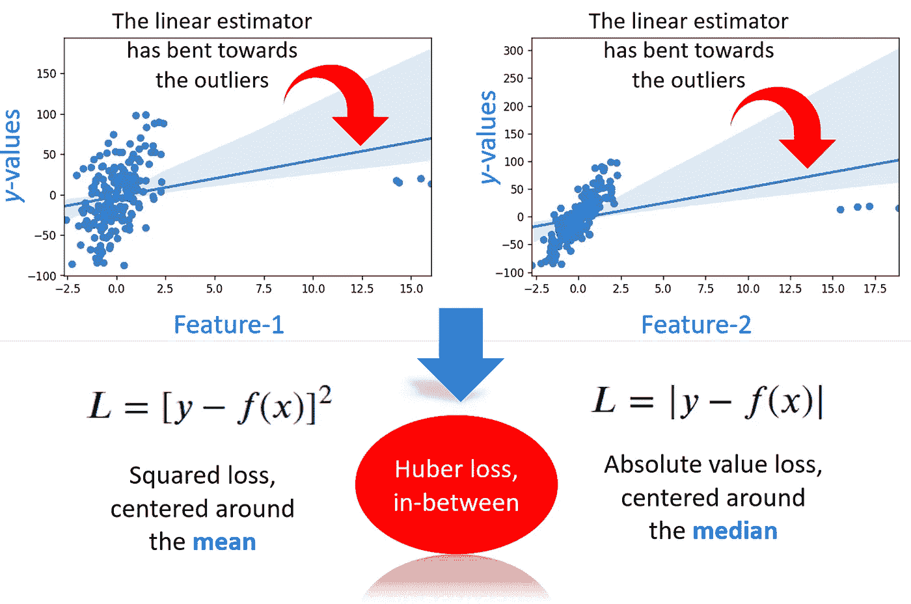
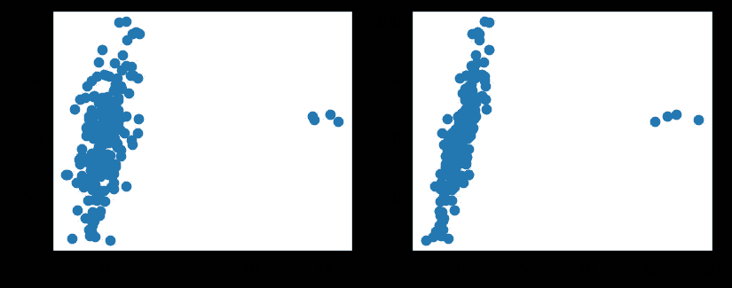
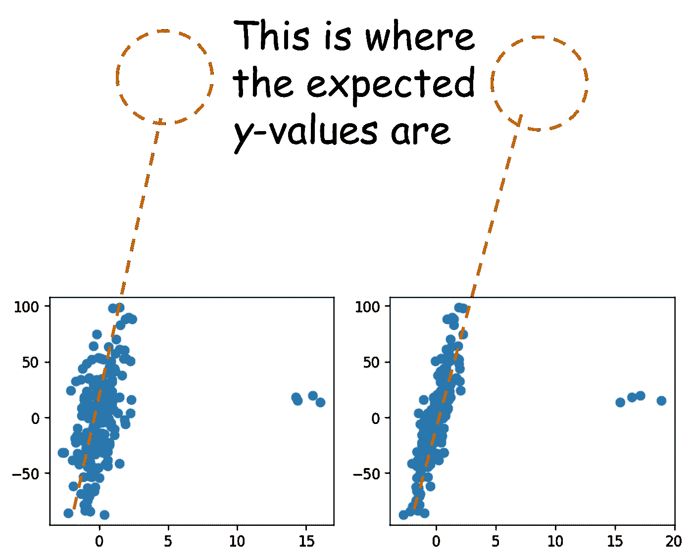
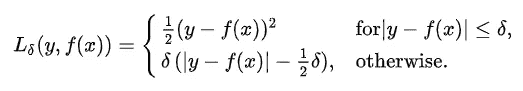
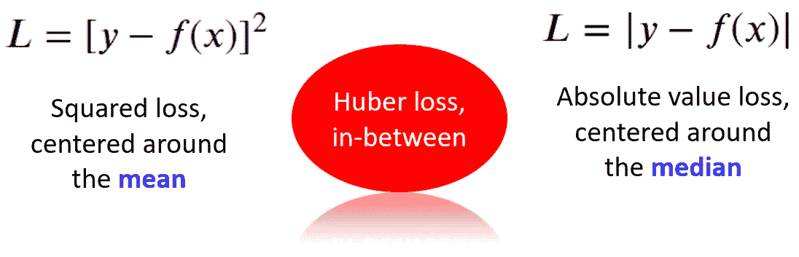
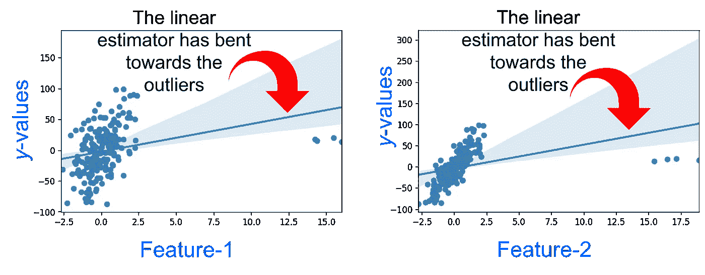
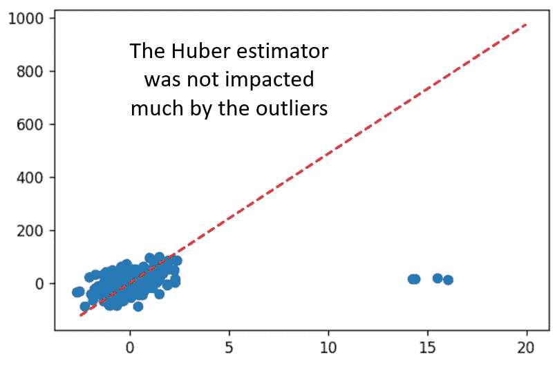

# 面对杂乱的离群值回归？试试 Huber 回归器

> 原文：<https://towardsdatascience.com/regression-in-the-face-of-messy-outliers-try-huber-regressor-3a54ddc12516?source=collection_archive---------10----------------------->

## 数据中的异常值无处不在，它们会搞乱你的回归问题。尝试哈伯回归器来解决这个问题。



图片来源:作者创作

# 有什么问题？

假设您有一个包含两个要素 *X* 1 和 *X* 2 的数据集，您正在对其执行线性回归。然而，数据集中引入了一些噪声/异常值。

比方说，***y*-值异常值与它们应有的值相比特别低**。那看起来像什么？

这是你得到的数据。



图片来源:作者创作

然而，如果你真的考虑一下 *X* - *Y* 数据的斜率，那些 *X* 值的预期 Y 值应该要高得多。类似于下面的内容，



图片来源:作者创作

这些是明显的异常值，您可以运行一个简单的探索性数据分析(EDA ),在构建回归模型之前从数据集中捕捉并丢弃它们。

但是你不能指望捕捉到所有尺度和所有维度上的异常值*。具有 100 或 1000 个维度(特征)的数据集的可视化具有足够的挑战性，以手动检查图并发现异常值。*

*对异常值*稳健的回归算法*听起来像是对那些讨厌的坏数据点的一个好赌注。胡伯回归器就是我们将在本文中讨论的一个工具。*

# *胡伯回归*

*在统计学中，Huber 损失是一种特殊的损失函数(由瑞士数学家 Peter Jost Huber 于 1964 年首次引入),广泛用于稳健回归问题——存在异常值的情况会降低基于误差的最小平方损失的性能和准确性。*

*</where-did-the-least-square-come-from-3f1abc7f7caf>  

## 技术细节

损失由下式给出:



图片来源:[维基百科](https://en.wikipedia.org/wiki/Huber_loss)

我们可以看到，只有当残差的绝对值小于某个固定参数时，损失才是通常残差的平方( *y* — *f* ( *x* ))。这个参数的选择和调整对于获得一个好的估计器是很重要的。当残差大于该参数时，损耗是残差绝对值和 Huber 参数的函数。

现在，您可能还记得基础统计学中的**平方损失来自均值附近的无偏估计量，而绝对差损失来自中位数附近的无偏估计量**。中位数比平均数对异常值更稳健。

**Huber 损失是这两种类型的平衡折衷**。它对异常值是稳健的，但也不会完全忽略它们。当然，可以使用自由参数进行调整。



图片来源:作者创作

## Python 演示

演示笔记本在我的 Github repo 中。

我们创建了合成数据，并用以下代码添加了一些噪声异常值，

```
import numpy as np
from sklearn.datasets import make_regressionrng = np.random.RandomState(0)
X, y, coef = make_regression(
    n_samples=200, n_features=2, noise=4.0, coef=True, random_state=0)**# The first four data points are outlier**
X[:4] = rng.uniform(10, 20, (4, 2))
y[:4] = rng.uniform(10, 20, 4)
```

现在，你所要做的就是调用 Scikit-learn 的内置`HuberRegressor`估算器并拟合数据。为了比较，我们也调用了标准的`LinearRegression`方法。

```
from sklearn.linear_model import HuberRegressor, LinearRegressionhuber = HuberRegressor().fit(X, y)
linear = LinearRegression().fit(X, y)
```

现在，我们知道前 4 个数据点是异常值。所以，如果我们试图用第一个数据点预测 y 值，我们会得到这样的结果，

```
linear.predict(X[:1,])>> array([87.38004436])
```

正如所料，线性回归预测是 *y* 的低值。为什么？因为线性拟合(基于最小平方损失)因其巨大的杠杆作用而偏向异常值。



图片来源:作者创作

然而，Huber 估计量预测了更合理(高)的值，

```
huber.predict(X[:1,])>> array([806.72000092])
```

为了进一步证明 Huber 估计量的稳健性，我们可以使用估计的系数并绘制最佳拟合线，

```
huber_y1 = np.arange(-2.5,20,0.01)*huber.coef_[0] + \
            np.arange(-2.5,20,0.01)*huber.coef_[1] + \
            huber.intercept_plt.figure(dpi=120)
plt.scatter(X[:,0],y)
plt.plot(np.arange(-2.5,20,0.01), 
         huber_y1,
         color='red',linestyle='--')
plt.show()
```



图片来源:作者创作

## 泰尔-森估计量

虽然我们不在本文中讨论它，但鼓励读者检查 [Theil-Sen 估计器](https://en.wikipedia.org/wiki/Theil%E2%80%93Sen_estimator)，这是另一种稳健的线性回归技术，并且对异常值高度不敏感。

正如所料，Scikit-learn 也为这个估计器提供了一个内置方法: [**Scikit-learn Theil-Sen 估计器**](https://scikit-learn.org/stable/modules/generated/sklearn.linear_model.TheilSenRegressor.html#sklearn.linear_model.TheilSenRegressor) 。

对于具有大量特征的多元线性回归，这是所有稳健估计量中非常有效和快速的回归算法。

# 摘要

在这篇简短的文章中，我们讨论了数据集中存在异常值时的线性回归估计量问题。我们用一个简单的例子证明，基于传统最小二乘损失函数的线性估计可能会预测出完全错误的值，因为它们倾向于离群值。

我们讨论了几个稳健估计量，并详细演示了休伯回归。非参数统计在许多地方使用这些稳健的回归技术，尤其是当数据预计会特别嘈杂时。

数据科学专业的学生和专业人士也应该具备这些强大的回归方法的工作知识，以便在存在异常值的情况下自动对大型数据集进行建模。* 

*喜欢这篇文章吗？成为 [***中等会员***](https://medium.com/@tirthajyoti/membership) *继续* ***无限制学习*** *。如果您使用下面的链接，* ***，我将收取您的一部分会员费，而不会对您产生额外费用*** *。**

*<https://medium.com/@tirthajyoti/membership> *