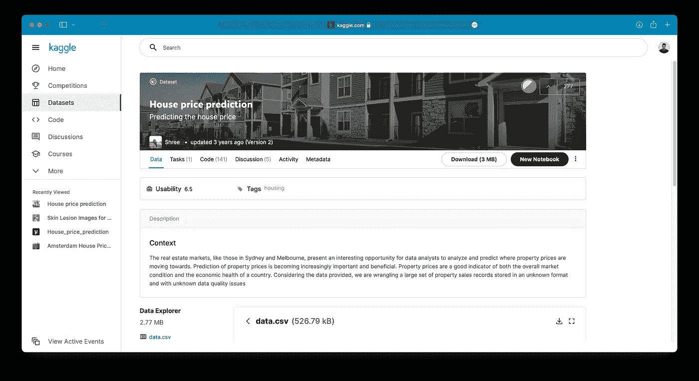

# 使用 TensorFlow 简化回归建模—在 10 分钟内训练您的第一个模型

> 原文：<https://towardsdatascience.com/regression-modelling-with-tensorflow-made-easy-train-your-first-model-in-10-minutes-497d829c7338?source=collection_archive---------7----------------------->

## 从数据收集和准备到模型训练和评估—包括源代码。


克里斯蒂安·维利奇科夫在 Unsplash[上拍摄的照片](https://unsplash.com/?utm_source=unsplash&utm_medium=referral&utm_content=creditCopyText)

如今，深度学习是一件大事。见鬼，这甚至是大多数数据科学工作的要求，甚至是入门级的工作。没有比回归更好的入门讲座了。您已经了解了基础统计学和机器学习的概念，现在是时候将神经网络融入其中了。

这篇文章将告诉你如何做。最终，你将拥有一个预测房价的全功能模型，你可以将它附加到你的投资组合中——在做了一些修改之后，这是你的首选。

不想看书？请观看我的视频:

今天的文章涵盖以下主题:

```
**·** [**Dataset used**](#da81)
**·** [**Dataset exploration and preparation**](#524c)
  ∘ [Deleting unnecessary columns](#4dc7)
  ∘ [Feature engineering](#455c)
  ∘ [Target variable visualization](#4b17)
  ∘ [Data preparation for ML](#4e53)
· [**Training a regression model with TensorFlow**](#bc82)
  ∘ [Loss tracking](#8539)
  ∘ [Building a model](#61fb)
  ∘ [Making predictions](#c0c7)
  ∘ [Model evaluation](#684a)
```

你可以在 [GitHub](https://github.com/better-data-science/TensorFlow) 上下载源代码。

# 使用的数据集

今天让我们把事情简单化，坚持使用一个众所周知的[房价数据集](https://www.kaggle.com/shree1992/housedata):



图片 Kaggle 的房价数据集(图片由作者提供)

它有一堆最初无法用神经网络模型使用的特性，所以你必须花一些时间来处理它们。下载数据集，提取 ZIP 文件，并将 CSV 数据集放在安全的地方。

然后激活安装了 TensorFlow 2+的虚拟环境，启动 JupyterLab。您可以自由使用任何其他 IDE，但下面所有的截图都将来自 Jupyter。

# 数据集探索和准备

第一步是导入 Numpy 和 Pandas，然后导入数据集。下面的代码片段实现了这一点，并随机打印了几行:

```
import numpy as np
import pandas as pd

df = pd.read_csv('data/data.csv')
df.sample(5)
```

以下是数据集的外观:


图片 2-房价数据集(图片由作者提供)

你绝对不能以这种格式传递给神经网络。

## 删除不必要的列

因为我们想避免花太多时间准备数据，所以最好去掉大部分非数字特征。只保留`city`列，因为它很容易编码:

```
to_drop = ['date', 'street', 'statezip', 'country']
df = df.drop(to_drop, axis=1)

df.head()
```

现在应该是这样的:


图 3-移除大部分字符串列后的数据集(作者提供的图片)

您肯定可以保留所有列，并对它们进行一些特性工程。这可能会提高模型的性能。但即使这样也足够满足你今天的需求了。

## 特征工程

现在，您将花一些时间调整数据集。`yr_renovated`列的值有时为 0。我想那是因为房子没有翻新。您将创建几个要素-房屋年龄、房屋是否翻修过、是否在过去 10 年翻修过以及是否在过去 30 年翻修过。

你可以对每个提到的特性使用列表理解。方法如下:

```
**# How old is the house?**
df['house_age'] = [2021 - yr_built for yr_built in df['yr_built']]

**# Was the house renovated and was the renovation recent?**
df['was_renovated'] = [1 if yr_renovated != 0 else 0 
    for yr_renovated in df['yr_renovated']]
df['was_renovated_10_yrs'] = [1 if (2021 - yr_renovated) <= 10 
    else 0 for yr_renovated in df['yr_renovated']]
df['was_renovated_30_yrs'] = [1 if 10 < (2021 - yr_renovated) <= 30
    else 0 for yr_renovated in df['yr_renovated']]

**# Drop original columns**
df = df.drop(['yr_built', 'yr_renovated'], axis=1)
df.head()
```

以下是数据集现在的样子:


图片 4-特征工程后的数据集(1)(图片由作者提供)

接下来让我们处理`city`列。许多城市只列出了几栋房子，因此您可以声明一个函数来删除所有不常出现的城市值。这就是`remap_location()`函数要做的——如果那个城市的房子少于 50 栋，它会被其他的东西代替。这只是减少选项数量的一种方式:

```
def remap_location(data: pd.DataFrame, 
                   location: str, 
                   threshold: int = 50) -> str:
    if len(data[data['city'] == location]) < threshold:
        return 'Rare'
    return location
```

让我们来测试一下这个功能——*西雅图*的城市有很多房子，而*秋天的城市*只有 11:


图 5-重新映射城市值(图片由作者提供)

让我们将这个函数应用于所有城市，并打印一个 10 行的样本:

```
df['city'] = df['city'].apply(
    lambda x: remap_location(data=df, location=x)
)
df.sample(10)
```


图片 6-特征工程后的数据集(2)(图片由作者提供)

一切看起来都是应该的，那我们继续吧。

## 目标变量可视化

每当你处理价格时，目标变量不太可能是正态分布的。这个住房数据集也不例外。让我们通过导入 Matplotlib 并用直方图可视化分布来验证它:

```
import matplotlib.pyplot as plt
from matplotlib import rcParams
rcParams['figure.figsize'] = (16, 6)
rcParams['axes.spines.top'] = False
rcParams['axes.spines.right'] = False

plt.hist(df['price'], bins=100);
```

它看起来是这样的:


图 7 —目标变量直方图(1)(图片由作者提供)

离群值肯定是存在的，所以接下来让我们来处理它们。最常见的事情是计算 Z 分数。它们让你知道一个值离平均值有多少标准差。在正态分布的情况下，任何低于或高于 3 个标准差的都被归类为异常值。价格的分布不是正态分布，但是我们仍然要做 Z 测试来移除最右边的房子。

你可以用 Scipy 计算 Z 值。您将把它们指定为一个新的数据集列— `price_z`，然后只保留 Z 的绝对值小于或等于 3 的行。

还有大约 50 栋价格为 0 美元的房子，所以你也要删除它们:

```
from scipy import stats

**# Calculate Z-values**
df['price_z'] = np.abs(stats.zscore(df['price']))

**# Filter out outliers**
df = df[df['price_z'] <= 3]

**# Remove houses listed for $0**
df = df[df['price'] != 0]

**# Drop the column**
df = df.drop('price_z', axis=1)

**# Draw a histogram**
plt.hist(df['price'], bins=100);
```

下面是现在的分布情况:


图 8 —目标变量直方图(2)(图片由作者提供)

仍然有一点倾斜，但是让我们宣布它*足够好*。

作为最后一步，让我们将数据转换成机器学习的格式。

## ML 的数据准备

神经网络喜欢只看到相同规模的数字数据。我们的数据集不是，我们也有一些非数字数据。这就是数据缩放和一次性编码发挥作用的地方。

您现在可以单独转换每个功能，但有一个更好的方法。您可以使用 Scikit-Learn 中的`make_column_transformer()`函数来一次性应用缩放和编码。

您可以忽略`waterfront`、`was_renovated`、`was_renovated_10_yrs`和`was_renovated_30_yrs`等特征，因为它们已经是您需要的格式:

```
from sklearn.compose import make_column_transformer
from sklearn.preprocessing import MinMaxScaler, OneHotEncoder

transformer = make_column_transformer(
    (MinMaxScaler(), 
        ['sqft_living', 'sqft_lot','sqft_above', 
         'sqft_basement', 'house_age']),
    (OneHotEncoder(handle_unknown='ignore'), 
        ['bedrooms', 'bathrooms', 'floors', 
         'view', 'condition'])
)
```

接下来，让我们将特征从目标变量中分离出来，并将数据集分成训练和测试部分。训练集将占 80%的数据，我们将使用其他所有数据进行测试:

```
from sklearn.model_selection import train_test_split

X = df.drop('price', axis=1)
y = df['price']

X_train, X_test, y_train, y_test = train_test_split(
    X, y, test_size=0.2, random_state=42
)
```

最后，你可以应用一分钟前声明的变换。您将调整和转换训练特征，并且仅将转换应用于测试集:

```
**# Fit**
transformer.fit(X_train)

**# Apply the transformation**
X_train = transformer.transform(X_train)
X_test = transformer.transform(X_test)
```

您将无法直接检查`X_train`和`X_test`，因为它们现在存储为稀疏矩阵:


图 9-稀疏矩阵(图片由作者提供)

TensorFlow 将无法读取该格式，因此您必须将其转换为多维 Numpy 数组。您可以使用`toarray()`功能。这里有一个例子:

```
X_train.toarray()
```


图 10-稀疏矩阵到 Numpy 数组(图片由作者提供)

将这两个特性集转换成一个 Numpy 数组，就可以开始了:

```
X_train = X_train.toarray()
X_test = X_test.toarray()
```

最后来训练模型。

# 使用 TensorFlow 训练回归模型

现在，您将构建一个由完全连接的层组成的顺序模型。有许多导入工作要做，所以让我们先把它解决掉:

```
import tensorflow as tf
from tensorflow.keras import Sequential
from tensorflow.keras.layers import Dense
from tensorflow.keras.optimizers import Adam
from tensorflow.keras import backend as K
```

## 损失跟踪

你正在处理这里的房价，所以如果你跟踪它，比如说，均方差，损失可能会很大。这个指标对你来说也不是很有用，因为它基本上是告诉你你的模型在平方单位上有多错误。

你可以计算 MSE 的平方根，回到原来的单位。默认情况下不支持该指标，但是我们可以手动声明它。请记住，您必须使用 Keras 后端的函数才能使它工作:

```
def rmse(y_true, y_pred):
    return K.sqrt(K.mean(K.square(y_pred - y_true)))
```

## 建立模型

现在你终于可以声明一个模型了。这将是一个简单的，只有 256，256 和 128 个单位的三个隐藏层。请随意尝试这些，因为建立神经网络没有对错之分。这些层之后是一个节点的输出层，因为您预测的是一个数值。

然后，您将使用 RMSE 编译一个模型，作为一种跟踪损失和评估指标的方法，并使用 Adam 优化器优化该模型。

最后，您将根据 100 个时期的训练数据训练模型:

```
tf.random.set_seed(42)

model = Sequential([
    Dense(256, activation='relu'),
    Dense(256, activation='relu'),
    Dense(128, activation='relu'),
    Dense(1)
])

model.compile(
    loss=rmse,
    optimizer=Adam(),
    metrics=[rmse]
)

model.fit(X_train, y_train, epochs=100)
```

培训应该在一分钟左右完成，具体取决于硬件:


图 11 —使用 TensorFlow 进行回归模型训练(图片由作者提供)

训练集的最终 RMSE 值刚刚超过 192000，这意味着对于一个普通的房子，该模型的价格估计错误 192000 美元。

## 做预测

您可以对测试集进行预测:

```
predictions = model.predict(X_test)
predictions[:5]
```

以下是前五个预测的样子:


图片 12 —前 5 个预测(图片由作者提供)

如果你想计算任何指标，你必须把它们转换成一维数组。您可以使用 Numpy 的`ravel()`函数来实现:

```
predictions = np.ravel(predictions)
predictions[:5]
```

结果如下:


图 13-作为 1D 数组的前 5 个预测(图片由作者提供)

## 模型评估

现在让我们通过使用 RMSE 来评估测试集上的预测:

```
rmse(y_test, predictions).numpy()
```

您将得到 191000 作为错误值，这表明模型没有过度拟合训练数据。对于更多的时期，使用更复杂的模型训练可能会得到更好的结果。这是你可以自己尝试的事情。

# 离别赠言

这就做到了——到目前为止，您已经训练了一个简单的神经网络模型，并且知道如何对新数据进行预测。不过，你还有很多可以改进的地方。

例如，你可以花更多的时间准备数据。我们删除了日期-时间特性、街道信息、邮政编码等等，这些对模型性能可能很有价值。问题是——这些需要太多的时间来准备，我想让这些文章简短一些。

您还可以向网络添加额外的层，增加神经元的数量，选择不同的激活函数，选择不同的优化器，添加丢弃层，等等。可能性几乎是无穷无尽的，所以一切都归结于实验。

下一篇文章将介绍如何使用 TensorFlow 建立分类模型，如果您想了解更多信息，请继续关注。

感谢阅读。

*喜欢这篇文章吗？成为* [*中等会员*](https://medium.com/@radecicdario/membership) *继续无限制学习。如果你使用下面的链接，我会收到你的一部分会员费，不需要你额外付费。*

<https://medium.com/@radecicdario/membership>  

# 保持联系

*   注册我的[简讯](https://mailchi.mp/46a3d2989d9b/bdssubscribe)
*   订阅 [YouTube](https://www.youtube.com/c/BetterDataScience)
*   在 [LinkedIn](https://www.linkedin.com/in/darioradecic/) 上连接