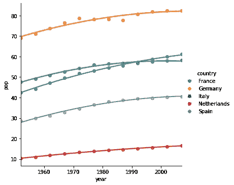

# 带有 Seaborn 的 Python 中的回归图

> 原文：<https://towardsdatascience.com/regression-plots-in-python-with-seaborn-118472b12e3d?source=collection_archive---------2----------------------->

## 当处理简单的图表时，熊猫绘图给了你很多你需要的东西，但是有一个明显的遗漏


回归图示例-作者图片

散点图是探索数据中的关系或模式的好方法。但是添加一条回归线可以使这些模式突出出来，这是熊猫图 API 没有内置的一件事。

您可以使用 Statsmodels 等统计库，甚至 Numpy，根据您的数据创建回归模型，并将其包含在您的绘图中。但是，如果你需要的只是数据中关系的可视化指南， *Seaborn* 可以很容易地为你做到这一点。

Seaborn 是一个统计绘图库，可以读取 Pandas 数据帧(以及其他数据结构),并提供简单的方法将回归线添加到散点图中。

我们将了解如何使用 Seaborn 中的 *regplot* 函数来实现这一点，我们还将了解帮助我们了解数据中简单关系的线性回归，以及显示更复杂情况的高阶回归。

为了介绍 *regplot* 函数，我们将首先制造一些数据来产生一些理想化的图，然后使用世界人口数据来说明它在现实世界中的用途。

# 回归图

下面是散点图和添加了线性回归线的同一图的示例。回归线试图通过散点图中的点找到最佳拟合。线周围的阴影区域是*置信区间*。


散点图—作者提供的图片


带有线性回归线的散点图-图片由作者提供

你可能能够从第一个图中看出线性关系，但是在散点图的顶部添加一条回归线会使它更加清晰。

# 锡伯恩图书馆

让我们直接进入代码，看看 Seaborn 如何帮助我们。首先导入 Seaborn 库。

```
import seaborn as sns
```

现在，我们将创建几个 Numpy 数组来表示我们将要绘制的 *x* 和 *y* 数据。在下面的代码中，我们导入 Numpy 库，然后创建一个从-5 到 5 的整数数组——该数组表示 *x* 数据。为了创建 *y* 数组，我们使用一个公式来创建 *x* 和 *y* 之间的线性关系:

```
y = x*2 + 3
```

当我们绘制该图时，我们期望看到截距为 3 的直线图，以及 *x* 和 *y* 之间的二对一关系。下面代码的最后一行创建了一个散点图，我们可以看到它是一条直线的形式。

```
import numpy as npx=np.array([-5,-4,-3,-2,-1,0,1,2,3,4,5])
y=x*2+3
sns.scatterplot(x=x,y=y)
```


一个线性的情节——作者的形象

因此，当我们创建一个 *regplot* ，一个包含回归线的图时，我们希望该线与分散点重合。

```
sns.regplot(x=x,y=y)
```


一个线性的情节——作者的形象

当然，确实如此。

但是回归不一定是线性的。在下一个代码块中，我们定义了 *x* 和 *y* 之间的二次关系。然后我们绘制曲线，但我们设置了一个二阶回归函数`order=2`，而不是默认的线性选项。这指示 *regplot* 找到二次关系。

```
y2=x**2+2*x+3
sns.regplot(x=x,y=y2,order=2)
```


二次曲线——作者的图像

回归线再次与散点图中的点精确匹配。

我们可以继续，但我们将停止在三阶回归，如下图所示。

```
y3=x**3+x**2+2*x+3
sns.regplot(x=x,y=y3,order=3)
```


三阶图—作者提供的图像

# 真实世界数据

当然，这些例子是不现实的。我们给出了 *regplot* 一阶、二阶和三阶图的精确表示，不出所料，回归线与散点图点完全吻合。真实数据通常更嘈杂:有随机变化，测量误差。或者，也许数据根本不符合我们理想的线性、二次或三次公式。

所以，现在我们将看到相同类型的图，但有一些真实的数据。

我们将加载一些世界人口数据，选择一个国家，并尝试看看回归图是否能给我们一些启示。

在这里，我们设置下载到 Github 存储库的数据的 url 数据最初来自 Gapminder(您可以在下面看到完整的确认*)。

然后，我们将数据加载到熊猫数据框架中。

这里需要注意一些事情:这个文件是一个 *tsv* 文件，类似于 *csv* 文件，但是用制表符代替逗号作为分隔符，所以我们需要在转换成 dataframe 时指定它；此外，我还将 *year* 字段转换为整数，以便更容易进行比较(否则它将作为浮点数加载)。

人口总数是实数，当然是以百万计。为了让这些在图表上看起来更好，我把它们都除以一百万。

```
popDataURL = "https://raw.githubusercontent.com/jennybc/gapminder/master/inst/extdata/gapminder.tsv"import pandas as pdpopData = pd.read_csv(popDataURL, delimiter='\t', 
   dtype=({'year':int}))
popData['pop']=popData['pop']/1000000
popData
```


人口表-按作者分类的图像

最初，我只关注一个国家，所以我创建了一个名为`SpainData`的新数据框架。然后，我在一个 *regplot* 上绘制了西班牙过去几十年的人口，寻找时间和人口之间默认的线性关系。

```
SpainData = popData[popData['country']=='Spain' 
sns.regplot(x="year", y="pop", data=SpainData)
```


西班牙的人口增长—图片由作者提供

从这个角度来看，人口似乎在稳步增长，但如果仔细观察分散点，就会发现在最初的几十年里，曲线更陡，而在最近，曲线变得更缓。也许直线不是最好的拟合。让我们试试高阶回归。

```
sns.regplot(x="year", y="pop", data=SpainData, order=2, ci=None)
```


西班牙的人口增长—图片由作者提供

```
sns.regplot(x="year", y="pop", data=SpainData, order=3, ci=None)
```


西班牙的人口增长—图片由作者提供

只看上面的图，看起来二阶图比其他图更接近真实数据。这并不是说西班牙的人口可以用严格的二次模型来解释——它可能比这更复杂——但是这条曲线让我们更好地理解正在发生的事情；人口增长不是以稳定的速度增长，而是在放缓。

试图用这样一个简单的数学模型来预测一个国家可能的人口增长可能是错误的，因为有太多的因素需要考虑。但与没有回归线的散点图相比，Seaborn 的纯视觉方法能让我们更好地理解趋势。

## 多重情节

如果我们想比较不同的国家呢？Seaborn 为我们提供了一种使用`hue`参数的简洁方法。

让我们用五个重要的欧洲国家，法国、德国、西班牙、意大利和荷兰，创建一个新的数据框架，看看他们的人口增长如何比较。

最终的剧情是用 *lmplot* 完成的。这类似于 *regplot* ，但是允许我们通过设置`hue='country'`用不同的颜色绘制不同的国家。

```
topeucountries = ['France','Germany','Spain','Italy','Netherlands']europeData = popData[popData['country'].isin(topeucountries)]
sns.lmplot(x="year", y="pop", data=europeData, hue='country',
   order=2, ci=False)
```



一些欧洲国家的人口增长情况—图片由作者提供

在结果图中，你可以看到，虽然人口增长仍处于明显上升的轨道，但似乎在放缓。在意大利的例子中，这一点尤其明显。

让我们看另一个例子。

## 你越富有，你活得越久

无可争议的是，平均而言，你拥有的钱越多，你的预期寿命就越长。财富和预期寿命是联系在一起的，因为可以获得更好的医疗设施、更好的饮食等等。

因此，你挣得越多，你活得越久，但这只是在一定程度上。寿命不能随着财富持续增长；必须有个限度。

这里有两个图表展示了这种联系。这里，我们用人均 GDP 来表示财富(这是一个国家的总 GDP 除以居住在那里的人口数量，可以认为是一个特定国家的平均财富)。

第一个线性图似乎是一个相当好的拟合，但它不可能随着收入的增加而延伸到 100 年、150 年或 200 年。必须有个限度；收入的增加必然遵循收益递减规律。

`order=2`的版本证实了这一点，并给出了一个更好的现实图景，即随着 GdpPercap 的增加，预期寿命的增加逐渐减少。

```
sns.lmplot(x="gdpPercap", y="lifeExp",data=europeData, 
   ci=False, order=1)
sns.lmplot(x="gdpPercap", y="lifeExp",data=europeData, 
   ci=False, order=2)
```


预期寿命与 GdpPercap——作者图片


预期寿命与 GdpPercap——作者图片

希望您可以从上面的例子中看到回归图可以使解释数据变得更加容易，而 Seaborn 为您提供了轻松做到这一点的工具。

一如既往，感谢阅读。如果你想知道我什么时候发表新文章，请考虑在这里注册一个电子邮件提醒。

如果你不是一个媒体订阅者，那就注册吧，这样你就可以每月花 5 美元阅读尽可能多的文章。在这里注册，我将赚取一小笔佣金。