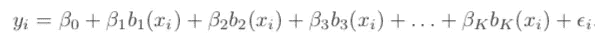
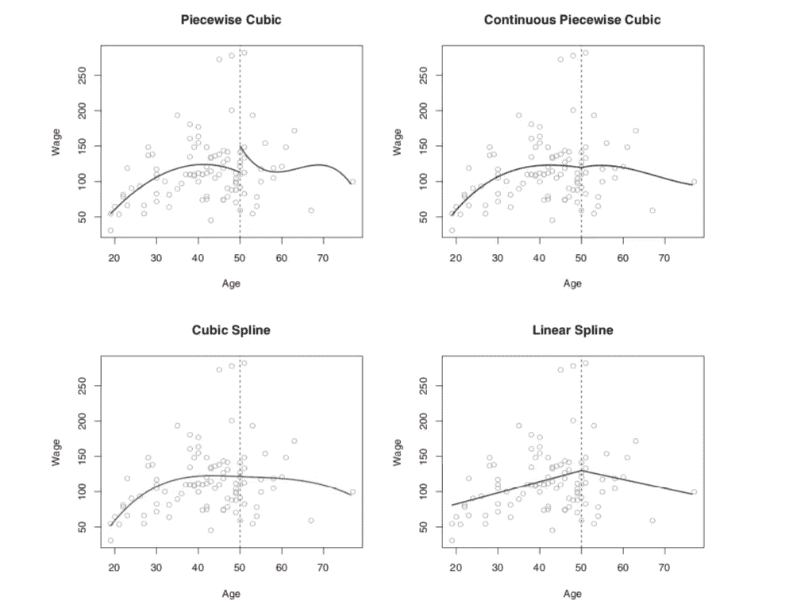
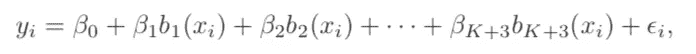
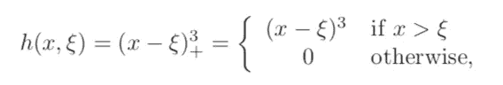
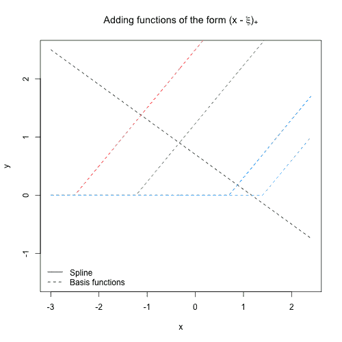
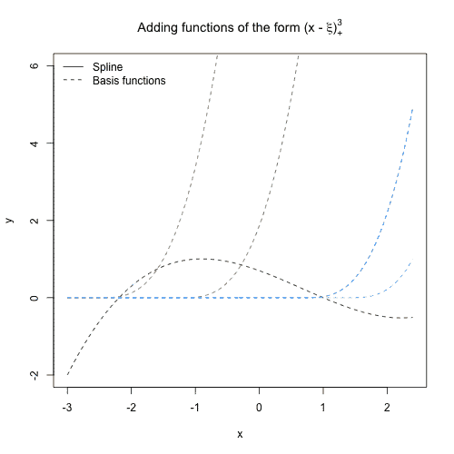

# R 和 Python 中的回归样条

> 原文：<https://towardsdatascience.com/regression-splines-in-r-and-python-cfba3e628bcd?source=collection_archive---------5----------------------->

## 线性模型的扩展

## 这篇文章讨论了回归样条的基础知识以及 R 和 Python 中的实现。


卢卡斯·戴维斯在 [Unsplash](https://unsplash.com?utm_source=medium&utm_medium=referral) 上的照片

T 线性模型之所以这样命名，是因为输入(自变量)和输出(因变量)之间存在线性关系。尽管我们知道现实世界的数据很有可能表现出非线性，但人们通常会将线性模型视为最佳选择之一。

原因主要有两点。首先，通过可接受的近似，线性模型是解释起来最简单的模型之一。第二，线性模型的低复杂性使得它不太可能过度拟合数据，尤其是当你有小的 n(样本大小)和大的 p(可变数)时。

如果来自线性模型的估计偏差太大而无法接受，我们需要在我们的模型中超越线性。这并不意味着我们必须直接进入神经网络，因为那里有许多更简单的模型，复杂性(方差)更低。

## 多项式回归的概念

“超越线性”的最直接的方法是简单地提高预测器的等级。例如，三次回归使用 X、X 和 X 作为预测值。“立方”意味着模型中变量 X 的最高幂是 3。三次回归模型的训练也非常简单，它估计 X、X 和 X 的系数，就像我们在具有三个独立变量的简单线性模型中所做的那样。这些提高原始预测能力的非线性模型被称为多项式回归模型。

多项式回归模型实际上是基函数方法的一个特例。基函数使用应用于 x 的变换:b₁(X)、b₂(X)、b₃(X)、…、Bk(X)作为新变量，而不是线性模型中的 x。



基函数方法。(图片来自 James，Gareth 等人*统计学习入门*。第 112 卷。纽约:施普林格，2013 年。)

对于多项式回归，基函数是 bj(x) = x^j.

在实践中，多项式回归模型的缺点之一是它用单个多项式函数来拟合整个训练数据。在这种情况下，为了跟踪跨越整个 X 范围的大多数数据点，模型曲线将会超级波动(我们讨论的是只有一个自变量 X 的情况)。换句话说，单一多项式模型需要高次项(如 X⁵)才能如此灵活。多项式模型的次数越高，模型在边界处越不稳定。

其中一个解决方案是使用分段多项式模型，将变量的范围分成几个不同的**局部**区域，在每个区域内，一个多项式函数与数据拟合。然而，这种类型的分段多项式有一个主要问题:它在节点(局部区域边界)是不连续的。

## 回归样条的概念

如果我们强制(约束)分段多项式在节点处平滑连接，我们得到一种新的方法，称为 ***回归样条*** 。这里的光滑节点意味着两个分段函数在节点处是连续的，在一阶和二阶导数处也是连续的。*“统计学习简介”*中的一张图很好地说明了这个概念，如下所示。



分段三次:不局限于连续；连续分段三次:只约束有连续值；三次样条:被约束为在节点处具有连续值，并且在一阶和二阶导数中也是连续的。线性样条:在节点处具有连续性的线性函数。

在上面的图中，我们可以看到回归样条(左下角)在节点处产生了一个平滑的连接。如果我们只将分段函数约束为连续的，那么接合点看起来就不那么平滑了，如右上图所示。

类似于多项式回归的基表示，回归样条也可以由基函数表示。让我们用 K 结的三次样条作为例子模型。它可以被框定为



表示带有 K 个节点的三次样条的基本模型。(*《统计学习概论》*)

三次样条的基函数总数为 ***K+3*** ，这里我们在最小二乘回归中使用 ***K+3*** 预测器。与简单的三次模型相比，它具有 ***K*** 额外的预测值(X、X 和 X 作为三个预测值)，因为这些额外的函数用于调整节点处的变化。

三次样条中最常用的基函数之一是 ***截断幂基函数*** 定义为，



截断的幂基函数，(图片来自“*统计学习简介*”)

其中ξ是结。

所以，总的来说，三次样条有以下预测值，X，X2，X3，h(X，ξ1)，h(X，ξ2)，...，h(X，ξK)。

不要被截断的幂基函数吓到。它的概念很简单，就像一个开关，当 X 大于它对应的纽结时，这个开关就打开了。

很难直接想象三次样条中的函数，所以让我们看看 1 次样条的动画。下面的 GIF 来自[这篇伟大的文章](https://stats.stackexchange.com/questions/433458/spline-basis-function-notation-to-include-constraint-for-continuity-at-the-knots)，用来说明截断的幂函数是如何打开的。



图来源:[https://stats . stack exchange . com/questions/433458/spline-basis-function-notation-to-include-constraint-for-continuity-at-the-knots](https://stats.stackexchange.com/questions/433458/spline-basis-function-notation-to-include-constraint-for-continuity-at-the-knots)

黑色曲线的转折点准确显示了结的位置。在上面的图中总共有四个结，因此有四个额外的截断幂函数用四条彩色虚线突出显示。

当我们看三次样条中的截断幂函数时，也是同样的想法。



图来源:[https://stats . stack exchange . com/questions/433458/spline-basis-function-notation-to-include-constraint-for-continuity-at-the-knots](https://stats.stackexchange.com/questions/433458/spline-basis-function-notation-to-include-constraint-for-continuity-at-the-knots)

在黑色曲线中也有四个“转折点”,并且当 X 大于相应的结时，每个截断的幂函数被打开。

回归样条的缺点之一是当 X 很小或很大(在边界区域)时，回归样条的方差很大。这可以通过向模型添加边界约束来解决，其中我们强制模型在边界区域是线性的(X 的 1 度)。这也叫做 ***自然样条*** 。因为这不是本文的重点，我们将在以后的文章中讨论。

## 回归样条的实现

好了，在了解了回归样条的基本概念之后，让我展示一下 R 和 Python 中的实现。

幸运的是，已经为回归样条函数建立了函数，所以标准实现在 R 和 Python 中都非常简单。我将只展示基本的实现，但是您可能需要在实际情况下修改代码。

在 ***R*** 中，我们将使用示例数据集 ***工资*** 中的 [**ISLR**](https://www.statlearning.com/) 。执行回归样条的 R 包是 [***样条***](https://www.rdocumentation.org/packages/splines/versions/3.6.2) 。

```
library(splines)
library(ISLR)
attach(Wage)
spl_mod <- lm(wage ~ bs(age, knots = c(30,50)), data = Wage)
```

其中函数 ***bs()*** 生成样条基函数的整个矩阵， ***节点*** 取 X 中节点的位置(此处为变量 ***年龄*** )， ***数据=工资*** 指定数据源，*工资~* 表示因变量为 ***工资*** (变量名)，以及 **【T23)**

然后，我们可以通过以下方式检查拟合参数:

```
summary(spl_mod)
```

在 ***Python*** 中，我们不能像在 ***R*** 中那样用一行代码编写，而是需要先生成样条的基函数矩阵，然后用线性回归模型拟合。

我们需要几个统计模型包，

```
**import pandas as pd
import numpy as np
import statsmodels.api as sm
from patsy import dmatrix** df = pd.read_csv('Wage.csv')
basis_x = dmatrix("bs(df.age, knots=(30,50), degree=3, include_intercept=False)", {"df.age": df.age}, return_type='dataframe') 
```

其中 ***df*** 是 ***工资*** 数据集， ***basis_x*** 是基函数的矩阵， ***bs*** 是生成基函数的函数。装配步骤是，

```
spl_mod = sm.GLM(df.wage, basis_x).fit()
```

我们可以通过以下方式检查拟合参数:

```
spl_mod.params
```

就是这样。

如果你完全理解回归样条的思想，R/Python 代码只是小菜一碟，因为你所需要的是首先将 X 变换为基函数矩阵，然后拟合一个简单的线性回归。

干杯！希望这篇短文有帮助。


照片由 [Yutacar](https://unsplash.com/@yutacar?utm_source=medium&utm_medium=referral) 在 [Unsplash](https://unsplash.com?utm_source=medium&utm_medium=referral) 上拍摄