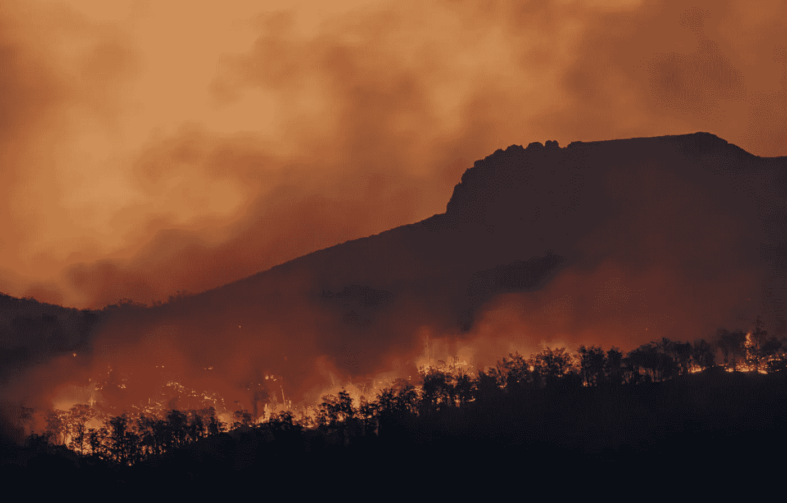
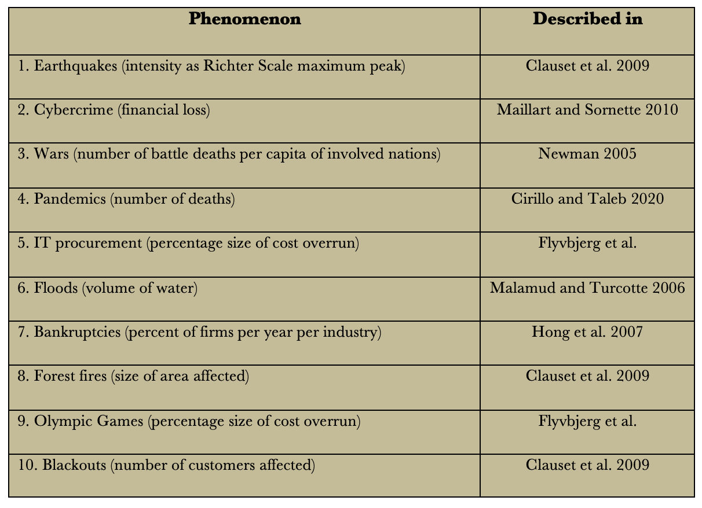

# 回归尾部与回归均值*

> 原文：<https://towardsdatascience.com/regression-to-the-mean-regression-to-the-tail-how-to-mitigate-covid-19-climate-change-and-other-c0e9b62aca5c?source=collection_archive---------14----------------------->

## [思想和理论](https://towardsdatascience.com/tagged/thoughts-and-theory)

## 更糟糕的疫情和更极端的气候将袭击我们。对于政府、企业和公众来说，导航的基本原则是什么？

马特·帕尔默在 Unsplash 拍摄的照片

> *回归到均值是美好可靠的，回归到尾部是可靠吓人的。我们生活在向尾部回归的时代。一场比迄今为止最糟糕的疫情袭击我们，气候比我们迄今为止见过的任何一场都更极端，这只是时间问题。对于政府、企业和公众来说，应对这种局面的基本原则是什么？*

弗朗西斯·高尔顿爵士创造了“回归均值”这个术语，或者他最初称之为“回归平庸”。它现在是统计学中广泛使用的一个概念，描述了当样本数量足够多时，样本均值的测量如何趋向于总体均值，尽管在单个测量中可能有很大的变化。

高尔顿举例说明了他的原理，高个子父母的孩子长大后往往比他们的父母矮，更接近于人口的平均值，反之亦然。

在一个更简单的例子中，在统计上独立的事件中，一个轮盘赌轮盘可以连续显示红色五次——在轮盘的任何连续五次旋转中，它会出现这种情况的 3%——但在接下来的轮盘旋转中，红色与黑色的赔率是 50–50。因此，轮盘旋转的次数越多，结果就越接近 50–50 的红色对黑色，即使开始时有连续五次红色。当进行大量旋转时，随着数量的增加，旋转的平均结果会回归到预期的平均值，无论起点是什么。

还有一个因诺贝尔经济学奖获得者丹尼尔·卡内曼而著名的例子，在最近几次飞行中表现良好的飞行员在以后的飞行中表现不佳，更接近多次飞行的平均水平。这不是因为飞行员的技能下降了，而是因为他们最近的良好表现不是因为技能的提高，而是随机事件的幸运组合。

> 回归均值的前提是均值存在。对于一些具有重大社会影响的随机事件来说，情况并非如此。

没有什么比正确的理论更实际的了。回归均值已经在数学上被证明适用于许多类型的统计数据，并且在保险、赌场和风险管理(例如飞行安全)中非常有用。

但是回归均值的前提是存在一个总体均值。对于一些具有重大社会影响的随机事件来说，情况并非如此。

例如，洪水、森林火灾、地震、战争、恐怖袭击、犯罪和 IT 投资的规模分布没有总体平均值，或者由于无限的变化而很难定义平均值。换句话说，均值和/或方差不存在。对于这种分布来说，回归均值是一个没有意义的概念，而所谓的“回归尾部”是有意义的，也是必然的。

回归到尾部适用于任何非零概率密度趋于无穷大的分布。新极值出现的频率以及它们超出先前记录的程度对于分布的厚尾程度具有决定性作用，例如，它是否具有无限方差和均值。超过某个频率和极值大小，平均值随着测量的事件越多而增加，平均值最终接近无穷大而不是收敛。在这种情况下，回归到平均值意味着回归到无穷大，即不存在的平均值。深度灾难(如地震、海啸、流行病和战争)往往遵循这种类型的分布。

> 尾部回归定律表明，总会有一个事件比迄今为止最极端的事件还要极端。它的出现只是时间问题。

我建议我们将这种现象命名为“尾部回归定律”，即事件以足够的规模和频率返回到尾部，使均值不会收敛该定律描述了一个有许多极端事件的情况，无论最极端的事件有多极端，总会有比这更极端的事件。它的出现只是时间问题。

当面临遵循尾部回归定律的风险时，谨慎的决策者不会指望运气，也不会指望传统的高斯风险管理，高斯风险管理比指望运气更糟糕，因为它给人一种虚假的安全感。相反，决策者想要做两件事:(a)“切尾”，通过缓解来降低风险，以及(b)实践“预防原则”，即通过过度谨慎来完全避免尾部风险。

> 许多认知和其他偏见——包括简单的一厢情愿——欺骗我们看到温和的风险，而实际上风险是巨大的。

在任何给定的情况下，谨慎的决策者和他们的风险经理必须能够决定他们是否面临回归均值(轻度高斯风险)或回归尾部(极端厚尾风险)的情况，最重要的是，永远不要将前者误认为后者。这是一项艰巨的任务，因为许多认知和其他偏见——包括简单的一厢情愿——诱使我们看到温和的风险，而实际上风险是巨大的。

> 流行病似乎遵循广义的帕累托分布。回归到尾部的法则因此是相关的，有三个重要的含义。

举例来说，考虑当前的新冠肺炎疫情。Cirillo 和 Taleb (2020)认为流行病(以死亡人数衡量)似乎遵循广义帕累托分布。回归到尾部的法则因此是相关的，有三个重要的含义。

> 新冠肺炎·疫情是完全可以预测的。事实上，疫情早在几年前就被纳西姆·尼古拉斯·塔勒布和比尔·盖茨这样截然不同的人预测到了。

首先，新冠肺炎疫情是完全可以预测的。事实上，疫情早在几年前就被各种不同的人预测到了，比如《因瑟托》的作者纳西姆·尼古拉斯·塔勒布、慈善家比尔·盖茨以及众多流行病学家，他们在被政府、企业和媒体忽视多年后，现在理所当然地成为了“我说了什么”的预言家。

第二，任何了解尾部退化的人都清楚，一旦危机发展，主要的缓解措施应该是什么，即:(a)切断尾部(通过封锁、个人保护设备、测试、开发疫苗等打破传播链)。)和(b)预防原则(宁可封锁太多也不要封锁太少)——在全球范围内以 T4 的速度和规模立即推出 T2。关闭湿货市场和改变食品加工业将有助于从一开始就防止危机的发展。

> 早期缓解和预防会在面临尾部退化时获得千倍的回报。

早期缓解和预防会在面临尾部退化时获得千倍的回报。不幸的是，中国领导层起初试图压制有关病毒的信息，从而推迟了缓解措施。然后，一旦数据公布，其他地方的领导人——包括美国和英国——很慢才意识到他们面临的是极端风险，而不是较温和的风险。因此，他们在做出正确决定时行动迟缓。封闭的政府也减缓了进步。

第三，应急措施必须到位，以便快速扩大规模。当领导人终于明白新冠肺炎是一个厚尾现象并开始做出正确的决定时，事实证明卫生服务、政府和企业准备不足，以至于口罩、长袍和其他卫生工作者防护装备等基本用品立即告罄。准备金的缺乏使其无法有效快速地扩大规模——就像没有准备金的银行在危机中毫无用处一样。

由于这三点中的每一点都失败了，许多地方的缓解措施来得*晚*、*慢*，并且*的规模*不足，也就是说，与面临尾部衰退时所需要的正好相反，在生命损失、苦难和财富破坏方面带来了毁灭性的后果。

为了避免未来出现类似的情况，领导者和公民必须理解并按照回归到尾部的规律行事。就流行病而言，我们可以吸取两个教训。

> 每个人都需要诚实面对，并牢记在心，未来会有更多的大流行，其中之一将比新冠肺炎疫情更糟糕。

首先，每个人都需要诚实地面对并记住，未来将会有更多的流行病，*和*其中之一将会比新冠肺炎疫情更严重。这一令人不安的事实直接来自流行病的幂律分布和相关的尾部回归定律。

其次，一旦领导人和公民明白大流行意味着回归到尾部，他们也将明白如何应对下一个疫情:立即、快速、大规模地切断尾部并实施预防原则，同时做好必要的应急准备。

这两个教训是一般性的。它们不仅适用于流行病，还适用于*所有服从尾部回归定律的*现象，例如:洪水、森林火灾、地震、海啸、雪崩、犯罪、战争、恐怖袭击、停电、破产和网络犯罪，以及灾难性较小但财务风险较高的风险项目，如举办奥运会、建设核电站、高速铁路系统、水电大坝、新城市，甚至是采购新 IT 系统这样看似无害的事情，后者是当前全球数字化工作中的一个严重缺陷。

> 政府用来重启衰退经济的大规模刺激计划，通常包括具有厚尾金融风险的大型建筑和投资项目。

疫情危机后的经济重建也将遵循尾部回归定律，尽管没有那么明显。生命损失不会成为主要风险，但金融脆弱性和财富毁灭将继续成为主要风险。政府用来重启衰退经济的大规模刺激支出计划通常包括具有厚尾金融风险的大型建筑和投资项目，如 IT、交通、能源、水、教育、住房、医疗和国防领域的大型项目。

> 通过选择风能而不是核能，回归尾部的风险将大大降低。埃隆·马斯克和奥斯泰德明白这一点。大能源没有。

有些项目比其他项目更厚尾，也就是说，它们更容易受到尾部回归定律的影响。应该使用数据来区分厚尾项目和薄尾项目，并尽可能坚持后者。例如，核电站是定制的，建造缓慢，金融风险大；而风力发电场和能量储存是模块化的、快速的和薄尾的。通过选择风能而不是核能，回归尾部的风险将大大降低。埃隆·马斯克和奥斯泰德明白这一点。大能源没有。每一种投资选择都必须以这种方式进行评估，以确保刺激支出成为对经济的提振而不是拖累，后者发生的频率比我们想象的要高。

下表显示了服从尾部回归定律的十大现象，按尾部的肥度排序。表中的所有现象都具有无限的方差，即它们是高度厚尾的。我们看到，最粗的尾部——表明对尾部的最大和最频繁的回归——被发现用于地震(以强度衡量),这有充分的理由经常被认为是幂律分布深度灾难的典型案例。流行病(以死亡人数衡量)处于中间，电力中断(以受影响的客户数量衡量)处于底部。

*服从回归到尾部法则的前 10 个现象，排在尾部的肥度之后。排名越高，尾巴越粗，对尾巴的回归就越大，越频繁。所有的现象都有无限的变化。下表显示了有数据可查的现象。*

来源:作者，【https://bit.ly/2TMbCg5 

> 存在四种有效的缓解措施:a)切断尾巴，b)使用预防原则，c)确保必要的应急措施到位，以及 d)立即、快速、大规模地采取行动。这是在尾部回归时代降低风险的四个基本原则。

对于遵循尾部回归定律的这些现象和许多其他现象，其影响是显而易见的:事件总是会回归到尾部，即极端的结果，迟早会出现一个比迄今为止最极端的事件更极端的事件，往往会危及生命和财富。同样清楚的是，存在四种有效的缓解措施:a)切断尾巴，b)使用预防原则，c)确保必要的应急措施到位，以及 d)立即、快速、大规模地采取行动。这是在尾部回归时代降低风险的四个基本原则。

如果我们积极地遵循这些原则，回归到尾部将是可管理的。如果我们不这样做，尾部事件将一次又一次地回来困扰我们，导致不必要的大屠杀，而我们则被动地追赶缓解措施，任何了解尾部回归的人都会承认，这些措施早在我们陷入尾部之前就应该到位，就像新冠肺炎疫情事件一样。

> 对于我们今天面临的最大、最紧迫的尾部风险:气候变化，新冠肺炎可能最终只是一场彩排

许多人正确地观察到，对于我们今天面临的最大和最紧迫的尾部风险:气候变化，新冠肺炎可能最终只是一场彩排。如果气候科学是正确的——没有理由认为它是错误的——回归到尾部的法则在这里将会特别相关。它告诉我们，如果现在不以前所未有的速度和规模减缓气候变化，没有时间浪费在所涉及的每一个步骤上，那么大量的生命和财富损失可能会随之而来。

回归到尾部的法则进一步告诉我们，气候缓解的重点必须是:(a)确定哪些缓解措施在闪电战般的速度下特别具有可扩展性，哪些没有,( b)加速和加强那些有可扩展性的措施，同时无情地摒弃那些没有可扩展性的措施，这两项措施在今天都做得不好。

> 如果我们真正理解气候变化尾部回归定律的紧迫性，我们就有机会在这种特殊的尾部风险中生存下来。如果我们不…

如果我们做到了这一点，也就是说，如果我们真正理解了气候变化尾部回归定律的紧迫性，我们就有机会在这种特殊的尾部风险中生存下来。如果我们不这样做，这很可能意味着告别我们所知的世界，大规模毁灭生命和财富，相比之下，使新冠肺炎看起来像一个野餐。

________

*)有关本文的更长版本，请参见 Flyvbjerg，Bent，2020，“回归到尾部的法则:如何在新冠肺炎、气候危机和其他灾难中生存”，*《环境科学与政策*，第 114 卷，12 月，第 614-618 页。免费 pdf [这里](https://bit.ly/2TMbCg5)。

________

# 参考

西里洛、帕斯夸莱和纳西姆·尼古拉斯·塔勒布，2020，“传染病的尾部风险”， *arXiv* ，4 月 18 日。

Clauset，a .，Shalizi，C. R .和 Newman，M. E .，2009，“经验数据中的幂律分布”， *SIAM Review* ，51(4)，661–703。

Flyvbjerg，Bent，Alexander Budzier，Dirk W. Bester 和 Daniel Lunn，正在进行中，“数字化灾难:走向 IT 投资风险理论”

Flyvbjerg，Bent，Alexander Budzier，和 Daniel Lunn，进行中，“回归到尾部:为什么奥运会爆炸。”

洪炳辉、李克伟、李建伟，2007，“企业破产中的权力法”，*物理学报 A* ，361(1-2)，6-8。

Maillart，t .和 Sornette，d .，2010，“网络风险的重尾分布”，*《欧洲物理杂志 B* ，75(3)，357–364。

Malamud，B. D .和 Turcotte，D. L .，2006，“幂律频率统计对洪水的适用性”，*《水文杂志》*，322(1–4)，168–180。

纽曼，M. E .，2005，“幂定律、帕累托分布和齐夫定律”，*当代物理学*，46(5)，323–351。