# Python 中的回归树从头开始

> 原文：<https://towardsdatascience.com/regression-tree-in-python-from-scratch-9b7b64c815e3?source=collection_archive---------6----------------------->

## 用 Python 编写流行的回归树算法，并解释其本质

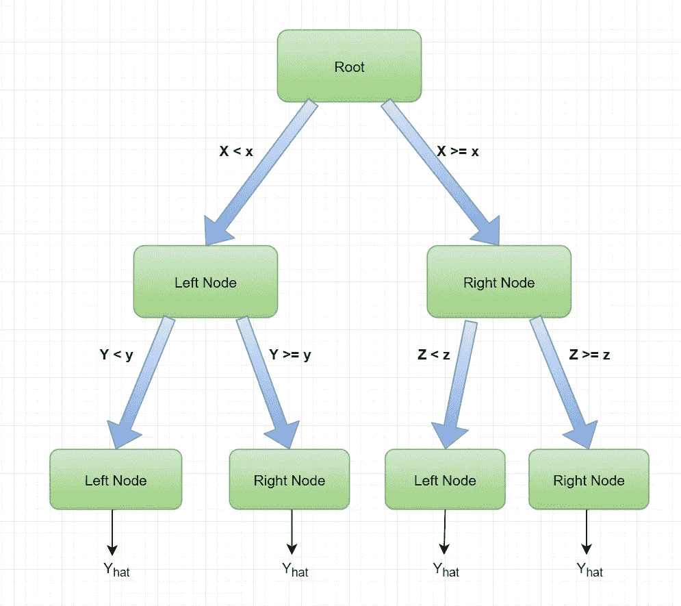

回归树的图形；作者模式

本文旨在向读者展示 python 中回归树算法背后的代码和直觉。我发现浏览一个算法的代码是一个非常好的教育工具，可以帮助我理解在引擎盖下发生了什么。我希望读者也能从中受益。

解释的算法是回归树算法。它用于模拟连续变量 **Y** 和一组特征 **X:** 之间的关系

```
**Y = f(X)**
```

函数 **f** 是一组特征和特征值的规则，它在给定特征 x 的情况下做了解释 Y 变量的“最好”工作

本文是上一篇关于决策树的文章的延续:

[](/decision-tree-algorithm-in-python-from-scratch-8c43f0e40173) [## Python 中的决策树算法从零开始

### 用 Python 编写只使用 NumPy 和 Pandas 的流行算法，并解释其中的内容

towardsdatascience.com](/decision-tree-algorithm-in-python-from-scratch-8c43f0e40173) 

我假设读者熟悉节点、分裂和树的层次的概念。所有这些概念在前一篇文章中都有解释。

在上一篇文章中， **Y** 变量是一个包含两个值——0 和 1 的二进制变量。

回归树是处理连续响应变量 **Y.** 的估计器，例如，身高、工资、点击量等。该算法在我的 GitHub 存储库中编码和实现(以及附带的笔记本):

[](https://github.com/Eligijus112/decision-tree-python) [## eligijus 112/决策树-python

### 从头开始实现决策树。为 eligijus 112/决策树-python 开发做出贡献，创建一个…

github.com](https://github.com/Eligijus112/decision-tree-python) 

回归的节点类非常类似于上一篇文章中的二叉分类树类:

回归节点；作者代码

每个节点，无论其级别如何，都具有以下主要属性:

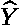

落入某个节点的 Y 变量的平均值

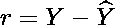

残差(真实 Y 值和平均值之间的差值)

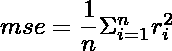

每个节点的均方误差

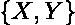

节点的特征和响应变量

上述所有属性都将用于拆分过程。

分割前的特征准备与分类决策树中的相同:

对于数据集中的每个数字特征，我们对特征值进行排序，并获取两个相邻值的平均值。

例如，假设我们的特征 1 如下:

```
feature_1 = [7, 5, 9, 1, 2, 8]
```

已排序:

```
feature_1 = [1, 2, 5, 7, 8, 9]
```

邻居的方式:

```
feature_1 = [1.5, 3.5, 6.5, 7.5, 8.5]
```

我们对所有的数字特征做同样的事情。

对于分类特征，比如

```
feature_2 = [‘cat’, ‘dog’, ‘dog’, ‘cow’, ‘cat’, ‘cow’] 
```

我们发现该特性的独特价值:

```
feature_2 = [‘cat’, ‘dog’, ‘cow’]
```

通过这样的预处理，对于每个特征和每个特征值，我们将节点的数据分成两个子集，左和右:

对于数字特征(例如，feature_p):

```
**left = X[X[feature_p]<value]****right = X[X[feature_p]≥value]**
```

对于分类特征(例如，feature_c):

```
**left = X[X[feature_c]==feature_c]****right = X[X[feature_c]!=feature_c]**
```

在分类树中，我们需要计算每个数据集(左侧和右侧)中的观察值数量。在回归树中，我们将两个数据集的所有残差放在一起，并计算联合的**均方误差**统计量。给出最低 **mse** 的特征和特征值是分裂标准。

例如，让我们考虑两种可能的拆分， **X 在 4** 和 **X 在 6.5** :

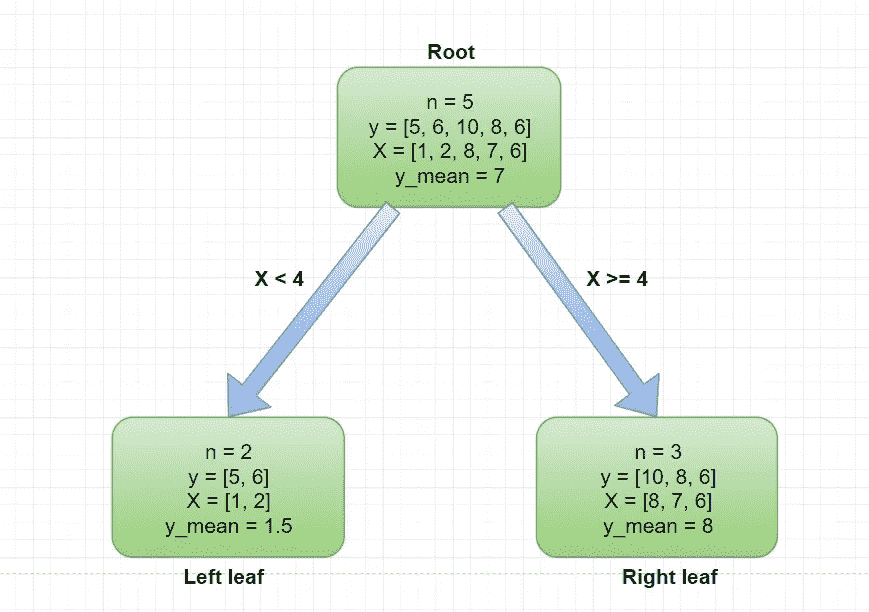

示例拆分 1；按作者分类的图表

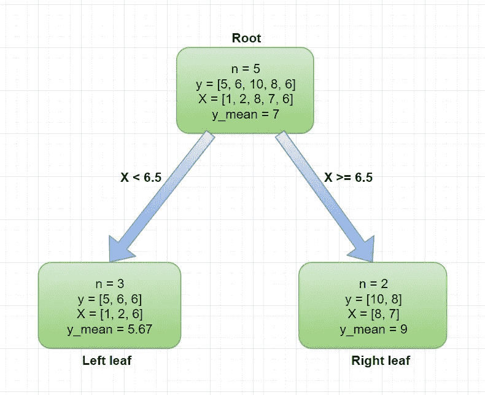

示例拆分 2；按作者分类的图表

左侧节点的第一个示例中的残差是**【3.5，4.5】**

右节点第一个例子中的残差是**【2，0，-2】**

左节点第二个例子中的残差是 **[-0.67，0.33，0.33]**

右节点的第二个例子中的残差是**【1，-1】**

因此，第一次拆分的残差为:

**r1 = [3.5，4.5，2，0，-2]**

第二个:

**r2 = [-0.67，0.33，0.33，1，-1]**

然后，我们找到两个残差集的 mse 统计量，并对它们进行比较:

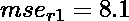

第一次分割残差的 MSE

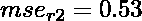

第二次分割残差的 MSE

正如我们所见，第二个 mse 比第一个小得多。因此，在两种可能的分裂中，第二种 **(X ≥ 6)** 更好。

让我们用一个例子来试试定制的 NodeRegression 类。

我们想要创建一个树 **f** ,这样:

```
**mpg = f(horsepower, weight)**
```

这里

每加仑汽油跑多少英里

**马力** —一辆车的马力数；发动机功率

**重量**——一辆汽车的重量，单位为千克

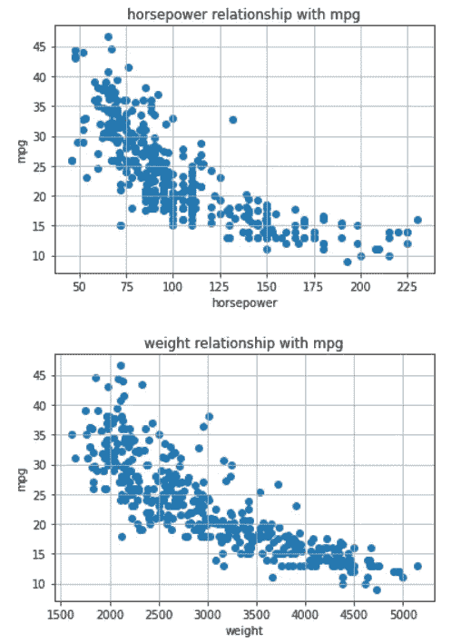

mpg 与马力和重量的关系:按作者分类的图表

实现与前面的树方法非常相似:

```
# Reading data
d = pd.read_csv("data/regression/auto-mpg.csv")# Subsetting
d = d[d['horsepower']!='?']# Constructing the X and Y matrices
features = ['horsepower', 'weight']# Ensuring the correct types 
for ft in features:
    d[ft] = pd.to_numeric(d[ft])# Constructing the X and Y matrices
X = d[features]
Y = d['mpg'].values.tolist()
```

节点初始化和树的生长:

```
# Initiating the Node
root = NodeRegression(Y, X, max_depth=2, min_samples_split=3)# Growing the tree
root.grow_tree()
```

最后打印出这棵树:

```
# Printing tree
root.print_tree()
```

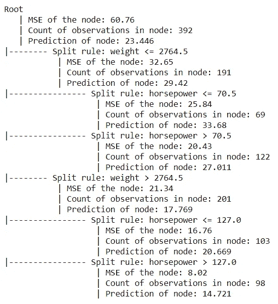

长成的树；图片来自作者的笔记本

我们可以将结果与回归树[的 scikit-learn 实现进行比较，https://scikit-learn . org/stable/modules/generated/sk learn . tree . decision tree regressor . html](https://scikit-learn.org/stable/modules/generated/sklearn.tree.DecisionTreeRegressor.html)具有相同的超参数:

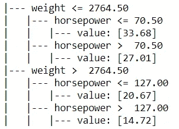

Scikit 学习实现；图片来自作者的笔记本

正如我们所看到的，分割值和特征都是相同的。

最后要注意的是，节点的预测是节点中 Y 个观测值的平均值。在分类器决策树中，预测是节点中具有最多观察值的类。

在上面生长的树木中，如果我们遵循规则:

```
**weight ≤2764.5** **→****horsepower ≤70.5**
```

我们会得到这个节点有 69 个观察值。如果我们对这些变量的 mpg 变量进行平均，我们会得到这些汽车的平均 mpg 值为 33.68。这是对所有未来汽车的预测，它们遵循上述路径。

总之，我强烈推荐仔细阅读 **NodeRegressor** 类的代码，因为我试图非常明确地编写它。通过从我的 GitHub 存储库中加载数据并一行一行地检查代码，您很快就会发现回归树是一种非常简单和直观的算法。

在我的 git 存储库中随意派生、复制、克隆代码并创建 pull 请求，这在第一段中提到过。

如果任何概念仍然不清楚，请随时留下评论。

感谢阅读和快乐编码！