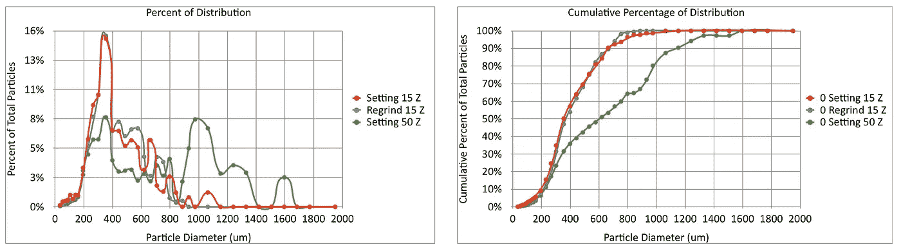
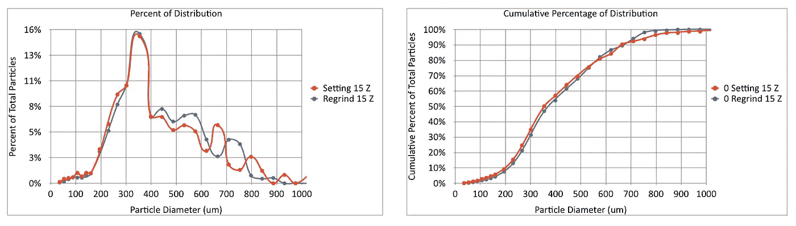
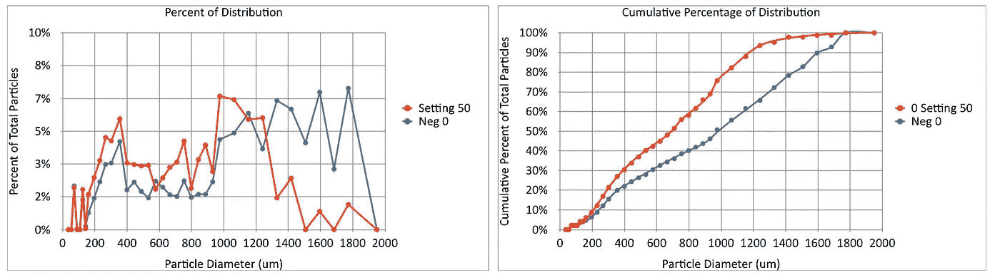
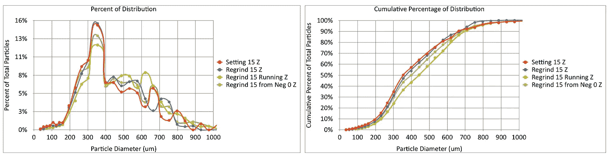
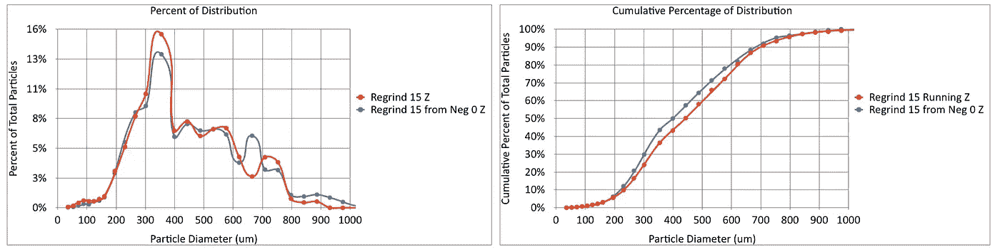
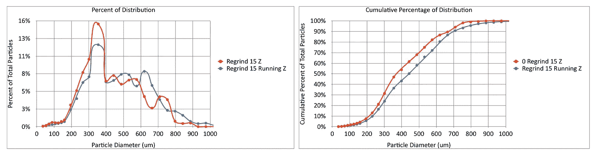

# 重磨咖啡:粒子分布

> 原文：<https://towardsdatascience.com/regrinding-coffee-particle-distributions-add74209992e?source=collection_archive---------40----------------------->

## 咖啡数据科学

## 近距离观察

几个月前，[詹姆斯·霍夫曼](https://www.google.com/url?sa=t&rct=j&q=&esrc=s&source=web&cd=&ved=2ahUKEwiOl7rclb7vAhW0On0KHc-2DT8QwqsBMAB6BAgIEAg&url=https%3A%2F%2Fwww.youtube.com%2Fwatch%3Fv%3D6IjFfl-8Gu8%26t%3D200s&usg=AOvVaw3G44ih81RNg1hVos-WRgB3)开始了一场关于重新研磨咖啡豆的讨论。目的是将咖啡研磨成粗粒，然后再将粗粒研磨得更细。我最初是这样做的，但我没看出有什么不同。然而，最初的挑战是有一个手动研磨机，这使得这种类型的实验具有挑战性。

在查看[颗粒分布](https://medium.com/nerd-for-tech/measuring-coffee-grind-distribution-d37a39ffc215)的同时，我想再看一看，以了解重新研磨是否改变了颗粒分布以及如何改变的。

我开始用一个小生磨床，我看着设置 50 的粗设置。这已经有一个非常双峰分布。然后，我把这些研磨设置为 15。设定 13 是我打得很好的地方，但我在设定 15 有更多的数据。

如果我们取出设置为 50 的分布并放大，我们可以看到两个分布非常相似。

所以我看了看负 0，这是逆时针转动表盘，直到它在 0 标记。这是超过设置 50 的刻度盘的半圈。分布情况大不相同，但罚款金额仍然很高。

然后我重新研磨这些研磨物进行比较。此外，当机器运行时，我在慢慢倒入研磨料的同时观察了二次研磨(二次研磨 15 运行)。这似乎比其他任何事情都更有影响。从负 0 开始也会导致较小的偏移。

我把这四张图分开来仔细看看。在这里，我们将初始粗糙度作为变量，开始时较粗会导致细微的偏移。

我可以比较研磨机在倒入研磨料和不倒入研磨料时的运转情况。随着研磨机的运行，有一个明显的转变为粗糙。

如果重新研磨对味道有什么影响，我很想知道。我总是很好奇，一个更好的研磨机是否会有两个阶段，粗磨和精磨。然而，这也是两个毛刺套件，因此会贵得多。

我不相信有趣的变化是由重新研磨引起的，而是研磨粉或咖啡豆是如何倒入机器的。

如果你愿意，可以在 Twitter 和 YouTube 上关注我，我会在那里发布不同机器上的浓缩咖啡视频和浓缩咖啡相关的东西。你也可以在 [LinkedIn](https://www.linkedin.com/in/robert-mckeon-aloe-01581595?source=post_page---------------------------) 上找到我。也可以关注我[中](https://towardsdatascience.com/@rmckeon/follow)。

# [我的进一步阅读](https://rmckeon.medium.com/story-collection-splash-page-e15025710347):

[浓缩咖啡系列文章](https://rmckeon.medium.com/a-collection-of-espresso-articles-de8a3abf9917?postPublishedType=repub)

[工作和学校故事集](https://rmckeon.medium.com/a-collection-of-work-and-school-stories-6b7ca5a58318?source=your_stories_page-------------------------------------)

[个人故事和关注点](https://rmckeon.medium.com/personal-stories-and-concerns-51bd8b3e63e6?source=your_stories_page-------------------------------------)

[乐高故事启动页面](https://rmckeon.medium.com/lego-story-splash-page-b91ba4f56bc7?source=your_stories_page-------------------------------------)

[摄影启动页面](https://rmckeon.medium.com/photography-splash-page-fe93297abc06?source=your_stories_page-------------------------------------)

[使用图像处理测量咖啡研磨颗粒分布](/measuring-coffee-grind-particle-distribution-using-image-processing-84882e6dd4fd?source=your_stories_page-------------------------------------)

[使用筛子改进咖啡研磨测量](/improving-coffee-grind-measurement-using-a-sifter-7b358f9c8331?source=your_stories_page-------------------------------------)

[使用先进的图像处理技术测量咖啡渣中的粉末](/measuring-fines-in-coffee-grounds-using-advanced-image-processing-148f048bdb7?source=your_stories_page-------------------------------------)

[使用自适应阈值改善咖啡粉分布](/improving-coffee-grind-distribution-using-adaptive-thresholds-194e001f301?source=your_stories_page-------------------------------------)

[拍摄咖啡渣进行研磨分布分析](https://medium.com/nerd-for-tech/photographing-coffee-grounds-for-grind-distribution-analysis-d3494e980c28?source=your_stories_page-------------------------------------)