# 用例子清楚地解释正则表达式

> 原文：<https://towardsdatascience.com/regular-expressions-clearly-explained-with-examples-822d76b037b4?source=collection_archive---------0----------------------->

## 任何数据分析师在处理字符串时都应该具备的最被低估的技能之一


布莱恩·纳塔内尔在 [Unsplash](https://unsplash.com?utm_source=medium&utm_medium=referral) 上的照片

这篇博文的诞生源于我自己最长时间以来对正则表达式(regex)这个话题的沮丧和回避。

几个月来，我一直在推迟学习 regex 的想法，因为说实话，它们看起来非常可怕，尤其是当你第一次遇到它们的时候。我的意思是，一串字符绑在一起，背后似乎没有任何逻辑——没有人有时间！

直到最近我在工作中接到一个任务，涉及到检索一个字符串的元素，我才最终对正则表达式的能力有了一个认识。事实证明，一旦你理解了基本面，它其实并没有那么糟糕。

因此，在本文中，我将解释什么是正则表达式，介绍一些基本的正则表达式字符，最重要的是，使用几个实际的例子演示如何使用 R 编程语言执行正则表达式。具体来说，我们将讨论在正则表达式中捕获组的概念。

如果你是一个 Python 爱好者，你可以在我的 GitHub [这里](https://github.com/chongjason914/regular-expressions-regex)找到 Python 版本的代码。

# 什么是正则表达式？

> 正则表达式不是一个库，也不是一种编程语言。相反，正则表达式是在任何给定文本(字符串)中指定搜索模式的字符序列。

文本可以包含从字母到数字，从空格到特殊字符的任何内容。只要字符串遵循某种模式，regex 就足够健壮，能够捕获这种模式并返回字符串的特定部分。

# 您需要知道的基本正则表达式字符

现在，在我们进入本质之前，我认为我们首先回顾正则表达式的一些基础知识是至关重要的。

本文后面的例子将建立在这里举例说明的一些主要概念之上，即:字符、分组和量词。

## 特性

*   转义符:`\`
*   任意字符:`.`
*   数字:`\d`
*   不是数字:`\D`
*   字符:`\w`
*   非文字字符:`\W`
*   空白:`\s`
*   不是空白:`\S`
*   字界:`\b`
*   不是单词边界:`\B`
*   字符串的开头:`^`
*   字符串结尾:`$`

## 分组

*   匹配括号中的字符:`[ ]`
*   匹配不在括号中的字符:`[^ ]`
*   非此即彼:`|`
*   捕获组:`( )`

## 量词

*   0 或更多:`*`
*   1 或更多:`+`
*   0 或 1: `?`
*   准确的字符数:`{ }`
*   字符数范围:`{Minimum, Maximum}`

# 正则表达式示例

如果上面的正则表达式字符对您来说没有太大意义，也不要担心——它们只是作为我们将要经历的例子的参考。

在这一节中，我们将关注 6 个不同的例子，希望它们能加深你对正则表达式的理解。实际上，我们将着眼于:

*   2 个数字示例(电话号码和日期)
*   2 个字母示例(名称和 URL)
*   2 个数字和字母的例子(电子邮件地址和地址)

在我们开始之前，确保您已经将 [tidyverse](https://www.tidyverse.org/) 包安装并加载到您的工作环境中。

```
# Install tidyverse package 
install.packages("tidyverse")# Load tidyverse package 
library(tidyverse)
```

## 1.电话号码

假设我们有一个名为 phone 的数据帧，包含如下电话号码列表:

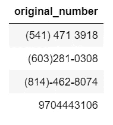

我们希望将这些电话号码分成 3 个独立的部分:区号(前 3 位)、交换机(后 3 位)和线路号码(后 4 位)。

正如我们所看到的，这里的数字模式并不总是一致的，也就是说，它们有不一致的括号、连字符和空格。但是，在正则表达式的帮助下，我们可以轻松地捕获数字组。

首先，我们需要定义一个正则表达式模式。

```
phone_pattern = ".?(\\d{3}).*(\\d{3}).*(\\d{4})"
```

我们到底该如何解读这一点？好吧，让我们一步一步来，从左到右:

*   `.?` 0 或 1 个字符，用于说明可选的左括号
*   `(\\d{3})` 3 位数字符(第一个捕获组，即前 3 位数)
*   `.*` 0 个或多个字符，说明可选的右括号、连字符和空格字符
*   `(\\d{3})` 3 位数字符(第二个捕获组，即接下来的 3 位数)
*   `.*` 0 个或更多的字符来说明可选的连字符和空格字符
*   `(\\d{4})` 4 位字符(第三个捕获组，即最后 4 位)

然后，我们可以使用 str_match 函数，使用我们定义的 regex 模式检索捕获组，并将它们放入数据帧中的各个列。

```
phone$area_code = str_match(phone$original_number, phone_pattern)[, 2]
phone$exchange = str_match(phone$original_number, phone_pattern)[, 3]
phone$line_number = str_match(phone$original_number, phone_pattern)[, 4]
```

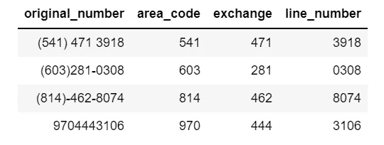

## 2.日期

假设我们有另一个名为 date 的数据帧，它由分隔符不一致的日期组成，我们希望提取日、月和年。

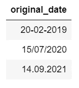

使用与我们刚刚看到的电话号码非常相似的方法，我们需要首先定义一个 regex 模式，然后将该模式与原始日期列匹配，最后为每个捕获组创建一个新列。

首先，定义日期的正则表达式模式。

```
date_pattern = "(\\d{2}).(\\d{2}).(\\d{4})"
```

下面是代码解释:

*   `(\\d{2})` 2 位数字符(第一个捕获组即日)
*   `.`单个字符代表所有特殊字符
*   `(\\d{2})` 2 位数字符(第二个捕获组即月)
*   `.`单个字符代表所有特殊字符
*   `(\\d{4})` 4 位数字符(第三个捕获组即年份)

现在，我们可以匹配模式并为日、月和年创建单独的列。

```
date$day = str_match(date$original_date, date_pattern)[, 2]
date$month = str_match(date$original_date, date_pattern)[, 3]
date$year = str_match(date$original_date, date_pattern)[, 4]
```

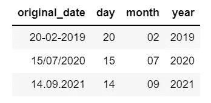

## 3.名称

到目前为止，我们已经研究了两个只包含数字和特殊字符的字符串示例。现在让我们学习如何捕捉单词和字母。

这里我有一个叫做名字的数据框，里面有人们的姓氏、头衔和名字。

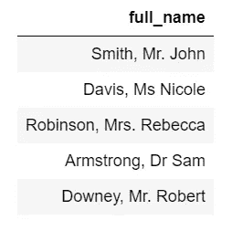

让我们把它们分开，这样它们每个都有自己的专栏。

```
name_pattern = "(\\w+),\\s(Mr|Ms|Mrs|Dr).?\\s(\\w+)"
```

这是这样的解释:

*   `(\\w+)` 1 个或多个单词字符(第一个捕获组，即姓氏)
*   `,`逗号字符
*   `\\s`一个空白字符
*   `(Mr|Ms|Mrs|Dr)`先生、女士、夫人或博士(第二个捕获组，即头衔)
*   `.?`标题后 0 或 1 个句号字符
*   `\\s`单个空白字符
*   `(\\w+)`一个或多个单词字符(第三个捕获组，即名字)

现在，将它们放入单独的列中。

```
names$family_name = str_match(names$full_name, name_pattern)[, 2]
names$title = str_match(names$full_name, name_pattern)[, 3]
names$given_name = str_match(names$full_name, name_pattern)[, 4]
```

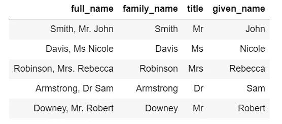

## 4.资源定位符

让我们来看另一个包含单词和字母的字符串的例子。

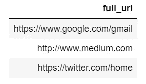

现在，您应该已经熟悉了这个过程。

```
url_pattern = "(https?)://(www)?.?(\\w+).(\\w+)/?(\\w+)?"
```

解释是:

*   `(https?)` http 或 https(第一个捕获组，即模式)
*   `://`特定的特殊字符串
*   `(www)?`可选 www(第二个捕获组，即子域)
*   `.?` 0 或 1 个句号字符
*   `(\\w+)`一个或多个单词字符(第三捕获组，即二级域名)
*   `.`单个句号字符
*   `(\\w+)`一个或多个单词字符(第四捕获组，即顶级域名)
*   `/?` 0 或 1 个反斜杠字符
*   `(\\w+)?`可选 1 个或多个单词字符(第五捕获组即子目录)

将捕获组分成单独的列，我们得到:

```
url$schema = str_match(url$full_url, url_pattern)[, 2]
url$subdomain = str_match(url$full_url, url_pattern)[, 3]
url$second_level_domain = str_match(url$full_url, url_pattern)[, 4]
url$top_level_domain = str_match(url$full_url, url_pattern)[, 5]
url$subdirectory = str_match(url$full_url, url_pattern)[, 6]
```

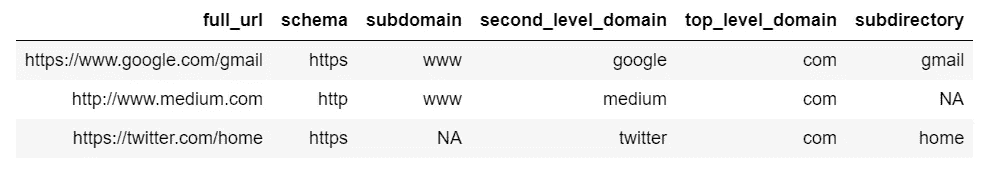

## 5.电子邮件地址

利用到目前为止我们已经获得的关于正则表达式的知识，现在让我们看两个包含字母和数字的最后的字符串例子。

假设我们在一个名为 email 的数据框架中有一个电子邮件列表:

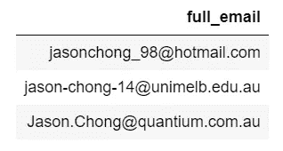

现在，生成一个正则表达式模式来匹配用户名、域名和域。

```
email_pattern = "([a-zA-Z0-9\\_\\-\\.]+)@([a-zA-Z]+).(.+)"
```

让我们仔细看看这个正则表达式，并解读它的含义。

*   `([a-zA-Z0-9\\_\\-\\.]+)`一个或多个小写字母、大写字母、数字和特殊字符，包括下划线、连字符和句号(第一个捕获组，即用户名)
*   `@` at 符号
*   `([a-zA-Z]+)` 1 个或多个小写和大写字母(第二个捕获组即域名)
*   `.`单个句号字符
*   `(.+)` 1 个或多个字符(第三捕获组即域)

然后，我们将这个正则表达式模式应用于电子邮件列表:

```
email$username = str_match(email$full_email, email_pattern)[, 2]
email$domain_name = str_match(email$full_email, email_pattern)[, 3]
email$domain = str_match(email$full_email, email_pattern)[, 4]
```

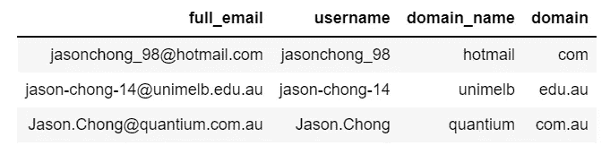

## 6.地址

当然，我把最好的例子留到了最后。这个例子和我在工作中所做的是一样的。

在努力重建那件作品的过程中，我用假想的地址制作了一个名为 address 的数据帧。目标是检索门牌号、街道名称、郊区、州和邮政编码。

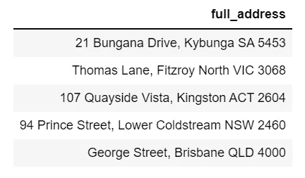

像往常一样，我们需要首先定义一个正则表达式模式。

```
address_pattern = "(\\d*)\\s?(.+),\\s(.+)\\s([A-Z]{2,3})\\s(\\d{4})"
```

以及代码解释:

*   `(\\d*)` 0 个或更多数字字符，因为有些地址没有门牌号(第一个捕获组，即门牌号)
*   `\\s?` 0 或 1 个空白字符
*   `(.+)` 1 个或多个字符(第二个捕获组，即街道名称)
*   `,`逗号
*   `\\s`单个空白字符
*   `(.+)` 1 个或多个字符(第三捕获组，即郊区)
*   `\\s`单个空白字符
*   `([A-Z]{2,3})` 2 或 3 个大写字母(第四个捕获组，即状态)
*   `\\s`单个空白字符
*   `(\\d{4})` 4 位字符(第五个捕获组，即邮政编码)

将此模式与地址列表进行匹配，我们得到:

```
address$house_number = str_match(address$full_address, address_pattern)[, 2]
address$street_name = str_match(address$full_address, address_pattern)[, 3]
address$suburb = str_match(address$full_address, address_pattern)[, 4]
address$state = str_match(address$full_address, address_pattern)[, 5]
address$postcode = str_match(address$full_address, address_pattern)[, 6]
```

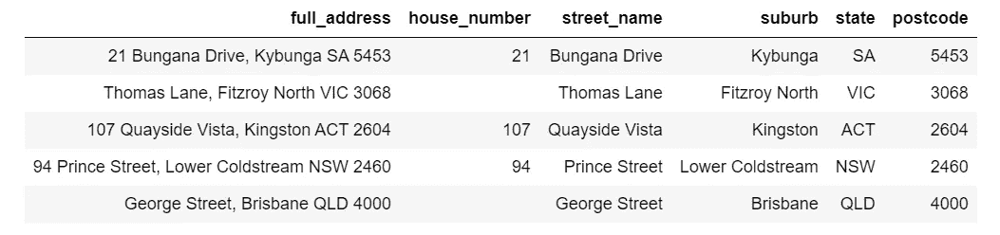

我希望，通过我在这篇博文中展示的 6 个例子，您不仅对正则表达式的工作原理有了更好的理解，更重要的是，对它们在匹配复杂字符串模式时的灵活性有了更好的理解。

如果你渴望成为一名数据分析师，或者只是渴望提高你的数据辩论技能，我强烈建议将 regex 添加到你的工具包中。为了进一步练习，我建议查看一下 [regex101](https://regex101.com/) 或 [regexone](https://regexone.com/) 。

非常感谢你的阅读和快乐学习！

# 更多关于 R 的文章

[](/back-to-basics-linear-regression-in-r-3ffe4900482b) [## 回归基础——R 中的线性回归

### 线性回归是统计学中最基本的知识之一，下面是如何用 R

towardsdatascience.com](/back-to-basics-linear-regression-in-r-3ffe4900482b) [](https://medium.com/swlh/customer-segmentation-using-k-means-clustering-in-r-a74d512a4cfa) [## 基于 R 中 K-均值聚类的客户细分

### 强大的 k-means 算法初学者指南

medium.com](https://medium.com/swlh/customer-segmentation-using-k-means-clustering-in-r-a74d512a4cfa) [](/five-basic-commands-to-getting-started-with-dplyr-in-r-c8b0451ad916) [## R 中开始使用 dplyr 的五个基本命令

### Dplyr 相当于 Python 中的 Pandas 库，可以轻松地进行数据探索和操作

towardsdatascience.com](/five-basic-commands-to-getting-started-with-dplyr-in-r-c8b0451ad916)