# 正则化和线性回归

> 原文：<https://towardsdatascience.com/regularization-and-linear-regression-bcaeba547c46?source=collection_archive---------15----------------------->

## 我们纠正过度拟合的那个


正则化和线性回归|照片由 Jr Korpa 拍摄

这篇文章是我关于[线性回归和 bootstrap](/linear-regression-with-bootstrapping-4924c05d2a9) 和[贝叶斯统计](/bayesian-statistics-11f225174d5a)系列的延续。

之前我详细地讨论了线性回归，现在我将继续这个话题。正如我先前暗示的，我将提出正规化的话题。正则化的作用是简化模型。你想要一个更简单的模型的原因是，通常，一个更简单的 will 模型会在大多数测试中表现得更好。

名词（noun 的缩写）用训练数据作为测试数据是不合适的。当您使用测试数据(模型尚未看到的数据)测试您的模型时，您只能清楚地看到正则化的全部效果。

我的写作主要来自对机器学习效果较差的事物的统计建模。为了简单起见，下面的许多例子打破了这个规则，我们使用训练数据而不是测试数据来评估我们的模型。

因此，**我们模型中的决定系数并不能真正代表模型的有效性，相反，它们只是相关系数**。

## 寻找最佳模型

模型选择——有时也称为特征选择，是指我们使用不同的特征/属性/可用数据列为现有数据选择最佳模型。为模型选择不同的特征实质上创建了不同的模型。

哪一个都可以。选择我们的模型后，我们将调整它。正则化就是简化它:**正则化=简化**。

我们之所以想要一个更简单的模型，是因为我们希望避免一种叫做过拟合或过参数化的现象。过度拟合或过度参数化是一种经常发生的现象，尤其是当您有很多参数时。

有多种正则化技术可供使用，包括:

*   逐步地
*   里脊回归
*   套索
*   PCR — PCA +回归(主成分分析和正则化)

PCR 是用于正则化的最重要的技术。

## 模型适合度

概括地说，一个好的模型“很好地符合数据”然而，这是有细微差别的，因为不同的型号有不同的用途。如果你有一个数据集，你想知道这个数据集是否可以建模；如果你可以用一个数学公式来解释模型，你所拥有的数据——这就是你所想做的——那么使用相同的数据并使用该数据评估你的模型，或者使用我们的训练数据评估我们的模型，这是非常好的和合法的。

然而，如果你希望能够做任何类型的预测，并确定这个模型在预测某事方面有多强大——这通常是人们希望对模型做的事情:他们希望实际利用它——那么**我们需要用测试数据**测试模型。

好的模型需要很好的概括。例如，它需要从您的训练数据推广到您的测试数据。考虑下面的例子:

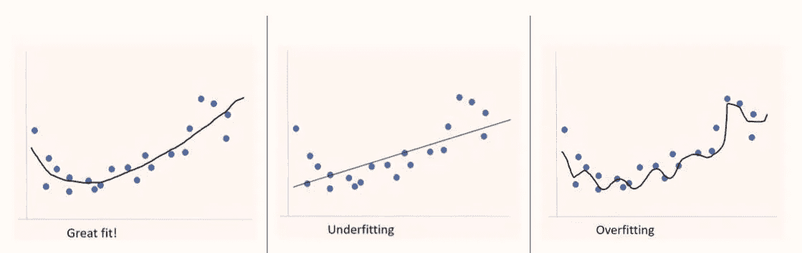

*   **过度拟合**:模型对训练数据非常有效，但不能推广到现实世界
*   **欠拟合**:模型过于简单，笼统但没有意义。更少的差异，但更多的偏向错误的答案

为什么我把最左边的图像称为非常适合，也就是刚刚好的那个？因为当我们看这个的时候，黑线似乎很好的解释了那些蓝点。如果我们要做一个简单的线性回归，我们可能会得到类似中间图像上的线。我们称之为不合身。我们的模型会缺少方差，我们的模型会有太多的偏差；这就是我们要说的。

现在，在右边，我们过度拟合。在这里，我们在模型中有太多的方差。所以模型方差非常明显，因为它上下波动，到处跳跃。这种差异有助于拟合这个特定的数据集。但是我们称之为过度拟合，我们说它对数据拟合得太好了。你可能会问，怎么/为什么这是一件坏事？嗯，这是一件坏事，因为如果我加入测试数据，测试数据可能会比其他两个模型更不适合。因为测试数据不会正好在这条黑线的最大值或最小值的这些波峰或波谷处。

## 过度拟合

过度参数化通常会导致过度拟合，并且还会带来其他一些问题:

*   参数数量>数据维度
*   输入要素的线性相关性
*   在训练数据集上效果很好，但在真实世界(测试数据)中性能很差(如果不是很糟糕的话)

我们所说的输入要素的线性相关性存在一个问题。因此，如果您的一个输入要素可以用其他输入要素以线性方式解释，那么我们称之为线性依赖。也就是说，如果你可以线性组合(也就是说，通过加法、减法和乘法，添加一些列来得出或确定另一个已经存在的列)，那么这意味着你有一个线性依赖；这意味着其中一列，一列或多列只是其他列的组合。当你计算和确定模型时，这会导致问题。

## 防止过度拟合

防止过度拟合的工具是正则化。正规化有不同的方式。从早期开始，逐步回归就是正则化的一种形式。什么是逐步回归？逐步删除/添加功能。有两种味道，向前和向后。向前逐步回归差不多是这样工作的:你选择你认为是你最好的特征。假设你有输入特征 x_1，x_2，x_3，x_4 等等；你选择一个你认为最好的(有很多种方法可以选择。)然后你来，你会创建一个线性回归，基于那个特征，假设是 x_2，现在是输入，y 是输出。然后你选择下一个最好的，比如说 x_4，你用 x_2 来测试那个。如果模型变得更好，有所改善，那么你保留第二个 x 值。如果它不好，如果模型性能没有提高，那么你就不要保留它，然后你又回到只有 x_2 的状态。然后你尝试这些功能中的另一个。这被称为向前逐步回归。

向后逐步回归是更常见的方法。你得到所有的值，比如 x_1，x_2，x_3，x_4，然后从这四个输入中建立一个线性回归，得到一个解释 y 的函数；计算/预测 y，然后你去掉其中一列，看看模型是否有所改进。通常情况下，你会不太适应。但是您的模型可能会基于标准而改进，这些标准不仅仅是纯粹的拟合，它们可能会更好，因为您还会对参数进行惩罚，或者使用一种称为信息标准的测量方法，该方法要求您需要从任何给定的输入参数中获取如此多的信息。继续移除特征，直到模型性能停止提高。这被称为向后逐步回归。

其他的正则化技术是你为你的每一列设置一个惩罚；与该列相关的系数的罚值。这些是其他正规化技术。

## 测量模型

我们如何度量模型？有 Akaike 信息标准(AIC):

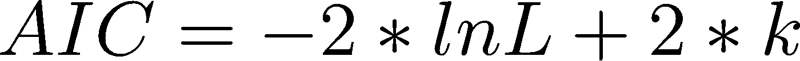

AIC 公式

*   k:估计参数的数量
*   可能性

这是确定一个模型是否有所改进的最受欢迎的标准。随着可比模型的 AIC 变得越来越小，你说 AIC 在改进，你的模型也在改进。因此，通过添加更多的列，或者删除更多的列，如果你的 AIC 有所改善，那么你就知道你在向正确的方向前进。如果你的 AIC 没有提高，那意味着没有下降，那么你知道你在错误的方向上迈出了一步；这意味着最后一次添加列或最后一次删除列应该被撤消，您可以返回并尝试其他操作。

另一个模型度量是贝叶斯信息标准(BIC)，但它很少在这种情况下使用，它非常类似于 AIC:

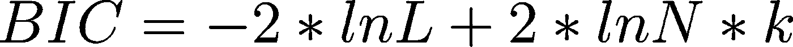

BIC 公制

*   k:估计参数的数量
*   可能性
*   n:记录的测量次数

不管你选择的标准是什么，你的最佳拟合模型是具有最小 AIC 或 BIC 的模型。

## 费用

当你确定任何函数时，任何机器学习算法都有一个所谓的代价函数。这是一个非常基本的概念。一个成本函数基本上是说，“你的模型有多差？”

我之前讨论过线性回归，差是残差的平方。提醒一下，残差是输出 y 的预测值和实际值之间的差值；然后你把它平方，然后你把所有的平方相加。这是一个成本函数，但以前没有明确地调用过。

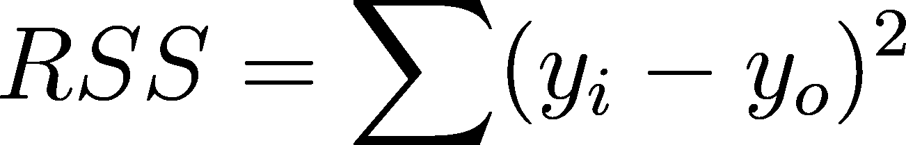

RSS 也被称为 SSR，但它们并不总是一回事！

名词（noun 的缩写）b:在某些文献中，SSR 不是残差平方和，而是平方和回归——一个不同的量。在本文的其余部分，我坚持使用 RSS 来避免对上述数量的混淆。

我们在这里和那里改变了一些细节，我们可以用案例的数量来划分，这意味着正在使用的值的数量—数据点的数量。我们可以在这里放入一个常数，但总的来说，我们希望将它最小化:

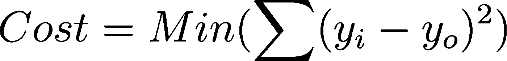

最小化成本函数

这可能是最常见的成本函数之一。还有其他的，特别是逻辑回归。然而，在很大程度上，这是我们的主要成本函数——它可能会以一些小的方式进行修改。

成本函数计算惩罚。所以这里的惩罚就是这些平方和:计算事情有多糟糕。对于给定的训练建模数据集，这是一个损失。我们的想法是最小化这个损失或者最小化这个成本。所以你需要注意一些事情:

*   模型需要相互比较
*   成本函数决定方差
*   根据数据集、目标变量和目的(要回答的业务问题)，选择正确的成本函数是至关重要的

相似的模型必须相互比较，这一点很重要。因此，你无法比较均方根误差(RMSE)，它与上面的成本函数密切相关，你无法真正比较一个模型与下一个模型，除非它们非常非常相似，除非有很多相同的东西。

如果你只有两个不同来源的不同模型，做不同的事情，有不同的目的，**比较 RMSE 没有任何意义**。这些均方根误差，或这些成本，只有在与一个非常相似的模型的另一个成本相比较时，才是可以理解的。

## 方差和偏差

一个好的成本函数试图平衡方差和偏差，使其成为方差和偏差的最佳组合。

什么是方差和偏差？


展示方差与偏差

在右边的过度拟合例子中，有很强的方差，方差太大；虽然在中心欠拟合的例子中有很大的偏差，但是偏差太大了。

## 回归成本

拟合度是最小化成本函数的另一种说法。到目前为止，我们一直在最小化残差平方和。非常容易混淆的是，这可以被称为 SSR 和 RSS，我将使用 RSS。总成本的另一个组成部分是我们系数的权重，只是系数的另一种说法。

提醒你一下，这个特殊情况下的系数，假设我们有两列:x _ 1 列和 x_2 列。好吧，那我们就有:

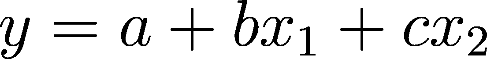

b 和 c 是系数

由于系数是我们回归的一部分(我们之前把它们当作 1)，我们应该把它们包括在总成本函数中。实际上，我们把它们的平方加进去，我们会因为有这个系数而得到另一个惩罚。

如果这个系数变为零，基本上就等于零了。这样的话，我们实际上可以去掉列。或者去掉这个惩罚，或者这个惩罚的一部分。很自然，如果我们去掉所有的列，就什么都没有了，那么我们只有 y 本身的平均值。

所以我们需要，当我们添加一列时，我们会说，“好的，我们可以添加一列，我们可以使用这些信息。但我们将接受因添加该栏而受到的处罚。”**不管那列得到什么系数，都将是我们的惩罚**。这意味着如果它是一个相当大的，重要的列，它将有一个大的系数，所以它最好是值得的。因为这个系数也将被算作这个所谓的惩罚的一部分，它将增加总成本。通过把这个放入我们的计算中，我们实际上不再寻找最佳拟合，T4，我们寻找最佳拟合和较小系数之间的平衡。一个非常非常小的系数就是零。负系数也被认为是大的。

**总成本** =拟合度+系数大小:

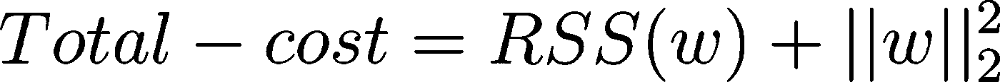

总成本，而不是“总成本减去数量成本”

*   当拟合度(RSS)较小时=良好拟合
*   当系数的幅度(误差平方和)很小时=良好拟合

如果你知道你的线性代数，这个重量(w)实际上叫做 L2 范数。对这个故事来说，重要的是把它想成系数的平方，有时叫做权重的平方，但它确实是一个系数。

在[之前的一篇文章](/an-introduction-to-linear-regression-9cbb64b52d23)中，我们引入了误差项ε。m 和 b 项是系数(斜率和 y 截距)


ε表示误差，I 表示它是哪个数据点(第一、第二等。)

看起来我们只有一个输入列，也就是 x 和一个系数 b，但实际上，取决于我们如何看待这个问题，x 可以是列的一个完整向量，也可以是系数的一个完整向量。

## 特征选择

选择作为目标的良好预测器的特征子集的过程被称为特征选择。如上所述，它是型号选择的另一个术语。两者相同的原因是，如果你有不同的功能集，你实际上有不同的模型。

它有助于:

*   控制模型的复杂性
*   提高模型性能
*   提高泛化能力
*   加速模型学习而不降低精度

我个人的偏好是尽可能多地使用所有的特性，然后一旦我有了所有的特性，我就可以精简并只找到重要的特性。所以我想尽可能多地去掉一些特性。我为什么要这么做？我想要一个更简单的模型。为什么我想要一个更简单的模型？因为一个简单的模型概括得更好。泛化是什么意思？**这意味着你可以在现实世界中使用它**。该模型不仅解释了训练数据，而且也有更好的机会解释我们以前没有见过的数据。首先是您的测试数据，然后是您从未见过的数据，即您的运营数据。

如前所述，逐步回归是一个重要的正则化工具。向后是最常见的，从所有特征开始，删除解释最小差异的列，直到模型性能达到峰值。向前是从平均值开始添加特性，直到模型性能达到峰值。然后是“两者”——在每一步检查是添加一个特性还是删除一个特性。说你往前走，你加了一个栏目。当你倒退的时候。现在，从这一点来看，最好删除的列可能不是您刚刚添加的列。可能是另一个。其原因是，列之间存在复杂的相互作用，这通常是无法预测的。这可能不是我正在做的线性回归的情况。但是在其他类型的回归中:树和神经网络，情况肯定是这样的。

我敢说每个人都使用逐步回归。这并不意味着你只用逐步回归。其他类型的正则化方法包括脊，套索，以及称为弹性网的东西，这是脊和套索的组合。然后在此基础上，我做逐步回归。所以我认为结合使用这些是一个人进步的典型方式，是一个人工作得最好的方式。

# 逐步回归:Python 示例

接下来的部分使用[高尔顿的身高数据集](https://dataverse.harvard.edu/dataset.xhtml?persistentId=doi:10.7910/DVN/T0HSJ1)，逐步回归的一个例子，我在我的 [bootstrap 重采样](/bootstrap-resampling-2b453bb036ec)文章中使用了相同的数据集。

```
# importsimport pandas as pd
import numpy as np
import statsmodels.formula.api as sm
import seaborn as sns
import matplotlib.pyplot as plt%matplotlib inline# load data# I previously saved the Galton data as data
family_data = pd.read_csv(data, delimiter=’\t’)# column labels
family_data.columns = [“family”,”father”,”mother”,”gender”,”childHeight”, “kids”]# check data is well-imported
family_data.head()
```

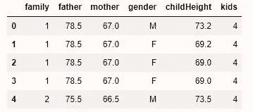

前 5 行，数据看起来不错

```
# check data types
family_data.dtypes
```

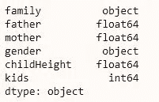

```
# subset the data with a Boolean flag, capture male children
isMale = family_data.loc[:,”gender”] == “M”# create just the male children df
male_only = family_data[isMale].copy()
male_only.head()
```

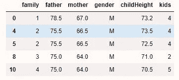

在此 df 中仅捕获(M)名男性儿童

```
print(‘Number of rows: {}, Number of Males: {}’.format(len(family_data), len(male_only)))
```

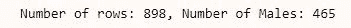

数据很平衡！M = F

```
# create new df for new feature
male_df = male_only.copy()# add in squares of mother and father heights
male_df[‘father_sqr’] = male_df[‘father’] **2
male_df[‘mother_sqr’] = male_df[‘mother’] **2# drop columns family, gender, kids
Drop = [“family”, “gender”, “kids”]
for x in Drop:
 male_df = male_df.drop(x, axis=1)

# reset index
male_df=male_df.reset_index(drop=True)
male_df.head()
```

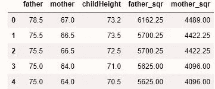

成功添加新功能

名词（noun 的缩写）childHeight 特性只是针对儿子的，我们之前只是复制并捕捉了儿子。我们稍后用女儿做 PCR 分析。

接下来，我们将 z-score 标准化数据。我们为什么要标准化数据？较大的值，比如 father_sqr，会有较小的系数，较小的值会有较大的系数。这是不“公平”的。为了公平起见，我们对数据进行了缩放，使它们彼此相等，其中一种方法是 z 分数标准化，即从身高中减去儿童身高的平均值，然后除以儿童身高的标准差。这是 z 值:

```
# scale all columns but the individual height (childHeight)
# normalization function for a column in a pandas df
def scale(col):
 mean_col = np.mean(col)
 sd_col = np.std(col)
 std = (col — mean_col) / sd_col
 return std# add scaled x to data frame.
male_df[‘father’] = scale(male_df[‘father’])
male_df[‘mother’] = scale(male_df[‘mother’])
male_df[‘father_sqr’] = scale(male_df[‘father_sqr’])
male_df[‘mother_sqr’] = scale(male_df[‘mother_sqr’])
male_df.head()
```


值根据列平均值的标准差进行缩放

注意第一个父亲的身高是四。四个什么？离平均值四个标准差，这已经很高了。

## 计算具有所有功能的模型

下面的代码使用所有可用的功能计算所有男孩的身高。到目前为止，这是我展示的全部内容，但今天的特别之处在于，现在我们可以找到可以扔掉的功能。为什么我们要找到可以抛弃的特性？我们想让模型更简单。为什么我们要让模型更简单？事实证明，越简单的模型越好。

名词（noun 的缩写）b:`ols_model`中的`+ 1`表示将会有一个偏移。`sklearn`这是自动的。总有截距，偏移量的另一个术语。因为一切都是按比例缩放的，所以在这种情况下，截距就是孩子的平均身高。

```
ols_model = sm.ols(formula = ‘childHeight ~ father + mother + father_sqr + mother_sqr + 1’, data=male_df)results = ols_model.fit()
n_points = male_df.shape[0]
y_output = male_df[‘childHeight’].values.reshape(n_points, 1)
print(‘Intercept, Slopes : \n{}’.format(results.params))# print  hypothesis test stats
print(‘Intercept t-value, Slope t-values: \n{}’.format(results.tvalues))
print(‘\nHypothesis test summary for each coefficient if they differ from zero:’)
print(results.pvalues)print(‘\nSSE, SST, SSR, and RMSE:’)
mean_y = np.mean(y_output)
sst = np.sum((y_output — mean_y)**2)
sse = sst — results.ssr
print(‘SSE: {}’.format(sse))
print(‘SST: {}’.format(sst))
print(‘SSR: {}’.format(results.ssr))
print(‘RMSE: {}’.format(np.sqrt(results.mse_resid))) # ESHx# print summary stats
print(results.summary())# plot a histogram of the residuals
sns.distplot(results.resid, hist=True)
plt.xlabel(‘Residual’)
plt.ylabel(‘Frequency’)
plt.title(‘Residual Histogram’)
plt.show()
```

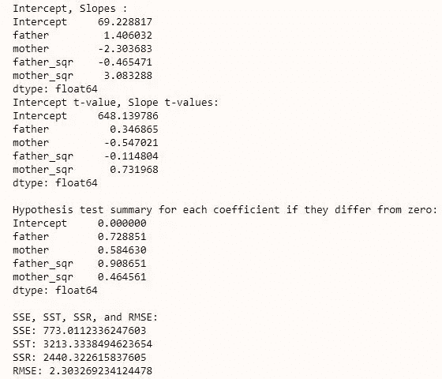

基线模型

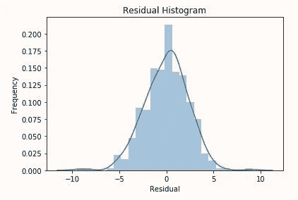

残差呈正态分布

现在我们有了一个基线模型，我们能用正则化技术改进它吗？

## 应用逐步回归

在前面，我定义了用于定义模型拟合度的指标:AIC


AIC:模型对数似然调整的参数数量

*   k:估计参数的数量
*   可能性

我们可以使用后向特征选择对该函数应用逐步回归:

```
def backward_selected(data, response):
 “””Linear model designed by backward selection. Feature selection based on AICParameters:
 — — — — — -
 data : pandas dfwith all possible predictors and responseresponse: string, name of response column in dataReturns:
 — — — — 
 model: an “optimal” fitted statsmodels linear model
 with an intercept
 selected by backward selection
 “””
 # begin with all factors and intercept
 possible_factors = set(data.columns)
 possible_factors.remove(response)
 formula = “{} ~ {} + 1”.format(response, ‘ + ‘.join(possible_factors))
 best_aic = sm.ols(formula, data).fit().aic
 current_aic = best_aic

 # create a non-empty set of columns that will be labeled as “to remove and try”
 to_try_remove = possible_factors

 # check which features remain
 while to_try_remove and current_aic == best_aic:
 aic_candidates = []
 for candidate in to_try_remove:

 columns = possible_factors — set([candidate])
 # removing the candidate column
 formula = “{} ~ {} + 1”.format(response, ‘ + ‘.join(columns))
 # print AIC
 aic = sm.ols(formula, data).fit().aic

 # append tuple of the form (aic, response)
 aic_candidates.append((aic, candidate))

 # sort all the pairs by the first entry of tuple 
 aic_candidates.sort()
 # change sort/pop order!
 best_new_aic, best_candidate = aic_candidates.pop(0)

 # check if we have something better:
 if best_new_aic < current_aic:
 # Remove the best candidate’s name from possible_factors

 possible_factors.remove(best_candidate)
 current_aic = best_new_aic

 # repeat the process with all the remaining candidate columns# final formula
 formula = “{} ~ {} + 1”.format(response, ‘ + ‘.join(possible_factors))
 # model object
 model = sm.ols(formula, data).fit()
 return modelbackwards_model = backward_selected(male_df, ‘childHeight’)print(backwards_model.model.formula)print(‘Adjusted R-Squared: {}’.format(backwards_model.rsquared_adj))
print(‘AIC: {}’.format(backwards_model.aic))
```

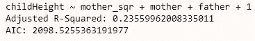

向后逐步回归，AIC 较好

反向选择的公式`childHeight ~ father + mother + mother_sqr + 1`现在被输入到标准`sm`模板中:

```
ols_model_forward = sm.ols(formula = ‘childHeight ~ father + mother + mother_sqr + 1’, data=male_df)
results = ols_model_forward.fit()
n_points = male_df.shape[0]
y_output = male_df[‘childHeight’].values.reshape(n_points, 1)# slope (m) and y-intercept (b)
print(‘Intercept, Slopes : \n{}’.format(results.params))# t-values (hypothesis test statistics) 
print(‘Intercept t-value, Slope t-values: \n{}’.format(results.tvalues))# p-values for above t-value statistics
print(‘\nHypothesis test summary for each coefficient if they differ from zero:’)
print(results.pvalues)print(‘\nSSE, SST, SSR, and RMSE:’)
mean_y = np.mean(y_output)
sst = np.sum((y_output — mean_y)**2)
sse = sst — results.ssr
print(‘SSE: {}’.format(sse))
print(‘SST: {}’.format(sst))
print(‘SSR: {}’.format(results.ssr))
print(‘RMSE: {}’.format(np.sqrt(results.mse_resid))) # ESHx
print(results.summary())# plot a histogram of the residuals:
sns.distplot(results.resid, hist=True)
plt.xlabel(‘Residual’)
plt.ylabel(‘Frequency’)
plt.title(‘Residual Histogram’)
plt.show()
```


部分斜率是系数

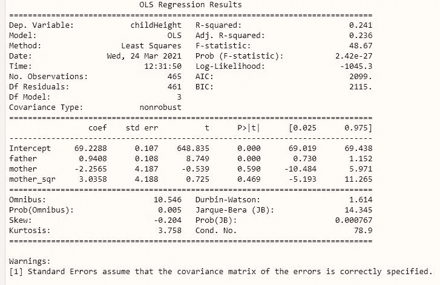

其余的更好

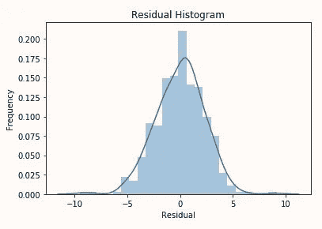

残差呈正态分布

名词（noun 的缩写）逐步回归似乎是一种简单的特征选择方法；请注意**逐步回归的伸缩性不好**。与任何多重比较方法一样，逐步回归法有很高的假阳性结果概率。在这种情况下，由于低 p 值或 AIC，不应删除的要素可能不会被删除。

# 主成分回归:Python 示例

为了简洁起见，我省略了 PCR 背后的大量线性代数。诀窍就是做 PCA，主成分分析。PCA 将帮助你确定哪个主成分是最好的。这是通过创建初始变量的线性组合并创建一个解释最大方差的新组合来实现的。然后另一个解释了稍微少一点的差异，等等。

从模型的角度来看，我们已经把它正规化了。没有任何信息被丢弃，每台电脑都包含所有功能的线性组合。但是模型看到了新的特性，使得确定哪些特性应该被丢弃变得容易。

名词（noun 的缩写）b:这个靠的是幕后的 SVD。

PCA 中的变换创建线性独立的特征，它们之间具有最佳的独立性。具有少量差异的 PC 可能对我们的模型不重要，因此我们通过移除差异极小的特征来简化我们的模型。

首先，在将 PCR 应用于高尔顿数据集之前，我将对其进行演示:

```
from sklearn.decomposition import PCA
from sklearn.preprocessing import StandardScalernp.random.seed(21)# right-multiply a 2x2 matrix to a 2x100 matrix to transform the points
X = np.dot(np.random.randn(100, 2), np.random.rand(2, 2))
# scale data
X = StandardScaler().fit_transform(X)plt.scatter(X[:, 0], X[:, 1])
plt.grid()
plt.xlabel(‘x’)
plt.ylabel(‘y’)
plt.title(‘Generated x-y data with dependence’)
plt.show()
```

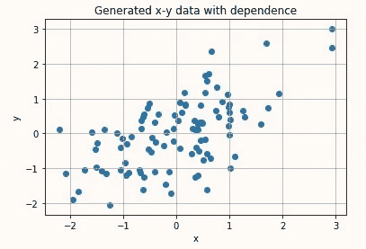

现在，我们将创建变量的线性组合来创建 PC1 和 PC2，即主成分 1 和主成分 2。PC1 的方差最大。请记住，在 PCA 中，输入特征与创建的主成分之间存在 1:1 的映射

```
pca = PCA(n_components=2)
pca_result = pca.fit_transform(X)
pca_df = pd.DataFrame(data = pca_result , columns = [‘pc1’, ‘pc2’])print(pca_df.head())
print(pca_df.shape)
```

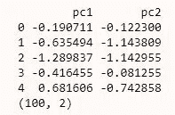

100 双

绘制输出

```
plt.axis(‘equal’) 
plt.scatter(pca_df.loc[:, ‘pc1’], pca_df.loc[:, ‘pc2’])
plt.ylabel(‘Component 2’)
plt.xlabel(‘Component 1’)
plt.title(‘Two Dimensional PCA’)
plt.grid()
plt.show()
```

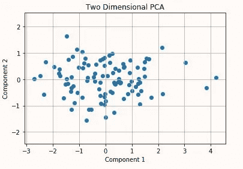

数据在我们新的坐标系中重新绘制。

PC1 和 PC2 是原始要素的线性组合，在我们的新坐标系(PC1 和 PC2)中附加了一些权重，而不是 x 和 y。

```
print(pca.explained_variance_)
print(pca.components_)
```

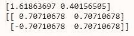

这些电脑解释了 100%的差异！

```
exp_var = pca.explained_variance_
components = pca.components_# plot vector
# = plot scale * component direction * component length
v1 = 2 * components[0] * np.sqrt(exp_var[0])
v2 = 2 * components[1] * np.sqrt(exp_var[1])
c = (0, 0) # Center is at 0,0 because of our standardizationplt.scatter(X[:, 0], X[:, 1], alpha=0.5)
plt.annotate(‘’, c + v1, c, arrowprops={‘arrowstyle’: ‘->’, ‘shrinkA’: 0,
 ‘shrinkB’: 0, ‘linewidth’: 3})
plt.annotate(‘’, c + v2, c, arrowprops={‘arrowstyle’: ‘->’, ‘shrinkA’: 0,
 ‘shrinkB’: 0, ‘linewidth’: 3})
plt.axis(‘equal’)
plt.grid()
plt.title(‘F-vector functions (Principal Components)’)
plt.xlabel(‘x’)
plt.ylabel(‘y’)
plt.show()
```

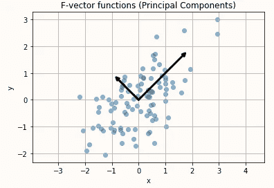

矢量在新的坐标系中确实是垂直的

根据 PCR，我们创建了两个线性独立的特征，如上图所示。因为 PC1 比 PC2 解释了更多的差异，这个模型可以通过去掉 PC2 来简化。

这可以扩展到更高维的数据集。通过计算主成分，我们消除了数据中的多重共线性问题。

现在，让我们在高尔顿数据集上使用 PCR 看看女儿。由于 df 中有四个特征，因此 PCA 之后将有四个主要成分。

```
# subset the data with a Boolean flag to capture daughters
isFemale = family_data.loc[:,”gender”] == “F”# create just the female df
female_data = family_data[isFemale].copy()# create new df for new feature set
female_df = female_data.copy()# feature engineer squares of mother and father heights
female_df[‘father_sqr’] = female_df[‘father’] **2
female_df[‘mother_sqr’] = female_df[‘mother’] **2# drop columns for family, gender, kids
Drop= [“family”, “gender”, “kids”]
for x in Drop:
 female_df = female_df.drop(x, axis=1)

# reset the index
female_df=female_df.reset_index(drop=True)# add scaled x to df
female_df[‘father’] = scale(female_df[‘father’])
female_df[‘mother’] = scale(female_df[‘mother’])
female_df[‘father_sqr’] = scale(female_df[‘father_sqr’])
female_df[‘mother_sqr’] = scale(female_df[‘mother_sqr’])
female_df.head()
```

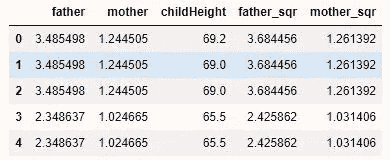

仅子数据集看起来很好

```
# calculate all the principal components (4)
X = female_df[[‘father’, ‘mother’, ‘father_sqr’, ‘mother_sqr’]].values
y = female_df[‘childHeight’]
pca = PCA()
pca_result = pca.fit_transform(X)
pca_df = pd.DataFrame(data = pca_result, columns=[‘pc1’, ‘pc2’, ‘pc3’, ‘pc4’])# our data projected onto the four principal components.
print(pca_df.head())
print(pca_df.shape)pca_df[‘childHeight’] = female_df[‘childHeight’]
```

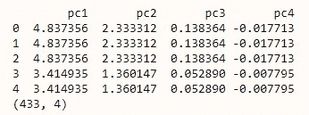

方差图:

```
plt.plot([i + 1 for i in range(4)], pca.explained_variance_)
plt.title(‘Scree plot for PCA decoposition’)
plt.xlabel(‘Component’)
plt.ylabel(‘Variance explained’)
plt.show()
```

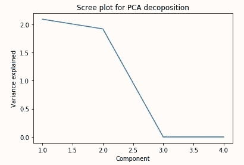

前两个部分解释了最大的差异

```
pca.explained_variance_
```

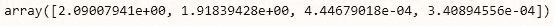

解释了四个 PCs 的差异

既然我们已经将所有的数据都投影到了 4 个主成分上，我们可以看看解释的方差了。前两个 PC 解释了最大的方差，因此我们可能会删除 PC3 和 PC4，因为它们解释的方差如此之低。

```
pcr_model = sm.ols(formula = ‘childHeight ~ pc1 + pc2 + pc3 + pc4’, data=pca_df)results = pcr_model.fit()
n_points = pca_df.shape[0]
y_output = pca_df[‘childHeight’].values.reshape(n_points, 1)
print(results.summary())# plot a histogram of the residuals
sns.distplot(results.resid, hist=True)
plt.xlabel(‘Residual’)
plt.ylabel(‘Frequency’)
plt.title(‘Residual Histogram’)
plt.show()
```

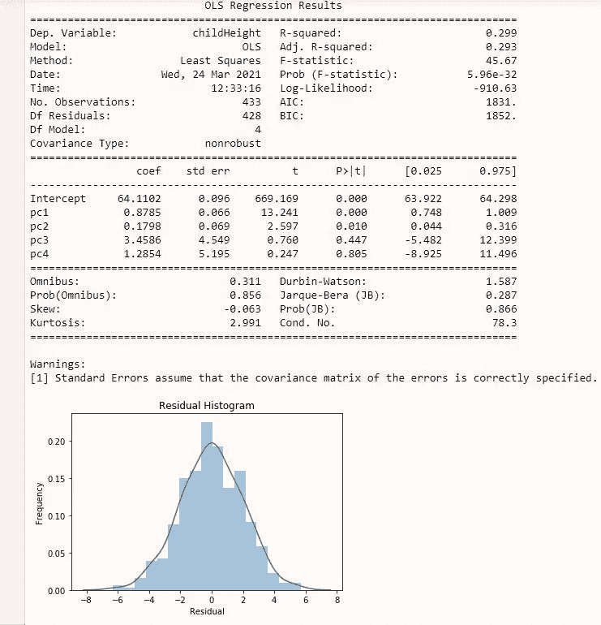

在这里，你可以看到，最后两个主要组成部分并不需要一个重要的拟合。你也可能已经注意到，从每个组件的“解释方差”中-以及最后两个组件如何解释近 4 个数量级的方差。

现在，我们可以只使用两个分量来尝试 PCA 回归；解释大部分差异的因素包括:

```
pcr_model = sm.ols(formula = ‘childHeight ~ pc1 + pc2’, data=pca_df)results = pcr_model.fit()
n_points = pca_df.shape[0]
y_output = pca_df[‘childHeight’].values.reshape(n_points, 1)
print(results.summary())# plot a histogram of the residuals
sns.distplot(results.resid, hist=True)
plt.xlabel(‘Residual’)
plt.ylabel(‘Frequency’)
plt.title(‘Residual Histogram’)
plt.show()
```

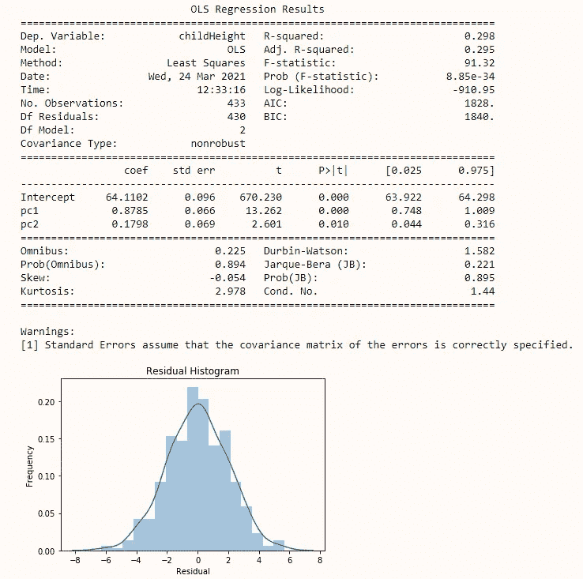

请注意，所有模型系数现在都很重要

PC3 和 PC4 的 p 值较大，因此不显著。此外，他们各自的 95%置信区间跨越零。因此，他们没有帮助模型解释女儿的身高，我们怀疑他们解释的低方差。如果我们没有执行 PCR，我们很可能不会丢弃任何初始特征(父、母、父 _sqr、母 _sqr)。

如果您注意到 R 在改进的模型上并没有更好，请记住我们犯了一个非犹太行为:我们在训练数据上测试了我们的模型。一个大禁忌。几乎可以肯定的是，如果我们把以前看不到的测试数据输入到最后一个模型，只有两台电脑的模型，R 就会增加。这是因为这是一个更简单的模型，不容易过度拟合。如果数据是训练/调整/测试分割的，那么模型的改进将是可论证的。

降维起到了预期的效果！调整后的 R 和 AIC 是该模型的最低值。正则化帮助我们创建了更好、更简单、更通用的模型。

如果你想知道为什么父母的身高不是孩子身高的好指标，这就是“回归平均值”这个短语的来源。与 18 世纪的普遍看法相反，高尔顿的家庭分析表明，高个子父母的孩子往往身高回归到人口平均水平。

接下来，我将用 [Ridge、LASSO 和 Elasticnet regressions](https://james-andrew.medium.com/ridge-lasso-and-elasticnet-regression-b1f9c00ea3a3) 来讨论正则化！

在 [Linkedin](https://www.linkedin.com/in/james-a-w-godwin/) 上找到我

*物理学家兼数据科学家——可用于新机遇| SaaS |体育|初创企业|扩大规模*