# 基于变分原理的正则化核回归

> 原文：<https://towardsdatascience.com/regularized-kernel-regression-from-a-variational-principle-d2b0c03eb919?source=collection_archive---------31----------------------->

## H 如何通过变分法推导和推广**Nadaraya–Watson 估计量**

约翰·安维克在 [Unsplash](https://unsplash.com/s/photos/prism?utm_source=unsplash&utm_medium=referral&utm_content=creditCopyText) 上的照片

K **Nadaraya–Watson 估计量**就是这样一种方法。它通常来源于计算因变量的条件期望，基于对自变量分布和因变量与自变量联合分布的核密度估计。

在本文中，我将介绍推导 Nadaraya–Watson 估计量的另一种基本原理(我也简称为“核回归”)。这个基本原理激发了一个变分原理，它将允许我们制定一个可以被称为“正则化核回归”的修改。

许多回归技术可以通过最小化相对于二次损失函数的**经验风险**，或者相对于*数据点 **( *x* ₁，*y*₁)…**的*残差平方和***r**f***来导出:**

*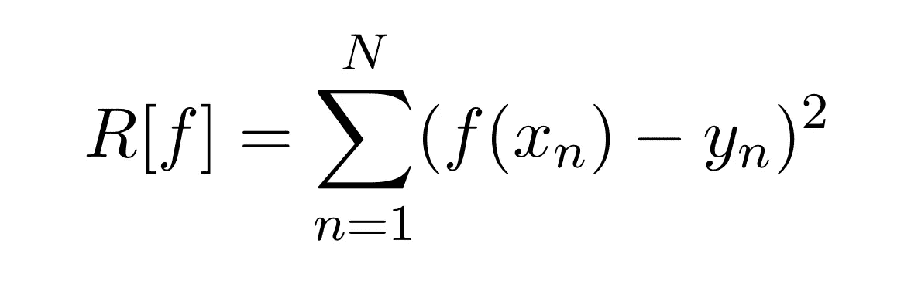*

*关于未知回归函数 ***f*** 最小化这个表达式的问题是不适定的，需要对 ***f*** 施加进一步的假设。在参数建模中，我们将 ***f*** 限制在某个假设空间，以便问题变得适定。比如在线性回归中，我们把 ***f*** 限制在仿射线性函数的空间，***f*(*x*)=*m⋅x*+*c****。* 确定斜率*m 和截距*c 使得上述残差平方和最小化，将产生最佳拟合线。***

***现在，让我们对上面的公式进行一些数学变换，然后一步一步地解释:***

***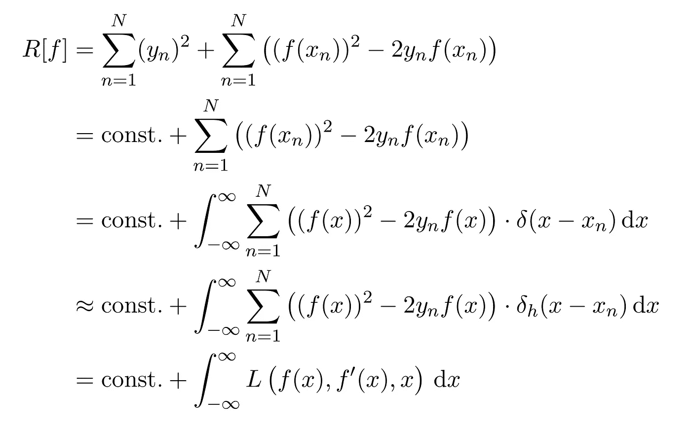***

***第一个等式只是将正方形展开，并将平方后的 ***y*** 作为自己的和。根据第二个等式，我们认识到 y 的平方和*对我们稍后想要应用的最小化过程没有贡献，因为它不依赖于我们想要最小化的函数 ***f*** 。因此，我们可以称之为“const”再也不用担心了。****

**下一步至关重要。我们可以通过**狄拉克δ函数**在单个固定位置计算 ***f*** ，如下所示:**

**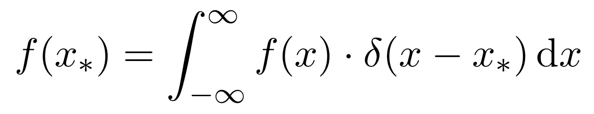**

**这将允许我们将总损失***R*[*f*]**写成一个积分，并且经验风险最小化变得可以从变分法的标准工具中获得。**

**“delta”的正确定义需要对函数分析有所了解，更准确地说是分布理论或“广义函数”。然而，对于所有实际的意图和目的，你可以把狄拉克δ函数想象成一个以原点为中心的非常窄的峰值。事实上，我们可以通过对初始δ函数的限制来近似狄拉克δ函数，初始δ函数的度量在原点附近变得越来越集中。**

**一如既往，最受欢迎的选择是高斯分布:**

**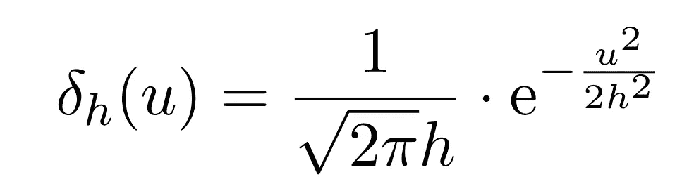**

**该函数族在消失带宽的极限内朝着狄拉克δ函数收敛 ***h > 0*** 。**

**最后，用上述近似代替狄拉克δ函数后，我们给积分下的公式起了自己的名字: ***L*** 代表 ***拉格朗日*** 。(这个特定的拉格朗日量实际上并不依赖于导数*’，但是我们稍后会需要这个普遍性。)***

***寻找一个像这样的泛函的驻点——即一个被表示为拉格朗日积分的泛函——在数学和理论物理中有许多应用。例如，基于最小作用原理，经典力学可以重新表述为拉格朗日力学。另一个应用是描述光线的路径，它遵循费马原理，也叫最短时间原理。***

***因此，这个问题有一个众所周知的通用解决方案。重复一下，我们感兴趣的是最小化以下形式的泛函:***

***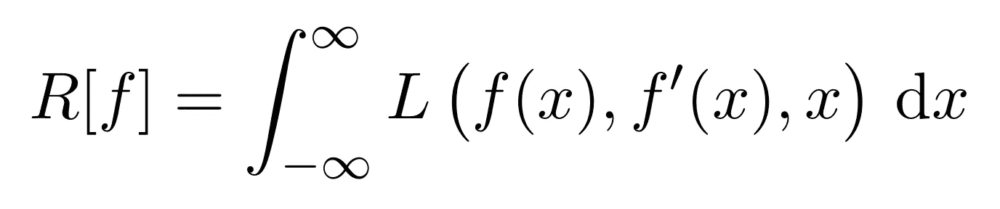***

***函数 ***f*** 是该泛函的驻点当且仅当它满足以下**欧拉-拉格朗日方程**:***

**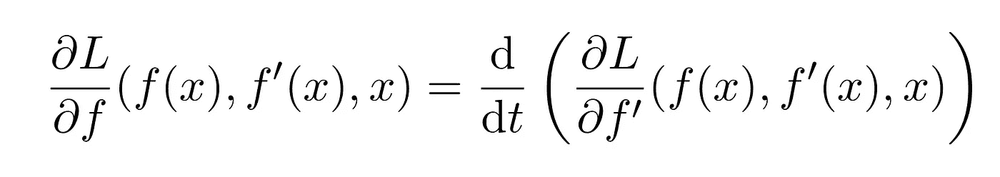**

**对于我们到目前为止导出的拉格朗日量，最小二乘 ***R* [ *f* ]** “涂抹掉”的和，右手边消失是因为导数 ***f* '** 中没有依赖项。**

**在这种情况下，欧拉-拉格朗日方程可以简单地用代数方法*求解***f*(*x*)**:***

*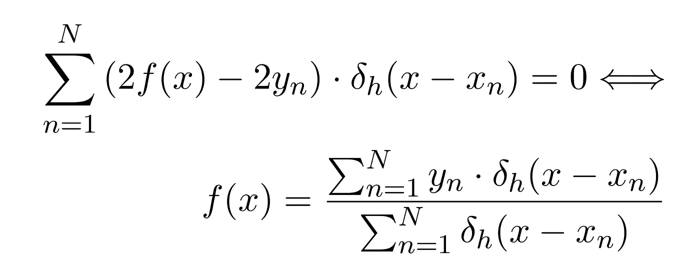*

*这正是 Nadaraya 和 Watson 提出的核回归公式。*

*因此，到目前为止，我们可以对我们的方法感到相当有信心，因为我们能够推导出一种经过验证的回归技术。现在是时候改变一下了，对我们的变分原理进行一些修改。例如，我们可以添加一个将**正则化**模型的项，并惩罚任何整体导数大的解:*

*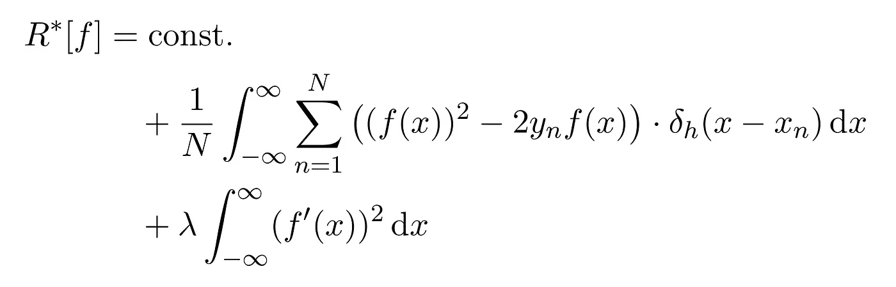*

*其中 ***λ >* 0** 为正则化参数。我们还引入了常数因子“ **1 / N** ”，因此我们实际上是将*平均*经验风险与正则化项进行对比。计算相应的欧拉-拉格朗日方程是一项简单的任务:*

*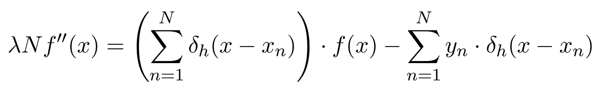*

*当然，对于 **λ = 0** ，该公式简化为传统的核回归。这是一个二阶线性微分方程，一旦给定边界条件或初始条件，它就有唯一的解。在 R 中， *deSolve* 和 *bvpSolve* 软件包可用于数值求解常微分方程。*

*L et 的模型一些真实数据。下图显示了由**伯克利地球**([http://berkeleyearth.org/data/](http://berkeleyearth.org/data/))提供的 1850 年至 2019 年间**地球平均全球温度**的时间序列:*

*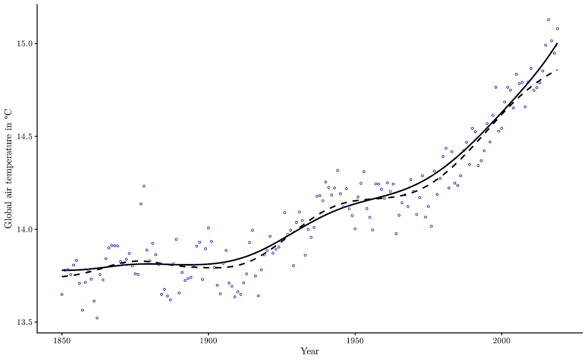*

*作者图片*

*虚线是带宽 ***h* = 10.0** 的常规核回归，实线是带宽和正则化参数 ***λ* = 0.5** 相同的正则化核回归的结果。欧拉-拉格朗日方程是通过强加一个边界值问题来求解的，该问题的最早/最晚温度由前五年/后五年的温度中值给出。*

*这里提出的正则化核回归有一些明显的缺点，例如:*

*   *需要指定边界条件，这看起来像是一个临时的过程，*
*   *试图应用初始条件似乎不实际，并导致无意义的爆破解，*
*   *数值会发生不稳定，特别是对于小数值**。***

**然而，这款车型似乎也有一些令人满意的特点。例如，对于不同的带宽选择，它看起来相当健壮。下图显示了相同的数据和回归函数，但带宽 ***h* = 1.0** :**

**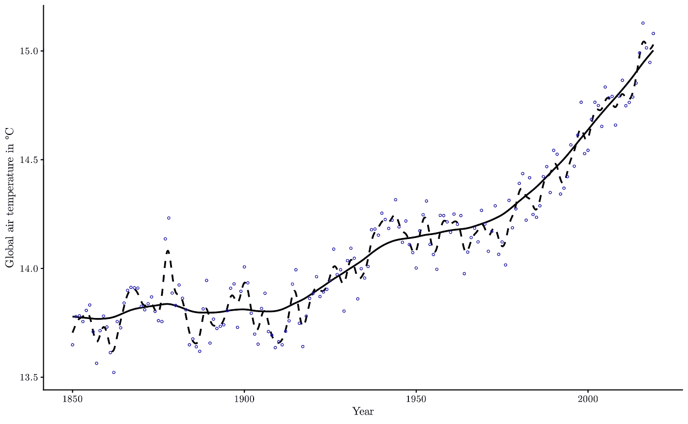**

**作者图片**

**虽然传统的核回归似乎在很大程度上过度拟合数据，但正则化版本“保持在正确的方向上”。**

**这个模型的另一个特点是:它可能更擅长输入缺失数据。这是一个图表，展示了同样的回归技术，但是 1920 年到 1970 年之间的所有数据点都被排除在分析之外:**

**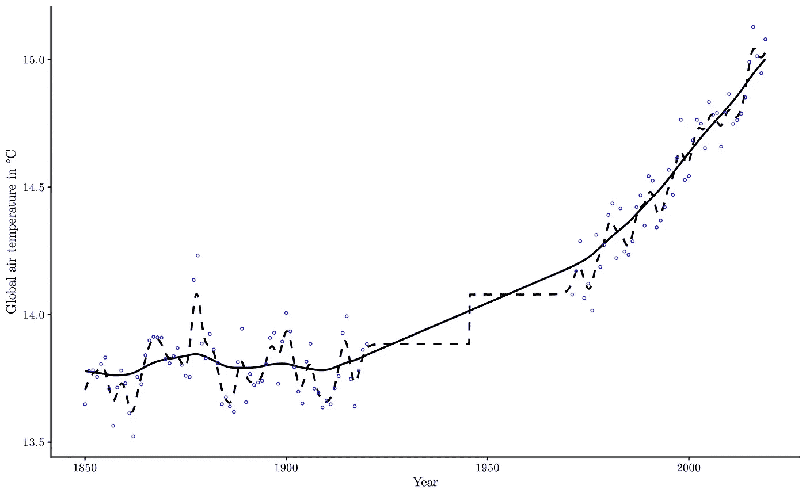**

**作者图片**

**我们可以利用这种稳健性来应对缺失数据，并尝试将时间序列外推至未来情景。虽然传统的核回归对于插值肯定是有用的，但是我们可以预见这项技术在这项任务中会惨败。**

**然而，正则化的内核回归可能会成功，因为添加了“惯性” ***λ*** *。* 下面的图表显示了预测*假设* *先验*2040 年全球平均气温将分别上升到 15.2 摄氏度、15.8 摄氏度和 16.4 摄氏度的未来情景:**

**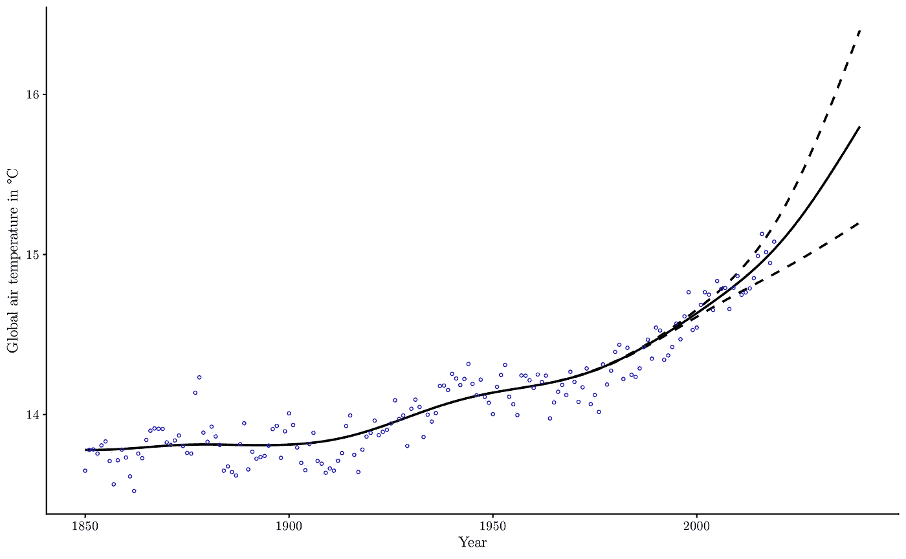**

**作者图片**

**对于每次外推，使用了相同的模型超参数 ***h* = 10.0** ， ***λ* = 0.5** 。尽管在拟合最终模型之前已经预先给出，但 2040 年 15.8℃的选择并不是特别的:外推至 2040 年 15.8℃实际上是最好的预测，因为有了这个参数，(传统的)残差平方和将最小化，这可以通过简单的网格搜索来验证。**

# **结论**

**核回归是一种技术，可以从最小化关于二次损失函数的经验风险的“平滑”或“模糊”版本中获得。这种方法产生了一种变分原理，例如通过增加正则化项可以扩展这种原理。**

**对所得模型的一些实验显示了一些令人满意的性质，它可能在预测时间序列中找到有用的应用。**

# **参考**

 **** **<https://en.wikipedia.org/wiki/Dirac_delta_function>    <https://en.wikipedia.org/wiki/Lagrangian_mechanics>    <https://cran.r-project.org/web/packages/bvpSolve/index.html>  <http://berkeleyearth.org/data/> **