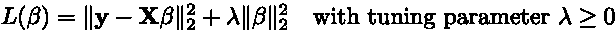

# 使用岭回归克服普通最小二乘法的缺点(OLS)

> 原文：<https://towardsdatascience.com/regularized-linear-regression-models-44572e79a1b5?source=collection_archive---------18----------------------->

## [正则化线性回归模型](https://towardsdatascience.com/tagged/regularized-regression)

## OLS 的弱点，获得岭模型估计量的优化，以及使用 Numpy 在 Python 中的实现

模型系数值随着正则化罚值的增大而变化(*图片由作者提供)*

再次向你问好，希望欢迎回来👋

在[这一深入探究**正则化线性回归**建模技术的三个部分的最后一部分](/regularized-linear-regression-models-57bbdce90a8c)中，涵盖了几个主题:线性回归模型下的响应和特征变量之间的方程、误差平方和(SSE)损失函数、O ***正则最小二乘*** (OLS)模型，以及找到 OLS 模型估计器的必要优化步骤，该估计器可以根据样本数据进行训练，以产生给定新特征数据的响应预测。

接下来，在这一部分中，将讨论 OLS 的缺点、潜在的补救措施以及 ***岭回归*** 模型。

与上一部分类似，这里建议的所有实现都在一个葡萄酒质量预测数据集上进行了验证，这个数据集和其他相关文件可以在项目的存储库中找到，这里是****。****

## **OLS 的缺点**

**与大多数事情一样，建模时必须做出权衡。其中一个主要的权衡就是**偏差-方差的权衡。任何模型的误差都可以分解成两个部分:偏差和方差。偏差可以被认为是建模算法中隐含的误差，而方差可以被认为是从训练数据集的特质差异中得出的误差。一个好的模型应该具有最小的总误差，因此偏差和方差都应该最小。然而，有一个权衡要考虑，因为增加偏差往往会减少方差。****

**对于 OLS 模型，高方差是一个问题。由于 SSE 正在优化，该模型倾向于拟合异常数据点，因为它们会由于损失函数中的平方项而产生更高的误差值。通过拟合这些异常点，OLS 模型随后可以基于仅存在于训练数据中的建模模式(特殊的异常点)进行预测，这些模式并不代表整个群体。这种现象被称为*过拟合，在推广到新的预测时会导致预测模型准确度低。***

***由于 OLS 是一个低偏差模型，它非常适合通过添加偏差来降低其方差，这可能会导致更高的整体预测能力。增加偏差的一种方法是通过**收缩**，使模型系数估计值偏向零。这种收缩可以通过将**正则化罚值**添加到损失函数来实现，该损失函数将独特形式的收缩应用于整体系数估计。***

***在下一节中，我将介绍 ***岭回归* —** 正则化，方法是向 OLS 损失函数添加一个调谐参数(λ)系数控制的 ***L₂*** 罚值。***

> ***请务必查看本系列 的下一部分和[最后一部分，了解其他两种形式的正则化线性回归，即**套索**和**弹性网。**](/regularized-linear-regression-models-dcf5aa662ab9)***

# ***里脊回归***

***这种形式的回归也被称为 ***吉洪诺夫正则化*** ，并修改 OLS 损失函数([第一部分](/regularized-linear-regression-models-57bbdce90a8c):等式。#7)增加了一个 ***L₂*** 罚值和一个相关联的调谐参数 ***λ*** 。这个损失函数可以用向量符号描述为:***

******

***方程式#1***

***类似于 OLS 的情况，该损失函数然后可以公式化为*最小二乘*优化问题，以找到最小化损失函数的模型系数的估计值，如下所示:***

******

***等式#2***

***就像 OLS 的情况一样，添加了 1/(2n)项，以便简单地求解梯度，并允许目标函数通过**大数定律**收敛到模型误差的期望值。***

***该问题也是无约束的，并且通过将损失函数(目标)的梯度设置为零并求解所得方程，可以找到**岭估计量**的闭合形式解。这将产生以下估计结果:***

******

***方程式#3***

***这个估计量也应该是唯一的。在这种情况下，关联的 ***黑森*** 矩阵是:***

******

***方程式#4***

***事实证明，这个矩阵可以表示为**正定的**:***

******

***方程式#5***

***因此，由于岭损失函数的相关 Hessian 矩阵是正定的，所以该函数是强凸的，这意味着岭估计(等式)。#3)是**对 ***岭回归*** 问题的唯一**全局极小点。***

***注意到该问题可以通过**数据扩充**重新表述为 OLS 问题，可以简化估计器的实现。这将采取以下形式:***

******

***方程式#6***

***因此，通过利用上述数据扩充，与本系列最后一部分中的[等式 9 相同的结果可用于求解系数估计值。该结果在此重现:](/regularized-linear-regression-models-57bbdce90a8c)***

******

***方程式#7***

## ***使用 Python 和 NumPy 实现估计器***

***类似于 OLS 的情况，矩阵求逆不能很好地缩放，因此使用了 LAPACK *_gesv* 例程的 NumPy 函数`solve`来寻找最小二乘解。该函数在 A 为平方且满秩(线性无关列)的情况下解方程。然而，在 A 不是满秩的情况下，则应该使用函数`lstsq`，该函数利用 xGELSD 例程，从而找到 A 的奇异值分解。***

***具有可选截距项的 ***岭回归*** 的一个可能的 Python 实现是:***

# ***结论***

***感谢阅读 ***正则化线性回归模型*** 的第二部分！🙌***

***如果您还没有，请务必查看 [**第一部分**！](/regularized-linear-regression-models-57bbdce90a8c)***

***继续到 [**第三部分**](/regularized-linear-regression-models-dcf5aa662ab9) 来学习一下*和 ***的套索*** ，最后两个规则化线性回归技巧！****

****见 [**此处**](https://github.com/wyattowalsh/regularized-linear-regression-deep-dive/blob/master/SOURCES.md) 为创建这一系列职位所利用的不同来源。****

****如果你愿意，请留下评论！我一直在努力改进我的帖子(逻辑上，语法上，或者其他方面),并且很乐意讨论任何相关的东西！👍****